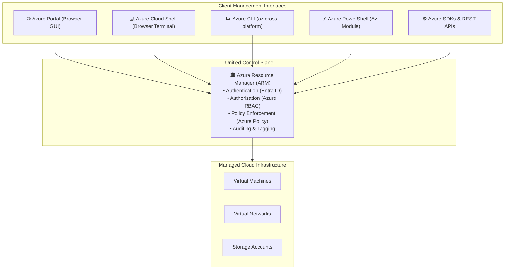
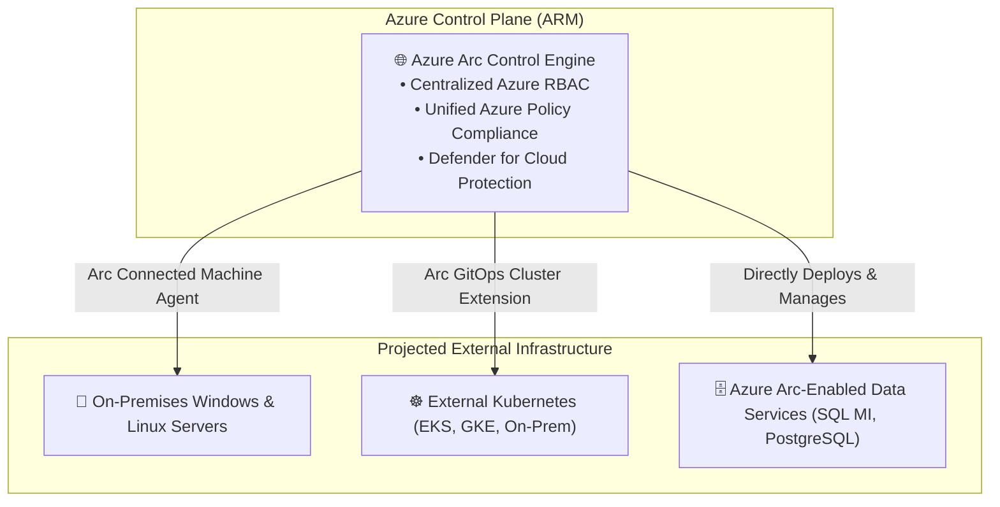
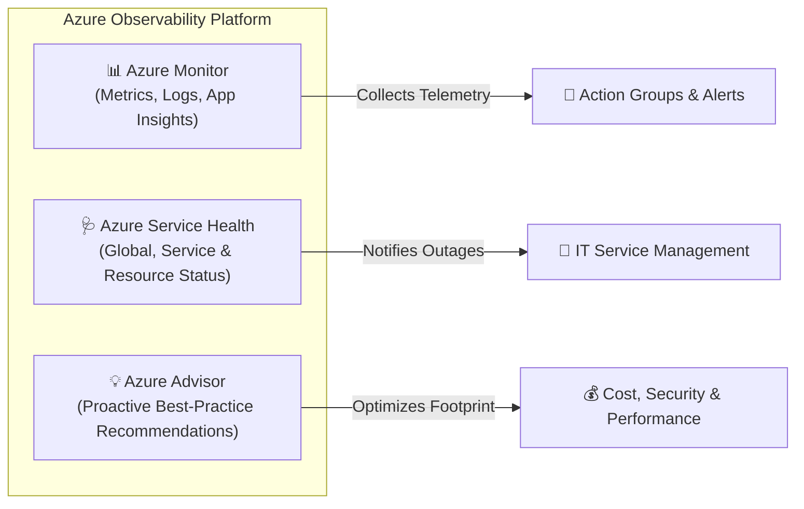
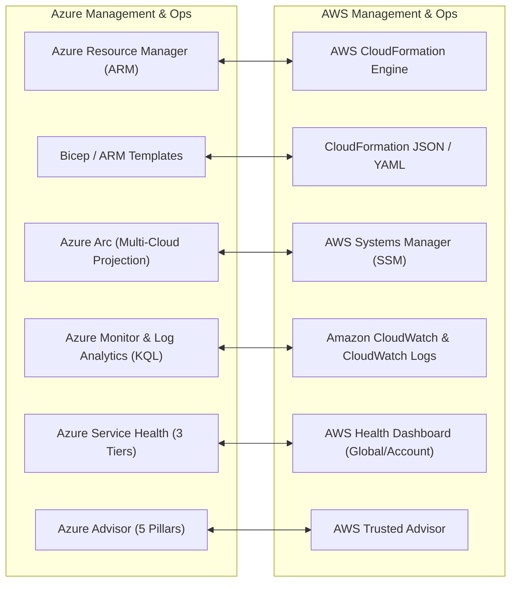

# Module 13-7: Management Tools, Azure Resource Manager (ARM) & Observability

**Breadcrumbs:** [[--Index--|🏠 Index]] > [[13-Index - Azure|☁️ Azure Reference MOC]] > **Module 13-7**

---

## 1. Interaction & Management Tooling

Azure provides a comprehensive suite of management tools tailored for administrators, developers, and automated CI/CD pipelines.



### 1.1 The Toolset Breakdown:
1. **Azure Portal:** A web-based graphical user interface for provisioning, managing, and monitoring resources, building dashboards, and viewing cost metrics.
2. **Azure Cloud Shell:** An interactive, authenticated, browser-accessible terminal for managing Azure resources.
   - Choose between **Bash** or **PowerShell**.
   - Comes pre-authenticated and pre-installed with tools (`az`, `kubectl`, `terraform`, `git`).
   - Requires an attached Azure Storage Account for persistent file storage (`clouddrive`).
3. **Azure CLI (`az`):** Cross-platform command-line tool (Windows, macOS, Linux) optimized for managing Azure resources with bash-friendly commands:
   ```bash
   az group create --name MyResourceGroup --location eastus
   az vm create --resource-group MyResourceGroup --name MyVM --image Ubuntu2204
   ```
4. **Azure PowerShell (`Az` module):** A set of cmdlets for managing Azure resources directly from Windows PowerShell or PowerShell 7:
   ```powershell
   New-AzResourceGroup -Name "MyResourceGroup" -Location "EastUS"
   New-AzVM -ResourceGroupName "MyResourceGroup" -Name "MyVM"
   ```

---

## 2. The Core Control Plane: Azure Resource Manager (ARM)

**Azure Resource Manager (ARM)** is the deployment and management service for Azure. It provides a management layer that enables you to create, update, and delete resources in your Azure account.

### 2.1 The Four Core Capabilities of ARM:
1. **Consistent Management Layer:** Whether a request originates from the Azure Portal, Azure CLI, PowerShell, or an SDK, it always terminates at the exact same ARM REST API endpoint. This guarantees that policies, RBAC roles, and locks are enforced identically across all tools.
2. **Declarative Templates (Infrastructure as Code):** Define your infrastructure declaratively using JSON (ARM Templates) or Microsoft's modern domain-specific language (**Bicep**).
3. **Idempotency:** Re-running an ARM or Bicep template against an existing environment will only apply changes (state reconciliation) without recreating existing unchanged resources.
4. **Resource Providers:** Specialized services that supply Azure resources (e.g., `Microsoft.Compute` provides VMs, `Microsoft.Network` provides VNets, `Microsoft.Storage` provides Storage Accounts). Providers must be registered in your subscription before deploying their respective resources.

---

## 3. Hybrid & Multi-Cloud Control: Azure Arc

**Azure Arc** extends Azure Resource Manager (ARM) governance, policy enforcement, and cloud services to infrastructure located outside of Azure (on-premises datacenters, edge environments, AWS, and GCP).



### 3.1 Key Capabilities of Azure Arc:
- **Arc-enabled Servers:** Install the Connected Machine agent on physical or virtual servers in AWS or on-premises to manage them inside the Azure Portal alongside native Azure VMs.
- **Arc-enabled Kubernetes:** Attach and configure Kubernetes clusters running anywhere (e.g. AWS EKS, GCP GKE, bare-metal clusters) and enforce GitOps configurations and Azure Policies.
- **Arc-enabled Data Services:** Run Azure managed databases (like Azure SQL Managed Instance) on your own on-premises infrastructure.

---

## 4. Observability, Monitoring & Proactive Advisory Suite



### 4.1 Azure Monitor
The central telemetry engine that collects, analyzes, and acts on telemetry data from cloud and on-premises environments:
- **Metrics:** Numerical values that describe some aspect of a system at a particular point in time (e.g. CPU percentage, available memory, disk IOPS). Lightweight, real-time, capable of driving auto-scale rules and metric alerts.
- **Logs:** Complex structured event records organized into tables within a **Log Analytics Workspace**. Queried using **Kusto Query Language (KQL)**.
- **Application Insights:** An Application Performance Monitoring (APM) feature of Azure Monitor that instruments live web applications to detect performance anomalies, exceptions, and track end-to-end distributed transaction traces.

### 4.2 Azure Service Health
Provides a personalized view of the health of the Azure services and regions you are using across three dedicated tiers:
1. **Azure Status:** Informs you of service outages in Azure on a global level (`azure.status.microsoft.com`).
2. **Service Health:** A personalized dashboard tracking active service issues, planned maintenance, and health advisories that impact **your specific subscriptions and regions**.
3. **Resource Health:** Detailed diagnostics on the health of individual cloud resources (e.g. indicating whether a specific Virtual Machine is `Available`, `Degraded`, or `Unavailable` due to platform maintenance).

### 4.3 Azure Advisor
A personalized cloud consultant that analyzes your deployed resource configurations and telemetry to provide actionable recommendations across **five architectural pillars**:
1. **Cost:** Identifies idle or underutilized resources (e.g., shutting down unattached managed disks, purchasing Reserved Instances).
2. **Security:** Integrates with Microsoft Defender for Cloud to remediate vulnerabilities and boost your Secure Score.
3. **Reliability (High Availability):** Recommends zone-redundancy, backup configurations, and availability sets.
4. **Performance:** Identifies compute bottlenecks, database index optimizations, and network throttling.
5. **Operational Excellence:** Advises on deployment best practices, template hygiene, and service limits.

---

## 5. 🌉 Cognitive Comparative Bridge: Azure Management vs. AWS



### Key Differences to Note:
1. **Bicep vs. CloudFormation:** Azure Bicep is a modern, transparent abstraction over ARM JSON that provides concise syntax, first-class modularity, and automatic dependency management without requiring third-party tools.
2. **Log Analytics (KQL) vs. CloudWatch Logs Insights:** Azure Log Analytics uses **Kusto Query Language (KQL)**, a powerful, pipe-based query engine (`| where ... | summarize ... | render ...`) that is significantly faster and more capable of complex aggregations than AWS CloudWatch Insights syntax.

<!-- Documentation References -->
[Microsoft Learn: Azure Resource Manager overview](https://learn.microsoft.com/en-us/azure/azure-resource-manager/management/overview)
[Microsoft Learn: Azure Arc overview](https://learn.microsoft.com/en-us/azure/azure-arc/overview)
[Microsoft Learn: Azure Monitor overview](https://learn.microsoft.com/en-us/azure/azure-monitor/overview)
[Microsoft Learn: What is Azure Advisor?](https://learn.microsoft.com/en-us/azure/advisor/advisor-overview)
