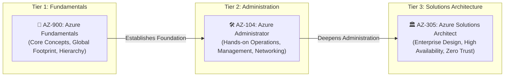

# ☁️ Microsoft Azure Reference MOC

**Breadcrumbs:** [[--Index--|🏠 Index]] > **Azure Reference MOC**

---

## 🏛️ Strategic Certification Tracks

This Map of Content (MOC) governs our Microsoft Azure architectural knowledge base. It is designed to bridge existing public cloud and AWS expertise into native Azure architecture across three progressive tiers:

---

## 📚 Core Foundation Modules (Domain 13)

- 🌐 **[[13-1_azure_fundamentals_cloud_concepts_and_economics.md|Module 13-1: Cloud Concepts, Service Types & Cloud Economics]]**
  * Public, private, hybrid, and multi-cloud paradigms; CapEx vs. OpEx; consumption-based billing; TCO & Pricing Calculators; IaaS vs. PaaS vs. SaaS; the Shared Responsibility Model; and the AWS Cloud Economics comparative bridge.
- 🏛️ **[[13-2_azure_core_architecture_hierarchy_and_governance.md|Module 13-2: Azure Architecture Hierarchy, Regions, AZs & Governance]]**
  * The 4-tier management hierarchy (`Tenant ➔ Management Groups ➔ Subscriptions ➔ Resource Groups ➔ Resources`); physical footprint, regional pairs, and availability zones; Azure Policy definitions and initiatives; resource locks; Microsoft Purview; and the AWS Organizations / OUs comparative bridge.
- 🖥️ **[[13-3_azure_compute_services_and_workload_paradigms.md|Module 13-3: Azure Compute Services & Workload Paradigms]]**
  * Azure Virtual Machines and VMSS autoscaling; Azure Virtual Desktop (AVD); Azure App Services & deployment slots; serverless Azure Functions; Azure Container Instances (ACI) and Azure Kubernetes Service (AKS); and the AWS EC2 / Fargate / Lambda comparative bridge.
- 🕸️ **[[13-4_azure_virtual_networking_and_hybrid_connectivity.md|Module 13-4: Virtual Networks (VNets) & Hybrid Connectivity]]**
  * Virtual Network (VNet) topology, subnets, IP allocation rules; Site-to-Site and Point-to-Site VPN Gateways; ExpressRoute private peering; Azure Public and Private DNS; and the AWS VPC / Direct Connect comparative bridge.
- 💾 **[[13-5_azure_storage_services_redundancy_and_migration.md|Module 13-5: Storage Accounts, Data Redundancy & Migration]]**
  * Unified Storage Account namespace; Blob storage containers and access tiers (Hot, Cool, Cold, Archive); Azure Files SMB/NFS; Queues and Tables; LRS vs. ZRS vs. GRS vs. GZRS data redundancy; Azure Migrate, Azure Data Box family, and AzCopy; and the AWS S3 / Snow Family comparative bridge.
- 🔐 **[[13-6_azure_identity_access_and_security_architecture.md|Module 13-6: Microsoft Entra ID, Azure RBAC & Security Architecture]]**
  * Microsoft Entra ID (Tenants, Users, Groups) and Entra Domain Services; Authentication vs. Authorization; MFA and Conditional Access engine; External Identities (B2B vs. B2C); Azure RBAC scope inheritance vs. Entra roles; Zero Trust and Defense-in-Depth; Microsoft Defender for Cloud; and the AWS IAM / SCP comparative bridge.
- ⚙️ **[[13-7_azure_management_monitoring_and_deployment_tooling.md|Module 13-7: Management Tools, Azure Resource Manager (ARM) & Observability]]**
  * Azure Portal, Cloud Shell, Azure CLI (`az`), and PowerShell (`Az`); Azure Resource Manager (ARM) declarative control plane and Bicep/ARM templates; Azure Arc hybrid projection; Azure Monitor, Log Analytics (KQL), and Application Insights; Azure Service Health; Azure Advisor; and the AWS CloudFormation / CloudWatch comparative bridge.

---

## 🎯 Exam & Hands-On Playbooks

- 🧪 `Projects/Azure/` (Hands-on CLI scenarios, ARM/Bicep playbooks, and AZ-104 / AZ-305 exam tracks).
