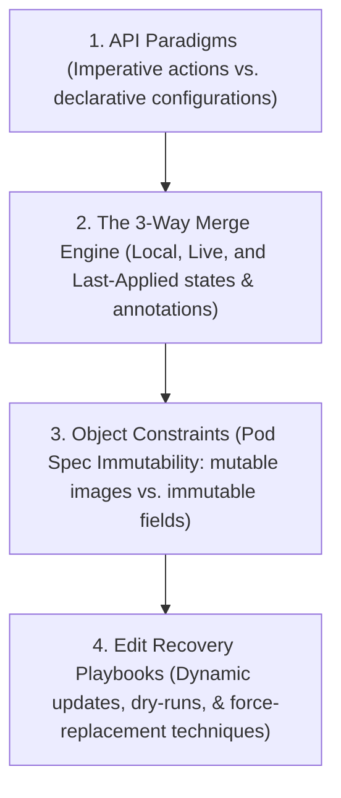

# Module 13: Kubernetes API Management, 3-Way Merge, and Pod Immutability

This module covers the core mechanics of Kubernetes resource management and API behavior, focusing on declarative vs. imperative object management, the internals of the 3-Way Merge Engine, Pod spec immutability boundaries, and recovery playbooks for handling rejected edits.

---

## 🗺️ Cognitive Map: How to Think About the Flow of Knowledge

To build a strong intuition for Kubernetes API management and resource updating, think of the topics as moving from configuration paradigms to deep engine mechanics, resource constraints, and disaster recovery playbooks:



1. **Step 1: API Paradigms (Section 1):** We start with how we instruct the cluster: using fast, imperatively executed actions (for rapid prototyping and exams) vs. declarative, state-oriented configurations (for version-controlled GitOps).
2. **Step 2: The 3-Way Merge Engine (Section 2):** We go under the hood of `kubectl apply`. We study how the engine dynamically updates resources by analyzing the intersection of three states: the new Local file, the Live object in `etcd`, and the `last-applied-configuration` annotation.
3. **Step 3: Object Constraints (Section 3):** We learn the boundaries of runtime modification. We analyze Pod Spec Immutability, learning the rare exceptions that can be changed in-place (images, activeDeadlineSeconds, and tolerations) vs. fields that require recreation.
4. **Step 4: Edit Recovery Playbooks (Section 4):** Finally, we practice operational recovery. When the API rejects an edit on an immutable field, we run recovery playbooks (exporting dry-runs, patching parent controllers, or using the `--force` replacement flag) to apply updates safely.

By following this flow, you progress from **Operational Interface (Paradigms) $\rightarrow$ Merge Internals (3-Way Engine) $\rightarrow$ API Constraints (Immutability) $\rightarrow$ Production Recovery (Playbooks)**.

---


## 1. Declarative vs. Imperative Object Management

Kubernetes supports different methods of managing API objects. Choosing the right method is critical for operational efficiency, team collaboration, and success in the CKA exam.

### A. Imperative Object Management (Commands)
Imperative management involves telling the API server *exactly what action to perform* through direct CLI commands.
* **Core Commands:** `kubectl run`, `kubectl create`, `kubectl expose`, `kubectl scale`, `kubectl label`, `kubectl edit`.
* **Execution Path:** The client specifies the action verb (e.g., `create`) and the resource parameters. The API server executes the action immediately, returning the result.
* **Use Cases:**
  * **CKA Exam Speed:** Writing YAML manifests by hand is slow and error-prone. Imperative commands allow you to spin up resources in seconds.
  * **Dry-Run Template Generation:** Generate template configurations using:
    ```bash
    kubectl run nginx --image=nginx --dry-run=client -o yaml > pod.yaml
    ```
  * **Quick Diagnostics/Inspections:** Checking resources or editing simple non-immutable fields on the fly.

### B. Declarative Object Management (Files)
Declarative management involves defining the *desired final state* of your resources in configuration files (YAML/JSON) and letting Kubernetes reconcile the differences.
* **Core Commands:** `kubectl apply -f <directory/file>`, `kubectl diff -f <file>`.
* **Execution Path:** The client submits a configuration file. The API server compares the desired state with the active live state using a 3-way merge algorithm and patches the resource.
* **Use Cases:**
  * **Production GitOps:** All configurations reside in version control (Git). This provides an audit trail of who changed what, when, and why.
  * **Disaster Recovery:** If a cluster fails, running `kubectl apply -f <directory>` restores the entire declared state.
  * **Peer Review & CI/CD:** Manifest changes are verified in Pull Requests before being automatically applied via pipeline.

### C. Operational Comparison Table

| Feature / Metric | Imperative Commands (e.g., `kubectl create`) | Declarative Files (e.g., `kubectl apply`) |
| :--- | :--- | :--- |
| **Primary Philosophy** | "Do *X* to resource *Y*" (Action-oriented) | "This is how resource *Y* should look" (State-oriented) |
| **Typical Tooling** | `kubectl run`, `create`, `scale`, `edit` | `kubectl apply`, `diff`, GitOps Controllers (ArgoCD) |
| **Tracking of State** | Not tracked. Commands are transient. | Tracked in Git and the `last-applied-configuration` annotation. |
| **CKA Exam Recommendation** | **High Priority** for fast creation and baseline template generation. | Used for applying generated files and bypass operations. |
| **Production Recommendation** | **Forbidden** for production. No audit path or history. | **Industry Standard**. Mandatory for reproducibility. |
| **Disaster Recovery** | Poor. Lost on execution. | Excellent. Simply re-apply the repository. |
| **Handling of Deletions** | Must be manually deleted using `kubectl delete`. | Managed via declarative pruning or comparing last-applied state. |

### D. Client-Side vs. Server-Side Validation

When managing resources, Kubernetes performs validation in two distinct phases: client-side (within `kubectl`) and server-side (within `kube-apiserver`).

* **Client-Side Validation Mechanics:**
  Before sending a request to the API server, `kubectl` performs local structural validation on the manifest:
  * **OpenAPI Schema Cache:** `kubectl` downloads OpenAPI schemas from the API server and caches them locally under `~/.kube/cache/schema/` (grouped by API server IP/port and version).
  * **Validation Checks:** It parses the local YAML/JSON file and checks for syntax errors, unknown fields (e.g., typos in properties), correct data types (e.g., string vs. integer), and required fields (e.g., `apiVersion`, `kind`).
  * **Custom Resources (CRDs):** When validating custom resources, `kubectl` queries the API server for the CRD schema. These schemas are cached locally as well. If a CRD is newly installed or updated, `kubectl` fetches the updated schema to refresh its cache.

* **Impact of Version Skew and Custom Resources:**
  * **Version Skew:** If there is a significant version mismatch between the client (`kubectl`) and the control plane (`kube-apiserver`), the local OpenAPI schema cache may disagree with the API server. This causes:
    * **False Positives (False Rejections):** `kubectl` rejects a manifest because it uses a new field that the older client's schema cache doesn't recognize yet.
    * **False Negatives:** `kubectl` accepts a manifest containing obsolete or invalid fields, only for the API server to reject it upon receipt.
  * **Caching Latency:** When a CRD is updated on the cluster, local clients might use their cached version and reject valid changes until the local cache expires (typically 10 minutes) or is manually cleared (`rm -rf ~/.kube/cache/schema`).

* **Bypassing Client-Side Validation (`--validate=false`):**
  If you need to bypass these local schema checks (e.g., during troubleshooting or version skew workarounds), you can use the `--validate=false` flag:
  ```bash
  kubectl apply -f manifest.yaml --validate=false
  ```
  * **Under the Hood:** The `--validate=false` flag instructs `kubectl` to skip local OpenAPI schema validation entirely. The raw manifest is sent directly to the API server as-is.
  * **Server-Side Validation:** The API server still validates the incoming request against its internal schema and admission control chain (including validating and mutating webhooks). Thus, passing `--validate=false` only bypasses the client-side pre-flight checks, not cluster-level validation.

---

## 2. The 3-Way Merge Engine

When you run `kubectl apply -f local.yaml`, the Kubernetes API server does not simply overwrite the live resource. Instead, it computes an API patch using a **3-Way Merge** algorithm.

### A. The Three Sources of Truth
The 3-way merge compares three distinct representations of the resource to compute the correct change:

```
                  +----------------------------------+
                  |            Local File            |
                  |  (The state you want to apply)   |
                  +----------------+-----------------+
                                   |
                                   | (Compares desired changes)
                                   v
+-----------------------------+  Merge  +-----------------------------+
|    Last-Applied Config      |<=======>|         Live Object         |
|  (Hidden JSON Annotation)   |  Patch  |   (Actual state in etcd)    |
+-----------------------------+         +-----------------------------+
```

1. **The Local File:** The configuration manifest you are currently applying (e.g., `kubectl apply -f local.yaml`).
2. **The Live Object:** The active configuration stored in `etcd`. This includes modifications made after creation (e.g., node IP bindings, status updates, or default values injected by Admission Controllers).
3. **The Last-Applied-Configuration:** A JSON representation of the manifest that was *previously* applied. It is stored directly within the live object's metadata under the annotation:
   `kubectl.kubernetes.io/last-applied-configuration`

### B. Why the Annotation is Critical for Deletions
Without the `last-applied-configuration` annotation, Kubernetes would not know if a missing field in your local file represents an intentional deletion or simply an unconfigured default.

#### Case Study: Removing a Label
Imagine a running Deployment that has a label `tier: frontend`. You decide you no longer need this label and want to remove it.

1. **Initial State:** You applied a manifest containing `tier: frontend` under labels. The live object now has the label `tier: frontend`, and the annotation stores `{"metadata":{"labels":{"tier":"frontend"}}}`.
2. **Modification:** You edit your local file to remove the line `tier: frontend` and run `kubectl apply`.
3. **The Merge Evaluation:**
   * The engine compares the **Local File** (no label) with the **Last-Applied-Configuration** (contains `tier: frontend`).
   * Because the label exists in the last-applied configuration but is *missing* from the local file, the engine determines that the user **intentionally deleted** the label.
   * **Action:** The label is removed from the **Live Object**.

> [!WARNING]
> If Kubernetes only compared the Local File to the Live Object, the engine would see that the local file does not mention `tier`. It would assume you are ignoring the field, and the label would remain in the Live Object indefinitely.

### C. The Merge Logic Matrix

| Field In Local File | Field In Last-Applied | Field In Live Object | Action Taken by 3-Way Merge |
| :--- | :--- | :--- | :--- |
| Present (Value: A) | Absent | Absent | **Create**: Field is added to the live object with value A. |
| Present (Value: B) | Present (Value: A) | Present (Value: A) | **Update**: Value is updated to B in the live object. |
| Absent | Present (Value: A) | Present (Value: A) | **Delete**: Field is deleted from the live object. |
| Absent | Absent | Present (Value: A) | **No Action**: Field is ignored (preserves defaults/sidecars). |

### D. The Mixed-Management Warning & The 2-Way Merge Fallback
If you create a resource using an imperative command like `kubectl create` (which does not write the `last-applied-configuration` annotation unless run with the `--save-config` flag) and later attempt to update it using `kubectl apply`, you will encounter the following warning:
```plaintext
Warning: resource replicasets/new-replica-set is missing the kubectl.kubernetes.io/last-applied-configuration annotation which is required by kubectl apply. kubectl apply should only be used on resources created declaratively by either kubectl create --save-config or kubectl apply. The missing annotation will be patched automatically.
```

#### The 2-Way Merge Fallback (Blind Spot Mechanics)
When `kubectl apply` does not find the `last-applied-configuration` annotation, it cannot perform a 3-way merge. Instead, it falls back to a simple **2-Way Merge**, comparing only the **Local Configuration** directly against the **Live Object** currently running in `etcd`. 

This creates a significant operational blind spot:
* **Additions (Work):** If you add a new port, environment variable, or label in your local file, the 2-way merge will successfully add it to the live object.
* **Updates (Work):** If you modify an existing field (e.g., updating a container image tag) in your local file, the 2-way merge will successfully update the live object.
* **Deletions (Fail):** If you delete a label, volume, or environment variable from your local file, the 2-way merge **will not remove it** from the live object. Because there is no historical `last-applied-configuration` annotation to prove that the field was previously managed by you, Kubernetes assumes you simply chose to omit that field from your local file this time (leaving the live value alone, preserving defaults or sidecars) rather than wanting it destroyed.

#### Auto-Recovery & Patching
When this warning is issued, Kubernetes is saying: *"I am applying your additions and updates using a 2-way merge right now, but to prevent future blind spots, I am automatically generating and injecting the `kubectl.kubernetes.io/last-applied-configuration` annotation into the live object using your current local configuration."*

Consequently:
1. The changes take effect (with the deletion blind spot active for that run).
2. The cluster patches the live object with the annotation.
3. All subsequent `kubectl apply` commands on this resource will successfully execute as **3-Way Merges**, enabling proper deletion tracking.

### E. Server-Side Apply (SSA)

Introduced as the default mechanism in Kubernetes v1.22+, **Server-Side Apply (SSA)** is a modern alternative to the traditional client-side 3-way merge engine. It shifts the responsibility of merging resources from `kubectl` to the `kube-apiserver`.

```
                  +----------------------------------+
                  |            Local File            |
                  |     (Sent as a PATCH request)    |
                  +----------------+-----------------+
                                   |
                                   | (application/apply-patch+yaml)
                                   v
+-----------------------------+  Merge  +-----------------------------+
|    Field Ownership Records  |<=======>|         Live Object         |
|   (metadata.managedFields)  |  Engine |   (Actual state in etcd)    |
+-----------------------------+         +-----------------------------+
```

#### 1. How Server-Side Apply Works
In client-side apply, the `kubectl` client calculates the patch locally and sends it to the API server. In Server-Side Apply, the client sends the entire raw manifest to the API server using a `PATCH` request with the `application/apply-patch+yaml` Content-Type (or via `kubectl apply --server-side`).
The API server itself computes and applies the patch.

#### 2. Field Ownership and `managedFields`
Instead of storing the client-side `kubectl.kubernetes.io/last-applied-configuration` JSON annotation, SSA tracks field ownership natively within the resource metadata under `metadata.managedFields`.
* **Field Managers:** Every client, controller, or user that modifies a resource is identified by a "manager" name (e.g., `kubectl-client-side-apply` or `system:serviceaccount:kube-system:deployment-controller`).
* **Ownership Mapping:** The `managedFields` list records exactly which fields are owned by which manager:
  ```yaml
  metadata:
    managedFields:
    - manager: kubectl-client-side-apply
      operation: Apply
      time: "2026-06-05T12:00:00Z"
      fieldsType: FieldsV1
      fieldsV1:
        f:spec:
          f:containers:
            k:{"name":"web"}:
              f:image: {}
              f:ports:
                k:{"containerPort":80,"protocol":"TCP"}: {}
  ```
* **Conflict Resolution:** If a manager attempts to change a field owned by a different manager, the API server rejects the request with a **Conflict** error. The applying client must either:
  1. Relinquish ownership of the field.
  2. Force the update using the `--force-conflicts` flag, which transfers field ownership to the new manager.

#### 3. Solving the etcd Metadata Size Constraint Limit
A primary technical motivator for Server-Side Apply was addressing the storage limitations of annotations:
* **The Problem:** The `last-applied-configuration` annotation is a single JSON string stored in the metadata. Annotations are stored in `etcd` alongside the resource itself. Kubernetes has an internal object size limit (typically 1.5MB to 1MB in etcd), and individual metadata keys like annotations are constrained (often to 256KB or less). Large resources—particularly complex Custom Resource Definitions (CRDs) or massive Deployments/StatefulSets—would frequently exceed this limit when storing their own entire JSON manifests in the annotation, causing `kubectl apply` commands to fail.
* **The Solution:** SSA eliminates the need to store the raw, redundant JSON string representation of the manifest. Instead, the API server tracks only a compressed, structural index of field paths (`managedFields`). This drastically reduces the metadata overhead, ensuring that even extremely large and nested custom resources can be updated declaratively without hitting etcd size limits.

---

## 3. Pod Immutability Rules

In Kubernetes, resource mutability depends on the resource type. Higher-level controllers (such as Deployments, StatefulSets, and DaemonSets) are fully mutable because they manage replica rollouts. However, **Pods are fundamentally immutable**.

### A. The Core Principle of Pod Immutability
A Pod represents running application processes bound to specific Linux namespaces (network, IPC, PID, UTS, mount, user) and cgroups on a physical or virtual host. Hot-swapping its underlying configuration (e.g., adding environment variables, changing volume mounts, or opening ports) would require recreating these low-level kernel boundaries on the fly. 

To maintain stability, Kubernetes enforces strict immutability on Pod specifications.

### B. The Mutable Pod Spec Fields
There are only three primary exceptions in the Pod spec that can be modified on a running Pod:

```yaml
apiVersion: v1
kind: Pod
metadata:
  name: mutable-demo-pod
spec:
  containers:
  - name: web
    # 1. IMAGE: MUTABLE (Triggers container restart)
    image: nginx:1.24.0 
  # 2. ACTIVE DEADLINE SECONDS: MUTABLE (Sets runtime timeout)
  activeDeadlineSeconds: 3600
  # 3. TOLERATIONS: MUTABLE (ONLY additions are permitted)
  tolerations:
  - key: "node-role.kubernetes.io/control-plane"
    operator: "Exists"
    effect: "NoSchedule"
```

1. **`spec.containers[*].image` / `spec.initContainers[*].image`**
   * **Behavior:** You can change the image tag or digest.
   * **Under the Hood:** Kubelet detects the change, stops the running container, pulls the new image (if necessary), and spawns a new container. The Pod's networking, IP, and volumes remain unchanged.
2. **`spec.activeDeadlineSeconds`**
   * **Behavior:** You can adjust the execution timeout.
   * **Under the Hood:** If set, it specifies the duration the Pod can run before it is forcefully terminated. Useful for batch Jobs.
3. **`spec.tolerations` (Additions Only)**
   * **Behavior:** You can append new tolerations to the existing list.
   * **Under the Hood:** You cannot modify or remove existing tolerations. This allows pods to tolerate newly tainted nodes without recreation.

> [!IMPORTANT]
> **API Server Error Output:**
> If you attempt to update any other field (e.g., environment variables, resource limits, volume mounts, or ports), the API server will reject the request with a `403 Forbidden` error:
> ```plaintext
> spec: Forbidden: pod updates may not change fields other than `spec.containers[*].image`, `spec.initContainers[*].image`, `spec.activeDeadlineSeconds`, `spec.tolerations` (only additions to existing tolerations), or `spec.terminationGracePeriodSeconds` (only if it is set to 0 or 1)
> ```

---

## 4. The `/tmp/kubectl-edit-xxxx.yaml` Recovery Workflow

When editing a live Pod using `kubectl edit pod <name>`, you might modify an immutable field by accident or out of necessity. If this happens, Kubernetes will block the update, but it will save your edits to a temporary recovery file.

### A. Step-by-Step Failure & Recovery Lifecycle

```
[ kubectl edit pod ]
       |
       v
[ Make changes to immutable field (e.g., env) ]
       |
       v
[ Exit Vim with :wq ] --(API Rejection)--> [ "Edit cancelled, no changes made" ]
                                                 |
                                                 v
                                        [ File saved to: ]
                                  [ /tmp/kubectl-edit-xxxxx.yaml ]
                                                 |
                                                 v
                                    [ Forceful Replacement ]
                              [ kubectl replace --force -f /tmp/... ]
```

#### Step 1: Trigger the Rejection
You edit a running pod to change an environment variable:
```bash
kubectl edit pod web-pod
```
Upon saving (`:wq`), the console displays:
```plaintext
error: pods "web-pod" is invalid
A copy of your changes has been stored to "/tmp/kubectl-edit-184752.yaml"
error: Edit cancelled, no changes made.
```

#### Step 2: Recover via Forceful Replacement
Do not waste time rewriting the YAML file or trying to manually clean up. Use the temporary recovery file to force a replacement:
```bash
kubectl replace --force -f /tmp/kubectl-edit-184752.yaml
```

### B. Understanding `--force` Under the Hood
The `kubectl replace --force` command behaves as a multi-step API sequence:
1. **Immediate Deletion:** It sends a deletion request with `grace-period=0`. This bypasses the default 30-second termination delay, instantly terminating the Pod's processes at the container runtime level.
2. **Instant Creation:** It immediately submits the configuration contained in `/tmp/kubectl-edit-xxxx.yaml` as a new creation request to the API server.
3. **Execution Benefit:** This workflow avoids terminal hangs and ensures the Pod is updated with the absolute minimum downtime (often less than a second).

### C. Linux Process Signal Mechanics: Normal vs. Force Deletion

When a Pod is deleted, the container runtime (e.g., `containerd` or `CRI-O`) must terminate the processes running inside the container namespaces on the worker node. This behavior differs dramatically between a normal deletion and a forceful deletion.

#### 1. Normal Deletion Flow (Graceful Shutdown)
By default, when you delete a Pod (e.g., `kubectl delete pod <name>`), Kubernetes initiates a graceful shutdown process:
1. **API Server Transition:** The API server updates the Pod's status to `Terminating` and sets a `metadata.deletionTimestamp`. The Pod is removed from the Endpoints list of any matching Services so it stops receiving new traffic.
2. **Kubelet Action:** The Kubelet on the node detects the transition and tells the container runtime to stop the containers.
3. **Linux Signal (SIGTERM / Signal 15):**
   * The container runtime sends a `SIGTERM` signal to the container's root process (PID 1 in the container's PID namespace).
   * **Purpose:** This signal is a request for the process to terminate gracefully. The application should catch this signal, stop accepting new connections, finish processing in-flight requests, close database connections, and exit.
4. **Countdown (terminationGracePeriodSeconds):**
   * A timer starts matching the Pod's `spec.terminationGracePeriodSeconds` (default: 30 seconds).
   * During this time, the process is expected to shut down and exit.
5. **Linux Signal (SIGKILL / Signal 9) Escalation:**
   * If the grace period expires and the PID 1 process is still running, the Kubelet instructs the runtime to send a `SIGKILL` signal to the process.
   * `SIGKILL` cannot be caught, blocked, or ignored by the application. The Linux kernel immediately terminates the process, reclaiming its memory and CPU resources.
6. **Cleanup:** The cgroups, network namespaces, and local volume mounts are torn down, and the Pod object is removed from etcd.

#### 2. Force Deletion Flow (Immediate Termination)
When you delete a Pod forcefully (e.g., `kubectl delete pod <name> --grace-period=0 --force` or during `kubectl replace --force`), the graceful transition is bypassed:
1. **API Server Immediate Update:** The API server bypasses the grace period and immediately deletes the Pod object from `etcd`.
2. **Kubelet/Runtime Immediate SIGKILL:**
   * The Kubelet instructs the container runtime to terminate the container processes *instantly*.
   * The container runtime immediately issues a `SIGKILL` (Signal 9) directly to PID 1 and all other processes in the container's PID namespace. No `SIGTERM` is sent.
   * **Consequences:** The application has zero time to clean up resources, close active database sessions, or drain TCP connection queues, potentially leading to dangling connections or data corruption at the application layer.
3. **Immediate cgroup Cleanup:**
   * The container runtime immediately destroys the cgroups (control groups) allocated for the containers, cutting off CPU and memory resource allocations.
   * The network namespace is torn down, and local container root filesystems (writeable layers) are unmounted and deleted.

---

## 5. Practical Proof of Concept (PoC)

### Target Scenario
We will create a bare Pod using an imperative dry-run template. We will inspect its `last-applied-configuration` annotation. Then, we will attempt to modify an immutable field (container port) using `kubectl edit`, capture the resulting `/tmp/kubectl-edit-xxxx.yaml` file, and restore the pod using the forceful replacement technique. Finally, we will verify the image update (a mutable field change) to contrast the two behaviors.

### Step-by-Step Guided Steps

#### 1. Generate and Apply the Initial Pod Manifest
Use imperative commands to bootstrap the Pod:
```bash
# Generate skeletal template
kubectl run po-demo --image=nginx:1.23.0 --port=80 --dry-run=client -o yaml > po-demo.yaml

# Create the pod using create (simulating absence of last-applied)
kubectl create -f po-demo.yaml
```

#### 2. Audit the Live Object Annotations
Inspect the metadata to check for the `last-applied-configuration` annotation:
```bash
kubectl get pod po-demo -o jsonpath='{.metadata.annotations}'
```
*(Notice that because we used `kubectl create` instead of `kubectl apply`, the annotation is not present.)*

#### 3. Write the Annotation (Optional Fix)
If you want to inject the annotation without modifying any fields, run:
```bash
kubectl apply -f po-demo.yaml --overwrite=true
```
Re-run the audit command from Step 2 to verify the annotation now exists.

#### 4. Trigger the Immutability Error
Run `kubectl edit` to change the container port from `80` to `8080` (an immutable field):
```bash
kubectl edit pod po-demo
```
In your editor, find the port section:
```yaml
    ports:
    - containerPort: 80 # Change this to 8080
      protocol: TCP
```
Save and exit (`:wq`). You will receive the `Forbidden` error, and a temporary file path will be printed.

#### 5. Execute Forceful Replacement
Locate the path of the temporary file from the error output (e.g., `/tmp/kubectl-edit-10294.yaml`) and run:
```bash
# Force replace the pod
kubectl replace --force -f /tmp/kubectl-edit-10294.yaml
```
Output:
```plaintext
pod "po-demo" deleted
pod "po-demo" replaced
```

#### 6. Perform a Mutable Update
Change the container image from `nginx:1.23.0` to `nginx:1.24.0` (a mutable field):
```bash
kubectl edit pod po-demo
```
In your editor, modify the image:
```yaml
    image: nginx:1.24.0
```
Save and exit. The change will succeed immediately:
```plaintext
pod/po-demo edited
```
Verify the container restarted and is running the new image:
```bash
kubectl get pod po-demo -o jsonpath='{.spec.containers[*].image}'
```

---

## 6. Verification Script

To automate validation of these rules and the recovery workflow, a companion bash script is located at:
`Reference Notes/scripts/verify_api_immutability.sh`

### Executing the Script
You can run the script using the following command:
```bash
bash "Reference Notes/scripts/verify_api_immutability.sh"
```

### Script Implementation Details
For reference, the validation script implements the following logic:
```bash
#!/usr/bin/env bash
# verify_api_immutability.sh
# Programmatic validation of Kubernetes Pod Immutability and Force-Replace workflows.

set -euo pipefail

log_info() {
    echo -e "\033[0;32m[INFO]\033[0m $1"
}

log_warn() {
    echo -e "\033[1;33m[WARN]\033[0m $1"
}

log_error() {
    echo -e "\033[0;31m[ERROR]\033[0m $1"
}

# Verify cluster connection
log_info "Verifying cluster access..."
if ! kubectl cluster-info >/dev/null 2>&1; then
    log_error "Kubernetes cluster is not accessible."
    exit 1
fi

TEMP_DIR=$(mktemp -d -t k8s-immutability-XXXXXX)
cleanup() {
    log_info "Cleaning up resources..."
    kubectl delete pod po-demo --ignore-not-found=true >/dev/null 2>&1
    rm -rf "${TEMP_DIR}"
}
trap cleanup EXIT

# 1. Generate and Create Initial Pod Manifest
log_info "Generating initial Pod manifest (nginx:1.23.0)..."
cat <<EOF > "${TEMP_DIR}/pod-initial.yaml"
apiVersion: v1
kind: Pod
metadata:
  name: po-demo
  labels:
    app: demo
spec:
  containers:
  - name: web
    image: nginx:1.23.0
    ports:
    - containerPort: 80
EOF

log_info "Creating Pod imperatively using 'kubectl create'..."
kubectl create -f "${TEMP_DIR}/pod-initial.yaml"
kubectl wait --for=condition=Ready pod/po-demo --timeout=60s

# 2. Check for annotation absence
ANNOTATIONS=$(kubectl get pod po-demo -o jsonpath='{.metadata.annotations}')
if [[ "$ANNOTATIONS" != *"last-applied-configuration"* ]]; then
    log_info "Success: 'last-applied-configuration' annotation is missing as expected."
fi

# 3. Inject annotation via apply
log_info "Injecting annotation via 'kubectl apply'..."
kubectl apply -f "${TEMP_DIR}/pod-initial.yaml"

# 4. Attempt to change immutable field (containerPort 80 -> 8080)
cat <<EOF > "${TEMP_DIR}/pod-immutable-change.yaml"
apiVersion: v1
kind: Pod
metadata:
  name: po-demo
  labels:
    app: demo
spec:
  containers:
  - name: web
    image: nginx:1.23.0
    ports:
    - containerPort: 8080
EOF

log_warn "Executing kubectl apply for immutable port change..."
if kubectl apply -f "${TEMP_DIR}/pod-immutable-change.yaml" 2> "${TEMP_DIR}/error.log"; then
    log_error "Failed: modification of immutable field was allowed!"
    exit 1
else
    log_info "Success: API server rejected the change as expected."
    cat "${TEMP_DIR}/error.log"
fi

# 5. Execute Forceful Replacement
log_info "Executing forceful replacement using 'kubectl replace --force'..."
kubectl replace --force -f "${TEMP_DIR}/pod-immutable-change.yaml"
kubectl wait --for=condition=Ready pod/po-demo --timeout=60s

# 6. Modify a Mutable Field (Image: nginx:1.23.0 -> nginx:1.24.0)
log_info "Modifying container image (mutable field)..."
cat <<EOF > "${TEMP_DIR}/pod-mutable-change.yaml"
apiVersion: v1
kind: Pod
metadata:
  name: po-demo
  labels:
    app: demo
spec:
  containers:
  - name: web
    image: nginx:1.24.0
    ports:
    - containerPort: 8080
EOF

kubectl apply -f "${TEMP_DIR}/pod-mutable-change.yaml"
sleep 2

LIVE_IMAGE=$(kubectl get pod po-demo -o jsonpath='{.spec.containers[0].image}')
if [ "$LIVE_IMAGE" == "nginx:1.24.0" ]; then
    log_info "Success: Pod image updated to ${LIVE_IMAGE} in-place."
else
    log_error "Failed: Image was not updated."
    exit 1
fi

log_info "--- ALL VERIFICATIONS PASSED ---"
```
