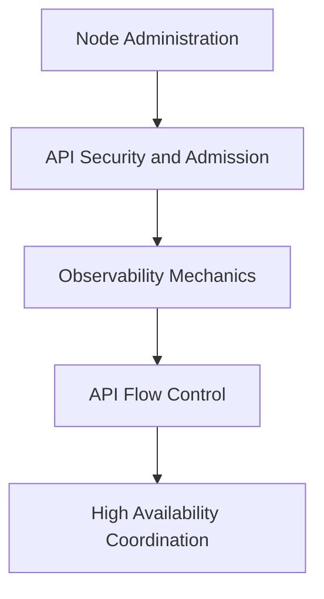

# Module 15: Cluster Administration, Observability, and API Flow Control

This module covers advanced cluster administration operations, including graceful and non-graceful node shutdowns, swap memory management with Linux kernel sysctls and cgroup v2 integration, node autoscaling, manual certificates generation with the Certificates API, admission webhooks, observability mechanics (system logging, metrics stability, OpenTelemetry traces), API Priority and Fairness (APF), and Coordinated Leader Election using the LeaseCandidate API.

---

## 🗺️ Cognitive Map: How to Think About the Flow of Knowledge

To build a strong intuition for advanced Kubernetes cluster administration, think of the topics as progressing from host-level node tuning, to API admission controls, cluster observability, api flow control, and distributed consensus:



1. **Step 1: Node Administration (Sections 1, 2 & 3):** We start at the machine layer. We configure systemd inhibitor locks to delay node shutdowns for pod draining, integrate swap memory allocations with cgroup v2, and manage node autoscaling.
2. **Step 2: API Security & Admission (Sections 4 & 5):** We intercept requests to the API. We request, sign, and approve certificates using the Certificates API, and deploy Mutating/Validating Webhooks to enforce custom cluster-wide configuration policies.
3. **Step 3: Observability Mechanics (Section 6):** We inspect the health of the system. We configure system logging, deploy the Metrics Server to gather CPU/Memory metrics, and track system latency using OpenTelemetry tracing.
4. **Step 4: API Flow Control (Section 7):** To protect the `kube-apiserver` from overloading during high-traffic events, we configure API Priority and Fairness (APF) rules, partitioning inbound requests using FlowSchemas and PriorityLevelConfigurations.
5. **Step 5: High Availability Coordination (Section 8):** Finally, we coordinate control plane consensus. We study how controllers perform leader election using Lease resources, and examine how the LeaseCandidate API minimizes resource conflicts.

By following this flow, you progress from **Host Operations (Shutdown/Swap) → API Policy Enforcement (Certs/Webhooks) → Cluster Telemetry (Observability) → Congestion Management (APF) → Distributed Consensus (Lease/Leader Election)**.

---


## 1. Graceful and Non-Graceful Node Shutdowns

### 1.1 Graceful Node Shutdown Mechanics
The Kubelet supports detecting host shutdown events and gracefully terminating pods running on that node. During a graceful shutdown, the Kubelet stops accepting new pods, initiates the standard pod termination process (sending `SIGTERM`, waiting for `terminationGracePeriodSeconds`, then sending `SIGKILL`), and updates the pod status to `Failed`.

#### systemd Inhibitor Locks Integration
To delay the OS shutdown long enough for Kubelet to terminate workloads, the Kubelet relies on **systemd inhibitor locks** via D-Bus (`/org/freedesktop/login1`). 
1. Upon startup, the Kubelet requests a delay inhibitor lock:
   ```bash
   # Conceptual DBus Inhibit request:
   Inhibit(what="shutdown", who="kubelet", why="Graceful node shutdown", mode="delay")
   ```
2. When a shutdown is initiated, systemd notifies the Kubelet and pauses the shutdown sequence for the duration defined in `/etc/systemd/logind.conf` under `InhibitDelayMaxSec` (which defaults to only **5 seconds**).
3. If Kubelet's configured grace period exceeds `InhibitDelayMaxSec`, systemd will shut down the host abruptly before Kubelet finishes draining the pods.

#### systemd logind Configuration
To allow the Kubelet sufficient time to gracefully drain pods, you must expand `InhibitDelayMaxSec` on the host operating system. Create a systemd logind override file:
```ini
# /etc/systemd/logind.conf.d/kubelet-graceful-shutdown.conf
[Login]
InhibitDelayMaxSec=45
```
Reload logind to apply:
```bash
sudo systemctl restart systemd-logind
```

> [!WARNING]
> **Debian/Ubuntu unattended-upgrades Conflict:**
> The `unattended-upgrades` package customizes the server shutdown grace period and conflicts with graceful node shutdowns when the Kubelet's `shutdownGracePeriod` is greater than 30 seconds. To bypass this conflict, symlink the package's logind configuration override to `/dev/null`:
> ```bash
> sudo ln -sf /dev/null /etc/systemd/logind.conf.d/unattended-upgrades-logind-maxdelay.conf
> ```

#### Kubelet Configuration
Configure graceful shutdown thresholds inside the `KubeletConfiguration` file:
```yaml
# /var/lib/kubelet/config.yaml
apiVersion: kubelet.config.k8s.io/v1beta1
kind: KubeletConfiguration
gracefulNodeShutdown: true # Enabled by default in v1.21+
shutdownGracePeriod: 30s # Total time allowed for all pods to shut down
shutdownGracePeriodCriticalPods: 10s # Subset of time reserved for critical pods (priority >= 2000000000)
```

---

### 1.2 Non-Graceful Node Shutdown & Volume Recovery
When a node crashes abruptly (e.g. power failure, hardware fault), the Kubelet cannot run its shutdown hooks. Pods on the crashed node remain in the `Terminating` or `Unknown` state because the API server cannot verify if the processes are still running.

#### The Volume Detach Deadlock
For stateful workloads utilizing read-write-once (RWO) volumes (like AWS EBS or local SAN storage), the volume remains attached to the failed host. Since the pod cannot be cleanly deleted, the volume attachment object (`VolumeAttachment`) remains in `etcd`, preventing the scheduler from mounting the same volume to a healthy node when rescheduling the workload.

#### Recovery via Out-of-Service Taints
To force volume detachment and allow stateful pods to safely recreate on healthy nodes:
1. **Apply the Out-of-Service Taint:**
   Taint the failed node with `node.kubernetes.io/out-of-service=nodeshutdown:NoExecute`:
   ```bash
   kubectl taint nodes worker-node-2 node.kubernetes.io/out-of-service=nodeshutdown:NoExecute
   ```
2. **Eviction and Re-mounting:**
   The control plane immediately deletes the pods on `worker-node-2`, detaches their persistent volumes, and reschedules the stateful workloads onto a healthy node.
3. **Post-Recovery Cleanup:**
   Once the crashed node is restored or decommissioned, remove the taint:
   ```bash
   kubectl taint nodes worker-node-2 node.kubernetes.io/out-of-service-
   ```

---

## 2. Swap Memory Management

Traditionally, Kubernetes required disabling swap space on all worker nodes. However, swap support allows the Linux kernel to swap cold memory pages to disk, preventing system-level memory spikes from crashing the node.

### 2.1 Kubelet Swap Configuration
To run Kubelet with swap active, you must instruct the agent to tolerate swap and define its behavior:
```yaml
# /var/lib/kubelet/config.yaml
failSwapOn: false # Tolerate host swap presence without crashing
memorySwap:
  swapBehavior: LimitedSwap # Options: NoSwap, LimitedSwap
```

#### Swap Behaviors
1. **`NoSwap` (Default):** Workloads running inside Kubernetes containers cannot use swap. The Kubelet directs the container runtime to allocate 0 swap bytes. However, host system processes and the Kubelet itself can still swap.
2. **`LimitedSwap`:** Workloads can use swap. The swap limit is tied directly to the container's memory request/limit ratio.

---

### 2.2 Host-Level OS & Cgroup Integration
To enforce swap boundaries, the node must run **cgroups v2** (unified control group hierarchy). The container runtime configures swap by writing values to the cgroup hierarchy:
* **Memory Swap Limit Path:** `/sys/fs/cgroup/kubepods.slice/kubepods-burstable.slice/pod<UUID>/container<UUID>/memory.swap.max`
* If a node is configured with cgroups v1, the Kubelet cannot restrict container-level swap usage, and setting `LimitedSwap` will fail.

#### Kernel Tuning (Sysctl parameters)
To adjust how aggressively the Linux kernel swaps pages out of physical RAM:
* **`vm.swappiness`:** Value between `0` and `100`. Lower values tell the kernel to avoid swapping and keep pages in RAM as long as possible. Set this in `/etc/sysctl.d/99-swap.conf`:
  ```ini
  vm.swappiness=10
  ```
* Apply the sysctl dynamically:
  ```bash
  sudo sysctl --system
  ```

---

### 2.3 Swap Observability and Metrics
The Kubelet collects swap metrics at its `/metrics/resource` and `/stats/summary` endpoints:
* `node_swap_usage_bytes`: Current host-level swap utilization.
* `container_swap_usage_bytes`: Current container-level swap utilization.
* `container_swap_limit_bytes`: The maximum swap allowed for the container.
* `machine_swap_bytes`: Total swap capacity of the physical host.

#### CLI Verification Commands
You can inspect swap metrics directly via the CLI:
```bash
# View node-level swap stats
kubectl top nodes --show-swap

# View pod-level swap stats in a namespace
kubectl top pods -n default --show-swap
```

---

## 3. Node Autoscaling

Node autoscaling dynamically scales the physical capacity of a Kubernetes cluster to match workload resource demands.

```
                  +-----------------------------------+
                  |        Pending Pods Exist         |
                  |     (Unschedulable due to CPU)    |
                  +-----------------+-----------------+
                                    |
                                    v
                  +-----------------------------------+
                  |         Cluster Autoscaler        |
                  | (Triggers scale-up in cloud provider)|
                  +-----------------+-----------------+
                                    |
                                    v
                  +-----------------------------------+
                  |           New Node Added          |
                  |     (Pods successfully scheduled) |
                  +-----------------+-----------------+
                                    |
            +-------+---------------+-------+
            | (Utilization drops < 50%)     | (Evaluate cost optimization)
            v                               v
+-----------------------+       +-----------------------+
|  Consolidate Workloads|       |      Scale-Down       |
| (Reschedule pods)     |       | (Terminate idle node) |
+-----------------------+       +-----------------------+
```

### 3.1 Provisioning (Scale-Up) vs Consolidation
*   **Provisioning:** Occurs when the scheduler cannot place a Pod due to resource constraints (insufficient CPU/memory, node selectors, taints). The Autoscaler detects these pending pods and provisions a new node.
*   **Consolidation (formerly Scale-Down):** Evaluates nodes that are underutilized. If their active workloads can be rescheduled onto other nodes without violating constraints, the Autoscaler drains the node and terminates the underlying VM to save costs.

### 3.2 Scheduling Constraints
The autoscaling engine must respect all Pod scheduling rules:
1.  **Resource Requests:** Nodes are provisioned based on the *declarative requests* of pending pods, not actual real-time utilization.
2.  **Affinities & Anti-Affinities:** The new node must reside in a zone/topology that satisfies `podAffinity` or `podAntiAffinity` rules.
3.  **Topology Spread Constraints:** Ensures workloads are balanced across failure domains.
4.  **Storage Volumes:** If a pod requires an AWS EBS volume, the autoscaler must provision the node in the *same Availability Zone* as the volume.

---

## 4. Certificates API & TLS Bootstrapping

Kubernetes requires secure TLS communication across all control plane components and worker nodes.

### 4.1 Manual Certificate Generation using OpenSSL
To manually generate a new client certificate and submit it to the cluster:

#### Step 1: Create a Private Key and CSR Configuration
Create a private key for the user/client:
```bash
openssl genrsa -out developer.key 2048
```
Create an OpenSSL configuration file named `developer-csr.conf`:
```ini
[req]
default_bits = 2048
prompt = no
default_md = sha256
distinguished_name = dn

[dn]
CN = developer-user
O = system:masters # Group name (binds to administrative privileges)
```
Generate the raw CSR:
```bash
openssl req -new -key developer.key -out developer.csr -config developer-csr.conf
```

#### Step 2: Submit CSR to the Kubernetes Certificates API
Convert the CSR to base64 (strip newlines):
```bash
cat developer.csr | base64 | tr -d '\n'
```
Apply the `CertificateSigningRequest` manifest:
```yaml
# developer-csr.yaml
apiVersion: certificates.k8s.io/v1
kind: CertificateSigningRequest
metadata:
  name: developer-user-csr
spec:
  request: <BASE64_CSR_STRING_HERE>
  signerName: kubernetes.io/kube-apiserver-client # Specific signer
  usages:
  - client auth # Purpose
```
```bash
kubectl apply -f developer-csr.yaml
```

---

### 4.2 Managing the CSR Lifecycle
Administrative approval or rejection of CSRs is managed via `kubectl`:
```bash
# List all pending certificate signing requests
kubectl get csr

# Approve the request
kubectl certificate approve developer-user-csr

# Reject the request
kubectl certificate reject developer-user-csr
```

#### Extracting the Issued Certificate
Once approved, the API server signs the certificate and updates the status. Extract the certificate:
```bash
kubectl get csr developer-user-csr -o jsonpath='{.status.certificate}' | base64 --decode > developer.crt
```

---

### 4.3 Kubelet TLS Bootstrapping
Instead of manually copying client certificates to every worker node during installation, Kubernetes uses **TLS Bootstrapping**:
1. The Kubelet starts with a temporary **Bootstrap Token**.
2. It authenticate to the API Server and submits a CSR for its node certificate (`CN=system:node:<node-name>`).
3. An auto-approval controller validates the request and issues the certificate.
4. The Kubelet automatically handles subsequent certificate renewals before expiration.

---

## 5. Admission Webhooks & Extensible Admission Control

Admission webhooks are HTTP callbacks that intercept API requests after authentication and authorization but before object persistence in `etcd`.

```
 +-------------+      +----------------+      +------------------+      +-------------+
 | API Request | ---> | Authentication | ---> |  Authorization   | ---> |   Mutating  |
 +-------------+      +----------------+      +------------------+      |  Webhooks   |
                                                                        +------+------+
                                                                               |
                                                                               v
 +-------------+      +----------------+      +------------------+      +------+------+
 | Persistence | <--- |   Validation   | <--- | OpenAPI Schema   | <--- | Validating  |
 |  (in etcd)  |      |   Webhooks     |      |  Verification    |      |  Webhooks   |
 +-------------+      +----------------+      +------------------+      +-------------+
```

### 5.1 Mutating vs Validating Webhooks
*   **Mutating Webhooks:** Invoked first. They can modify the incoming object payload (e.g. injecting sidecar containers, adding default labels).
*   **Validating Webhooks:** Invoked after mutation. They inspect the final object state and return an approval or rejection. They cannot modify the object.

---

### 5.2 Webhook Configuration Options
Webhooks are declared via `MutatingWebhookConfiguration` or `ValidatingWebhookConfiguration` manifests:
```yaml
apiVersion: admissionregistration.k8s.io/v1
kind: ValidatingWebhookConfiguration
metadata:
  name: validation-rules-webhook
webhooks:
  - name: validate.example.com
    rules:
      - apiGroups: [""]
        apiVersions: ["v1"]
        operations: ["CREATE", "UPDATE"]
        resources: ["pods"]
        scope: "Namespaced"
    clientConfig:
      service:
        namespace: security-system
        name: webhook-validator-svc
        path: "/validate-pods"
      caBundle: <BASE64_CA_BUNDLE_OF_THE_WEBHOOK_SERVER_CERT>
    admissionReviewVersions: ["v1"]
    sideEffects: None # Must declare whether this has out-of-band side effects
    timeoutSeconds: 5 # Maximum duration API server waits for the callback
    failurePolicy: Fail # Critical parameter: Fail or Ignore
```

#### Key Parameters
*   **`failurePolicy: Fail`:** If the webhook server is unreachable or times out, the entire API request is rejected. Used for strict security policies.
*   **`failurePolicy: Ignore`:** If the webhook is down, the request is allowed through. Used for non-critical monitoring or auditing.

---

### 5.3 Webhook Troubleshooting & Diagnostics
When API requests fail with webhook-related errors:
1.  **Check API Server Logs:** Look for webhook timeout or connection refused messages.
    ```bash
    kubectl logs -n kube-system kube-apiserver-controlplane | grep -i "webhook"
    ```
2.  **Verify Webhook Service Endpoints:** Ensure the backend pods are running and registered:
    ```bash
    kubectl get endpoints -n security-system webhook-validator-svc
    ```
3.  **Verify TLS Trust:** The `caBundle` field must contain the correct Root CA that signed the webhook server's certificate. If misconfigured, the API server will reject the connection due to certificate verification failure.

---

## 6. Observability: Logging, Metrics, and Tracing

### 6.1 System Component Metrics & Stability
Kubernetes components expose their metrics on `/metrics` in the Prometheus exposition format.

#### RBAC Authorization for Metrics Scrapers
To allow a monitoring agent (like Prometheus) to scrape `/metrics` and `/metrics/cadvisor` endpoints, create a ClusterRole and binding:
```yaml
apiVersion: rbac.authorization.k8s.io/v1
kind: ClusterRole
metadata:
  name: prometheus-scrapper
rules:
  - nonResourceURLs:
      - "/metrics"
      - "/metrics/cadvisor"
      - "/metrics/resource"
    verbs:
      - get
---
apiVersion: rbac.authorization.k8s.io/v1
kind: ClusterRoleBinding
metadata:
  name: prometheus-scrapper-binding
subjects:
  - kind: ServiceAccount
    name: prometheus-sa
    namespace: monitoring
roleRef:
  apiGroup: rbac.authorization.k8s.io
  kind: ClusterRole
  name: prometheus-scrapper
```

#### Metric Lifecycle & Deprecation Policy
Metrics follow a strict stability framework to prevent breaking downstream alerts and dashboards:
1.  **Alpha Metrics:** No stability guarantees. Can be deleted or modified at any time.
2.  **Beta Metrics:** Looser API contract. Labels can be added, but not removed.
3.  **Stable Metrics:** Guaranteed to not change type, name, or signature.
4.  **Deprecated Metrics:** Marked for future deletion. Emits warning messages.
5.  **Hidden Metrics:** No longer published for scraping. 
6.  **Deleted Metrics:** Permanently removed.

#### Enabling Hidden Metrics
If you upgrade a cluster and miss the migration timeline for a deprecated metric, you can temporarily enable hidden metrics using the command line flag on the respective control plane binary (e.g. `kube-apiserver`, `kubelet`):
```bash
--show-hidden-metrics-for-version=1.35
```

---

### 6.2 klog Library and System Logging
Kubernetes utilizes the **`klog`** library for component logging. 

#### Deprecation of Logging Flags
To simplify logging architectures, starting in v1.23 and removed in v1.26, all file-writing flags in klog (such as `--log-dir`, `--logtostderr`, `--alsologtostderr`) were removed. 
* All Kubernetes components now write logs strictly to **`stderr`**.
* Redirection to files must be handled by the invocation shell or wrappers like `kube-log-runner`.

#### Structured Logging (JSON)
Kubernetes components support writing logs in structured JSON format rather than flat text. To enable JSON format on control plane components, configure the logging format flag:
```bash
--logging-format=json
```
Example structured output:
```json
{"ts":1698242115525,"v":2,"msg":"GET /api/v1/namespaces/default/pods","method":"GET","uri":"/api/v1/namespaces/default/pods","status":200}
```

---

### 6.3 OpenTelemetry System Tracing
Kubernetes control plane components can export traces over the **OpenTelemetry Protocol (OTLP)** via gRPC on port `4317`.

#### API Server Tracing Configuration
To configure tracing on `kube-apiserver`, create a tracing configuration file:
```yaml
# /etc/kubernetes/tracing-config.yaml
apiVersion: apiserver.config.k8s.io/v1
kind: TracingConfiguration
endpoint: localhost:4317 # Address of the OpenTelemetry Collector
samplingRatePerMillion: 1000 # Record 0.1% of requests
```
Reference the file via the API Server flag:
```bash
--tracing-config-file=/etc/kubernetes/tracing-config.yaml
```

---

## 7. API Priority and Fairness (APF)

To prevent the `kube-apiserver` from freezing or crashing during traffic spikes, API Priority and Fairness (APF) categorizes, queues, and dispatches requests fairly.

```
       +---------------------------------------------+
       |             Incoming API Request            |
       +----------------------+----------------------+
                              |
                              v
       +---------------------------------------------+
       |                 FlowSchema                  |
       |  (Classifies request by user/verb/resource) |
       +----------------------+----------------------+
                              |
                              v
       +---------------------------------------------+
       |         PriorityLevelConfiguration          |
       |  (Defines queues, concurrency seats, limit) |
       +----------------------+----------------------+
                              |
           +------------------+------------------+
           | (Concurrent capacity available)     | (Concurrency limit reached)
           v                                     v
+-----------------------+             +-----------------------+
|    Allocate Seat      |             |     Enqueue Request   |
|   (Execute Request)   |             | (Shuffled Round-Robin)|
+-----------------------+             +-----------------------+
```

### 7.1 FlowSchemas and PriorityLevelConfigurations
*   **`FlowSchema` (FS):** Matches incoming requests based on credentials, verbs, namespaces, and API groups. It assigns matching requests to a specific `PriorityLevelConfiguration`.
*   **`PriorityLevelConfiguration` (PLC):** Defines the execution and queuing strategy for that priority tier. It controls the maximum concurrent "seats" (APIServer execution threads) allowed for the category.

---

### 7.2 Shuffled Round-Robin (SRR) Queuing
When execution seats are fully saturated, incoming requests are placed into queues. APF uses Shuffled Round-Robin:
1.  A Priority Level has multiple parallel queues.
2.  Incoming requests are hashed to a subset of queues (shuffling).
3.  The request is appended to the shortest queue in the subset.
4.  Requests are dispatched round-robin across queues.
This isolates abusive controllers: if one client sends a flood of requests, it saturates only its hashed queues, leaving the remaining queues free for other clients in the same priority tier.

---

### 7.3 APF Inspection Commands
```bash
# List all active FlowSchemas
kubectl get flowschemas

# Describe a specific PriorityLevelConfiguration
kubectl describe prioritylevelconfigurations workload-low

# View API Priority and Fairness metrics
kubectl get --raw /metrics | grep apiserver_flowcontrol
```

---

## 8. Coordinated Leader Election

High-availability Kubernetes control planes run multiple replicas of `kube-scheduler` and `kube-controller-manager`. To prevent conflicting actions, only one replica can act as the leader.

### 8.1 The Lease API
Kubernetes uses the **Lease API** (`coordination.k8s.io/v1`) as a distributed lock. The leader replica maintains the lease by updating it periodically.
* `holderIdentity`: The hostname/pod name of the current leader.
* `acquireTime`: When leadership was acquired.
* `renewTime`: The last heartbeat timestamp.
* `leaseDurationSeconds`: The validity window of the lease.

---

### 8.2 Coordinated Leader Election (CLE)
Introduced in v1.33, CLE enables deterministic leader selection instead of a race condition:
*   **LeaseCandidate API:** Candidates register their candidacy by creating `LeaseCandidate` objects.
*   **Selection Strategy:** The control plane applies a selection logic, prioritizing the candidate with the lowest emulation version (`OldestEmulationVersion`), followed by binary version, and then creation time. This ensures that during a cluster upgrade, older control plane replicas retain leadership to maintain backward compatibility and avoid version skew anomalies.

---

## 9. Verification PoC: Configuring Swap, APF, and Webhook Diagnostics

This hands-on PoC walks through configuring swap toleration, inspecting APF, and debugging a failing validating admission webhook.

### Step 1: Provisioning Swap on a Node
To configure a worker node to support limited swap:
1. Create a swap file on the host OS:
   ```bash
   sudo fallocate -l 1G /swapfile
   sudo chmod 600 /swapfile
   sudo mkswap /swapfile
   sudo swapon /swapfile
   ```
2. Persist the swap configuration:
   ```bash
   echo '/swapfile none swap sw 0 0' | sudo tee -a /etc/fstab
   ```
3. Edit the `KubeletConfiguration` at `/var/lib/kubelet/config.yaml`:
   ```yaml
   failSwapOn: false
   memorySwap:
     swapBehavior: LimitedSwap
   ```
4. Restart the Kubelet:
   ```bash
   sudo systemctl restart kubelet
   sudo systemctl status kubelet
   ```

---

### Step 2: Querying APF Flow Configurations
Verify that the API Priority and Fairness rules are active:
```bash
# Check if API server has APF active
kubectl get flowschemas | grep -E "(system-|workload-)"
```
Output:
```plaintext
NAME                           RESOURCEVERSION   AGE
system-leader-election         2091              2d
system-nodes-high              2095              2d
workload-leader-election       2098              2d
```

---

### Step 3: Simulating and Debugging a Failing Webhook
1. Apply a validating webhook configuration that targets a dummy server:
   ```yaml
   # webhook-poc.yaml
   apiVersion: admissionregistration.k8s.io/v1
   kind: ValidatingWebhookConfiguration
   metadata:
     name: audit-webhook-poc
   webhooks:
     - name: audit.example.com
       rules:
         - apiGroups: [""]
           apiVersions: ["v1"]
           operations: ["CREATE"]
           resources: ["configmaps"]
           scope: "Namespaced"
       clientConfig:
         url: "https://127.0.0.1:9443/validate"
         caBundle: dGVzdC1jYS1idW5kbGUK # Dummy base64
       admissionReviewVersions: ["v1"]
       sideEffects: None
       timeoutSeconds: 2
       failurePolicy: Fail
   ```
   ```bash
   kubectl apply -f webhook-poc.yaml
   ```
2. Attempt to create a ConfigMap:
   ```bash
   kubectl create configmap test-cm --from-literal=key=value
   ```
   *Expect output:*
   ```plaintext
   Error from server (InternalError): Internal error occurred: failed calling webhook "audit.example.com": failed to call webhook: Post "https://127.0.0.1:9443/validate": dial tcp 127.0.0.1:9443: connect: connection refused
   ```
3. Remove the block by deleting the broken webhook configuration:
   ```bash
   kubectl delete validatingwebhookconfiguration audit-webhook-poc
   ```
