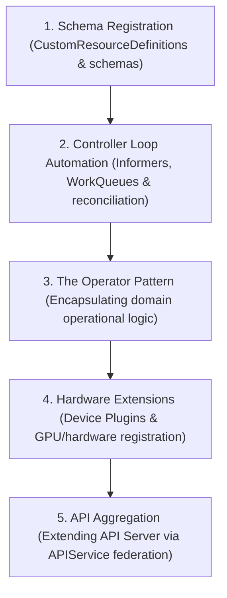

# Module 16: Kubernetes API Extension and Operators

This module covers CustomResourceDefinitions (CRDs), Custom Controllers, the Operator Pattern, Device Plugins, and API Aggregation. It details how to extend the Kubernetes API and orchestrate custom resources.

---

## 🗺️ Cognitive Map: How to Think About the Flow of Knowledge

To build a strong intuition for Kubernetes extensibility, think of the topics as moving from static custom data definitions, to active automation loops, operational bundling, physical hardware access, and core API aggregation:



1. **Step 1: Schema Registration (Section 1):** We start by registering custom data types. We write CustomResourceDefinitions (CRDs) with OpenAPI v3 validation schemas and subresources (like `/status` and `/scale`) to define new structures within the API database.
2. **Step 2: Controller Loop Automation (Section 2):** Custom schemas require active loop engines. We build Custom Controllers that leverage Informers, SharedInformers, and WorkQueues to watch CRD events and reconcile discrepancies.
3. **Step 3: The Operator Pattern (Section 3):** We package these custom resources and controllers. We implement the Operator Pattern, which encapsulates domain-specific operations (e.g., database backups, automatic upgrades, clusters recovery) directly inside containerized daemons.
4. **Step 4: Hardware Extensions (Section 4):** We extend resource management down to the hardware. We deploy Device Plugins that interface with the Kubelet, allowing container runtimes to allocate physical hardware (like GPUs or NICs) to scheduled workloads.
5. **Step 5: API Aggregation (Section 5):** Finally, we look at full API Server federation. We compare lightweight CRDs with API Aggregation, configuring an auxiliary API server to handle specialized routing and logic.

By following this flow, you progress from **Custom Data Definition (CRDs) → Active State Reconciliation (Controllers) → Domain Automation (Operators) → Hardware Resource Allocation (Device Plugins) → Federated API Extension (Aggregation)**.

---


## 1. CustomResourceDefinitions (CRDs)

A **CustomResourceDefinition (CRD)** allows users to register custom resources (objects) with the Kubernetes API. Once a CRD is created, the API server handles the storage and lifecycle of the new resource type.

### A. CRD Anatomy
A CRD defines the API group, versions, singular/plural names, scope (Namespaced vs. Cluster), and a validation schema:
* **Validation Schema:** Defined using OpenAPI v3 schema specifications. This ensures that the API server validates request payloads before writing them to `etcd`.
* **Subresources:**
  * `/status`: Decouples spec modifications from status updates. When `/status` is enabled, updating the main spec does not clear the status, and vice-versa.
  * `/scale`: Exposes the resource to scale operations (like `kubectl scale` or HorizontalPodAutoscalers), mapping `.spec.replicas` and `.status.replicas`.

### B. Example CRD Manifest
```yaml
apiVersion: apiextensions.k8s.io/v1
kind: CustomResourceDefinition
metadata:
  name: backups.stable.example.com
spec:
  group: stable.example.com
  versions:
    - name: v1
      served: true
      storage: true
      schema:
        openAPIV3Schema:
          type: object
          properties:
            spec:
              type: object
              properties:
                database:
                  type: string
                cronExpression:
                  type: string
            status:
              type: object
              properties:
                lastBackupTime:
                  type: string
  scope: Namespaced
  names:
    plural: backups
    singular: backup
    kind: Backup
    shortNames:
    - bk
```

---

## 2. Custom Controllers

A **Custom Controller** is a background loop that watches the API server for changes to custom resources (like the `Backup` resource defined above) and reconciles the actual state of the cluster to match the desired state.

### A. Reconciliation Loop Mechanism
1. **Informer:** Watches the API server for target resource events (create, update, delete) and maintains a local cache to avoid query overload.
2. **Workqueue:** Events are pushed into a thread-safe queue.
3. **Reconciler:** A worker function pops items from the workqueue, inspects the current cluster state, and executes actions (e.g. triggering an external shell script, provisioning a pod) to match the desired state.

---

## 3. The Operator Pattern

The **Operator Pattern** combines a **CustomResourceDefinition (CRD)** with a **Custom Controller** to package human operational knowledge into software code. It is designed to manage complex, stateful applications (like PostgreSQL, Elasticsearch, or Kafka) automatically.

### A. Operator Tasks
* Deploying applications on demand.
* Taking and restoring backups.
* Managing rolling upgrades of database schemas.
* Implementing automated failover and leader election during node loss.

---

## 4. Device Plugins

The **Device Plugin Framework** allows hardware vendors (like NVIDIA, Intel, or Mellanox) to expose host devices (GPUs, FPGAs, NICs) to container workloads without modifying upstream Kubernetes code.

### A. Lifecycle & Communication
1. **Registration:** The Device Plugin running on the node registers itself with the local Kubelet via a UNIX socket path (`/var/lib/kubelet/device-plugins/kubelet.sock`) using gRPC.
2. **ListAndWatch:** The plugin streams host device status and health to Kubelet.
3. **Allocate:** When Kubelet is scheduling a Pod requesting a device, it invokes the plugin's `Allocate` gRPC method to initialize the device interface and pass mount paths/variables to the container runtime.

---

## 5. API Server Aggregation

API Server Aggregation allows developers to write their own standalone API server (Extension API Server) that integrates seamlessly with the primary `kube-apiserver`.

### A. Mechanisms
* **`APIService` Object:** Users register their extension server using an `APIService` manifest.
* **Routing:** When a client queries the custom API path, the primary `kube-apiserver` acts as a reverse proxy, forwarding the HTTP request directly to the extension server.
* **Comparison with CRDs:**
  * **CRDs:** Easy to write, stored directly in default `etcd`, limited customization.
  * **API Aggregation:** High complexity, requires managing a separate server and database (usually a dedicated `etcd`), but allows complete control over validation, storage, version translation, and business logic.

---

## 🛠️ Practical Proof of Concept (PoC)

### Target Scenario
We will create a custom resource definition named `Backup`, deploy a custom instance of it, and query it using `kubectl`.

### Step-by-Step Guided Steps

1. **Verify or Provision Cluster:**
   Ensure you have a running cluster (e.g., using `kind`):
   ```bash
   kind create cluster --name cka-ext-poc
   ```

2. **Deploy the CRD:**
   Save the Backup CRD manifest to a file named `backup-crd.yaml` and apply it:
   ```yaml
   cat <<EOF > backup-crd.yaml
   apiVersion: apiextensions.k8s.io/v1
   kind: CustomResourceDefinition
   metadata:
     name: backups.stable.example.com
   spec:
     group: stable.example.com
     versions:
       - name: v1
         served: true
         storage: true
         schema:
           openAPIV3Schema:
             type: object
             properties:
               spec:
                 type: object
                 properties:
                   database:
                     type: string
                   cronExpression:
                     type: string
         subresources:
           status: {}
     scope: Namespaced
     names:
       plural: backups
       singular: backup
       kind: Backup
       shortNames:
       - bk
   EOF
   ```
   Apply the CRD:
   ```bash
   kubectl apply -f backup-crd.yaml
   ```

3. **Verify API Discovery:**
   Check if the API server discovers the new Backup resource type:
   ```bash
   kubectl api-resources | grep backups
   ```
   Verify that it displays `backups` mapped to `bk` shortname and `stable.example.com` group.

4. **Deploy a Custom Backup Resource:**
   Create an instance of the custom `Backup` resource:
   ```yaml
   cat <<EOF > custom-backup.yaml
   apiVersion: stable.example.com/v1
   kind: Backup
   metadata:
     name: production-db-backup
   spec:
     database: "postgres-prod"
     cronExpression: "0 2 * * *"
   EOF
   ```
   Apply the instance:
   ```bash
   kubectl apply -f custom-backup.yaml
   ```

5. **Query the Custom Resource:**
   Use kubectl to read the custom object:
   ```bash
   kubectl get bk
   # or
   kubectl describe backup production-db-backup
   ```

6. **Clean up Resources:**
   Delete the custom resource, the CRD, and the cluster:
   ```bash
   kubectl delete -f custom-backup.yaml
   kubectl delete -f backup-crd.yaml
   rm custom-backup.yaml backup-crd.yaml
   kind delete cluster --name cka-ext-poc
   ```

---

## 🔗 Related Modules
- [Module 02: Cluster Architecture & Control Plane Components](02_cluster_architecture_and_components.md) - Details how the control plane API server routes requests and manages default objects.
