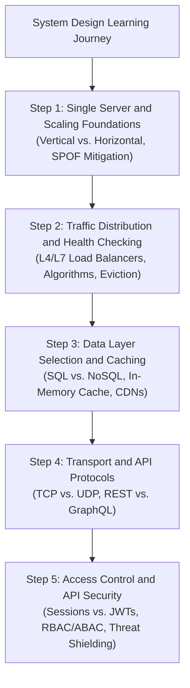
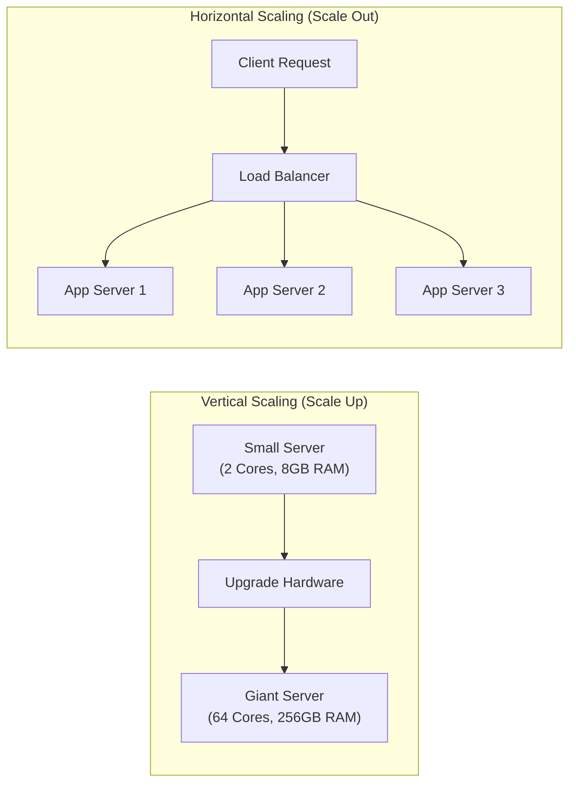
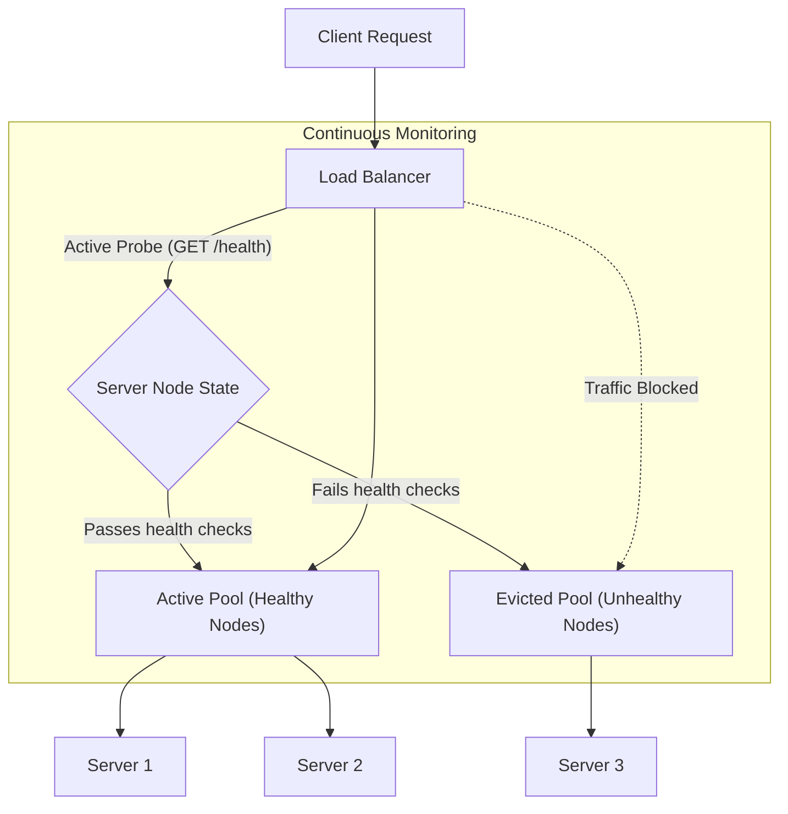
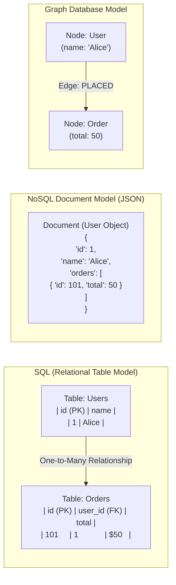
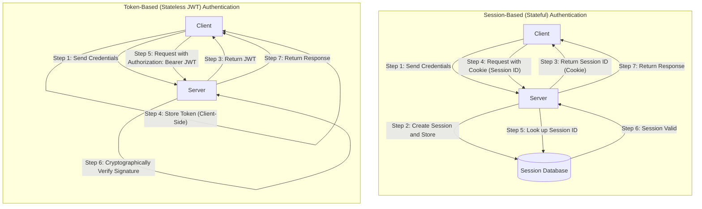
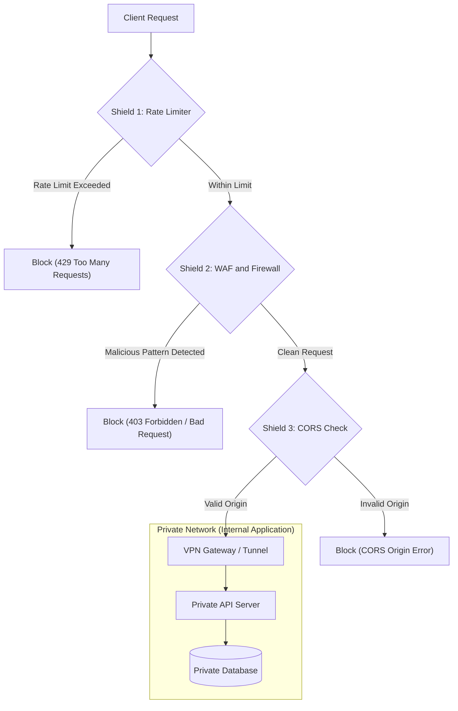

# Module 17: System Design Fundamentals

This module covers foundational system design concepts, database selection, horizontal and vertical scaling, load balancing, API protocols, transport layers, authentication, authorization, and core API security protection strategies.

---

## 🗺️ Cognitive Map: How to Think About the Flow of Knowledge

To build a strong intuition for high-level system architecture, think of the topics as moving from a single server setup, to scaling architectures, distributing traffic, structuring the data storage, designing communication APIs, and securing the system:

1. **Step 1: Single Server & Scaling Foundations (Section 1):** We start with the simplest architecture—a single server running the application, database, and cache. We then scale this setup vertically (upgrading hardware) and horizontally (multiplying servers), identifying bottlenecks and Single Points of Failure (SPOFs).
2. **Step 2: Traffic Distribution and Health Checking (Section 2):** To handle horizontal scaling, we introduce Load Balancers. We examine L4 vs. L7 routing, load balancing algorithms, and health check mechanics for node eviction and recovery.
3. **Step 3: Data Layer Selection and Caching (Section 3):** We select the correct database engines (Relational/SQL vs. NoSQL Document, Key-Value, Columnar, or Graph stores) based on ACID guarantees and schema flexibility, and implement Caching/CDNs to reduce database load.
4. **Step 4: Transport and API Protocols (Section 4):** We design communication contracts. We compare TCP vs. UDP at the transport layer, and REST vs. GraphQL for web APIs, analyzing payload sizes and query structures.
5. **Step 5: Access Control and API Security (Section 5):** Finally, we secure the entry doors. We implement authentication (Sessions vs. JWTs), authorization models (RBAC, ABAC, ACLs, OAuth 2.0), and defend against common attacks (Rate Limiting, CORS, Injections, WAF, VPNs, CSRF, and XSS).

By following this flow, you progress from **Foundational Server Scaling → Traffic Orchestration → Storage Selection → API Contract Design → Enterprise Security Hardening**.

---

## 1. Single Server Setup and Scaling Foundations

Every complex architecture begins with a single server setup. Understanding how to transition from a single host to a distributed pool is the core of system scaling.

### A. Single Server Architecture
In a single server setup, all components run on a single host machine: the web server (e.g., Nginx, Apache), the application runtimes (e.g., Node.js, Python, Go), the database (e.g., PostgreSQL, MongoDB), and the cache (e.g., Redis).
* **Workflow:** 
  1. The user requests `app.demo.com`.
  2. The client browser queries DNS to resolve the domain to the server's public IP address (e.g., `12.34.56.78`).
  3. The browser sends HTTP requests directly to the server IP.
  4. The server processes the request, queries the database locally, and returns the response.
* **Limitations:** A single server suffers from severe resource exhaustion (CPU, memory, disk I/O) and represents a **Single Point of Failure (SPOF)**. If the server crashes, the entire system is offline.

### B. Vertical vs. Horizontal Scaling
When traffic increases, the system must scale to handle the load:
* **Vertical Scaling (Scaling Up):** Adding more power (CPU, RAM, faster NVMe storage) to the existing server.
  * *Pros:* Simple; requires zero application code or architectural changes. Database relations remain unified.
  * *Cons:* Hard hardware limit (ceiling of modern server motherboards); no redundancy (SPOF remains); downtime is usually required for upgrades.
* **Horizontal Scaling (Scaling Out):** Adding more machines to the resource pool.
  * *Pros:* Theoretically infinite scale; high availability and redundancy; easy incremental upgrades.
  * *Cons:* Requires a load balancer; introduces networking complexity; application servers must be *stateless*; data consistency across distributed database nodes becomes challenging.

### C. Redundancy and SPOF Mitigation
To eliminate SPOFs, every component must have redundancy:
* **Application Layer:** Run multiple stateless server instances. If one instance fails, the load balancer reroutes traffic to the surviving instances.
* **Database Layer:** Deploy a primary-replica (master-slave) setup. Write operations go to the primary node, which replicates data to one or more read-only replicas. If the primary fails, a replica is promoted to primary.
* **Active-Passive vs. Active-Active:** In active-passive, secondary nodes stand by and only receive traffic upon failover. In active-active, all redundant nodes actively process traffic simultaneously.

---

## 2. Load Balancing and System Health

As we scale horizontally, we require a mechanism to distribute incoming requests across our pool of application servers. This is the role of the Load Balancer (LB).

### A. Load Balancer Routing (L4 vs. L7)
Load balancers operate at different layers of the OSI model:
* **Layer 4 (L4) Load Balancing:** Operates at the transport layer (TCP/UDP). It routes traffic based on the source IP, destination IP, and port number without inspecting the HTTP/HTTPS payload. It is fast and requires low CPU overhead, but cannot make routing decisions based on request paths, headers, or cookies.
* **Layer 7 (L7) Load Balancing:** Operates at the application layer (HTTP/HTTPS). It inspects HTTP headers, cookies, query parameters, and URL paths. This allows smart routing (e.g., sending `/api` to api-servers and `/static` to storage servers, or sticky sessions based on cookies). L7 requires SSL termination, which consumes more CPU resources.

### B. Load Balancing Algorithms
To distribute traffic, load balancers use various routing algorithms:
* **Round Robin:** Routes requests sequentially to each server in the pool. Best when all backend servers have identical hardware.
* **Weighted Round Robin:** Assigns a weight to each server based on capacity. More powerful servers receive a higher percentage of requests.
* **Least Connections:** Routes requests to the server with the fewest active TCP connections. Highly effective for long-running requests or databases.
* **IP Hash:** Hashes the client's IP address to determine which server gets the request. This guarantees that a specific client always hits the same backend server (useful for session caching).

### C. Health Checks and Node Eviction
To prevent routing traffic to unhealthy servers, load balancers perform active health checks:
* **Mechanism:** The load balancer sends periodic requests (e.g., HTTP GET to `/health` or TCP pings) to each backend server every $N$ seconds.
* **Eviction:** If a server fails $K$ consecutive health checks, the load balancer marks it as unhealthy and evicts it from the active routing pool.
* **Recovery:** The load balancer continues monitoring the evicted server. Once it passes $M$ consecutive health checks, it is reintegrated into the pool.

---

## 3. Data Layer Design (SQL, NoSQL, and Caching)

Selecting the right data storage engine is one of the most critical architectural decisions.

### A. Relational (SQL) Databases
SQL databases (e.g., PostgreSQL, MySQL) store data in structured tables with predefined schemas, utilizing foreign keys to represent relationships.
* **ACID Transactions:** Guarantee Atomicity, Consistency, Isolation, and Durability.
* **Joins:** Efficiently join tables to retrieve complex relational data.
* **Scaling:** Scaled horizontally through master-replica setups (for reads) or sharding (partitioning rows across multiple database servers based on a shard key).

### B. Non-Relational (NoSQL) Databases
NoSQL databases sacrifice strict ACID constraints or relationships to achieve high write throughput and horizontal scaling.
* **Key-Value Stores:** Store data as key-value pairs in RAM (e.g., Redis, Memcached) for extremely fast read/write access. Frequently used for caching and sessions.
* **Document Databases:** Store data in JSON or BSON documents (e.g., MongoDB). Ideal for unstructured or rapidly changing schemas where data objects are self-contained.
* **Column-Oriented (Columnar) Databases:** Store data by columns instead of rows (e.g., Cassandra, HBase). Optimized for high-volume analytical queries (OLAP) across billions of rows.
* **Graph Databases:** Store data as nodes, edges, and properties (e.g., Neo4j). Specifically designed for highly connected data structures like social graphs, recommendation engines, or fraud detection.

### C. Caching and Content Delivery Networks (CDNs)
To minimize database reads, systems cache data at multiple layers:
* **Application Cache:** Using an in-memory key-value store (like Redis) in a *cache-aside* pattern (checking cache first; if miss, query DB and update cache).
* **Content Delivery Network (CDN):** A geographically distributed network of proxy servers that cache static assets (HTML, CSS, JS, images, videos) close to the user's physical location. This reduces latency and web server bandwidth usage.

---

## 4. API Design, Protocols, and Networking

APIs define the communication contracts between clients and servers.

### A. Transport Layer: TCP vs. UDP
API protocols rely on transport layer protocols:
* **TCP (Transmission Control Protocol):** Connection-oriented. Establishes a connection via a 3-way handshake (SYN -> SYN-ACK -> ACK). Guarantees reliable, ordered packet delivery with error-checking and flow control. Used for HTTP, REST, GraphQL, and database connections.
* **UDP (User Datagram Protocol):** Connectionless, "fire-and-forget" protocol. Packets are sent without verifying delivery, order, or connection state. It is fast and lightweight. Used for video streaming, online gaming, VoIP, and DNS.

### B. RESTful APIs
REST (Representational State Transfer) is an architectural style based on HTTP.
* **Statelessness:** Each request from the client must contain all information needed to process it; the server stores no client session context.
* **Resources:** Identified by URLs (e.g., `/posts`). Actions are defined by HTTP methods:
  * `GET`: Retrieve resource (safe and idempotent).
  * `POST`: Create resource (neither safe nor idempotent).
  * `PUT`: Replace resource (idempotent).
  * `PATCH`: Partially update resource (non-idempotent).
  * `DELETE`: Remove resource (idempotent).
* **Headers:** Utilizes standard headers:
  * `Content-Type`: Format of body (e.g., `application/json`).
  * `Authorization`: Credentials (e.g., `Bearer <token>`).
  * `Cache-Control`: Instruction on caching.

### C. GraphQL
GraphQL is a query language for APIs that replaces REST's multi-endpoint architecture with a single endpoint (typically `POST /graphql`).
* **Schema Definition:** Types, queries, and mutations are defined in a schema.
* **Preventing Over-Fetching / Under-Fetching:** Clients specify the exact fields they need in the query payload. The server resolves and returns only those fields, saving bandwidth and roundtrips.
* **Mutations:** Used for write operations (create, update, delete).

---

## 5. Access Control and API Security Protection

APIs must be strictly protected from attackers to prevent data breaches and denial of service.

### A. Authentication: Sessions vs. JWTs
Authentication verifies *who* the client is:
* **Session-Based Authentication (Stateful):**
  1. User logs in.
  2. Server creates a session record in the database or Redis cache.
  3. Server returns a session ID to the client in a cookie.
  4. The client's browser automatically sends the session ID cookie with every subsequent request.
  5. The server queries the database/cache to validate the session.
* **Token-Based Authentication (Stateless - JWT):**
  1. User logs in.
  2. Server creates a JSON Web Token (JWT) containing headers, payload (claims like user ID, roles, expiry), and signs it using a private key.
  3. Server returns the JWT.
  4. Client stores the token (localStorage or HttpOnly cookie) and sends it in the `Authorization: Bearer <token>` header.
  5. The server validates the token's cryptographic signature locally without querying a database.

### B. Authorization Models
Authorization verifies *what* authenticated users are allowed to do:
* **Role-Based Access Control (RBAC):** Assigns permissions to roles (e.g., admin, editor, viewer), and roles to users. Simplest to manage at scale.
* **Attribute-Based Access Control (ABAC):** Assigns permissions based on user attributes (department, age), resource attributes (confidentiality, owner), and environmental conditions (time of day, network location). Highly flexible but complex.
* **Access Control Lists (ACLs):** Each resource carries a list of specific user IDs and their allowed actions (e.g., Google Drive sharing).
* **OAuth 2.0:** A delegation protocol allowing a third-party application (e.g., Vercel) to access a resource server (e.g., GitHub API) on behalf of a user using an access token instead of user credentials.

### C. API Security Protection Techniques
To defend against common vulnerabilities, implement the following safeguards:
1. **Rate Limiting:** Restricts the number of requests a client can make in a time window to prevent API exhaustion and brute-forcing. Can be applied per-endpoint, per-IP, or globally.
2. **CORS (Cross-Origin Resource Sharing):** Browser-enforced mechanism that restricts a web page from making requests to a different domain than the one that served it. The server must explicitly allow the requesting origin via headers (e.g., `Access-Control-Allow-Origin`).
3. **SQL/NoSQL Injection Prevention:** Never concatenate user input directly into queries. Always use parameterized queries (prepared statements) or Object-Relational Mapping (ORM) safeguards.
4. **Firewalls (WAF):** A Web Application Firewall sits between the internet and the API, filtering out known malicious traffic patterns (suspicious headers, SQL keywords, abnormal methods).
5. **VPN (Virtual Private Network):** Restricts network access. Internal APIs or admin dashboards should reside inside a private network, accessible only via VPN tunnel.
6. **CSRF (Cross-Site Request Forgery) Prevention:** Protect session cookie-based systems from malicious sites triggering actions. Enforce CSRF tokens (unique, unpredictable tokens validated on every POST/PUT/DELETE request) and set cookie attributes to `SameSite=Strict`.
7. **XSS (Cross-Site Scripting) Prevention:** Prevent attackers from injecting executable scripts (JavaScript) into fields (like comment sections) that are rendered to other users. Always sanitize user input and HTML-encode all output.

