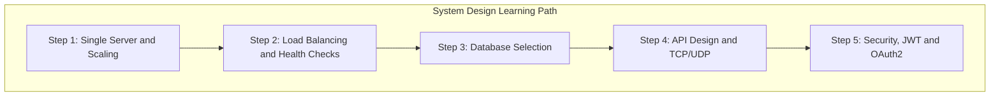
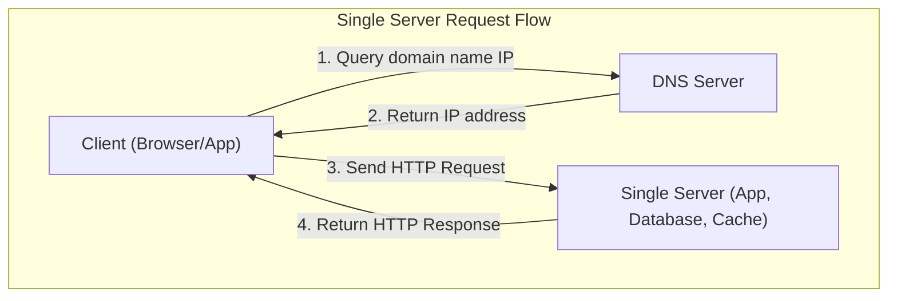
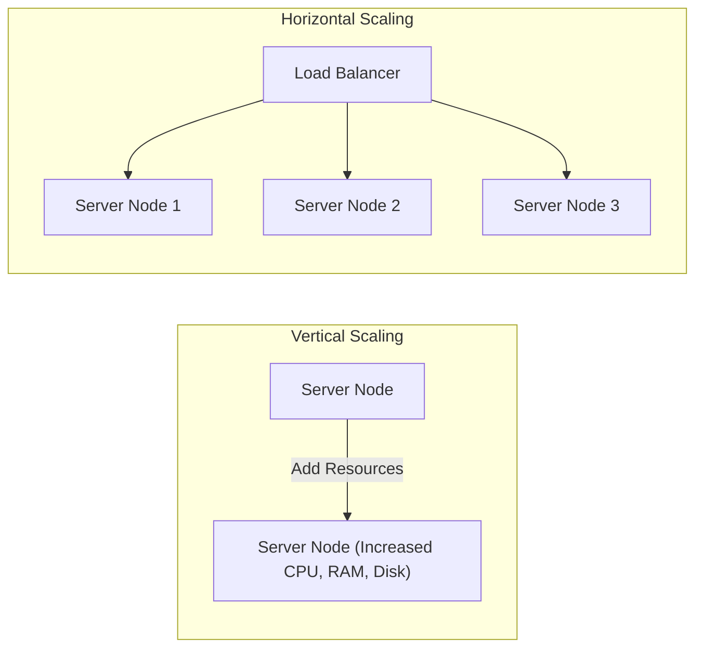
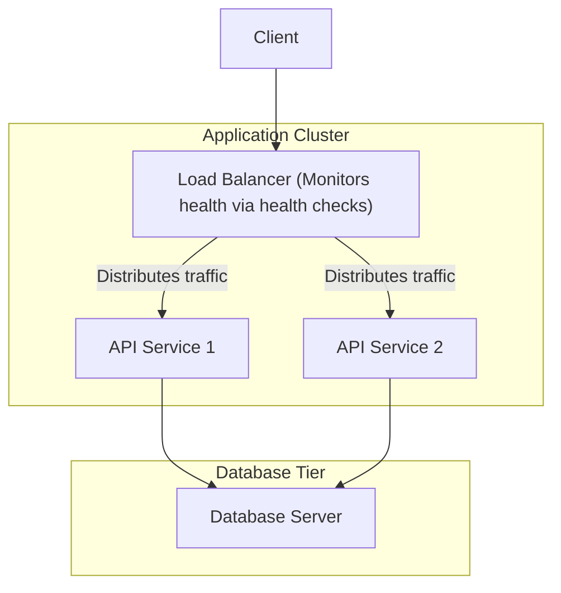
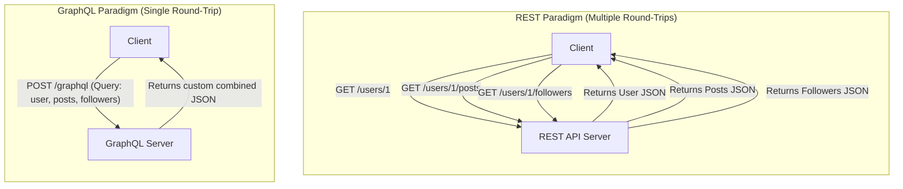
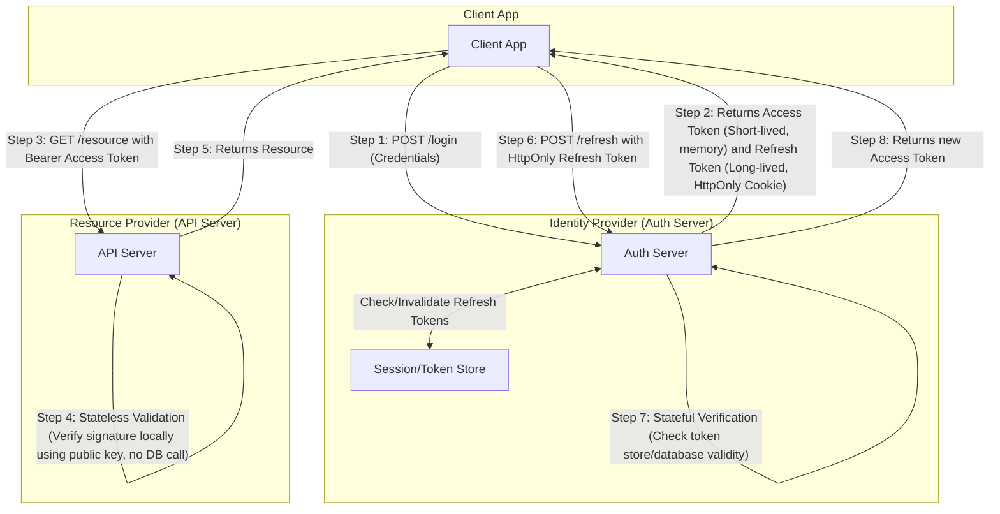
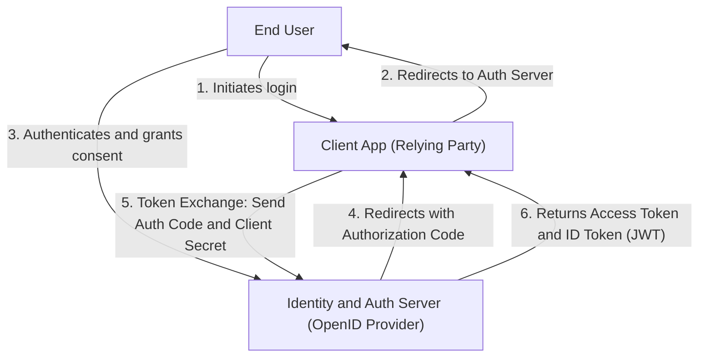

---
domains:
  - "networking"
  - "infra"
  - "database"
  - "security"
---

# Module 17: System Design Fundamentals

This module covers foundational system design principles, progressing from single server setups to production-ready architectures. It dives deep into database selection (SQL, NoSQL, Key-Value, Graph), horizontal and vertical scaling, load balancing algorithms, health checks, single points of failure (SPOF), API design styles (REST, GraphQL, gRPC), transport layer protocols (TCP/UDP), authentication, authorization, and core security controls.

---

## 🗺️ Cognitive Map: How to Think About the Flow of Knowledge

To build a strong intuition for system design fundamentals, think of the topics as moving from a single server to scaled, resilient, and secure multi-tier architectures:

1. **Step 1: Foundational Layout & Scaling (Section 1):** Moving from a single-point setup to vertical/horizontal models.
2. **Step 2: Traffic Distribution (Section 2):** Introducing load balancers and health checks to maintain availability.
3. **Step 3: Storage Selection (Section 3):** Choosing the right database engine based on ACID requirements and access latency.
4. **Step 4: API Design & Transport Protocols (Section 4):** Standardizing communication interfaces (REST, GraphQL, gRPC) and protocol bindings (TCP/UDP).
5. **Step 5: Defense-in-Depth & Identity (Section 5):** Securing endpoints through encryption, AAA (Authentication, Authorization, Accounting), and network safeguards.

By following this flow, you progress from **Single Node Primitives → Dynamic Routing → Data Architecture → Protocol Selection → Hardened Infrastructure**.

---

## 1. Single Server Setup & Scaling Foundations

### A. The Single Server Paradigm
In a foundational system setup, all software components run on a single machine. This includes:
* **Presentation & Web Layer:** Serves static files (HTML, CSS, JS) to browsers.
* **Application Layer:** Executes the business logic (e.g., Node.js, Python, Java).
* **Data Layer:** Hosts the database (e.g., PostgreSQL, MySQL) and cache (e.g., Redis).

#### Request Lifecycle on a Single Server:
1. The user enters a domain name (e.g., `app.demo.com`) in the client application.
2. The client queries the **Domain Name System (DNS)** to map the domain to the server's public IP address.
3. The DNS returns the IP address.
4. The client initiates an HTTP request directly to the server's IP.
5. The server processes the request, queries the local database, and returns the response (HTML page or JSON payload).

### B. Vertical vs. Horizontal Scaling
As traffic grows, a single server struggles under compute (CPU), memory (RAM), disk I/O, or network bandwidth constraints. We scale the system using two primary strategies:

1. **Vertical Scaling (Scale-Up):** Adding more hardware resources (more CPU cores, more RAM, faster SSDs) to the existing server instance.
   * **Advantages:** Simplicity; no architectural changes; low initial overhead.
   * **Limitations:** Hardware ceiling (physical resource limits); no redundancy; if the server crashes, the entire application suffers a complete outage (Single Point of Failure).

2. **Horizontal Scaling (Scale-Out):** Adding more server instances to distribute the processing load.
   * **Advantages:** Virtually limitless scale; high availability and fault tolerance (if one node fails, others handle requests); elastic adjustment to traffic spikes.
   * **Limitations:** Requires traffic routing mechanisms (Load Balancers); introduces state management challenges (stateless application design is required); increases complexity.

---

## 2. Load Balancing Topologies & Algorithmic Strategies

### A. Traffic Distribution Mechanics
To implement horizontal scaling, we insert a **Load Balancer (LB)** between the client and backend application servers. The load balancer acts as a reverse proxy, accepting incoming traffic and distributing it across a pool of backend servers.

### B. Algorithmic Strategies
Load balancers use different routing algorithms depending on system needs:

* **Round Robin:** Routes incoming requests sequentially through the list of servers. Best when backend servers are homogeneous (identical capacity) and request processing times are uniform.
* **Least Connections:** Routes traffic to the server with the fewest active TCP connections. Ideal for long-running sessions or requests of variable duration.
* **Least Response Time:** Evaluates server latency and routes to the fastest-responding node with the fewest connections. Useful for optimizing user experience across heterogeneous clusters.
* **IP Hashing:** Hashes the client's IP address to map it to a specific server. Ensures session persistence (sticky sessions) so a client consistently hits the same backend node.
* **Weighted (Round Robin / Least Connections):** Assigns a capacity weight to each server. A server with 64GB RAM gets a higher weight than one with 16GB RAM, receiving a proportional share of traffic.
* **Geographical (Latency-Based):** Routes users to the data center geographically closest to them (e.g., US-East, Europe-West) to minimize network latency.
* **Consistent Hashing:** Maps servers and request keys onto a hash ring. Used in distributed caching to minimize cache invalidation when nodes are added or removed.

### C. Health Monitoring & High Availability
To ensure traffic only goes to healthy nodes, load balancers perform active **Health Checks**:
1. The LB periodically sends HTTP requests (e.g., `/healthz`) or TCP pings to each backend server.
2. If a server responds with `200 OK` within a timeout window, it remains in the active pool.
3. If it fails or times out, the LB removes it from the routing pool.
4. Once the server recovers and passes checks again, it is re-integrated.

#### Single Point of Failure (SPOF) Mitigation:
An individual load balancer is a SPOF. If it fails, the entire cluster becomes unreachable. To prevent this, systems implement **LB Redundancy**:
* **Active-Passive Pair:** An active LB handles traffic while a passive (standby) LB monitors it. They share a virtual IP (VIP) using protocols like VRRP. If the active LB fails, the standby takes over the IP immediately.
* **Active-Active Pair:** Both LBs handle traffic concurrently, coordinated by DNS-based routing (e.g., Round Robin DNS).

---

## 3. Database Architectures & Selection Framework

A critical decision in system design is selecting the correct database paradigm based on data relations, scale, and consistency requirements.

### A. Relational Databases (SQL / RDBMS)
* **Examples:** PostgreSQL, MySQL, SQLite, Oracle.
* **Data Model:** Structured tables with columns, rows, and foreign key relations.
* **Query Language:** Structured Query Language (SQL).
* **Key Advantages:**
  * Support for complex **JOIN operations** across multiple tables.
  * Strict transaction safety governed by **ACID properties**:
    * **Atomicity:** All operations in a transaction succeed, or the entire transaction is rolled back (all-or-nothing).
    * **Consistency:** A transaction shifts the database from one valid state to another, enforcing schemas and constraints.
    * **Isolation:** Concurrent transactions execute independently without interfering with each other.
    * **Durability:** Committed transactions survive system crashes.

### B. Non-Relational Databases (NoSQL)
NoSQL databases sacrifice relational completeness (JOINs) and sometimes absolute consistency for massive scale, flexibility, and low-latency performance.

1. **Document Stores:**
   * **Examples:** MongoDB, CouchDB.
   * **Data Model:** Semi-structured JSON-like documents.
   * **Best For:** Content management, user profiles, rapidly changing schemas.

2. **Key-Value Stores:**
   * **Examples:** Redis, Memcached.
   * **Data Model:** Simple dictionary mapping keys to values, optimized for RAM storage.
   * **Best For:** Session caching, database query caching, real-time message brokering.

3. **Wide-Column Stores:**
   * **Examples:** Cassandra, ScyllaDB, HBase.
   * **Data Model:** Multi-dimensional tables indexing rows by partition and clustering keys.
   * **Best For:** Time-series telemetry, write-heavy analytics, multi-region horizontal scaling.

4. **Graph Databases:**
   * **Examples:** Neo4j, Amazon Neptune.
   * **Data Model:** Nodes (entities), Edges (relationships), and Properties.
   * **Best For:** Recommendation engines, social network mapping, fraud detection.

### C. Selection Matrix
* **Choose SQL when:** Your schema is highly structured and stable, relationships between entities are dense, and you require transactional integrity (e.g., financial ledger).
* **Choose NoSQL when:** You handle unstructured or semi-structured data, need to write massive volumes of write-heavy events, require sub-millisecond read latencies, or must scale horizontally across multiple regions.

---

## 4. API Design & Communication Protocols

### A. Core API Paradigms
An API defines the communication contract between clients and servers. The three dominant styles are:

| Attribute | REST | GraphQL | gRPC |
| :--- | :--- | :--- | :--- |
| **Concept** | Resource-oriented (Nouns) | Client-defined query graphs | Remote function invocation |
| **Protocol** | HTTP (1.1 / 2) | HTTP (1.1 / 2) | HTTP/2 (Strict) |
| **Serialization** | JSON, XML | JSON | Protocol Buffers (Binary) |
| **Payload Size** | Larger (Over-fetching risk) | Minimal (Client requests fields) | Smallest (Compressed binary) |
| **Caching** | HTTP/Gateway level (GET) | Client-side/App level | Custom application logic |
| **Use Case** | Public web services, CRUD | Complex dashboards, mobile clients | Internal microservices, streaming |

### B. Transport Layer Protocols: TCP vs. UDP
At the network layer, APIs run on top of Transport protocols:

1. **TCP (Transmission Control Protocol):**
   * **Characteristics:** Connection-oriented (established via a **Three-Way Handshake**), guarantees message delivery, packet reordering, flow control, and checksum confirmation.
   * **Handshake Flow:** `SYN` -> `SYN-ACK` -> `ACK`.
   * **Trade-off:** High packet overhead and latency due to acknowledgement loops and retransmission.
   * **Ideal For:** Web APIs (REST/GraphQL), file transfers, databases, payment gateways.

2. **UDP (User Datagram Protocol):**
   * **Characteristics:** Connectionless, packet-delivery is not guaranteed (fire-and-forget), no packet ordering, minimal overhead.
   * **Trade-off:** Fast and lightweight, but susceptible to packet loss and out-of-order packets.
   * **Ideal For:** VoIP, video conferencing, live streaming, online multiplayer games.

---

## 5. Security, Authentication, and Authorization Frameworks

### A. Access Management: AAA Foundation
* **Authentication (AuthN):** Verifies *who* you are (identifying the requester).
* **Authorization (AuthR):** Verifies *what* you are allowed to do (permissions checking).

#### Authentication Types:
* **Basic Authentication:** Credentials sent as Base64-encoded strings (`username:password`) in the `Authorization` header. Highly insecure without HTTPS.
* **Digest Authentication:** Uses challenge-response hashing (MD5) to avoid sending plaintext credentials.
* **API Keys:** Unique strings issued to consumers. Lightweight but difficult to invalidate selectively without database checks.
* **Session-Based Authentication:** Stateful. The server verifies credentials, creates a session in store (e.g., Redis), and returns a session ID in a browser cookie. The server must check the session store on every request.
* **Token-Based Authentication (JWT):** Stateless. The server returns a signed JSON Web Token (JWT). The client includes it in the `Authorization: Bearer <token>` header. The server verifies the token signature cryptographically using a public/private key or shared secret, eliminating database lookups.
  * **Access vs. Refresh Tokens:** Short-lived access tokens (e.g., 15 mins) reduce leak impact. Long-lived refresh tokens (stored in secure `HttpOnly` cookies) request new access tokens.

#### Authorization Models:
* **Role-Based Access Control (RBAC):** Assigns permissions to roles (e.g., admin, editor, viewer). Users are assigned to roles. Easy to manage and audit.
* **Attribute-Based Access Control (ABAC):** Checks attributes (User department, Resource classification, Time of day, IP origin) to determine access. High flexibility but complex logic.
* **Access Control Lists (ACL):** Associates a permission matrix directly with an individual resource (e.g., Google Doc sharing).

#### OAuth 2.0 and OpenID Connect (OIDC):
* **OAuth 2.0:** A delegated authorization framework. Allows a third-party app to access resource scopes on a user's behalf without sharing passwords (uses authorization codes to trade for access tokens).
* **OpenID Connect (OIDC):** An identity verification layer built on top of OAuth 2.0. It adds an `id_token` (JWT format containing user profile info) to verify authentication.

### B. Common Vulnerabilities & Hardening Techniques
1. **Rate Limiting:** Protects systems from brute-force and DDoS attacks. Restricts requests per endpoint, client IP, or global threshold.
2. **CORS (Cross-Origin Resource Sharing):** A browser-enforced security mechanism restricting which external origins can query your API.
3. **Injection Defenses:** Eliminates SQL/NoSQL Injection by separating database queries from parameter data using Parameterized Queries or ORM mapping.
4. **Firewalls & WAFs:** Web Application Firewalls inspect HTTP headers, payloads, and cookies to block known attack vectors (e.g., SQLi strings, XSS payloads).
5. **VPNs & Network Segregation:** Isolates internal admin APIs behind virtual private networks, blocking public-internet routing.
6. **CSRF (Cross-Site Request Forgery):** Prevents session hijack commands by verifying custom CSRF tokens sent in headers alongside cookies.
7. **XSS (Cross-Site Scripting):** Sanitizes user-generated inputs to prevent malicious scripts from executing in client browsers, and protects sensitive cookies via `HttpOnly` flags.

---

## 6. Decoupled Hands-on Project Implementation

To verify and inspect the complete, production-grade hands-on configuration files, API code, database migration scripts, and diagnostic command recipes for a secure, load-balanced web API system, refer to:
- [[Projects/Systems Design/Project - Secure Load-Balanced Web API.md|Project - Secure Load-Balanced Web API]]

