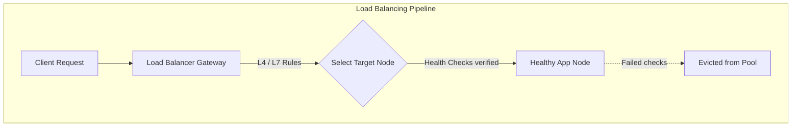
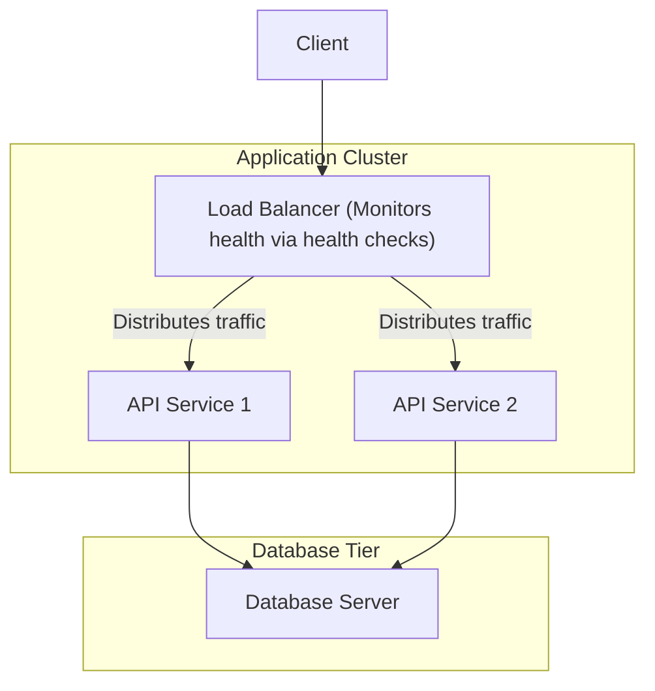

---
domains:
  - "networking"
  - "infra"
---

# Module 18: Load Balancing Topologies & Algorithms

This module covers traffic distribution mechanics using Load Balancers (LBs). It details Layer 4 vs. Layer 7 proxy routing, load balancing algorithms, active health checks, and strategies for achieving high availability (SPOF mitigation).

---

## 🗺️ Cognitive Map: How to Think About Load Balancing

---

## 1. Traffic Distribution Mechanics

To implement horizontal scaling, we insert a **Load Balancer (LB)** between the client and backend application servers. The load balancer acts as a reverse proxy, accepting incoming traffic and distributing it across a pool of backend servers.

### Routing Layers: Layer 4 vs. Layer 7
* **Layer 4 (L4) Transport-Level Routing:** Routes traffic based on packet headers at the transport layer (TCP/UDP), examining only IPs and port numbers. It does not decrypt or inspect request payloads (like HTTP headers or URLs).
  - *Pros:* Extremely fast, low CPU utilization, high throughput.
  - *Cons:* No path-based routing (e.g. cannot separate `/api` from `/static`), cannot modify HTTP headers.
* **Layer 7 (L7) Application-Level Routing:** Parses the application-layer payload (HTTP/HTTPS), routing traffic based on URL paths, query strings, headers, cookies, or request methods.
  - *Pros:* Intelligent path-based routing, header injections (e.g. `X-Forwarded-For`), SSL/TLS termination.
  - *Cons:* CPU-intensive due to TLS decryption and deep packet inspection.

---

## 2. Load Balancing Algorithms

Load balancers rely on specific mathematical algorithms to assign clients to backend targets:

* **Round Robin:** Routes incoming requests sequentially through the list of servers. Best when servers are identical in capacity and request processing times are uniform.
* **Weighted Round Robin:** Assigns a capacity weight to each server. Nodes with higher weights receive a proportionally larger share of traffic.
* **Least Connections:** Routes traffic to the server with the fewest active TCP connections. Ideal for long-running sessions (e.g. file transfers).
* **Least Response Time:** Evaluates server latency and routes to the fastest-responding node with the fewest active connections.
* **IP Hashing:** Hashes the client's source IP address to compute a static target server. Ensures session persistence (sticky sessions) so a client consistently hits the same backend node.
* **Consistent Hashing:** Maps servers and keys to a circular ring. Primarily used in distributed caching to minimize cache invalidation when nodes are added or removed.

---

## 3. Health Monitoring & High Availability

To ensure traffic is only routed to healthy nodes, load balancers perform active **Health Checks**:
1. The LB periodically sends HTTP requests (e.g. `/healthz`) or TCP pings to each backend server.
2. If a server responds with `200 OK` within a timeout window, it remains in the active pool.
3. If it fails or times out, the LB removes it from the routing pool.
4. Once the server recovers and passes checks again, it is re-integrated.

### Single Point of Failure (SPOF) Mitigation:
An individual load balancer is a SPOF. If it fails, the entire cluster becomes unreachable. To prevent this, systems implement **LB Redundancy**:
* **Active-Passive Pair:** An active LB handles traffic while a passive (standby) LB monitors it. They share a virtual IP (VIP) using protocols like VRRP. If the active LB fails, the standby takes over the IP immediately.
* **Active-Active Pair:** Both LBs handle traffic concurrently, coordinated by DNS-based routing (e.g. Round Robin DNS).

---

## 🛠️ Hands-on Verification Project

To verify and inspect the complete, production-grade hands-on configuration files for Nginx load balancing (upstream algorithms, reverse-proxy headers, passive health check timeouts), refer to:
- [[Projects/Systems Design/Project - Secure Load-Balanced Web API.md#1-nginx-load-balancer-and-gateway-configuration-nginxconf|Nginx Load Balancer Config Playbook]]
