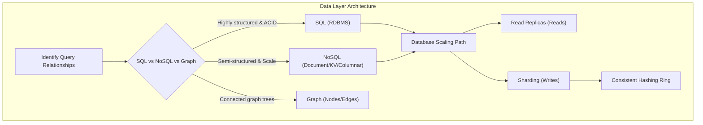
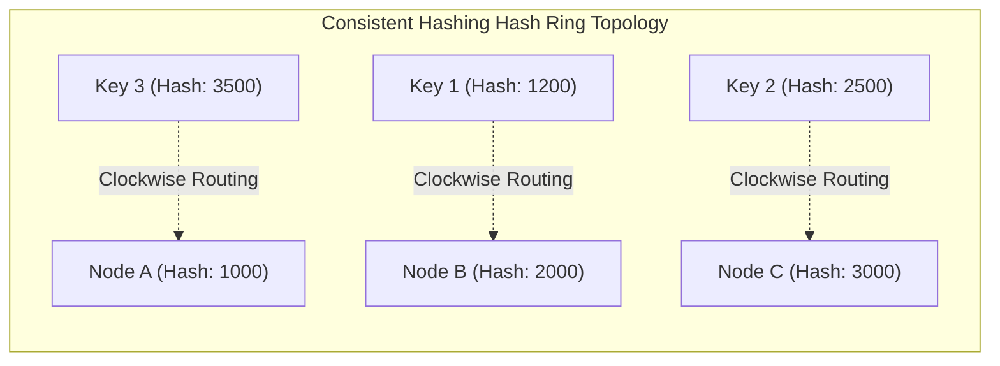

---
domains:
  - "database"
  - "infra"
---

# Module 19: Database Architectures & Sharding

This module covers the core database paradigms (SQL vs. NoSQL vs. Graph), horizontal data scaling, table sharding key selection, and the mathematical mechanics of Consistent Hashing.

---

## 🗺️ Cognitive Map: How to Think About Data Architecture

---

## 1. Database Paradigms

A critical decision in system design is selecting the correct database model based on data relations, write/read volume, and transaction consistency requirements.

### A. Relational Databases (SQL / RDBMS)
* **Examples:** PostgreSQL, MySQL, SQLite, Oracle.
* **Data Model:** Structured tables with columns, rows, and foreign key relations.
* **Query Language:** Structured Query Language (SQL).
* **Key Advantages:**
  - Support for complex **JOIN operations** across multiple tables.
  - Strict transaction safety governed by **ACID properties**:
    - **Atomicity:** All operations in a transaction succeed, or the entire transaction is rolled back (all-or-nothing).
    - **Consistency:** A transaction shifts the database from one valid state to another, enforcing schemas and constraints.
    - **Isolation:** Concurrent transactions execute independently without interfering with each other.
    - **Durability:** Committed transactions survive system crashes.

### B. Non-Relational Databases (NoSQL)
NoSQL databases sacrifice relational completeness (JOINs) and sometimes absolute consistency for massive scale, flexibility, and low-latency performance.

1. **Document Stores:**
   - *Examples:* MongoDB, CouchDB.
   - *Data Model:* Semi-structured JSON-like documents.
   - *Best For:* Content management, user profiles, rapidly changing schemas.
2. **Key-Value Stores:**
   - *Examples:* Redis, Memcached.
   - *Data Model:* Simple dictionary mapping keys to values, optimized for RAM storage.
   - *Best For:* Session caching, database query caching, real-time message brokering.
3. **Wide-Column / Columnar Stores:**
   - *Examples:* Apache Cassandra, ScyllaDB, HBase.
   - *Data Model:* Multi-dimensional tables indexing rows by partition and clustering keys.
   - *Best For:* Time-series telemetry, write-heavy logs, multi-region horizontal scaling.
4. **Graph Databases:**
   - *Examples:* Neo4j, Amazon Neptune.
   - *Data Model:* Nodes (entities), Edges (relationships), and Properties.
   - *Best For:* Recommendation engines, social network mapping, fraud detection.

### C. Selection Matrix
* **Choose SQL when:** Your schema is highly structured and stable, relationships between entities are dense, and you require strict transactional integrity (e.g., financial ledger).
* **Choose NoSQL when:** You handle unstructured or semi-structured data, need to write massive volumes of write-heavy events, require sub-millisecond read latencies, or must scale horizontally across multiple regions.

---

## 2. Database Scaling: Partitioning & Sharding

When a single database node hits capacity, we scale the data layer:
1. **Read Replicas:** Writes go to a primary database node, which replicates data asynchronously to one or more read-only replicas. This scales read volume but introduces **eventual consistency** delays and does not increase write capacity.
2. **Sharding (Horizontal Partitioning):** Splits a single table horizontally by storing subsets of rows across independent database servers (shards).
   - **Sharding Key:** The attribute used to route a row to a specific shard (e.g., `user_id`). Choosing a bad sharding key creates **Hot Spots** where one shard handles a disproportionate share of the load, causing latency spikes.
   - **Re-sharding Complexity:** If nodes are added or removed, data must be redistributed, which is highly CPU-intensive and can cause service degradation.

---

## 3. Consistent Hashing Mechanics

Consistent Hashing is an algorithmic routing strategy that resolves the massive data invalidation problem of standard hashing (`hash(key) % N`) when node count `N` changes.
- **The Hash Ring:** Both the keys and the database/cache nodes are hashed (e.g., using MD5 or SHA-1) and mapped onto a virtual circular hash ring ($0$ to $2^{32}-1$).
- **Key Assignment:** To map a key to a node, we hash the key and locate its position on the ring. We then traverse the ring clockwise until we encounter the first physical node. That node handles the key.
- **Node Additions/Evictions:** If a node is added or fails, only a fraction of keys ($\approx 1/N$) need to be moved to adjacent nodes, keeping the rest of the cluster stable.
- **Virtual Nodes (vnodes):** Physical nodes are mapped to multiple virtual locations across the ring. This ensures an even distribution of keys, prevents imbalances (hot spots), and balances load proportionally to physical server capacities.

---

## 🛠️ Hands-on Verification Project

To verify and inspect the complete, production-grade hands-on configuration files for database query parameterization and table migrations, refer to:
- [[Projects/Systems Design/Project - Secure Load-Balanced Web API.md#2-secure-api-web-server-python---fastapi|FastAPI database client parameterization config]]
- [[Projects/Systems Design/Project - Secure Load-Balanced Web API.md#3-database-migration-script-sql|PostgreSQL Schema Migration script]]
