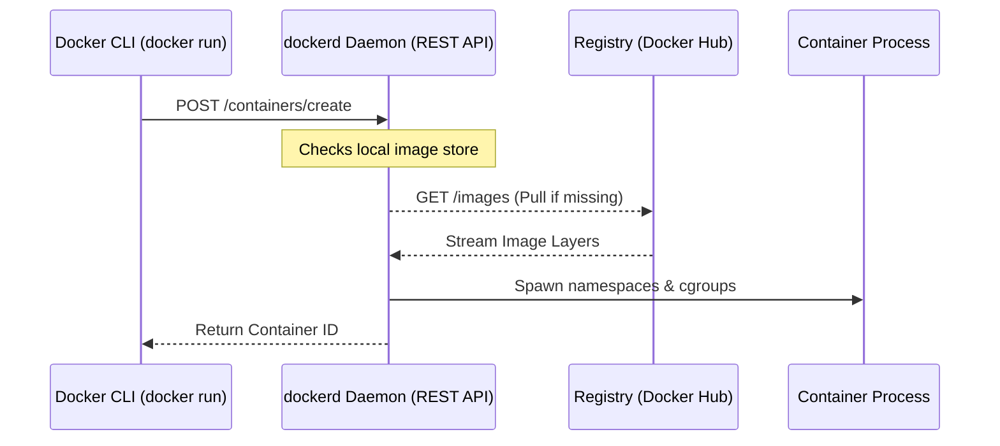
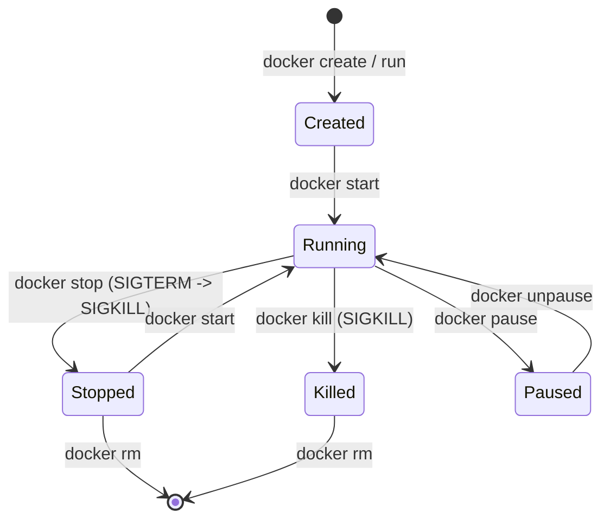

---
domains:
  - "docker"
  - "linux"
  - "infra"
---

# Module 2-1: Docker Fundamentals & Container Mechanics

This module covers the architectural foundations of Docker container virtualization. It details the Docker Engine client-server architecture, container vs. virtual machine isolation, container execution lifecycle commands, and the core concept of container process immutability.

---

## 🗺️ Cognitive Map: Container Isolation Primitives

```mermaid
graph TD
    subgraph VM["Virtual Machine Isolation"]
        AppV["Application process"] --> GuestOS["Guest OS Kernel (Full overhead)"]
        GuestOS --> Hypervisor["Hypervisor (ESXi, KVM, VirtualBox)"]
        Hypervisor --> HostOS1["Host OS & Hardware"]
    end

    subgraph DockerContainer["Docker Container Isolation"]
        AppC["Application process (Host Namespace)"] --> cgroups["cgroups (Resource limits)"]
        cgroups --> namespaces["Namespaces (PID, Net, IPC isolation)"]
        namespaces --> HostKernel["Shared Host Kernel"]
        HostKernel --> HostOS2["Host Hardware"]
    end
```

---

## 1. Container vs. Virtual Machine Isolation

Distributed scaling requires choosing the correct isolation boundary. Containers provide process-level virtualization, whereas VMs provide hardware-level virtualization.

### A. Virtual Machine Virtualization
Virtual Machines run on top of a Hypervisor. Every VM contains a complete copy of a Guest Operating System, virtual device drivers, and the application files.
* **Key Characteristics:** Strong hardware-level isolation, high startup overhead (minutes), large image footprints (gigabytes).

#### Deep-Intuition (AARF) Breakdown:
1. **The Answer (Core Pattern):** Deploy full Virtual Machines when hypervisor-level isolation, strict kernel customization (different kernels per tenant), or running different guest operating systems (e.g., Windows guest on Linux host) is required.
2. **The Assumptions (Context):** The hypervisor must manage physical CPU/Memory resource allocations, and slow boot times (minutes) must be acceptable for scaling patterns.
3. **The Rationale (Why):** Virtualization happens at the hardware level. The Guest OS does not interact directly with the Host OS kernel; it talks to virtualized hardware simulated by the Hypervisor.
4. **The Failure Loop (What if not):** Attempting to scale microservices horizontally using full VMs causes severe resource exhaustion. Memory is pre-allocated and locked per VM guest, meaning idle VMs consume active RAM, reducing host bin-packing density.
5. **Alternative Case (When to use 'if not'):** For high-density, sub-second horizontal scaling of microservices, containerization should be used instead.

### B. Container Virtualization (Docker)
Containers run as isolated processes directly on the host operating system, sharing the host OS kernel.
* **Key Technologies:** Linux **namespaces** (walls for PID, network, mount isolation) and Linux **cgroups** (resource limits).
* **Key Characteristics:** Instant boot times (milliseconds), extremely lightweight footprints (megabytes).

#### Deep-Intuition (AARF) Breakdown:
1. **The Answer (Core Pattern):** Use Docker containers to package applications and their direct dependencies, allowing multiple isolated environments to run on the same shared host kernel.
2. **The Assumptions (Context):** The host OS kernel must be secure, and all containers must be compatible with the host kernel version.
3. **The Rationale (Why):** Virtualization happens at the process level. Namespaces slice host resources so a process sees only its own resources (like virtual network interfaces or specific file mounts), while cgroups enforce execution limits.
4. **The Failure Loop (What if not):** Without containerization, dependency conflicts arise (e.g., App A requires Node v14, App B requires Node v18 on the same host). Managing system-level packages becomes a deployment bottleneck.
5. **Alternative Case (When to use 'if not'):** If the application requires low-level kernel modifications, custom kernel modules, or running a completely different OS kernel, containers cannot be used; VMs are mandatory.

---

## 2. Docker Engine Client-Server Architecture

Docker is structured as a client-server application consisting of the Docker CLI client, the dockerd daemon REST API server, and a registry.

* **CLI Client:** The command-line tool used to write instructions (e.g., `docker run`, `docker build`).
* **dockerd Daemon:** A persistent background process (`systemd` service) that listens for Docker API requests and manages Docker objects (images, containers, networks, volumes).
* **Registry:** A repository service (like Docker Hub or AWS ECR) used to store and distribute images.

---

## 3. Container Lifecycle Operations & Commands

Containers transition through states (Created, Running, Paused, Stopped, Exited).

### A. Lifecycle Command Reference:
*   `docker run -d -p 80:80 --name web nginx`: Creates and starts a container in detached mode, mapping ports.
*   `docker stop <id>`: Sends a `SIGTERM` signal to the container's primary process (PID 1), followed by `SIGKILL` if it fails to stop within 10 seconds.
*   `docker kill <id>`: Sends an immediate `SIGKILL` signal to terminate the process instantly.
*   `docker ps -a`: Lists all containers, including stopped ones.
*   `docker logs -f <id>`: Follows the stdout/stderr logs of the container.
*   `docker exec -it <id> sh`: Spawns an interactive shell inside the container's active namespaces.
*   `docker rm <id>`: Deletes a stopped container.
*   `docker rm -f <id>`: Forcefully deletes a running container by sending a `SIGKILL` first.

### B. Container Immutability & Process Persistence (PID 1)
A container runs as long as its primary process (PID 1) is active. Once this process exits, the container stops.

#### Deep-Intuition (AARF) Breakdown:
1. **The Answer (Core Pattern):** Ensure the container's entrypoint command runs in the foreground as PID 1 (e.g., `ENTRYPOINT ["nginx", "-g", "daemon off;"]`).
2. **The Assumptions (Context):** The process must handle OS signals (like `SIGTERM`) properly to clean up connections before shutting down.
3. **The Rationale (Why):** The container runtime monitors the execution state of the process assigned to PID 1. If that process exits or runs in the background (like traditional systemd service daemons), the container immediately exits.
4. **The Failure Loop (What if not):** Invoking service startups like `service nginx start` inside a container starting script causes the script to finish and exit immediately. The Docker daemon interprets this script exit as container completion, transitioning the container state to `Exited (0)` instantly.
5. **Alternative Case (When to use 'if not'):** For persistent background workers or cron-like batch jobs that do not need to run continuously, configure the container entrypoint to execute a script and exit naturally upon task completion.

---

## 4. Visual Verification: Container Commands & States

Below is a flowchart tracing common container operations and state transitions:

