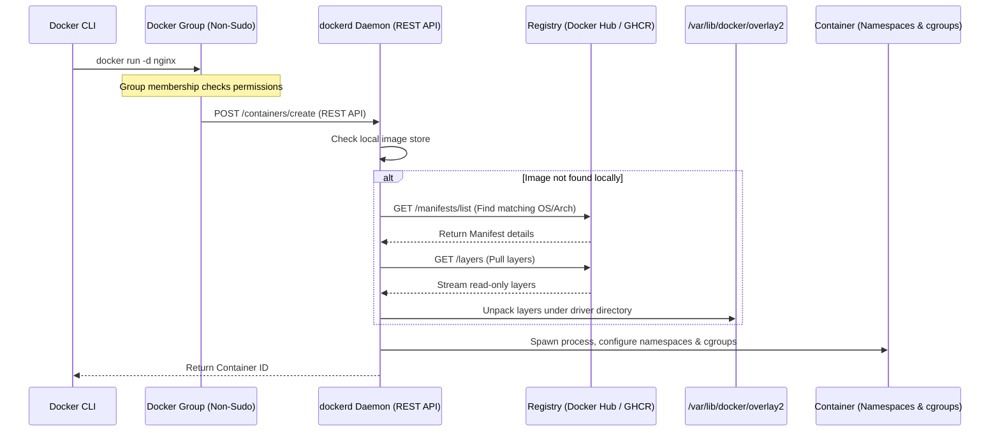
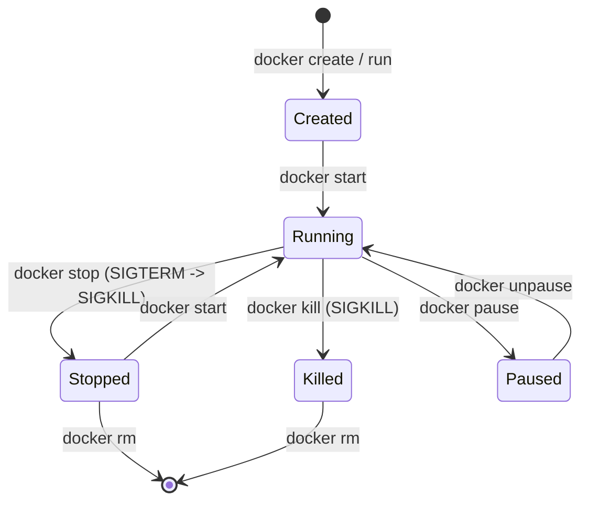
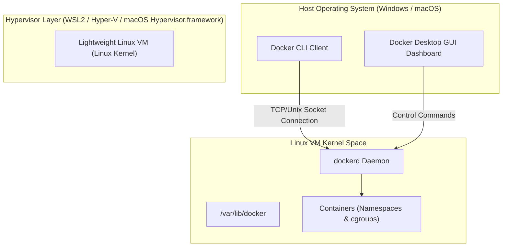

---
domains:
  - "docker"
  - "linux"
  - "infra"
---

# Module 2-1: Docker Fundamentals & Container Mechanics

This module details the architectural and kernel foundations of container virtualization. It covers Linux namespace and control group (cgroups) isolation primitives, historical isolation mechanisms, Type 1 vs. Type 2 Hypervisor Virtual Machines, the Docker Engine client-daemon REST architecture, container execution lifecycles, process persistence (PID 1), container process immutability, and Docker Desktop virtualization structures.

---

## 🗺️ Cognitive Map: Container Isolation Primitives

```mermaid
graph TD
    subgraph VM["Virtual Machine Isolation (Hardware Virtualization)"]
        AppV["Application Process"] --> GuestOS["Guest OS Kernel (Full Overhead)"]
        GuestOS --> Ring1["Guest Kernel (Ring 1)"]
        Ring1 --> Hypervisor["Hypervisor (Ring 0 - Bare-Metal/Hosted)"]
        Hypervisor --> HostOS1["Host OS & Physical Hardware"]
    end

    subgraph DockerContainer["Docker Container Isolation (OS Virtualization)"]
        AppC["Application Process (Host Namespace)"] --> cgroups["cgroups (Resource limits & QoS)"]
        cgroups --> namespaces["Namespaces (PID, Net, Mount, IPC, UTS, User)"]
        namespaces --> HostKernel["Shared Host Kernel"]
        HostKernel --> HostOS2["Host Physical Hardware"]
    end
```



---

## 1. Container vs. Virtual Machine Isolation

Distributed systems scale using varying isolation boundaries. Choosing between hardware-level virtualization (VMs) and operating-system-level virtualization (containers) impacts resource utilization, security surface, and scaling metrics.

### A. Historical Context & Primitive Tools
Before modern containers, Unix/Linux systems utilized lower-level isolation primitives:
*   **`chroot` (Change Root / Root Jail, 1979):** The oldest isolation primitive. It changes the root directory of a running process and its children to a new location in the directory tree. This isolates file-system access, creating a replica directory structure. It does not isolate network interfaces, process trees, users, or memory limits.
*   **`ulimit` (User Limits):** Used to set limits on system resource consumption (e.g., maximum open file descriptors, maximum processes). However, it cannot control CPU time sharing effectively because CPU resources remain shared and cannot be hard-capped.
*   **`nice` / `renice`:** Configures CPU scheduling priority (niceness value ranging from -20 to 19). While these modify process scheduling frequency, they are priority adjusters, not absolute resource limiters.

### B. Linux Kernel Isolation Primitives (Namespaces and cgroups)
Modern containerization wraps two core features of the Linux kernel (introduced around 2002-2008):
1.  **Namespaces:** Provide process isolation by virtualizing system resources. A process inside a namespace sees only its allocated slice of the system:
    *   **Mount (mnt):** Isolates filesystem mount points. The container cannot see or access host mounts.
    *   **PID:** Isolates the process ID space. The container's primary process becomes PID 1, completely isolated from the host's process tree.
    *   **Network (net):** Isolates network devices, IP routing tables, port bindings, and firewall rules.
    *   **IPC (Inter-Process Communication):** Isolates shared memory, System V IPC, and POSIX message queues.
    *   **UTS (Unix Timesharing System):** Isolates hostnames and domain names.
    *   **User:** Maps UIDs and GIDs inside the container to a different set of UIDs/GIDs on the host (allowing a process to run as root inside the container while mapped to a non-privileged user on the host).
2.  **Control Groups (cgroups):** Enforce hierarchical resource management, accounting, and limiting. A control group tree (root and child nodes) restricts:
    *   **CPU Limit:** Restricts CPU time slices via CPU controllers.
    *   **Memory Limit:** Sets hard memory limits. If exceeded, the memory controller triggers the Out-Of-Memory (OOM) killer to terminate the process.
    *   **I/O and Network Bandwidth:** Throttles disk read/write throughput and network traffic.
    *   **QoS (Quality of Service):** Guarantees resource availability in multi-tenant environments.

### C. VM Virtualization Mechanics
Virtual Machines run on top of a **Hypervisor** that simulates virtual hardware (vCPU, vRAM, vNIC, virtual disks).
*   **Type 1 (Bare-Metal) Hypervisors:** Run directly on the physical hardware (e.g., VMware ESXi, KVM). The hypervisor operates in Ring 0 (kernel space), while the Guest OS kernels run in Ring 1.
*   **Type 2 (Hosted) Hypervisors:** Run as software on a host OS (e.g., VirtualBox, VMware Workstation).
*   **Base Disks (.VHD) vs. Differencing Disks (.AVHD):** In VM cloning, the parent `.VHD` base disk remains read-only. Clone VMs utilize a differencing disk (`.AVHD`) to record modification layers. The clone's logical drive represents the merged parent + diff layers. Containers apply a similar concept using Union Filesystems (UFS) and image layers.

---

## 2. Deep-Intuition (AARF) Breakdowns

### A. OS-Shared Kernel vs. VM Hardware Virtualization
#### Deep-Intuition (AARF) Breakdown:
1. **The Answer (Core Pattern):** Deploy applications as Docker containers to share a single host OS kernel, reserving Virtual Machines for cases requiring custom kernel configurations or heterogeneous guest operating systems (e.g., running Windows on a Linux physical host).
2. **The Assumptions (Context):** The host kernel must be stable, secure, and compatible with the application's runtime. The application must not require low-level kernel driver modifications.
3. **The Rationale (Why):** Linux distributions (Ubuntu, RedHat, SUSE, Alpine) share the same underlying Linux kernel interface. A container strips away the redundant guest kernel and GUI subsystems (user mode), packaging only application files and dependencies. It calls host kernel daemons directly, eliminating hypervisor translation overhead.
4. **The Failure Loop (What if not):** Provisioning a full VM for every microservice wastes CPU, RAM, and disk storage. Booting a VM takes minutes because it must initialize virtual hardware and run a guest kernel boot sequence. If VM allocations are pre-committed, idle microservices lock host physical RAM, leading to memory exhaustion and low host bin-packing density.
5. **Alternative Case (When to use 'if not'):** If hosting multi-tenant environments with untrusted code, Hypervisor-level VM isolation is mandatory. Containers share the host kernel; a kernel-level vulnerability (e.g., container breakout exploits) can compromise the host machine.

### B. Namespace Isolation vs. cgroup Limits
#### Deep-Intuition (AARF) Breakdown:
1. **The Answer (Core Pattern):** Implement namespaces to establish logical boundaries (who can see what) and cgroups to enforce physical resource limits (how much they can consume).
2. **The Assumptions (Context):** The container runtime environment must support cgroups v2 for consolidated resource management and namespaces for process tree separation.
3. **The Rationale (Why):** Namespaces virtualize OS resources (network stack, mount points, PIDs). However, they do not prevent a process from consuming 100% of the host's CPU or memory. cgroups constrain resource allocations by scheduling CPU time slices and tracking memory allocations.
4. **The Failure Loop (What if not):** Running containers with namespaces but without cgroup limits leaves the system open to "noisy neighbor" issues. A memory leak in Container A will consume all host RAM, triggering the host OS kernel OOM killer. The OOM killer might terminate critical host processes or stable containers (like Container B), causing cascade failures.
5. **Alternative Case (When to use 'if not'):** When running administrative container tools (e.g., host monitoring agents, packet sniffers), select namespaces must be shared with the host (e.g., `--network=host`, `--pid=host`) to allow the tool to view host-level metrics.

---

## 3. Docker Engine Client-Server Architecture

Docker operates as a client-server application. It decouples command input from container execution.



*   **Docker CLI Client:** Sends commands to the daemon. By default, accessing the Docker daemon socket (`/var/run/docker.sock`) requires root permissions. Adding the user account to the docker group (`sudo usermod -aG docker $USER`) allows running commands without `sudo` by granting access to the socket.
*   **dockerd Daemon:** A systemd background service that listens for REST API requests. It manages images, containers, networks, volumes, and communicates with container runtimes (containerd/runc) to spawn isolation environments.
*   **Manifest Lists:** Docker Hub and other registries store images using a Manifest List. When a client pulls an image (e.g., `ubuntu`), the daemon checks the host machine's architecture (e.g., `amd64` vs. `arm64`) and operating system to fetch the correct manifest and layer hashes.

---

## 4. Container Lifecycle Operations & Commands

Containers transition through states based on process status. A container is a sandbox wrapping a single primary process.



### A. Lifecycle Command Reference
*   `docker info`: Displays system-wide information (storage driver, kernel version, CPU/memory resources, active container count).
*   `docker run -d -p 8080:80 --name web nginx`: Creates, starts, and detaches a container, mapping host port 8080 to container port 80.
*   `docker ps -a`: Lists all containers, including stopped ones.
*   `docker logs -f <id>`: Follows stdout/stderr streams from the container's PID 1.
*   `docker exec -it <id> sh`: Spawns an interactive shell process *inside* the container's active namespaces. It creates a sub-process of the container but does not replace PID 1.
*   `docker attach <id>`: Binds terminal input/output directly to the container's active PID 1 process.
*   `docker rm -f <id>`: Forcefully removes a running container by sending a `SIGKILL` signal to PID 1 before deleting its writable layer.

### B. Persistent Background Execution Flags
When launching containers, execution flags determine shell attachment:
*   `-d` (Detached): Runs the container in the background. It will exit immediately if the primary command completes.
*   `-dit` (Detached, Interactive, TTY): Runs the container in the background while keeping stdin open and allocating a pseudo-TTY. This is useful for keeping interactive shells (like `sh` or `bash`) running in the background.
*   `sleep infinity`: Keeping a container running indefinitely without a web server or daemon process can be achieved by passing `sleep infinity` as the command.

---

## 5. Deep-Intuition (AARF) Breakdowns: Lifecycle & Troubleshooting

### A. Container Lifetime & PID 1 Process Persistence
#### Deep-Intuition (AARF) Breakdown:
1. **The Answer (Core Pattern):** Ensure the container's entrypoint runs the main application in the foreground as PID 1, and configure it to handle OS lifecycle signals (`SIGTERM`) gracefully.
2. **The Assumptions (Context):** The container runtime monitors only the process designated as PID 1. If this process exits, the container halts.
3. **The Rationale (Why):** Containers are process wrappers, not system initializers. There is no `systemd` or `init` system inside a standard container. Once the PID 1 process exits, the namespace execution context collapses.
4. **The Failure Loop (What if not):** Invoking background daemons (e.g., using `service nginx start` or running a script that forks processes and exits) causes the shell executor to finish. Because the parent script terminates, the container immediately transitions to `Exited (0)`. If PID 1 does not handle `SIGTERM`, stopping the container (`docker stop`) triggers a 10-second timeout followed by a hard `SIGKILL`, resulting in connection drops, database lock corruption, and lost files.
5. **Alternative Case (When to use 'if not'):** For batch tasks, scripts, or database migration jobs, exiting the container upon task completion is the desired behavior. The entrypoint should execute the task script and allow the container to exit naturally with status `0`.

### B. Troubleshooting Crashed Containers via Filesystem Commits
#### Deep-Intuition (AARF) Breakdown:
1. **The Answer (Core Pattern):** Investigate stopped or crashing containers by committing their filesystem state to a temporary image and running a shell wrapper to override the entrypoint:
    ```bash
    # 1. Commit the stopped container's state to a temporary debug image
    docker commit <crashed_container_id> debug_image:temp
    # 2. Run the debug image with a shell entrypoint to inspect files
    docker run -it --entrypoint sh debug_image:temp
    ```
2. **The Assumptions (Context):** The container must have stopped or crashed with data intact in its writable layer. The debug image does not inherit original environment variables, volume mounts, or network configurations; these must be passed manually if needed.
3. **The Rationale (Why):** When a container's PID 1 crashes immediately upon startup (e.g., due to configuration errors or missing dependencies), it transitions to `Exited`. `docker exec` requires a running container to attach a sub-process to the namespace. Committing the container merges its read-only layers with the modified writable layer, preserving the exact filesystem state at the time of the crash.
4. **The Failure Loop (What if not):** Attempting to troubleshoot immediate startup crashes without entrypoint overrides is impossible since the container will not stay running long enough to execute diagnostics. Re-running the original image starts from scratch, wiping out the specific configuration changes or log files written to the crashed container's writable layer.
5. **Alternative Case (When to use 'if not'):** If log routing is configured to stream stdout/stderr externally (e.g., to Elasticsearch or CloudWatch), container startup logs can be inspected directly without committing the filesystem.

### C. Container Immutability & Ephemeral Lifecycle
#### Deep-Intuition (AARF) Breakdown:
1. **The Answer (Core Pattern):** Treat containers as ephemeral, immutable units of execution. Never modify running container configurations (ports, mounts, network interfaces) or write application state directly to the writable layer.
2. **The Assumptions (Context):** The system must utilize declarative configurations (Docker Compose, Kubernetes manifests). State must be externalized to volumes or databases.
3. **The Rationale (Why):** Ports and volumes are bound at container startup. Modifying port mappings requires altering host `iptables` NAT tables and Docker daemon routing rules. Injecting new storage mounts requires updating the container's active Mount namespace, which is blocked by the kernel to prevent access violations and filesystem corruption.
4. **The Failure Loop (What if not):** Trying to maintain containers like traditional VMs (applying patches inside a running container, dynamically adding configurations) creates "snowflake" containers. If the physical host fails, these manual changes cannot be reproduced. The application fails to scale because new containers spun up from the base image lack the manual changes.
5. **Alternative Case (When to use 'if not'):** In development phases, bind mounts are utilized to sync host source code directories to the container for hot-reloading. However, the container itself remains immutable; only the source files on the host change.

---

## 6. Docker Desktop Virtualization Architecture

Docker requires Linux kernel primitives (namespaces and cgroups) to execute containers. Because macOS and Windows do not run Linux kernels natively, Docker Desktop utilizes virtualization.



### A. Windows and macOS Virtualization
*   **macOS:** Docker Desktop runs a lightweight Linux VM using Apple's native `Hypervisor.framework`. This VM boots a minimal Linux kernel containing the required namespace and cgroup implementations.
*   **Windows:** Docker Desktop utilizes the **Windows Subsystem for Linux 2 (WSL2)** or Hyper-V. WSL2 runs a real Linux kernel in a lightweight utility VM, allowing native execution speed and resource management.
*   **API Routing:** The Docker CLI on the host machine communicates with the daemon (`dockerd`) running *inside* the Linux VM via a socket proxy or local TCP port.

### B. Linux Native vs. Docker Desktop for Linux
*   **Native Linux Engine:** Runs directly on the host operating system. Containers are native host processes sharing the host's kernel and filesystem namespaces. Storage resides directly under `/var/lib/docker` on the host disk.
*   **Docker Desktop for Linux:** Runs the Docker engine inside a virtualized sandbox. This provides security isolation, preventing container processes from interacting directly with host system files or kernel threads unless explicitly configured.

---

---

## 📖 Detailed Study: Docker Deep Dive (Nigel Poulton)

![[../Attachments/docker_deep_dive_book.jpeg]]  
![[../Attachments/docker_deep_dive_nigelpoulton.jpg]]  


**[Docker Deep Dive: Zero to Docker in a single book](https://www.amazon.com/gp/product/B01LXWQUFF/ref=dbs_a_def_rwt_bibl_vppi_i1)**

# Virtualization

- **HW-Level Virtualization**  
    - **Network Virtualization**  
    - **Storage Virtualization**  
    - **Server  Virtualization**  
- **Application Virtualization**  
- **OS-Level Virtualization**

# 1: Containers from a 30,000 feet

## The bad old days
## Hello VMWare!
## Hello Containers!
- **Linux subsystems**  
- **Mainframe**

## Hello Docker!
- **Docker, Inc. 1999**
- **Windows Containers**  
- **[Docker in GitHub](https://github.com/docker)**  

## Windows containers vs Linux containers
## What about Mac containers
## What about Kubernetes

---------

# 2: Docker

- **Docker, Inc. the company**  
- **Docker the technology**

## Docker - The TLDR


- **Software runs on Windows and Linux**  
- **Create, Manage and Orchestrate containers**  
- **Created by a companyn called Docker, Inc. in 1999**


## Docker, Inc.
![[../Attachments/docker_deep_dive_1.png]]

- **Was dotCloud**  
- **Started as PaaS provider**  
- **Build on Linux containers**  
- **In 2013 Became Docker, Inc."**
- **Two Main products:**
    - **Docker Desktop**  
    - **Docker Hub**

## The Docker technology

**Architecture**  
![[../Attachments/docker_deep_dive_2.png]]

**1. The runtime**  
- ``runc``  
    - Reference implementation of Open Containers Initiative (OCI) runtime-spec  
    - Start/Stop containers  
    - Build OS Constructs  
- ``containerd``  
    - Pull images  
    - Create network interfaces  
    - Manage runc  
    - Open source project from CNCF  
    
**2. The daemon (a.k.a engine) ``dockerd``**  
- Expose the Docker remote API  
- Manage images  
- Manage columes  
- Manage netwroks  
- etc.  

**3. The orchestrator**  
- Native support for managing clusters of nodes running Docker
- Clusters of nodes running Docker are called swarm

## The Open Container Initiative (OCI)

- **A governance council responsible for standardizing the low-level fundamental components of container infrastructure** 
- **Image formats. [image-spec](https://github.com/opencontainers/image-spec)**  
- **container runtime. [runtime-spec](https://github.com/opencontainers/runtime-spec)**  

----

# 3: Installing Docker

- **Windows, Mac and Linux**  
- **Local and Cloud**  
- **Manual, Scripted and Wizard-based**

- Docker Desktop:  
    * Windows 10  
    * Mac  
- Server installs:  
    - Linux  
    - Windows Server 2019  
- Play with Docker  

## Docker Desktop

- Single-engine Docker 
- Docker Compose
- Single-node Kubernetes cluster

## Installing Docker on Linux

**[Install Docker Engine on Ubuntu](https://docs.docker.com/engine/install/ubuntu/)**

```
$ sudo apt-get update
$ sudo apt-get remove docker docker-engine docker.io containerd runc

$ sudo apt-get update
$ sudo apt-get install ca-certificates curl gnupg lsb-release

$ curl -fsSL https://download.docker.com/linux/ubuntu/gpg | sudo gpg --dearmor -o /usr/share/keyrings/docker-archive-keyring.gpg

$ echo \
  "deb [arch=$(dpkg --print-architecture) signed-by=/usr/share/keyrings/docker-archive-keyring.gpg] https://download.docker.com/linux/ubuntu \
  $(lsb_release -cs) stable" | sudo tee /etc/apt/sources.list.d/docker.list > /dev/null


$ sudo apt-get update --allow-unauthenticated --allow-insecure-repositories
$ sudo apt-get install docker-ce docker-ce-cli containerd.io

$ sudo docker --version
$ sudo docker info
```

**[Play with Docker](https://labs.play-with-docker.com/)**

----

# 4: The Big Picture

## Quick overview on DevOps of the containers

### The Ops perspective

- Download images
- Start containers
- Log in to containers
- Run commands inside containers
- List containers
- etc.

#### Confirm Installation

`$ sudo docker version`

**note: you might need to add your user account to the local docker group rather than using "sudo" always**  
- To check the current local groups:  
    `$ sudo getent group`  
- To check the groups you're currently in:  
    `$ groups`  
- To add a user to the local docker group:  
    `$ sudo usermod -a -G docker <username>`  
    `$ groups`  

#### Images

List all images  
`$ docker image ls`

Pull the `ubuntu:latest` image  
`$ docker image pull ubuntu:latest`

Launch a container from an image  
`$ docker container run -it ubuntu:latest /bin/bash`

Exit a container without terminating it: `Ctrl-PQ`

Attach to a running container  
`$ docker container exec -it <containername> bash`

Stop a running container  
`$ docker container stop <containername>`

Start a stopped container  
`$ docker container start <containername>`  

Delete a stopped container  
`$ docker container rm <containername>`  

### The Dev perspective

Clone a github repo that has a docker file  
`$ git clone https://github.com/nigelpoulton/psweb.git`

Inspect the Dockerfile  
`$ cat Dockerfile`

Create a new image from the Dockerfile in the repo  
Run the following command from inside the repo directory  
`$ docker image build -t test:latest .`

List images after build. You should see 3 images (2 of them related to the newly built Dockerfile)  
`$ docker image ls`

Launch a container from the test image  
``` >
$ docker container run -d \
  --name web1 \
  --publish 8080:8080 \
  test:latest
```

----

# 5: The Docker Engine

## Docker Engine - The TLDR

![[../Attachments/docker_deep_dive_5.png]]

### Docker Engine - The Deep Dive

![[../Attachments/docker_deep_dive_6.png]]

### The influence of the Open Container Initiative (OCI)

#### **`runc`**

- CLI wrapper  
- Only creates containers
- Standalone container runtime tool
- Also called "the OCI layer"
- [`runc` lastest release information](https://github.com/opencontainers/runc/releases)

#### **`containerd`**

- Backgroud process (`$ ps -elf | grep containerd`)
- Manage container lifecycle(`start | stop | pause | rm ...`)
- Image pulls, volumes, networks, etc.
- Initially developed by Docker, Inc. then denoted to CNCF
- [`containerd` latest release information](https://github.com/containerd/containerd/releases)

#### Starting a new container (example)

`$ docker container run --name ctr1 -it alpine:latest sh`

1. Docker client converts it into appropriate API payload  
2. POSTs it into API endpoint exposed by Docker daemon (`/var/run/docker.sock` on Linux)  
3. Daemon calls `containerd`  
4. `containerd` converts the required Docker image into an OCI bundle and uses `runc` to create the container  
5. `runc` interfaces with the OS kernel to pull together all of th constructs necessary as a child-process of `runc`  
6. After the child-process starts `runc` exits  

![[../Attachments/docker_deep_dive_7.png]]

**One huge benefit of this model**  
- Container runtime is decoupled from the Docker daemon: "daemonless containers"  
- You can perform maintenance and upgrades on the Docker daemon without impacting running containers

**What’s this shim all about?**  
- Reduced version of `containerd` that remains running after `runc` exists after creating the container  
- STDIN and STDOUT streams remain open even after the daemon is restarted  
- Reports container status to daemon

- `dockerd` (the Docker daemon)
- `docker-containerd` (containerd)
- `docker-containerd-shim` (shim)
- `docker-runc` (runc)

`$ ps -elf | grep container`

**Securing client and daemon communication**

Locally over IPC sockets:
- `/var/run/docker.sock` on Linux  
- `//./pipe/docker_engine` on Windows

Over the network unsecure HTTP socket call on port `2375/tcp`

![[../Attachments/docker_deep_dive_8.png]]

**TLS can be enforced on both client and daemon**  
1. Configure a CA and certificates 
2. Create a CA  
3. Create and sign keys for the Daemon  
4. Create and sign keys for the Client  
5. Distribute keys  
6. Configure Docker to use TLS  
7. Configure daemon mode  
8. Configure client mode  

**[Protect the Docker daemon socket](https://docs.docker.com/engine/security/protect-access/)**

![[../Attachments/docker_deep_dive_9.png]]

![[../Attachments/docker_deep_dive_10.png]]

----

# 7: Containers

**[Open Container Initiative (OCI)](https://www.opencontainers.org)**

## Docker containers - The TLDR

- A container is the runtime instance of an image.
- Instead of running a full-blown OS like a VM, containers share the OS/kernel with the host they’re running on.
- A single Docker image can be used to start multiple Docker containers.

![[../Attachments/docker_deep_dive_22.png]]

- `docker container run <image> <app>`
- `$ docker container run -it ubuntu /bin/bash`
- `$ docker container run -it alpine:latest sleep 10`

To stop the container:  
`docker container stop`

To start the container:  
`docker container start`

To delete a container forever:  
`docker container rm`


## Docker containers - The deep dive

### Containers vs VMs

**VMs Architecture**

![[../Attachments/docker_deep_dive_23.png]]

**Containers Architecture**

![[../Attachments/docker_deep_dive_24.png]]

- Hypervisors perform **hardware virtualization** — they carve up physical hardware resources into virtual versions called VMs.
- Containers perform **OS virtualization** — they carve OS resources into virtual versions called containers.


### The VM tax

- Less resources
- Less licenses
- Faster
- Single kerner, single surface of attack


### Running containers

- Docker Desktop on Mac or Windows
- docker.io on Linux


### Checking that Docker is running

`$ sudo docker version`

To check the current local groups:  
`$ sudo getent group`  
To check the groups you're currently in:  
`$ groups`  
To add a user to the local docker group:  
`$ sudo usermod -a -G docker <username>`  
`$ groups`

Check service status:  
`$ service docker status`  
`$ systemctl is-active docker`


### Starting a simple container

`$ docker container run -it ubuntu:latest`  
1. Docker client POSTs the request to Docker API on local socket `/var/run/docker.sock`  
2. Docker daemon checks the local repo for the `ubuntu:latest` image, if it's not their it will check Docker Hub.
3. After obtaining the image it instructs `containerd` and 'runc' to create and run the container.

- `-i` run container in interactive mode keeping STDIN stream open  
- `-t` Allocate a pseudo-TTY  
- `/bin/bash` this makes Bash shell **one and only process running inside of the container**. Run `ps -elf` to validate.
- `root@50949b614477:/#` container pseudo terminal

### Container processes

- `/bin/bash` is the only process running in the container, hence if you run `exit` it will exit and terminate the container.
- If you run `Ctrl-PQ` it will exist the container without terminating it.
- **killing the main process in the container will kill the container**

### Container lifecycle

**Change the name of the running container**  
`$ docker container run --name sawsan -it ubuntu:latest /bin/bash`

**Write data to container**  
`# cd tmp`   
`# echo "Jan 25th, the day Egypt stood still" > newfile`  
`# ls -l`  
`# cat newfile`

**Stop containers**  
`docker container stop <container-id or container-name>`

**Start containers**  
`docker container start <container-name>`

**Start containers in detached mode (run it in the background)**  
`docker container run -d <container-name>`

**Connect to running container**  
`docker container exec -it <container-name> bash`

**Try to access the text file created (newfile) after restarting and reconnecting to the container**

**Notes**  
1. The data created in this example is stored on the Docker hosts local filesystem. If the Docker host fails, the data will be lost.  
2. Containers are designed to be immutable objects and it’s not a good practice to write data to them

**Kill a running container**  
- In one step:
    - `docker container rm -f <container-name>`
- In two steps:
    - `docker container stop <container-name>`
    - `docker container rm <container-name>`


### Stopping containers gracefully

- `docker container stop` sends a **SIGTERM** signal to PID(1)
- If the process doesn't exit in 10 sec it sends a **SIGKILL** signal  


### Self-healing containers with restart policies

Restart policies are applied per-container, and can be configured imperatively on the command line as part of `docker container run` commands, or declaratively in YAML files for use with higher-level tools

**`always`**  
container will always restart if the main process is killed from inside the container but won't restart if you manually stopped it. Will restart if the Docker daemon restarts.  
**`unless-stopped`**  
container will always restart if the main process is killed from inside the container but won't restart if you manually stopped it. However will NOT restart if the Docker daemon restarts.  
**`on-failue`**  
container will always restart if the main process exits with non-zero code (i.e. with error) but won't restart if you manually stopped it. However will restart if the Docker daemon restarts.  


`docker container run --name <container-name> --restart always <image-name> <process>`

1. `$ docker container run --name neversaydie -it --restart always alpine sh`
2. `# exit`
3. `$ docker container ls`
4. `$ docker container inspect neversaydie`

check the `RestartCount` item in the inspection json.


### Web server example

1. `$ docker container run -d --name webserver -p 80:80 nginx:latest`
2. open browser http://localhost:80
3. stop the container 
4. open browser again and refresh
5. start the container
6. open browser again and refresh

### SQL Example

**[Docker Hub - Microsoft SQL Server Repo](https://hub.docker.com/_/microsoft-mssql-server)**

`$ docker run -e "ACCEPT_EULA=Y" -e "SA_PASSWORD=P@ssw0rd" -e "MSSQL_PID=Express" -p 1433:1433 -d mcr.microsoft.com/mssql/server:2019-latest`


### Inspecting containers

- When building a Docker image, you can embed an instruction that lists the default app for any containers that use the image. You can see this for any image by running a `docker image inspect`  
- `Cmd` show the command/app that the container will run unless you override it with a different one when you launch the container with `docker container run`
- sometimes the default app is listed as `Entrypoint` instead of `Cmd`


### Tidying up

Delete all containers by force  
`$ docker container rm $(docker container ls -aq) -f`  
Delete all images by force  
`$ docker image rm $(docker image ls -q) -f`


## Containers - The commands

- `docker container run`  // start new containers.
- `docker container run -it ubuntu /bin/bash`
- `Ctrl-PQ`  // will detach your shell from the terminal of a container and leave the container running (UP) in the background.
- `docker container ls`  // lists all containers in the running (UP). Add -a flag to list (Existed) containers.
- `docker container exec`  // runs a new process inside of a running container.
- `docker container stop`  // stop a running container and put it in the Exited (0) state.
- `docker container start`  // will restart a stopped (Exited) container.
- `docker container rm`  // delete a stopped container.
- `docker container stop`  // stops a running (UP) container .
- `docker container inspect`  // will show you detailed configuration and runtime information about a container.


----

---

## 🛠️ Practical Proof of Concept (PoC): Container Isolation & Lifecycle Verification

### Target Scenario
We will verify namespace isolation, cgroup resource constraints, and process immutability in action on a live container.

### Step-by-Step Guided Steps

1. **Launch a Container with Resource Restrictions**:
   Run an Nginx container in the background, limiting its memory allocation to 128MB and CPU utilization to 0.5 shares:
   ```bash
   docker run -d --name isolation-poc --memory="128m" --cpus="0.5" nginx
   ```

2. **Audit Namespace Isolation (PIDs)**:
   - Run `docker top` to inspect the container processes:
     ```bash
     docker top isolation-poc
     ```
     Observe that the parent process inside the container has `PID 1`.
   - Now, search for the Nginx process from your host terminal:
     ```bash
     ps aux | grep nginx
     ```
     Note that on the host system, the same Nginx process runs under a standard high-number PID (e.g., `31452`), demonstrating PID namespace mapping.

3. **Verify cgroups Memory and CPU Limits**:
   - Inspect the configuration state directly from the Docker daemon:
     ```bash
     docker inspect isolation-poc | grep -E "Memory|NanoCpus"
     ```
     Ensure `Memory` is set to `134217728` bytes (128MB) and `NanoCpus` is configured to `500000000` (0.5 CPU cores).
   - Read the cgroup filesystem from within the running container:
     ```bash
     docker exec -it isolation-poc cat /sys/fs/cgroup/memory/memory.limit_in_bytes
     ```
     The output should return `134217728`, showing the container runtime has projected the cgroup constraints inside the container's virtualized filesystem.

4. **Verify Container Process Immutability**:
   - Create a temporary file inside the container:
     ```bash
     docker exec -it isolation-poc touch /tmp/ephemeral_file.txt
     ```
   - Restart the container and verify that the file remains (process state is preserved across reboots):
     ```bash
     docker restart isolation-poc
     docker exec -it isolation-poc ls /tmp/ephemeral_file.txt
     ```
   - Now destroy the container and verify the state is completely lost (ephemeral container storage layer is destroyed):
     ```bash
     docker rm -f isolation-poc
     docker run -d --name isolation-poc nginx
     docker exec -it isolation-poc ls /tmp/ephemeral_file.txt
     ```
     This command will return an error `ls: cannot access /tmp/ephemeral_file.txt: No such file or directory`, proving the immutability design.

5. **Clean Up**:
   ```bash
   docker rm -f isolation-poc
   ```
