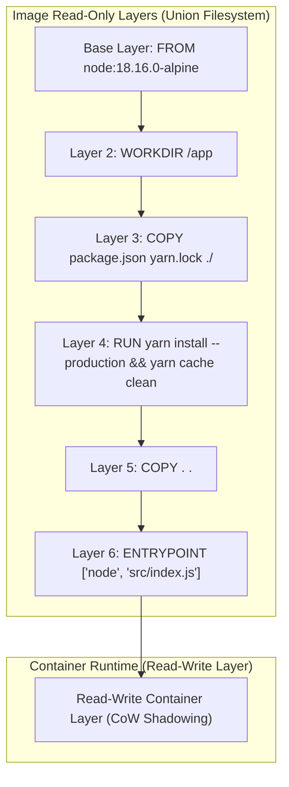
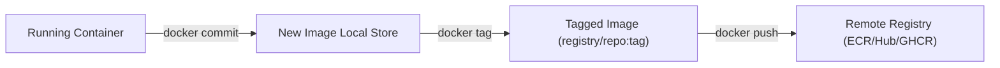

---
domains:
  - "docker"
  - "infra"
---

# Module 2-2: Dockerfile Primer & Image Building

This module details how container images are constructed using Dockerfiles. It covers Dockerfile instruction syntax, Union Filesystem (UFS) layering mechanics, Copy-on-Write (CoW) side effects, layer caching optimization, BuildKit architecture, exec vs. shell forms, image tagging, and local commit operations.

---

## 🗺️ Cognitive Map: Image Layers and Cache Execution



---

## 1. Dockerfile Instruction Reference

A `Dockerfile` is a text document containing instructions to build a container image.

*   `FROM <image>:<tag>`: Initializes the build stage and sets the base image. Best practice is to use specific, pinned version tags (e.g., `node:18.16.0-alpine`) rather than `latest` or generic version numbers (e.g., `node:18`).
*   `WORKDIR /path`: Sets the working directory. If it doesn't exist, it is created. Avoids absolute path repetition. Equivalent to running `mkdir -p` and `cd`.
*   `COPY <src> <dest>`: Copies files/directories from the build context host to the image filesystem. Supports wildcard patterns. Use `.dockerignore` to prevent copying local node_modules, build logs, or git files.
*   `ADD <src> <dest>`: Similar to `COPY`, but adds support for pulling files from remote URLs and automatically unpacking local `.tar` archives. For standard file transfers, `COPY` is preferred to maintain predictable behavior.
*   `RUN <command>`: Executes commands in a new layer and commits the results. Used to install packages (e.g., `RUN apt-get update && apt-get install -y curl`).
*   `ENV KEY=VALUE`: Sets persistent environment variables accessible inside the running container.
*   `ARG KEY=VALUE`: Sets build-time variables. These do not persist in the final image layers but can be passed during build execution: `docker build --build-arg KEY=new_val .`
*   `EXPOSE <port>`: Serves as documentation indicating which port the application listens on. It has no network routing effect at runtime.
*   `USER <user>:<group>`: Sets the non-privileged user or UID/GID to run subsequent instructions, hardening the container against privilege escalation attacks.
*   `LABEL key=value`: Adds metadata (author, version, description) to the image.
*   `VOLUME ["/path"]`: Creates a mount point inside the container and marks it as holding externally mounted volumes.
*   `ONBUILD <instruction>`: Declares trigger instructions that execute when the current image is used as a base for another build stage.
*   `HEALTHCHECK`: Configures a command to run periodically to test if the container process is operating correctly (e.g., `HEALTHCHECK CMD curl -f http://localhost/ || exit 1`).
*   `SHELL ["executable", "parameters"]`: Overrides the default shell used for the shell form of commands (default: `/bin/sh -c` on Linux, `cmd /S /C` on Windows).

---

## 2. Deep-Intuition (AARF) Breakdowns: Image & Cache Mechanics

### A. Union Filesystem (UFS) and Copy-on-Write (CoW) Bloat
#### Deep-Intuition (AARF) Breakdown:
1. **The Answer (Core Pattern):** Combine package updates, installations, and cleanup steps into a single `RUN` instruction:
    ```dockerfile
    RUN apt-get update && apt-get install -y \
        curl \
        git \
     && apt-get clean \
     && rm -rf /var/lib/apt/lists/*
    ```
2. **The Assumptions (Context):** The filesystem must be a Union Filesystem (e.g., Overlay2). Docker layers are read-only; modifications are captured in stacked differences.
3. **The Rationale (Why):** UFS overlays folders. If a file is created in Layer A and deleted/modified in Layer B, the change is written to Layer B. If deleted, a "whiteout" metadata file is written to Layer B to shadow (hide) the file from Layer A. However, the file still occupies disk space in Layer A. Separating update, install, and cleanup commands into multiple `RUN` layers preserves the cached packages in the installation layer forever.
4. **The Failure Loop (What if not):** Running `RUN apt-get update`, followed by `RUN apt-get install`, followed by `RUN rm -rf /var/lib/apt/lists/*` creates three distinct layers. The package lists downloaded in layer 1 and the `.deb` caches created in layer 2 are preserved in the image history. The delete command in layer 3 merely shadows them. This bloats the final image size by hundreds of megabytes.
5. **Alternative Case (When to use 'if not'):** In development environments, splitting steps into separate layers is sometimes done temporarily to speed up incremental builds when installing large stable packages that rarely change.

### B. Layer Caching & Cache Invalidation (Cache Busting)
#### Deep-Intuition (AARF) Breakdown:
1. **The Answer (Core Pattern):** Order Dockerfile instructions from least frequently changed (base layers, dependencies) to most frequently changed (application source code), copying packages and running installs *before* copying source files.
    ```dockerfile
    # 1. Install dependencies (Cached unless package files change)
    COPY package.json yarn.lock ./
    RUN yarn install --production && yarn cache clean
    
    # 2. Copy source code (Invalidates cache on every source commit)
    COPY . .
    ```
2. **The Assumptions (Context):** A build cache matches instructions character-for-character. For `COPY` and `ADD` commands, it computes the checksum of files inside the build context.
3. **The Rationale (Why):** During a build, Docker checks if a layer matches the cache. If a match is found, it skips execution. However, if any instruction changes (e.g., a file checksum in a `COPY` block differs), that layer's cache is invalidated. All subsequent layers are forced to rebuild from scratch (cache busting).
4. **The Failure Loop (What if not):** Placing `COPY . .` *before* `RUN npm install` invalidates the package installation cache on every single code change (even a minor edit in a comment). The builder is forced to re-run package installation, downloading gigabytes of dependencies from the internet on every commit, slowing build times from seconds to minutes.
5. **Alternative Case (When to use 'if not'):** If dependencies are dynamic (e.g., pulling a SNAPSHOT or a variable branch version from Git inside the container), pass `--no-cache` to the `docker build` command to force complete execution.

### C. Exec Form vs. Shell Form (ENTRYPOINT/CMD Signal Swallowing)
#### Deep-Intuition (AARF) Breakdown:
1. **The Answer (Core Pattern):** Always specify `ENTRYPOINT` and `CMD` commands using the **Exec Form** (JSON array syntax) rather than the **Shell Form**:
    ```dockerfile
    # Exec Form (Correct)
    ENTRYPOINT ["node", "src/index.js"]
    
    # Shell Form (Incorrect)
    ENTRYPOINT node src/index.js
    ```
2. **The Assumptions (Context):** The application process must run as PID 1 to receive OS termination signals (`SIGTERM`, `SIGINT`) sent by the Docker host.
3. **The Rationale (Why):** The exec form executes the binary directly as PID 1. The shell form wraps the binary, running it as a sub-process of `/bin/sh -c`. Shells (like `sh` or `bash`) do not forward OS signals to their child processes.
4. **The Failure Loop (What if not):** If the application runs in shell form, it does not receive the `SIGTERM` signal when running `docker stop`. The process continues to run until the default 10-second grace period expires. The Docker daemon is then forced to send a hard `SIGKILL`, terminating the process instantly. This prevents graceful connection close, transactions rollbacks, and file locks cleanup, risking state corruption.
5. **Alternative Case (When to use 'if not'):** If environment variable expansion (e.g., `ENTRYPOINT echo $MY_VAR`) or shell pipe redirection is strictly required, shell form must be used, or the entrypoint must execute an init wrapper script that calls `exec "$@"`.

---

## 3. Image Lifecycle: Commit & Push Operations

Docker images are immutable templates. They can be created via declarative builds or by committing container states.



### A. Image Commits
`docker commit` captures the container's writable layer changes and packages them into a new image layer.
*   **Command:** `docker commit -m "added packages" <container_id> username/myapp:v1.0`
*   **Commit vs. Build:** Committing container states is a "black box" operation. It results in a single, undocumented layer containing all filesystem changes. It does not provide reproducibility or change tracking. It is useful for forensic analysis of crashed environments, but not for software distribution.

### B. Registry Authentication & Image Tagging
1.  **Image Tag Structure:** `registry.domain.com/namespace/repository:tag`
    *   If no registry domain is specified, it defaults to Docker Hub (`docker.io/library/`).
    *   If the tag is omitted, it defaults to `latest`.
2.  **Tagging and Publishing to Docker Hub:**
    ```bash
    # Rename local image
    docker tag getting-started:v1 username/getting-started:v1.0.0
    # Push to registry
    docker push username/getting-started:v1.0.0
    ```
3.  **Tagging and Publishing to Custom Registries (e.g., Quay.io, GHCR):**
    ```bash
    # Authenticate
    docker login quay.io
    # Tag for Quay
    docker tag getting-started:v1 quay.io/username/getting-started:v1.0.0
    # Push
    docker push quay.io/username/getting-started:v1.0.0
    ```

---

## 4. Deep-Intuition (AARF) Breakdown: Version Pinning & Tag Drift

#### Deep-Intuition (AARF) Breakdown:
1. **The Answer (Core Pattern):** Tag production images using explicit semantic version tags matching the application build (e.g., `myapp:1.2.3` or `myapp:1.2.3-commitsha`), and avoid relying on the `latest` tag in deployment configurations.
2. **The Assumptions (Context):** The build system must generate unique identifiers (e.g., Git commit SHA or CI build numbers) for every image release.
3. **The Rationale (Why):** The `latest` tag is not a dynamic pointer; it is simply a tag applied by default when no tag is specified. If multiple builders push images labeled `latest`, the tag shifts to the newest upload, causing silent configuration changes.
4. **The Failure Loop (What if not):** Deploying services using `image:latest` introduces tag drift. If a host node restarts and pulls the image, it might pull a newer, untested build containing breaking changes, while another node runs the older build. This results in heterogeneous application environments, untraceable errors, and broken rollbacks.
5. **Alternative Case (When to use 'if not'):** In local development environments, utilizing `latest` or generic tags simplifies fast building and running cycles without updating configurations.

---

## 5. BuildKit Integration & Static Analysis
Modern Docker engines utilize **BuildKit** as the backend compiler, offering enhanced performance, concurrent execution, cache mounts, and secret injections.

*   **Enabling BuildKit:** Set the environment variable `DOCKER_BUILDKIT=1` before executing builds.
*   **Static Code Analysis (Hadolint):** Utilize a Dockerfile linter like `hadolint` in CI pipelines to scan code. It flags insecure patterns (running as root, missing pinned tags, apt cache files not cleaned up) and ensures compliance with image creation best practices.

---

## 🛠️ Practical Proof of Concept (PoC): Layer Caching & Image Commits Verification

### Target Scenario
We will build a custom Nginx image, verify how changing local files invalidates the layer cache at different steps, and perform a manual `docker commit` modification.

### Step-by-Step Guided Steps

1. **Setup the Build Context**:
   Create a directory and two static files:
   ```bash
   mkdir -p build-poc && cd build-poc
   echo "Version 1.0" > app_version.txt
   echo "Welcome to Nginx PoC" > index.html
   ```

2. **Write a Layer-Optimized Dockerfile**:
   Write the following Dockerfile:
   ```dockerfile
   cat <<EOF > Dockerfile
   FROM nginx:alpine
   RUN apk add --no-cache curl
   COPY app_version.txt /usr/share/nginx/html/version.txt
   COPY index.html /usr/share/nginx/html/index.html
   EOF
   ```

3. **Perform the Initial Build**:
   Build the image and observe the layer compilation:
   ```bash
   DOCKER_BUILDKIT=1 docker build -t cache-poc:v1 .
   ```
   Note that all steps (`apk add`, `COPY`) are executed fresh.

4. **Verify Layer Caching (No Changes)**:
   Rebuild the image immediately:
   ```bash
   DOCKER_BUILDKIT=1 docker build -t cache-poc:v1 .
   ```
   Observe the build output. BuildKit will mark steps with `CACHED`, meaning no layers were re-compiled.

5. **Trigger Cache Invalidation (Cache Busting)**:
   - Modify the `index.html` file (affects the last layer):
     ```bash
     echo "Welcome to Nginx PoC - Updated" > index.html
     DOCKER_BUILDKIT=1 docker build -t cache-poc:v1 .
     ```
     Observe that only the step `COPY index.html ...` runs fresh; the preceding step `COPY app_version.txt ...` is resolved from cache.
   - Modify the `app_version.txt` file (affects an earlier layer):
     ```bash
     echo "Version 2.0" > app_version.txt
     DOCKER_BUILDKIT=1 docker build -t cache-poc:v1 .
     ```
     Observe that because `app_version.txt` is copied *before* `index.html`, changing it invalidates the cache for its step *and all subsequent steps* (both COPY commands are re-run).

6. **Perform a Container Commit**:
   - Run the container in the background:
     ```bash
     docker run -d --name commit-poc cache-poc:v1
     ```
   - Make an ad-hoc change directly inside the running container:
     ```bash
     docker exec -it commit-poc sh -c 'echo "Manual Patch" > /usr/share/nginx/html/patch.txt'
     ```
   - Commit the modified container state into a new image:
     ```bash
     docker commit commit-poc cache-poc:patched
     ```
   - Destroy the running container and verify the patched file exists in the newly created image:
     ```bash
     docker rm -f commit-poc
     docker run --rm cache-poc:patched cat /usr/share/nginx/html/patch.txt
     ```
     This should output `Manual Patch`, proving the state was captured in the new image layer.

7. **Clean Up**:
   ```bash
   docker rmi cache-poc:v1 cache-poc:patched
   cd .. && rm -rf build-poc
   ```
