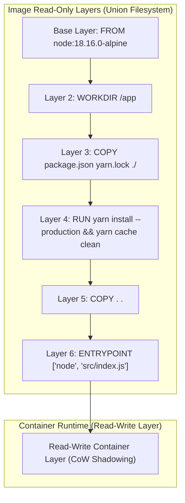
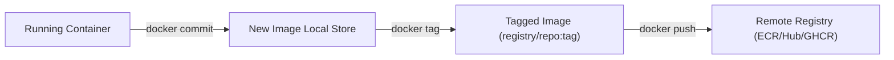

---
domains:
  - "docker"
  - "infra"
---

# Module 2-2: Dockerfile Primer & Image Building

This module details how container images are constructed using Dockerfiles. It covers Dockerfile instruction syntax, Union Filesystem (UFS) layering mechanics, Copy-on-Write (CoW) side effects, layer caching optimization, BuildKit architecture, exec vs. shell forms, image tagging, and local commit operations.

---

## 🗺️ Cognitive Map: Image Layers and Cache Execution



---

## 1. Dockerfile Instruction Reference

A `Dockerfile` is a text document containing instructions to build a container image.

*   `FROM <image>:<tag>`: Initializes the build stage and sets the base image. Best practice is to use specific, pinned version tags (e.g., `node:18.16.0-alpine`) rather than `latest` or generic version numbers (e.g., `node:18`).
*   `WORKDIR /path`: Sets the working directory. If it doesn't exist, it is created. Avoids absolute path repetition. Equivalent to running `mkdir -p` and `cd`.
*   `COPY <src> <dest>`: Copies files/directories from the build context host to the image filesystem. Supports wildcard patterns. Use `.dockerignore` to prevent copying local node_modules, build logs, or git files.
*   `ADD <src> <dest>`: Similar to `COPY`, but adds support for pulling files from remote URLs and automatically unpacking local `.tar` archives. For standard file transfers, `COPY` is preferred to maintain predictable behavior.
*   `RUN <command>`: Executes commands in a new layer and commits the results. Used to install packages (e.g., `RUN apt-get update && apt-get install -y curl`).
*   `ENV KEY=VALUE`: Sets persistent environment variables accessible inside the running container.
*   `ARG KEY=VALUE`: Sets build-time variables. These do not persist in the final image layers but can be passed during build execution: `docker build --build-arg KEY=new_val .`
*   `EXPOSE <port>`: Serves as documentation indicating which port the application listens on. It has no network routing effect at runtime.
*   `USER <user>:<group>`: Sets the non-privileged user or UID/GID to run subsequent instructions, hardening the container against privilege escalation attacks.
*   `LABEL key=value`: Adds metadata (author, version, description) to the image.
*   `VOLUME ["/path"]`: Creates a mount point inside the container and marks it as holding externally mounted volumes.
*   `ONBUILD <instruction>`: Declares trigger instructions that execute when the current image is used as a base for another build stage.
*   `HEALTHCHECK`: Configures a command to run periodically to test if the container process is operating correctly (e.g., `HEALTHCHECK CMD curl -f http://localhost/ || exit 1`).
*   `SHELL ["executable", "parameters"]`: Overrides the default shell used for the shell form of commands (default: `/bin/sh -c` on Linux, `cmd /S /C` on Windows).

---

## 2. Deep-Intuition (AARF) Breakdowns: Image & Cache Mechanics

### A. Union Filesystem (UFS) and Copy-on-Write (CoW) Bloat
#### Deep-Intuition (AARF) Breakdown:
1. **The Answer (Core Pattern):** Combine package updates, installations, and cleanup steps into a single `RUN` instruction:
    ```dockerfile
    RUN apt-get update && apt-get install -y \
        curl \
        git \
     && apt-get clean \
     && rm -rf /var/lib/apt/lists/*
    ```
2. **The Assumptions (Context):** The filesystem must be a Union Filesystem (e.g., Overlay2). Docker layers are read-only; modifications are captured in stacked differences.
3. **The Rationale (Why):** UFS overlays folders. If a file is created in Layer A and deleted/modified in Layer B, the change is written to Layer B. If deleted, a "whiteout" metadata file is written to Layer B to shadow (hide) the file from Layer A. However, the file still occupies disk space in Layer A. Separating update, install, and cleanup commands into multiple `RUN` layers preserves the cached packages in the installation layer forever.
4. **The Failure Loop (What if not):** Running `RUN apt-get update`, followed by `RUN apt-get install`, followed by `RUN rm -rf /var/lib/apt/lists/*` creates three distinct layers. The package lists downloaded in layer 1 and the `.deb` caches created in layer 2 are preserved in the image history. The delete command in layer 3 merely shadows them. This bloats the final image size by hundreds of megabytes.
5. **Alternative Case (When to use 'if not'):** In development environments, splitting steps into separate layers is sometimes done temporarily to speed up incremental builds when installing large stable packages that rarely change.

### B. Layer Caching & Cache Invalidation (Cache Busting)
#### Deep-Intuition (AARF) Breakdown:
1. **The Answer (Core Pattern):** Order Dockerfile instructions from least frequently changed (base layers, dependencies) to most frequently changed (application source code), copying packages and running installs *before* copying source files.
    ```dockerfile
    # 1. Install dependencies (Cached unless package files change)
    COPY package.json yarn.lock ./
    RUN yarn install --production && yarn cache clean
    
    # 2. Copy source code (Invalidates cache on every source commit)
    COPY . .
    ```
2. **The Assumptions (Context):** A build cache matches instructions character-for-character. For `COPY` and `ADD` commands, it computes the checksum of files inside the build context.
3. **The Rationale (Why):** During a build, Docker checks if a layer matches the cache. If a match is found, it skips execution. However, if any instruction changes (e.g., a file checksum in a `COPY` block differs), that layer's cache is invalidated. All subsequent layers are forced to rebuild from scratch (cache busting).
4. **The Failure Loop (What if not):** Placing `COPY . .` *before* `RUN npm install` invalidates the package installation cache on every single code change (even a minor edit in a comment). The builder is forced to re-run package installation, downloading gigabytes of dependencies from the internet on every commit, slowing build times from seconds to minutes.
5. **Alternative Case (When to use 'if not'):** If dependencies are dynamic (e.g., pulling a SNAPSHOT or a variable branch version from Git inside the container), pass `--no-cache` to the `docker build` command to force complete execution.

### C. Exec Form vs. Shell Form (ENTRYPOINT/CMD Signal Swallowing)
#### Deep-Intuition (AARF) Breakdown:
1. **The Answer (Core Pattern):** Always specify `ENTRYPOINT` and `CMD` commands using the **Exec Form** (JSON array syntax) rather than the **Shell Form**:
    ```dockerfile
    # Exec Form (Correct)
    ENTRYPOINT ["node", "src/index.js"]
    
    # Shell Form (Incorrect)
    ENTRYPOINT node src/index.js
    ```
2. **The Assumptions (Context):** The application process must run as PID 1 to receive OS termination signals (`SIGTERM`, `SIGINT`) sent by the Docker host.
3. **The Rationale (Why):** The exec form executes the binary directly as PID 1. The shell form wraps the binary, running it as a sub-process of `/bin/sh -c`. Shells (like `sh` or `bash`) do not forward OS signals to their child processes.
4. **The Failure Loop (What if not):** If the application runs in shell form, it does not receive the `SIGTERM` signal when running `docker stop`. The process continues to run until the default 10-second grace period expires. The Docker daemon is then forced to send a hard `SIGKILL`, terminating the process instantly. This prevents graceful connection close, transactions rollbacks, and file locks cleanup, risking state corruption.
5. **Alternative Case (When to use 'if not'):** If environment variable expansion (e.g., `ENTRYPOINT echo $MY_VAR`) or shell pipe redirection is strictly required, shell form must be used, or the entrypoint must execute an init wrapper script that calls `exec "$@"`.

---

## 3. Image Lifecycle: Commit & Push Operations

Docker images are immutable templates. They can be created via declarative builds or by committing container states.



### A. Image Commits
`docker commit` captures the container's writable layer changes and packages them into a new image layer.
*   **Command:** `docker commit -m "added packages" <container_id> username/myapp:v1.0`
*   **Commit vs. Build:** Committing container states is a "black box" operation. It results in a single, undocumented layer containing all filesystem changes. It does not provide reproducibility or change tracking. It is useful for forensic analysis of crashed environments, but not for software distribution.

### B. Registry Authentication & Image Tagging
1.  **Image Tag Structure:** `registry.domain.com/namespace/repository:tag`
    *   If no registry domain is specified, it defaults to Docker Hub (`docker.io/library/`).
    *   If the tag is omitted, it defaults to `latest`.
2.  **Tagging and Publishing to Docker Hub:**
    ```bash
    # Rename local image
    docker tag getting-started:v1 username/getting-started:v1.0.0
    # Push to registry
    docker push username/getting-started:v1.0.0
    ```
3.  **Tagging and Publishing to Custom Registries (e.g., Quay.io, GHCR):**
    ```bash
    # Authenticate
    docker login quay.io
    # Tag for Quay
    docker tag getting-started:v1 quay.io/username/getting-started:v1.0.0
    # Push
    docker push quay.io/username/getting-started:v1.0.0
    ```

---

## 4. Deep-Intuition (AARF) Breakdown: Version Pinning & Tag Drift

#### Deep-Intuition (AARF) Breakdown:
1. **The Answer (Core Pattern):** Tag production images using explicit semantic version tags matching the application build (e.g., `myapp:1.2.3` or `myapp:1.2.3-commitsha`), and avoid relying on the `latest` tag in deployment configurations.
2. **The Assumptions (Context):** The build system must generate unique identifiers (e.g., Git commit SHA or CI build numbers) for every image release.
3. **The Rationale (Why):** The `latest` tag is not a dynamic pointer; it is simply a tag applied by default when no tag is specified. If multiple builders push images labeled `latest`, the tag shifts to the newest upload, causing silent configuration changes.
4. **The Failure Loop (What if not):** Deploying services using `image:latest` introduces tag drift. If a host node restarts and pulls the image, it might pull a newer, untested build containing breaking changes, while another node runs the older build. This results in heterogeneous application environments, untraceable errors, and broken rollbacks.
5. **Alternative Case (When to use 'if not'):** In local development environments, utilizing `latest` or generic tags simplifies fast building and running cycles without updating configurations.

---

## 5. BuildKit Integration & Static Analysis
Modern Docker engines utilize **BuildKit** as the backend compiler, offering enhanced performance, concurrent execution, cache mounts, and secret injections.

*   **Enabling BuildKit:** Set the environment variable `DOCKER_BUILDKIT=1` before executing builds.
*   **Static Code Analysis (Hadolint):** Utilize a Dockerfile linter like `hadolint` in CI pipelines to scan code. It flags insecure patterns (running as root, missing pinned tags, apt cache files not cleaned up) and ensures compliance with image creation best practices.

---

---

## 📖 Detailed Study: Docker Deep Dive (Nigel Poulton)

# 6: Images

## Docker images - The TLDR

- A unit of packaging that contains everything required for an application to run
- Application code
- Application dependencies
- OS Constructs

- In VM analogy an image is like a template VM (Stopped VM)
- Get an image by "Pulling" it from a registry. By default Docker Hub is used
- Consists of layers stacked on top of each other

## Docker images - The deep dive

- Images are considered _build-time_ constructs where containers are _runtime_ constructs.

![[../Attachments/docker_deep_dive_11.png]]

### Images and containers

To start a container from an image  
- `docker container run`  
- `docker service create`

### Images are usually small

- Images have _just enought operating system_  
- They normally don't include kernel  
- Some images are really small:  
- [Alpine image in Docker Hub](https://hub.docker.com/_/alpine)  
- [Alpine Linux](https://alpinelinux.org/downloads/)

### Pulling images

- Fresh installation of Docker comes with no images  
- The local repo of Docker is in `/var/lib/docker/<storage-driver>`  
- Use `docker image ls` to list all of the current images in the local repo

- Use `$ docker image pull redis:latest` to pull the latest redis image  
- Use `$ docker image pull alpine:latest` to pull the latest alpine linux image

### Image naming

**Image Registries**  
- Images are stored in centralized places called _image registries_.  
- The most common registry is [Docker Hub](https://hub.docker.com)  
- Other 3rd party registries and local registries can also be used.
- Use `$ docker info` to check the current "Registry" option.
- Image registries contain one or more _image repositories_. Each repo can have one or more versions of the image.

![[../Attachments/docker_deep_dive_12.png]]

### Official and unofficial repositories

- **_Official repositories_** are the home to images that have been vetted and curated by Docker, Inc.  
- **_Unofficial repositories_** may not be safe, well-documented or built according to best practices.

- _Official repos_ exist on the top level namespace in docker hub:
    - nginx: https://hub.docker.com/_/nginx/
    - busybox: https://hub.docker.com/_/busybox/
    - redis: https://hub.docker.com/_/redis/
    - mongo: https://hub.docker.com/_/mongo/
- _Unofficial repos_ will have user account name in the url and not in the top level namespace:
    - nigelpoulton/tu-demo — https://hub.docker.com/r/nigelpoulton/tu-demo/
    - nigelpoulton/pluralsight-docker-ci — https://hub.docker.com/r/nigelpoulton/pluralsight-docker-ci/
    - https://hub.docker.com/repository/docker/asami76/web

### Image naming and tagging

**Pulling images from Official repos**

- `$ docker image pull <repository>:<tag>`  
- `$ docker image pull alpine:latest`
- `$ docker image pull mongo:4.2.6`
- `$ docker image pull alpine`

**Pulling images from Unofficial repos**

- `$ docker image pull nigelpoulton/tu-demo:v2`  

**Pulling images from 3rd party registries (not Docker Hub)**

Pulling from `google-containers/git-sync` repo:  
`$ docker image pull gcr.io/google-containers/git-sync:v3.1.5`

### Images with multiple tags

`$ docker image pull -a <imagename>` // will pull all versions of the image from the repo  
`$ docker image prune` // remove all images that are not referenced by any container  
`$ docker image prune -a` //remove all dangling images (images with no tags)

### Searching Docker Hub from the CLI

- Use `docker search`  
- `$ docker search nigelpoulton`
- `$ docker search asami76`

`--filter "is-official=true"`

- `$ docker search alpine --filter "is-official=true"`  
- `$ docker search ubuntu --filter "is-official=true"`

### Images and layers

- A Docker image is a bunch of loosely-connected read-only layers.  
- Each layer is one or more files

![[../Attachments/docker_deep_dive_13.png]]

![[../Attachments/docker_deep_dive_15.png]]

![[../Attachments/docker_deep_dive_14.png]]

Another way to see the layers of an image is to use `docker image inspect <image-name>`

`$ docker image inspect ubuntu:latest`

- All Docker images start with a _base layer_  
- New layers are added on top as new content is added to the image

**Example:**  
Create a Python application on top over ubuntu 20.04 then some source code is added

![[../Attachments/docker_deep_dive_16.png]]

![[../Attachments/docker_deep_dive_17.png]]

![[../Attachments/docker_deep_dive_18.png]]

**Docker uses a _storage driver_ in order to stack and merge all layers and present them as a single image.**  
- `AUFS`, `overlay2`, `devicemapper`, `btrfs` and `zfs` for Linux
- `windowsfilter` for Windows NTFS.

![[../Attachments/docker_deep_dive_19.png]]

### Sharing image layers

Multiple images can, and do, share layers. This leads to efficiencies in space and performance.

`$ docker image pull -a nigelpoulton/tu-demo`

![[../Attachments/docker_deep_dive_20.png]]

### Pulling images by digest

- What happens after you download an image with a tag and then the vendor uploads another image with the same tag?
- Docker 1.10 introduced a content addressable storage model.
-  As part of this model, all images get a _cryptographic content hash_.
- This has is referred to as the _digest_.
- Every time you pull an image, the `docker image pull` command includes the image’s digest as part of the information returned

- `$ docker image pull alpine`
- `$ docker image ls --digests alpine`

- You can use the digest of the image when pulling it to ensure that we get **exactly the image we expect**

### A little bit more about image hashes (digests)

- The _image_ itself is a configuration file that lists the layers and some metadata.
- The _layers_ are where the data lives (files, codes, etc.).
- Each layer is independent.
- Each image is identified by a crypto ID which is a hash of the config file.
- Each layer is identified by a crypto ID which is a has of the contents (also called _content hashes_).

- If and image or a layer is changed the hash changes.
- When pushing or pulling an image docker compresses the image to save network bandwidth - But this changes the hashes.
- That's why each layer also has a **_distribution hash_** which is the hash of the image after compression.

### Multi-architecture images

- Windows and Linux, on variations of ARM, ARM 64, IBM Z, IBM POWER, x64, PowerPC, and s390x.
- A single image tag supporting multiple platforms and architectures.
- To make this happen, the Registry API supports two important constructs:
    - **`manifest lists`**
    - **`manifests`**

![[../Attachments/docker_deep_dive_21.png]]

1. When pulling the image the Docker client makes a call to the Docker Registry API exposed by Docker Hub.
2. Docker Registry API inspect the platform/Arch of the calling docker client.  
3. If a **manifest list** exists for the image it will be parsed to see if there's a **manifest** for the calling client.
4. If a **manifest** exists the API will retrieve the layers in it.

**All official images have manifest lists.**

`$ docker manifest inspect golang` // inspects manifest file on Docker Hub

To build an image for Linux/ARM:  
`$ docker buildx build --platform linux/arm/v7 -t myimage:arm-v7`

To create your own manifest lists:  
`docker manifest create`

### Deleting Images

`$ docker image rm <imagename or id>..<imagename or id>`

Delete all images:  
`$ docker image rm $(docker image ls -q) -f`

`$ docker image ls -q` // returns a list containing just the image IDs of all images pulled locally on the system

## Images - The commands

- `docker image pull` is the command to download images.  
- `docker image ls` lists all of the images stored in your Docker host’s local image cache.  
- `docker image inspect` all of the details of an image — layer data and metadata.  
- `docker manifest inspect` allows you to inspect the manifest list of any image stored on Docker Hub.  
- `docker buildx` is a Docker CLI plugin that extends the Docker CLI to support multi-arch builds.  
- `docker image rm` is the command to delete images.


----

# 8: Containerizing an App

The process of taking an application and configuring it to run as a container is called “containerizing".


## Containerizing an app - The TLDR

The process of containerizing an app looks like this:

1. Start with your application code and dependencies
2. Create a _Dockerfile_ that describes your app, its dependencies, and how to run it
3. Feed the _Dockerfile_ into the `docker image build` command
4. Push the new image to a registry (optional)
5. Run container from the image

![[../Attachments/docker_deep_dive_25.png]]


## Containerizing an app - The deep dive


### Containerize a single-container app

- Clone the repo to get the app code
- Inspect the Dockerfile
- Containerize the app
- Run the app
- Test the app
- Look a bit closer
- Move to production with Multi-stage Builds
- A few best practices


#### Getting the application code

`$ git clone https://github.com/nigelpoulton/psweb.git`


#### Inspecting the Dockerfile

1. All Dockerfiles start with the `FROM` instruction. This will be the base layer of the image, and the rest of the app will be added on top as additional layers.

![[../Attachments/docker_deep_dive_26.png]]

2. Next, the Dockerfile creates a `LABEL` that specifies “nigelpoulton@hotmail.com” as the maintainer of the image

3. The `RUN apk add --update nodejs nodejs-npm` instruction uses the Alpine `apk` package manager to install `nodejs` and `nodejs-npm` into the image.

![[../Attachments/docker_deep_dive_27.png]]

4. The `COPY . /src` instruction creates another new layer and copies in the application and dependency files from the _build context_.

![[../Attachments/docker_deep_dive_28.png]]

5. Next, the Dockerfile uses the `WORKDIR` instruction to set the working directory inside the image filesystem for the rest of the instructions in the file

6. Then the `RUN npm install` instruction creates a new layer and uses `npm` to install application dependencies listed in the `package.json` file in the build context.

![[../Attachments/docker_deep_dive_29.png]]

7. The application exposes a web service on TCP port 8080, so the Dockerfile documents this with the `EXPOSE 8080` instruction.

8. Finally, the `ENTRYPOINT` instruction is used to set the main application that the image (container) should run. This is also added as metadata and not an image layer.


#### Containerize the app/build the image

`$ docker image build -t web:latest .`

`$ docker images`

`$ docker image inspect web:latest`


#### Pushing images

First login to the Docker Hub registry:  
`docker login`

Docker needs the following information when pushing an image:
- `Registry`
- `Repository`
- `Tag`

The `tag` should include the `repository` name (your user account on Docker Hub):  
`$ docker image tag <current-tag> <repository-name>/<new-tag>`  
`$ docker image tag web:latest asami76/newweb:latest`

`$ docker image push asami76/newweb:latest`

![[../Attachments/docker_deep_dive_30.png]]

You can also create multiple image tags and push them to the same repo:  

`$ docker image tag web:latest asami76/newweb:v2`

Check the following URL to find all of the tags in the `newweb` repo  
**[asami76/newweb](https://hub.docker.com/repository/docker/asami76/newweb)**

#### Run the app

Remove all images from the local repo.

Run the following command to create a container named c1 based on the image we just pushed:  
 `$ docker container run -d --name c1 -p 80:8080 asami76/newweb:latest`


#### Test the app

Open the browser in the Docker Host on URL http://localhost:80


#### Looking a bit closer

The `docker image build` command parses the Dockerfile one-line-at-a-time starting from the top.

Comment lines start with the `#` character.

**Instructions** and take the format `INSTRUCTION argument`.

View the instructions that were used to build the image with the `docker image history` command.

- Each line corresponds to an instruction in the Dockerfile (starting from the bottom and working up).  
- The CREATED BY column even lists the exact Dockerfile instruction that was executed.  
- Only 4 of the lines displayed in the output create new layers (the ones with non-zero values in the SIZE column).

The `docker image build` executes in the following order:  
`spin up a temporary container` > `run the Dockerfile instruction inside of that container` > `save the results as a new image layer` > `remove the temporary container`

**[Dockerfile Instructions Cheatsheet](https://medium.com/@oap.py/dockerfile-cheat-sheet-4ad12569aa0b)**


### Moving to production with Multi-stage Builds

Multi-stage builds have a single Dockerfile containing multiple FROM instructions. Each FROM instruction is a new **build stage** that can easily COPY artefacts from previous **stages**.


### A few best practices

#### Leverage the build cache

Artefacts from the first build, such as layers, are cached and leveraged by later builds.

During the `docker image build` and for each instruction in the Dockerfile, Docker looks to see if it already has an image layer for that instruction in its cache. If it does, this is a _cache hit_ and it uses that layer. If it doesn’t, this is a _cache miss_ and it builds a new layer from the instruction.


#### Squash the image

Squashing an image means that after building the image all layers will be merged(squashed) into a single layer.

Add the `--squash` flag to the `docker image build` command if you want to create a squashed image.

![[../Attachments/docker_deep_dive_31.png]]


#### Use no-install-recommends

- `no-install-recommends` flag with the `apt-get` install command.
- This makes sure that apt only installs main dependencies (packages in the Depends field) and not recommended or suggested packages.


## Containerizing an app - The commands

- `docker image build` // the command that reads a Dockerfile and containerizes an application
- Dockerfile instructions:
    - `FROM`  // specifies the base image for the new image you will build. It is usually the first instruction in a Dockerfile
    - `RUN`  // run commands inside the image. Each RUN instruction creates a single new layer.
    - `COPY`  // adds files into the image as a new layer. It is common to use the COPY instruction to copy your application code into an image.
    - `EXPOSE`  // documents the network port that the application uses.
    - `ENTRYPOINT`  // sets the default application to run when the image is started as a container.
    - Other Dockerfile instructions include LABEL, ENV, ONBUILD, HEALTHCHECK, CMD and more…


----

---

## 🛠️ Practical Proof of Concept (PoC): Layer Caching & Image Commits Verification

### Target Scenario
We will build a custom Nginx image, verify how changing local files invalidates the layer cache at different steps, and perform a manual `docker commit` modification.

### Step-by-Step Guided Steps

1. **Setup the Build Context**:
   Create a directory and two static files:
   ```bash
   mkdir -p build-poc && cd build-poc
   echo "Version 1.0" > app_version.txt
   echo "Welcome to Nginx PoC" > index.html
   ```

2. **Write a Layer-Optimized Dockerfile**:
   Write the following Dockerfile:
   ```dockerfile
   cat <<EOF > Dockerfile
   FROM nginx:alpine
   RUN apk add --no-cache curl
   COPY app_version.txt /usr/share/nginx/html/version.txt
   COPY index.html /usr/share/nginx/html/index.html
   EOF
   ```

3. **Perform the Initial Build**:
   Build the image and observe the layer compilation:
   ```bash
   DOCKER_BUILDKIT=1 docker build -t cache-poc:v1 .
   ```
   Note that all steps (`apk add`, `COPY`) are executed fresh.

4. **Verify Layer Caching (No Changes)**:
   Rebuild the image immediately:
   ```bash
   DOCKER_BUILDKIT=1 docker build -t cache-poc:v1 .
   ```
   Observe the build output. BuildKit will mark steps with `CACHED`, meaning no layers were re-compiled.

5. **Trigger Cache Invalidation (Cache Busting)**:
   - Modify the `index.html` file (affects the last layer):
     ```bash
     echo "Welcome to Nginx PoC - Updated" > index.html
     DOCKER_BUILDKIT=1 docker build -t cache-poc:v1 .
     ```
     Observe that only the step `COPY index.html ...` runs fresh; the preceding step `COPY app_version.txt ...` is resolved from cache.
   - Modify the `app_version.txt` file (affects an earlier layer):
     ```bash
     echo "Version 2.0" > app_version.txt
     DOCKER_BUILDKIT=1 docker build -t cache-poc:v1 .
     ```
     Observe that because `app_version.txt` is copied *before* `index.html`, changing it invalidates the cache for its step *and all subsequent steps* (both COPY commands are re-run).

6. **Perform a Container Commit**:
   - Run the container in the background:
     ```bash
     docker run -d --name commit-poc cache-poc:v1
     ```
   - Make an ad-hoc change directly inside the running container:
     ```bash
     docker exec -it commit-poc sh -c 'echo "Manual Patch" > /usr/share/nginx/html/patch.txt'
     ```
   - Commit the modified container state into a new image:
     ```bash
     docker commit commit-poc cache-poc:patched
     ```
   - Destroy the running container and verify the patched file exists in the newly created image:
     ```bash
     docker rm -f commit-poc
     docker run --rm cache-poc:patched cat /usr/share/nginx/html/patch.txt
     ```
     This should output `Manual Patch`, proving the state was captured in the new image layer.

7. **Clean Up**:
   ```bash
   docker rmi cache-poc:v1 cache-poc:patched
   cd .. && rm -rf build-poc
   ```
