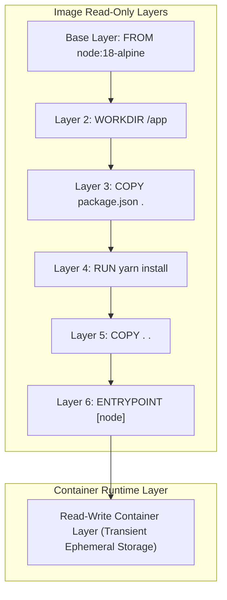
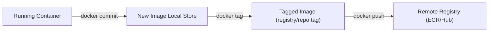

---
domains:
  - "docker"
  - "infra"
---

# Module 2-2: Dockerfile Primer & Image Building

This module details how container images are constructed using Dockerfiles. It covers essential Dockerfile instructions, layer caching mechanics, command parameters (`ENTRYPOINT` vs. `CMD`), build arguments, and publishing images to registries.

---

## 🗺️ Cognitive Map: Image Layers and Cache Execution



---

## 1. Dockerfile Instruction Reference

A `Dockerfile` is a text document containing instructions to assemble a container image.

*   `FROM <image>:<tag>`: Sets the base image (e.g., `node:18-alpine`). Using minimal base images like Alpine reduces image size and vulnerability footprints.
*   `WORKDIR /path`: Sets the working directory for subsequent instructions. Equivalent to running `mkdir -p` and `cd`.
*   `COPY <src> <dest>`: Copies files from the host machine to the image.
*   `ADD <src> <dest>`: Copies files but also supports downloading from remote URLs and automatically extracting tar archives.
*   `RUN <command>`: Executes commands during the image build phase, creating a new read-only layer (used for installing packages, e.g., `RUN apt-get update && apt-get install -y curl`).
*   `ENV KEY=VALUE`: Defines persistent environment variables available inside the running container.
*   `ARG KEY=VALUE`: Defines build-time variables that can be overridden via `docker build --build-arg KEY=new_val`.
*   `EXPOSE <port>`: Documents the ports the application listens on. It does *not* actually expose the ports to the host; that is done during container runtime.
*   `USER <user>`: Sets the execution user (or UID) for subsequent commands. Non-root user configurations are critical for container security hardening.

---

## 2. Docker Layer Caching & Build Optimization

Every instruction in a Dockerfile that modifies files (like `RUN`, `COPY`, `ADD`) creates a new read-only **layer** in the container image.

#### Deep-Intuition (AARF) Breakdown:
1. **The Answer (Core Pattern):** Structure the Dockerfile instructions from least frequently changed to most frequently changed. Copy and install dependencies (`package.json` or `requirements.txt`) *before* copying the application source code:
    ```dockerfile
    WORKDIR /app
    COPY package.json yarn.lock ./
    RUN yarn install --production
    COPY . .
    ```
2. **The Assumptions (Context):** The builder uses the cache matching the exact string representation of the Dockerfile lines and file hashes for `COPY` commands.
3. **The Rationale (Why):** If a layer is cached, Docker skips executing it during builds. If any file copied by a `COPY` instruction changes (like source code in `.`), the cache for that layer and all subsequent layers is invalidated, forcing execution.
4. **The Failure Loop (What if not):** Placing `COPY . .` *before* `RUN yarn install` invalidates the package cache every time a minor source code change is made. The builder is forced to re-download and re-install all dependencies from scratch, increasing build times from seconds to minutes.
5. **Alternative Case (When to use 'if not'):** If dependencies change frequently or are dynamic (e.g., pulling the latest snapshot during CI/CD runs), cache invalidation is desired, and `--no-cache` can be passed to the build command.

---

## 3. ENTRYPOINT vs. CMD

Both instructions define the default executable process for a running container, but they behave differently when arguments are passed.

| Instruction | Behavior | Overriding |
| :--- | :--- | :--- |
| `ENTRYPOINT ["exec", "param"]` | Defines the core binary executable. Arguments passed to `docker run` are appended to the entrypoint. | Overridden via `docker run --entrypoint <binary>` |
| `CMD ["param1", "param2"]` | Provides default arguments for the `ENTRYPOINT`. If no entrypoint is set, runs as the core binary. | Overridden by appending parameters directly to `docker run <image> <new_cmd>` |

### Deep-Intuition (AARF) Breakdown:
1. **The Answer (Core Pattern):** Combine `ENTRYPOINT` and `CMD` by assigning the binary to the entrypoint and default arguments to the CMD:
    ```dockerfile
    ENTRYPOINT ["python", "app.py"]
    CMD ["--port", "8080"]
    ```
2. **The Assumptions (Context):** Always use the **exec form** (JSON array: `["exec"]`) rather than the **shell form** (`python app.py`) to ensure the process runs as PID 1 and receives OS signals.
3. **The Rationale (Why):** In exec form, the binary is launched directly without shell wrapper overhead. In shell form, the command runs as a sub-process of `/bin/sh -c`, meaning `SIGTERM` signals sent to the container are captured and swallowed by the shell, preventing graceful shutdown.
4. **The Failure Loop (What if not):** Using shell form prevents container cleanup. When the orchestrator (like Kubernetes) stops the container, the application process never receives the shutdown signal, runs until the timeout expires (usually 30s), and is forcefully killed (`SIGKILL`), causing database session drops or corrupted files.
5. **Alternative Case (When to use 'if not'):** If environment variable expansion or shell piping is strictly required in the startup script, the shell form or an entrypoint script (`exec "$@"`) is necessary.

---

## 4. Image Lifecycle: Commit & Push Operations



*   **Commit:** Takes a container's filesystem changes and writes them as a new local image layer:
    `docker commit <container_id> my-app:debug`
*   **Pushing to Registries:**
    1.  Authenticate: `docker login <registry_url>`
    2.  Tag the local image: `docker tag my-app:v1 myregistry.com/my-app:v1`
    3.  Push: `docker push myregistry.com/my-app:v1`
