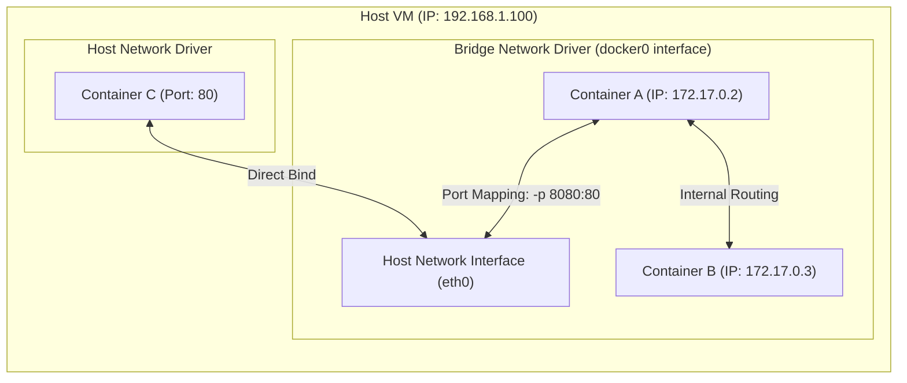

---
domains:
  - "docker"
  - "infra"
---

# Module 2-4: Docker Networking & Multi-Container Compose

This module details how Docker isolates and routes network traffic. It covers core network drivers, port-mapping techniques, and coordinating multi-container deployments using Docker Compose.

---

## 🗺️ Cognitive Map: Bridge vs. Host Networking



---

## 1. Network Drivers in Docker

Docker uses container network interfaces to isolate containers on virtual networks.

*   **`bridge`:** The default driver. Creates a virtual bridge interface (`docker0`) on the host. Containers get private IPs (e.g., `172.17.0.X`) and communicate via port mapping.
*   **`host`:** Removes network isolation between the container and the host. The container binds directly to host interfaces (e.g., container listening on port 80 maps directly to host port 80).
*   **`none`:** Completely disables networking. The container only gets a loopback interface (`127.0.0.1`), preventing external communication.
*   **`overlay`:** Connects multiple Docker daemons across different hosts (Docker Swarm).

---

## 2. Port Mapping & Network Communication

Because default bridge networks assign private IPs, containers cannot be reached directly from outside the host without port mapping.

#### Deep-Intuition (AARF) Breakdown:
1. **The Answer (Core Pattern):** Configure port-forwarding mappings during container runtime using the `-p <host_port>:<container_port>` flag:
    `docker run -d -p 8080:80 nginx`
2. **The Assumptions (Context):** The host ports must not be in use by other services or containers.
3. **The Rationale (Why):** Docker configures Linux kernel **iptables rules** (specifically NAT rules) to forward packets arriving at the host interface's port `8080` to the container's private interface on port `80`.
4. **The Failure Loop (What if not):** Launching containers without `-p` maps makes them unreachable from host networks. Attempts to contact the service result in socket connection failures.
5. **Alternative Case (When to use 'if not'):** For internal microservices (like databases) that should *never* be accessed directly from outside, omit the `-p` flag. Place them on a custom user-defined bridge network so only app containers on the same network can reach them.

---

## 3. Docker Compose Orchestration

Docker Compose allows configuring and running multi-container applications using a single YAML file (`docker-compose.yml`).

### Deep-Intuition (AARF) Breakdown:
1. **The Answer (Core Pattern):** Structure services, networks, and volumes inside a declarative Compose file:
    ```yaml
    version: '3.8'
    services:
      web:
        image: nginx:alpine
        ports:
          - "80:80"
        depends_on:
          - db
      db:
        image: postgres:alpine
        volumes:
          - db_data:/var/lib/postgresql/data
    volumes:
      db_data:
    ```
2. **The Assumptions (Context):** The CLI must have the Compose plugin installed (`docker compose` v2 syntax).
3. **The Rationale (Why):** Compose automatically creates a dedicated user-defined bridge network for the stack. Services can resolve each other dynamically using their service names as DNS names (e.g., `web` resolves `db`).
4. **The Failure Loop (What if not):** Attempting to orchestrate multi-container apps using shell scripts with raw `docker run` commands makes container boot order, network sharing, and host volume mappings brittle and difficult to maintain.
5. **Alternative Case (When to use 'if not'):** For large-scale clustering across multiple physical nodes, Docker Compose is insufficient; Kubernetes should be used.

---

## 4. Docker Compose Command Reference

*   `docker compose up -d`: Builds, (re)creates, and starts all containers in detached mode.
*   `docker compose down`: Stops and removes containers, networks, and volumes created by `up`.
*   `docker compose down -v`: Also deletes named volumes (useful for database resets).
*   `docker compose logs -f`: Aggregates and follows logs of all services.
