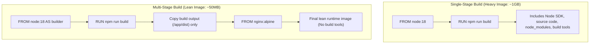

---
domains:
  - "docker"
  - "infra"
---

# Module 2-5: Advanced Docker & CI/CD Pipelines

This module covers advanced container image optimization and automated deployment pipelines. It details multi-stage Docker builds to reduce image sizes and structuring GitHub Actions workflows to build and publish images to registries.

---

## 🗺️ Cognitive Map: Multi-Stage Build vs. Single-Stage Build



---

## 1. Multi-Stage Docker Builds

Multi-stage builds allow utilizing multiple `FROM` instructions in a single Dockerfile. Developers can copy build artifacts from previous stages to a minimal final stage, discarding heavy compilers, SDKs, and build tools.

#### Deep-Intuition (AARF) Breakdown:
1. **The Answer (Core Pattern):** Define a build stage with compilers, copy the files, build the application, and copy *only* the compiled assets to a minimal final runtime stage:
    ```dockerfile
    # Stage 1: Build
    FROM node:18-alpine AS builder
    WORKDIR /app
    COPY package.json yarn.lock ./
    RUN yarn install
    COPY . .
    RUN yarn build

    # Stage 2: Runtime
    FROM nginx:alpine
    COPY --from=builder /app/dist /usr/share/nginx/html
    EXPOSE 80
    CMD ["nginx", "-g", "daemon off;"]
    ```
2. **The Assumptions (Context):** The builder must support Docker multi-stage syntax (available in all modern engine versions).
3. **The Rationale (Why):** Build stages are ephemeral. Only the final stage's instructions are written to the output image layers, reducing image bloat and vulnerability exposure.
4. **The Failure Loop (What if not):** Packaging build tools (compilers, git, test runners, devDependencies) inside the production image increases image sizes from megabytes to gigabytes. This increases network push/pull latency and exposes a large security attack surface (vulnerable packages).
5. **Alternative Case (When to use 'if not'):** For basic scripts (like Python scripts) that do not require a compile/build phase, a simple single-stage build is sufficient.

---

## 2. CI/CD Integration: GitHub Actions Image Workflow

Automating image builds ensures consistent production deployments.

### Deep-Intuition (AARF) Breakdown:
1. **The Answer (Core Pattern):** Configure a GitHub Actions workflow using official Docker actions to build and push images:
    ```yaml
    name: Build and Push Docker Image

    on:
      push:
        branches:
          - main

    jobs:
      build-and-push:
        runs-on: ubuntu-latest
        steps:
          - name: Checkout Code
            uses: actions/checkout@v3

          - name: Set up QEMU
            uses: docker/setup-qemu-action@v2

          - name: Set up Docker Buildx
            uses: docker/setup-buildx-action@v2

          - name: Login to Docker Hub
            uses: docker/login-action@v2
            with:
              username: ${{ secrets.DOCKERHUB_USERNAME }}
              password: ${{ secrets.DOCKERHUB_TOKEN }}

          - name: Build and Push
            uses: docker/build-push-action@v4
            with:
              context: .
              push: true
              tags: myusername/myapp:latest,myusername/myapp:${{ github.sha }}
    ```
2. **The Assumptions (Context):** Docker Hub secrets must be securely stored in the GitHub repository environment settings.
3. **The Rationale (Why):** By using specific actions like `setup-buildx-action`, GitHub Actions utilizes advanced caching, multi-platform image building, and secure API login handshakes automatically.
4. **The Failure Loop (What if not):** Writing custom bash scripts (`docker build && docker push`) inside CI runs makes handling registry authentication handshakes, multi-platform compilation, and build caching fragile and error-prone.
5. **Alternative Case (When to use 'if not'):** For local development or air-gapped systems, manual image building and scripting is used instead of cloud-based GitHub Actions.
