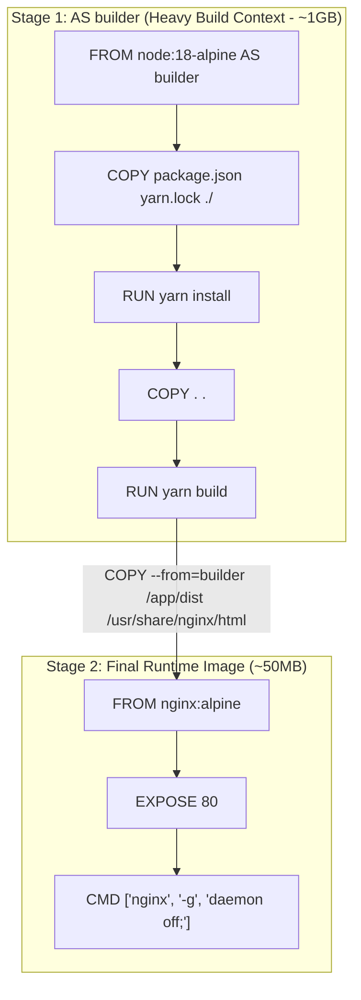
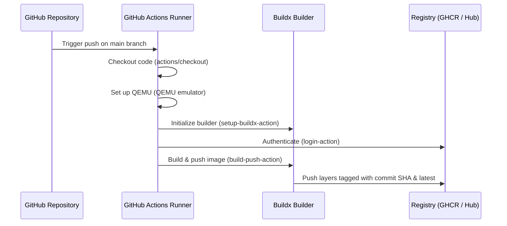

---
domains:
  - "docker"
  - "infra"
---

# Module 2-5: Advanced Docker & CI/CD Pipelines

This module details advanced image optimization strategies and automated publishing pipelines. It covers multi-stage Docker builds, target stage selection, Buildx multi-platform builders, and structuring GitHub Actions workflows to automate image publishing.

---

## 🗺️ Cognitive Map: Multi-Stage Build Pipeline



---

## 1. Multi-Stage Docker Builds

Multi-stage builds allow utilizing multiple `FROM` instructions in a single Dockerfile. Developers can copy build artifacts from previous stages to a minimal final stage, discarding heavy compilers, SDKs, and build tools.

### A. Stage Inheritance vs. Artifact Copying
*   **Stage Inheritance:** A stage can build directly from a previous stage declared in the same Dockerfile.
    ```dockerfile
    FROM python:3.11-slim AS base
    WORKDIR /app
    COPY requirements.txt ./
    RUN pip install --no-cache-dir -r requirements.txt

    # Inherits all packages and configurations from base
    FROM base AS dev
    RUN pip install watchdog
    CMD ["python", "app.py"]
    ```
*   **Artifact Copying:** Copying files across different base images. This discards the entire build environment, retaining only target output files.
    ```dockerfile
    FROM node:18-alpine AS compiler
    WORKDIR /src
    COPY . .
    RUN npm install && npm run build

    # Clean runtime environment
    FROM alpine:3.18
    RUN apk add --no-cache curl
    # Copy compiled static site only, discarding node_modules and compilers
    COPY --from=compiler /src/dist /var/www
    ```
*   **Stage Indices:** If a stage is not named using the `AS` keyword, Docker assigns it a zero-indexed number (e.g., `COPY --from=0 /src/dist /var/www`). Using named stages (`AS compiler`) is preferred to maintain code readability and prevent index shift bugs when instructions are modified.

---

## 2. Deep-Intuition (AARF) Breakdowns: Advanced Building & CI/CD

### A. Multi-Stage Compilations (Image Size & Vulnerability Reduction)
#### Deep-Intuition (AARF) Breakdown:
1. **The Answer (Core Pattern):** Utilize multi-stage builds to compile binaries in an SDK-heavy container, and copy *only* the compiled binary artifact to a minimal scratch or alpine runtime container.
    ```dockerfile
    # Stage 1: Build binary
    FROM golang:1.20-alpine AS builder
    WORKDIR /build
    COPY . .
    RUN CGO_ENABLED=0 GOOS=linux go build -o app .

    # Stage 2: Final release
    FROM scratch
    COPY --from=builder /build/app /app
    ENTRYPOINT ["/app"]
    ```
2. **The Assumptions (Context):** The binary must be statically compiled (CGO disabled) to run inside a `scratch` (empty) container that lacks dynamic system libraries.
3. **The Rationale (Why):** Development SDKs, compilers, headers, and package manager tools are required to compile applications. However, they are useless at runtime. By utilizing separate stages, only the final stage's layers are written to the output image. The build context, compilers, and packages are discarded.
4. **The Failure Loop (What if not):** Shipping production images containing compilers (e.g., Go/C++ compilers, JDKs) and package managers (e.g., apk, apt) bloats image sizes from megabytes to gigabytes. This slows down cluster scaling speeds due to network push/pull delays. Furthermore, it increases the security attack surface: an attacker exploiting a remote code execution vulnerability inside the container can utilize the pre-installed build tools and curl to download, compile, and run malicious binaries directly.
5. **Alternative Case (When to use 'if not'):** For interpreted languages that do not feature a build step (like Python, unless compiling native C extensions), single-stage builds utilizing minimal base images (slim) are sufficient.

### B. Targeting Specific Stages
#### Deep-Intuition (AARF) Breakdown:
1. **The Answer (Core Pattern):** Execute builds targeting specific stages in the Dockerfile using the `--target` flag in development and CI environments.
    ```bash
    # Build only the development environment (with hot-reloading tools)
    docker build --target dev -t myapp:dev .
    # Build only the production release
    docker build --target final -t myapp:prod .
    ```
2. **The Assumptions (Context):** The Dockerfile must declare separate named stages (`AS dev`, `AS final`) configured for their respective targets.
3. **The Rationale (Why):** Targeting a stage instructs the builder to compile layers up to that target and stop. It skips executing any subsequent stages, allowing a single Dockerfile to serve as the definition for dev, testing, and production.
4. **The Failure Loop (What if not):** Maintaining separate Dockerfiles for development (e.g., `Dockerfile.dev`) and production (`Dockerfile.prod`) introduces code drift. A library added to the dev Dockerfile might be forgotten in the production Dockerfile, leading to runtime failures that are only detected after deployment.
5. **Alternative Case (When to use 'if not'):** If the development and production runtime setups are drastically different (e.g., running dev inside a system package manager container while prod runs in scratch), separate Dockerfiles may be necessary, but this should be avoided to preserve build reproducibility.

---

## 3. CI/CD Integration: GitHub Actions Image Workflow

Automating image builds ensures consistent production deployments. GitHub Actions workflows use BuildKit and Buildx plugins to build and push images.



### A. GitHub Actions Workflow Configuration
Create a workflow file under `.github/workflows/docker-image.yml` in your repository:

```yaml
name: Docker Image CI/CD

on:
  push:
    branches:
      - main
  pull_request:
    branches:
      - main

jobs:
  build-and-push:
    runs-on: ubuntu-latest
    steps:
      - name: Checkout Code
        uses: actions/checkout@v3

      # 1. Set up QEMU for multi-platform build support (ARM64, AMD64)
      - name: Set up QEMU
        uses: docker/setup-qemu-action@v3

      # 2. Initialize the Buildx builder plugin
      - name: Set up Docker Buildx
        uses: docker/setup-buildx-action@v3

      # 3. Authenticate to GitHub Container Registry (GHCR)
      - name: Log in to GitHub Container Registry
        uses: docker/login-action@v3
        with:
          registry: ghcr.io
          username: ${{ github.repository_owner }}
          password: ${{ secrets.GITHUB_TOKEN }} # Auto-generated token by GitHub

      # 4. Build and push the multi-platform image
      - name: Build and Push Docker Image
        uses: docker/build-push-action@v5
        with:
          context: .
          push: true
          platforms: linux/amd64,linux/arm64
          tags: |
            ghcr.io/${{ github.repository_owner }}/myapp:latest
            ghcr.io/${{ github.repository_owner }}/myapp:${{ github.sha }}
```

### B. Core CI/CD Steps Explained:
1.  **QEMU Setup (`setup-qemu-action`):** Installs QEMU static binaries, enabling the runner to emulate different CPU architectures (like running ARM64 compilers on AMD64 runners).
2.  **Buildx Setup (`setup-buildx-action`):** Initializes a Buildx builder instance. Buildx is the CLI tool wrapper for BuildKit. It is required to execute multi-platform compilation and export advanced build caches.
3.  **Registry Login (`login-action`):** Authenticates to the target container registry. For GHCR, use `ghcr.io` as the registry and feed it the repository owner username and the auto-generated `${{ secrets.GITHUB_TOKEN }}`. For Docker Hub, use secrets stored in repository environment variables (`${{ secrets.DOCKERHUB_USERNAME }}`, `${{ secrets.DOCKERHUB_TOKEN }}`).
4.  **Build and Push (`build-push-action`):** Performs the build. The `tags` parameter compiles and pushes multiple tags simultaneously (e.g., tagging the build with `latest` and the specific Git commit SHA `${{ github.sha }}`). This provides version tracking for rollbacks.

---

## 🛠️ Practical Proof of Concept (PoC): Multi-Stage Build & Target Optimization

### Target Scenario
We will create a simple Go application, write a multi-stage Dockerfile, build it in development mode (targeting the builder stage), build the optimized production release, and compare their sizes to verify the size reduction.

### Step-by-Step Guided Steps

1. **Setup the Go App Codebase**:
   Create a temporary development workspace:
   ```bash
   mkdir -p multi-stage-poc && cd multi-stage-poc
   ```
   Write a simple Go web server (`main.go`):
   ```go
   cat <<EOF > main.go
   package main
   import (
       "fmt"
       "net/http"
   )
   func handler(w http.ResponseWriter, r *http.Request) {
       fmt.Fprintf(w, "Multi-stage PoC Successful")
   }
   func main() {
       http.HandleFunc("/", handler)
       http.ListenAndServe(":8080", nil)
   }
   EOF
   ```

2. **Write a Multi-Stage Dockerfile**:
   Write the following multi-stage Dockerfile:
   ```dockerfile
   cat <<EOF > Dockerfile
   # Stage 1: Development & Compilation Environment
   FROM golang:1.20-alpine AS builder
   WORKDIR /app
   COPY main.go .
   RUN CGO_ENABLED=0 GOOS=linux go build -o myapp main.go

   # Stage 2: Minimal Production Runtime Environment
   FROM alpine:3.18 AS release
   WORKDIR /root/
   COPY --from=builder /app/myapp .
   EXPOSE 8080
   ENTRYPOINT ["./myapp"]
   EOF
   ```

3. **Build Target Stage (Development Mode)**:
   Build only the compilation stage (contains the Go compiler, SDK, and source code):
   ```bash
   docker build --target builder -t myapp:dev .
   ```
   Verify that Go development tools are present in this dev image:
   ```bash
   docker run --rm myapp:dev go version
   ```

4. **Build the Final Stage (Production Release Mode)**:
   Build the optimized production release image:
   ```bash
   docker build --target release -t myapp:prod .
   ```
   Verify that Go development tools are *absent* from the production image (expected to fail):
   ```bash
   docker run --rm myapp:prod go version
   ```
   This command should return an error (`executable file not found in $PATH`), verifying that the SDK layer was discarded.

5. **Compare Image Sizes**:
   Inspect the size difference between the development image and the production release image:
   ```bash
   docker images --format "table {{.Repository}}:{{.Tag}}\t{{.Size}}" | grep myapp
   ```
   Observe the output. The dev image (`myapp:dev`) should be around 250MB+ (due to the embedded Go compiler/SDK), while the production image (`myapp:prod`) should be less than 15MB (due to the minimal alpine base runtime containing only the compiled binary), proving a **94%+ size reduction**.

6. **Clean Up**:
   ```bash
   docker rmi myapp:dev myapp:prod
   cd .. && rm -rf multi-stage-poc
   ```
