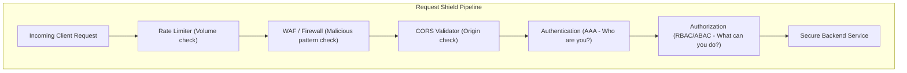
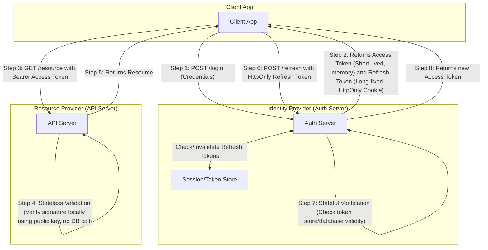
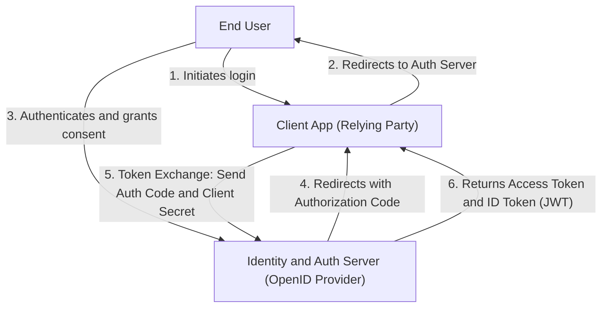

---
domains:
  - "security"
---

# Module 22: Access Control & API Security

This module covers identity verification and security hardening at the application and network layers, detailing authentication models, authorization frameworks, and common defense-in-depth mitigation strategies.

---

## 🗺️ Cognitive Map: How to Think About Security Guards

---

## 1. Access Management: AAA Foundation

Security systems rely on the AAA framework:
* **Authentication (AuthN):** Verification of identity (proves *who* the entity is).
- **Authorization (AuthR):** Verification of permissions (proves *what* the entity can do).
- **Accounting (Auditing):** Tracking and logging actions performed by authenticated users.

### A. Authentication Paradigms
- **Basic Authentication:** Credentials sent as Base64-encoded strings (`username:password`) in the `Authorization` header. Insecure without TLS encryption.
- **Digest Authentication:** Uses challenge-response hashing (MD5) to avoid transmitting credentials in plain text.
- **API Keys:** Unique identifier strings issued to consumers. Lightweight but requires database/caching lookups to invalidate selectively.
- **Session-Based Authentication:** Stateful. The server verifies credentials, generates a session record in a memory store (e.g. Redis), and returns a session ID in a browser cookie. The server must check the session database on every request.
- **Token-Based Authentication (JWT):** Stateless. The server returns a signed JSON Web Token (JWT). The client includes it in the `Authorization: Bearer <token>` header. The server verifies the token signature cryptographically using a public/private key or shared secret, eliminating database lookups.
  - *Access vs. Refresh Tokens:* Short-lived access tokens (e.g. 15 minutes) reduce leak window. Long-lived refresh tokens (stored in secure `HttpOnly` cookies) are checked against a stateful store to renew access tokens.

### B. Authorization Models
- **Role-Based Access Control (RBAC):** Permissions are bound to logical roles (e.g. `admin`, `editor`, `reader`), and users are assigned to roles. Highly audit-friendly.
- **Attribute-Based Access Control (ABAC):** Evaluates attributes of the subject, resource, and context (e.g. "Department = Finance", "Resource = Secret", "Time = Working Hours"). Extremely flexible but complex to implement.
- **Access Control Lists (ACL):** Associates individual permissions directly with specific resources (e.g. file read/write permissions mapped per user ID).

### C. OAuth 2.0 & OpenID Connect (OIDC)
- **OAuth 2.0:** A delegated authorization framework. Allows third-party client applications to access API scopes on a user's behalf without credentials sharing (trades authorization codes for access tokens).
- **OpenID Connect (OIDC):** An identity verification layer built on top of OAuth 2.0. Adds an `id_token` (JWT format containing user profile info) to verify user authentication.

---

## 2. Infrastructure & API Hardening

1. **Rate Limiting:** Protects systems from brute-force and Denial of Service (DDoS) requests by capping request count per client IP or session (e.g. using Token Bucket or Leaky Bucket algorithms).
2. **CORS (Cross-Origin Resource Sharing):** A browser-enforced security mechanism restricting which external origins can query your API. Enforced via HTTP handshake headers (`Access-Control-Allow-Origin`).
3. **Injection Defenses:** Prevents SQL/NoSQL Injection by separating database queries from parameter data using Parameterized Queries or ORM mapping.
4. **Firewalls & WAFs:** Web Application Firewalls inspect HTTP headers, payloads, and cookies to block known attack vectors (e.g. SQLi strings, XSS payloads).
5. **VPNs & Network Segregation:** Isolates internal admin APIs behind virtual private networks, blocking public-internet routing.
6. **CSRF (Cross-Site Request Forgery):** Prevents session hijack commands by verifying custom CSRF tokens sent in headers alongside cookies.
7. **XSS (Cross-Site Scripting):** Sanitizes user-generated inputs to prevent malicious scripts from executing in client browsers, and protects sensitive cookies via `HttpOnly` flags.

---

## 🛠️ Hands-on Verification Project

To verify and inspect the complete, production-grade hands-on configuration files for security hardening (Nginx rate limits, CORS response headers, parameterized backend SQL queries, JWT parsing), refer to:
- [[Projects/Systems Design/Project - Secure Load-Balanced Web API.md#1-nginx-load-balancer-and-gateway-configuration-nginxconf|Nginx rate limiting and CORS configuration]]
- [[Projects/Systems Design/Project - Secure Load-Balanced Web API.md#2-secure-api-web-server-python---fastapi|SQL Parameterization and JWT verify token verification logic]]
