---
domains:
  - "aws"
class: reference-note
tier: reference-note
tags:
  - aws/loadbalancing
---

# Module 3-10: AWS Elastic Load Balancing (ELB)

## 1. Core Topologies & Features
Elastic Load Balancing (ELB) automatically distributes incoming application traffic across multiple targets (such as EC2 instances, containers, IP addresses, and Lambda functions) in one or more Availability Zones to ensure scalability and high availability.

### A. Regional Construct
- ELB is a **REGIONAL** construct. It cannot natively distribute traffic across multiple AWS Regions (for multi-region topologies, Route 53 DNS routing or AWS Global Accelerator must be fronted).
- Amazon recommends deploying ELB nodes across a minimum of **two Availability Zones** in the target region.
- When you configure the load balancer, you specify the subnets in each AZ. For internet-facing load balancers, the enabled subnets **must be public subnets** (containing a route to an Internet Gateway) because AWS creates Elastic Network Interfaces (ENIs) with public IP addresses in those subnets to receive client traffic.

### B. Internet-Facing vs. Internal Load Balancers
- **Internet-Facing ELB:** Exposes a public DNS name. Nodes have public IP addresses and route requests from clients over the internet to targets (which can be in public or private subnets).
- **Internal ELB:** Exposes a private DNS name. Nodes have private IP addresses and route requests from clients within the VPC (or peered networks) to targets in private subnets.

---

## 2. Load Balancer Types
AWS provides four managed load balancer types, each operating at a different layer of the OSI model:

```mermaid
flowchart TD
    subgraph ALB_Flow ["Application Load Balancer (ALB) - Layer 7 HTTP/HTTPS/WebSockets"]
        C1["Client Request (HTTP/HTTPS)"] --> ALB_L["ALB Listener (Ports 80/443)"]
        ALB_L --> ALB_R{"Routing Rules (Host/Path/Header)"}
        ALB_R -->|"/users"| TG_Users["Target Group: Users (EC2/ECS)"]
        ALB_R -->|"/search"| TG_Search["Target Group: Search (IP/Lambda)"]
    end

    subgraph NLB_Flow ["Network Load Balancer (NLB) - Layer 4 TCP/UDP/TLS"]
        C2["Client Connection (TCP/UDP/TLS)"] --> NLB_L["NLB Listener (Ports 1-65535)"]
        NLB_L --> NLB_TG["Target Group (EC2/IP/ALB)"]
    end

    subgraph GWLB_Flow ["Gateway Load Balancer (GWLB) - Layer 3 IP Packets"]
        C3["Internet / Ingress Traffic"] --> IGW["Internet Gateway / Route Table"]
        IGW --> GWLBE["GWLB Endpoint (VPC Endpoint)"]
        GWLBE --> GWLB["Gateway Load Balancer"]
        GWLB -->|GENEVE Port 6081| VA_TG["Virtual Appliance TG (IDS/IPS/Firewall)"]
        VA_TG -->|Inspect and Return| GWLB
        GWLB --> GWLBE
        GWLBE --> App["App EC2 Instance"]
    end
```

### A. Classic Load Balancer (CLB) - *Legacy / Deprecated*
- **Layer:** Layer 4 (TCP/SSL) and Layer 7 (HTTP/HTTPS).
- **Targets:** EC2 Instances (classic mode).
- **Evolutionary Context:** Released in 2009. AWS deprecated CLB and strongly advises against using it. It requires one CLB per application/domain, does not support host/path-based routing, lacks Server Name Indication (SNI), and does not support modern target types like Lambda or ECS task IP addresses.

### B. Application Load Balancer (ALB) - *Modern Layer 7*
- **Layer:** Layer 7 (HTTP, HTTPS, and HTTP/2, WebSockets).
- **Targets:** EC2 instances, ECS tasks, Lambda functions, or private IP addresses.
- **Routing Capabilities:** Path-based (`/users`), Host-based (`offers.example.com`), Query String parameters (`?platform=mobile`), HTTP headers, request methods, and source IP CIDRs.
- **Features:** Supports slow start mode, AWS WAF integration, and dual-stack (IPv4 and IPv6) DNS resolution.

### C. Network Load Balancer (NLB) - *Layer 4 High-Performance*
- **Layer:** Layer 4 (TCP, UDP, and TLS).
- **Targets:** EC2 instances, private IP addresses, or Application Load Balancers (ALBs).
- **Performance:** Designed to handle millions of requests per second with ultra-low latency (sub-millisecond).
- **IP Topology:** Provides a **single static IP address per enabled Availability Zone**. You can optionally assign an Elastic IP (EIP) to each AZ, which is critical for firewalls that require whitelisting specific IP ranges.

### D. Gateway Load Balancer (GWLB) - *Layer 3 Virtual Appliances*
- **Layer:** Layer 3 (IP packets).
- **Targets:** Third-party virtual security, firewall, intrusion detection/prevention systems (IDS/IPS), or deep packet inspection appliances.
- **Protocol:** Uses the **GENEVE protocol** on **port 6081** to encapsulate the original IP packets, allowing transparent inspection before forwarding to application subnets via Gateway Load Balancer Endpoints (GWLBEs).

---

## 3. Target Groups, Listeners, & Health Checks

### A. Target Groups
A Target Group is a logical grouping of targets.
- **Target Types:**
  - `instance`: Registers targets by EC2 instance ID.
  - `ip`: Registers private IP addresses (e.g., peered VPC targets, on-premises servers via VPN/Direct Connect).
  - `lambda`: For ALB, forwards requests to AWS Lambda.
  - `alb`: For NLB, routes traffic to an ALB, combining static IPs with complex Layer 7 routing.
- Targets can be registered with a target group multiple times using different ports.

### B. ELB Listeners & Routing Rules
A listener is a process running on the ELB that checks for connection requests matching its configured port and protocol.
- **ALB Routing Rules:**
  - Rules are configured on listeners to route matching requests to specific Target Groups.
  - Rules consist of **conditions** (Path, Host, Query String, Header, Method, Source IP) and **actions** (Forward, Redirect to URL, Return fixed response like a custom 404).
  - Rules are evaluated sequentially from top to bottom based on **priorities** (1 to 50,000). The first matching rule executes.
  - Every listener must have a **default rule** to catch traffic that does not match any custom rule.

### C. Health Checks
- Health checks are defined at the **Target Group level**.
- They are performed by the ELB nodes sending periodic requests (e.g., HTTP `GET /health` or TCP connect) to targets.
- If a target fails to respond with a success code (such as HTTP `200 OK`) within the configured timeout for a set number of consecutive checks, it is marked as **unhealthy**.
- **Fails-Open Behavior:** If *all* targets in all enabled Availability Zones are marked unhealthy, the ELB does not drop the traffic. Instead, it "fails open" and routes requests to **all targets** across the fleet in the hope that some are responsive.

---

## 4. Advanced Networking & Session Features

### A. Security Groups
- **ALB & CLB:** Security groups can be attached to filter inbound traffic (e.g., allow HTTP/HTTPS from `0.0.0.0/0`).
- **NLB:** Security groups are supported (added in 2023). NLB security groups filter incoming Layer 4 connections.
- **Target Instance SGs:** To secure backend EC2 instances, configure their Security Groups to allow inbound traffic **only from the Security Group of the Load Balancer** (referencing the Security Group ID as the source). This leverages the stateful nature of security groups, blocking direct access from the internet.

### B. Client IP Address Propagation
Because ELB terminates client connections and establishes new ones to downstream targets, the target instances see the ELB private IP as the source. Client IP is preserved as follows:
- **Layer 7 (ALB/CLB):** Client IP is injected into the HTTP header **`X-Forwarded-For`**. The port and protocol are passed in **`X-Forwarded-Port`** and **`X-Forwarded-Proto`**.
- **Layer 4 (NLB/CLB):** Uses **Proxy Protocol v2** to prepend client connection data inside the TCP payload.
  - *Automatic Preservation:* If you register EC2 targets by **Instance ID** on the NLB, the NLB preserves the original client IP and port automatically, making Proxy Protocol unnecessary. It is required when registering targets by **IP address**.

### C. Cross-Zone Load Balancing
- **Definition:** Distributes incoming traffic evenly across all registered targets in all enabled Availability Zones, rather than just the targets in the same zone as the active ELB node.
- **ALB:** Enabled by default. No charges apply for inter-AZ data transfer. Can be forced on/off/inherited at the target group level.
- **NLB & GWLB:** Disabled by default. If enabled, inter-AZ data transfer is chargeable.
- **CLB:** Disabled by default. If enabled, no charges apply for inter-AZ data transfer.

### D. Connection Draining (Deregistration Delay)
Allows in-flight requests to complete when an instance is deregistered or marked unhealthy.
- **Naming Conventions:** Named **Connection Draining** in Classic Load Balancer (CLB), and **Deregistration Delay** in Application Load Balancer (ALB) and Network Load Balancer (NLB).
- **Behavior:** Once an instance begins draining, the ELB stops sending new requests to it. It remains in a draining state until active connections finish or the configured delay timeout is reached, after which remaining sessions are dropped.
- **Configuration:** Can be configured from 0 to 3,600 seconds (1 hour). The default is 300 seconds. Setting the delay to 0 disables it completely.
- **Tuning Trade-offs:**
  - *Short Delay (e.g., 30s):* Ideal for short-lived requests (less than 1s) to allow rapid instance decommissioning, scaling-in, and auto-replacement.
  - *Long Delay:* Necessary for applications with long-lived active sessions (e.g., file uploads, streaming, websockets), but delays the decommission and auto-scaling cycle.

### E. Session Affinity (Sticky Sessions)
Session stickiness binds a client session to a specific backend instance, ensuring all consecutive requests from that client route to the same target.
- **Support & Scope:** Configured at the target group level. Supported by CLB, ALB, and NLB.
- **Drawbacks:** Can lead to load imbalances if certain client sessions generate highly disproportionate traffic or are very long-lived. It is not fault-tolerant (if the target instance fails, session data is lost unless replicated).
- **Cookie Types:**
  - **Application-Based Cookies:**
    - *Custom Cookie:* Generated by the target application itself with custom attributes. The cookie name must be defined individually for each target group. The names `AWSALB`, `AWSALBAPP`, and `AWSALBTG` are reserved and cannot be used.
    - *Application Cookie:* Generated by the load balancer itself (ALB name: `AWSALBAPP`).
  - **Duration-Based Cookies:**
    - Generated by the load balancer itself (ALB name: `AWSALB`, CLB name: `AWSELB`). Session affinity expires after a specific duration generated by the load balancer.

---

## 5. SSL/TLS Certificates & Encryption

### A. SSL Offloading (TLS Termination)
- **Concept:** The ELB terminates TLS/HTTPS sessions from clients, decrypts the traffic, and forwards clear text (HTTP/TCP) to the backend instances over the secure private VPC network.
- **Advantages:** Offloads compute-intensive cryptographic operations from backend instances, saving CPU cycles. Simplifies certificate management by centralizing certificates in AWS Certificate Manager (ACM).

### B. TCP Passthrough (End-to-End Encryption)
- **Concept:** The ELB forwards encrypted SSL/TLS packets directly to the backend instances without decrypting them.
- **Advantages:** Ensures end-to-end in-transit encryption. Required for strict compliance standards (e.g., PCI-DSS, HIPAA).
- **Disadvantages:** Each backend EC2 instance must manage its own certificate and perform decryption, increasing CPU overhead.

### C. Server Name Indication (SNI)
- **Problem Solved:** Allows hosting multiple websites, each with its own SSL/TLS certificate, behind a single load balancer endpoint.
- **Mechanism:** The client specifies the hostname it wants to connect to in the initial TLS handshake. The ELB reads this hostname and loads the corresponding SSL certificate.
- **Support:** Supported by ALB, NLB, and CloudFront. It is **NOT** supported by CLB (CLB supports only a default certificate).
- **Configuration:** You specify a default certificate on the HTTPS listener, then add optional certificates to the SNI list.

### D. Perfect Forward Secrecy (PFS)
- PFS uses ephemeral session keys that are generated dynamically for each session and are not stored. This ensures that even if the server's private key is compromised, historical captured traffic cannot be decrypted.
- Enabled by selecting an ELB SSL Negotiation Policy that utilizes Elliptic Curve Diffie-Hellman Ephemeral (ECDHE) cipher suites.

---

## 6. ELB Monitoring & Logging
ELB integrates with several AWS services for observability:
- **CloudWatch:** Sends metrics (such as `RequestCount`, `TargetResponseTime`, `HTTPCode_Target_5XX_Count`) every minute by default if traffic flows through the ELB nodes.
- **CloudTrail:** Records API calls made to the ELB service (e.g., creation, modification, target registration).
- **Access Logs:** Captures detailed logs of requests sent to the load balancer (Client IP, protocol, user agent, target IP, response latency). Disabled by default; logs are stored in an S3 bucket.

---

## 7. Deep-Intuition (AARF) Breakdowns

### AARF Breakdown: SSL Offloading vs. TCP Passthrough
1. **The Answer (Core Pattern):** Terminate TLS sessions at the load balancer (SSL Offloading) using certificates managed by AWS Certificate Manager (ACM). Transition to TCP Passthrough only when end-to-end encryption to the host is required for compliance (e.g., PCI-DSS, HIPAA).
2. **The Assumptions (Context):** The client to ELB path is encrypted. In SSL Offloading, the ELB to backend instance path is unencrypted HTTP over the private network.
3. **The Rationale (Why):** SSL Offloading offloads the compute-intensive TLS handshake and decryption CPU cycles from backend application servers, simplifying certificate rotation. TCP Passthrough (utilizing NLB) forwards encrypted packets directly to the EC2 instances, requiring each instance to manage its own certificate and perform decryption.
4. **The Failure Loop (What if not):** Implementing TCP Passthrough on web applications with large numbers of short-lived connections causes high CPU utilization on EC2 instances due to constant TLS negotiations, necessitating larger instance sizes and increasing overall compute costs.
5. **Alternative Case (When to use 'if not'):** For regulated workloads requiring zero plaintext data transmission over any network segment, implement TCP Passthrough with backend TLS termination.
