```mermaid
flowchart TD
    subgraph Launch_Hook ["ASG Instance Launch Hook Flow"]
        L1["ASG Trigger: Scale Out / Launch Instance"] --> L2["State: Pending:Wait"]
        L2 --> L3{"Custom Action Execution"}
        L3 -->|"Trigger EventBridge/Lambda/SSM"| L4["Custom Action (Software Install, Config)"]
        L4 --> L5["Send API: CompleteLifecycleAction"]
        L2 -->|"Default Timeout (1 Hour)"| L6["Timeout Reached"]
        L5 --> L7{"Result Decision"}
        L6 --> L7
        L7 -->|"CONTINUE"| L8["State: Pending:Proceed"]
        L7 -->|"ABANDON"| L9["Terminate and Replace Instance"]
        L8 --> L10["State: InService (Healthy)"]
    end

    subgraph Terminate_Hook ["ASG Instance Terminate Hook Flow"]
        T1["ASG Trigger: Scale In / Terminate Instance"] --> T2["State: Terminating:Wait"]
        T2 --> T3{"Custom Action Execution"}
        T3 -->|"Trigger EventBridge/Lambda/SSM"| T4["Custom Action (Log Export, Data Backup)"]
        T4 --> T5["Send API: CompleteLifecycleAction"]
        T2 -->|"Default Timeout (1 Hour)"| T6["Timeout Reached"]
        T5 --> T7{"Result Decision"}
        T6 --> T7
        T7 -->|"CONTINUE / ABANDON"| T8["State: Terminating:Proceed"]
        T8 --> T9["State: Terminated (Cleaned Up)"]
    end
```

---
domains:
  - "aws"
class: reference-note
tier: reference-note
tags:
  - aws/autoscaling
---

# Module 3-11: AWS Auto Scaling Groups (ASG)

## 1. Scalability & Elasticity

### A. Scalability
Scalability refers to a system's ability to handle the growth of load by adapting resources.
- **Vertical Scaling (Up/Down):** Increasing or decreasing the size/specification of an individual instance (e.g., upscaling an EC2 instance from a `t2.micro` to a `t2.large`). Common for non-distributed systems like databases (RDS, ElastiCache), but restricted by physical hardware limits.
- **Horizontal Scaling (Out/In):** Increasing or decreasing the number of instances/systems (also called **elasticity**). This requires a distributed system architecture and is highly standard for modern web applications.

### B. Elasticity
Elasticity is the ability of a system to provision and deprovision compute resources **automatically** so that the running fleet closely matches the real-time demand.
- In AWS, this is natively implemented for EC2 instances using **Auto Scaling Groups (ASG)**.
- **Bootstrapping Latency Warning:** Horizontal scaling is not instantaneous. Triggers must wait for CloudWatch alarm evaluations, and newly launched instances can take several minutes to initialize, run user data scripts, and become healthy. If traffic spikes are extremely brief (e.g., less than 5 minutes), horizontal scaling will react too slowly, requiring vertical headroom or caching to maintain fault tolerance.

---

## 2. Auto Scaling Group (ASG) Core Concepts
An ASG is a logical grouping of managed EC2 instances. It manages the fleet lifecycle, automatically scaling instances out or in based on configured parameters.

### A. Capacity Settings
- **Min Size (Minimum Capacity):** The minimum number of instances that must run in the group at all times.
- **Desired Capacity:** The starting or targeted number of instances. The ASG launches or terminates instances to maintain this number unless dynamic scaling policies override it.
- **Max Size (Maximum Capacity):** The absolute ceiling for the group size, preventing runaway costs.

### B. ASG Integration Features
- **Load Balancer Integration:** ASG targets are automatically registered with a Load Balancer's Target Group. As instances scale out, they receive traffic from the ELB automatically.
- **Auto-healing:** If an instance is terminated manually or is marked unhealthy by health checks, the ASG automatically terminates the faulty instance and launches a new one to replace it.
- **Cost:** The ASG service itself is free. You pay only for the underlying EC2 instances, EBS volumes, and monitoring resources launched.

---

## 3. Configuration Components

### A. Launch Templates vs. Launch Configurations
To launch instances, the ASG requires a blueprint defining the instance specifications.

- **Launch Configurations (Deprecated):** The legacy method. They are immutable (cannot be modified after creation, requiring a new configuration for any changes) and do not support versioning or modern EC2 features.
- **Launch Templates (Recommended):** The modern standard.
  - **Parameters Defined:** AMI, instance type, EC2 user data (bootstrapping scripts), EBS volumes, security groups, SSH key pairs, IAM roles, and network settings.
  - **Key Advantages:**
    - Supports **versioning** (allows easy upgrades or rollbacks to previous templates).
    - Supports mixed **instance types** (e.g., combining different instance sizes to satisfy demand).
    - Can combine **On-Demand and Spot instances** inside the same group to optimize costs.
    - Supports placement groups and zonal shifts.
    - *Note:* Subnets are configured at the **Auto Scaling Group level**, not in the launch template, to ensure network flexibility.

### B. Health Check Settings
By default, the ASG determines instance health using **EC2 status checks** (hypervisor and system ping tests).
- **ELB Health Checks:** You can enable the ASG to also use health checks from the attached **Elastic Load Balancer (ELB)**.
- **Behavior:** If ELB health checks are enabled, the instance is marked unhealthy and replaced if *either* the EC2 status check or the ELB health check returns a negative response.
- **Grace Period:** Configure a health check grace period (default: 300 seconds) to prevent the ASG from terminating newly launched instances before they finish bootstrapping.

---

## 4. Scaling Policies & Types
Scaling policies determine when and how the capacity of the group changes.

### A. Manual Scaling
- Maintaining a fixed capacity by manually adjusting the desired capacity in the console or CLI, or attaching/detaching specific instances.

### B. Scheduled Scaling
- Scales based on predictable, recurring usage patterns.
- Pre-scheduled events change capacity ahead of known load changes (e.g., scale up to 10 instances every Friday at 5:00 PM and scale down to 2 instances on Monday at 8:00 AM).

### C. Dynamic Scaling
Scales in response to metric thresholds evaluated by CloudWatch.
- **Target Tracking Scaling:**
  - The most common dynamic policy. You specify a target metric and value (e.g., maintain average CPU utilization at 40%, or request count per target at 1,000).
  - AWS automatically creates two CloudWatch alarms in the background:
    - **`AlarmHigh` (Scale Out):** Triggers when the metric exceeds the target value, causing the ASG to add instances.
    - **`AlarmLow` (Scale In):** Triggers when the metric falls below the target, causing the ASG to terminate instances.
- **Step Scaling:**
  - Scales in response to CloudWatch alarms using step adjustments based on the size of the metric breach.
  - *Example:* If CPU > 50%, add 1 instance; if CPU > 70%, add 3 instances; if CPU > 85%, add 5 instances.
- **Simple Scaling:**
  - Legacy policy. Scales by a single adjustment (e.g., add 2 instances) when a single CloudWatch alarm triggers.
  - *Constraint:* Disables further scaling actions until the cooldown period expires, which is less responsive than step scaling.

### D. Predictive Scaling
- Uses machine learning to continuously analyze historical load patterns, forecast future load, and proactively schedule scaling actions ahead of time.
- Highly effective for cyclical applications with repeating weekly or daily demand patterns.

---

## 5. Lifecycle Hooks, Cooldowns, & Tuning

### A. Lifecycle Hooks
Lifecycle hooks enable performing custom administrative actions by pausing instances as they transition between pending and terminating states.
- **Wait States:** The instance is paused in a `Pending:Wait` or `Terminating:Wait` state.
- **Heartbeat Timeout:** The instance remains paused until a custom action signals completion via the `CompleteLifecycleAction` API, or the default heartbeat timeout (3,600 seconds / 1 hour) is reached.
- **Typical Use Cases:**
  - *On Launch:* Run custom software setup, verify database connection availability, configure networking.
  - *On Terminate:* Export logs to Amazon S3, drain active client sessions, back up data state.
- **Outcomes:**
  - `CONTINUE`: Proceeds with the launch or termination.
  - `ABANDON`: Stops the launch (terminates and replaces the instance) or proceeds with the termination.

### B. Scaling Cooldown vs. Instance Warm-up
- **Scaling Cooldown:** The period (default: 300 seconds) after a scaling activity during which the ASG will not execute additional scaling actions. This allows metrics to stabilize and prevents rapid, runaway scaling (flapping).
  - *Cooldown Advice:* To make scaling more responsive, use **ready-to-use AMIs** (Golden AMIs) rather than performing heavy configuration at startup. This drastically reduces bootstrapping time, allowing you to safely decrease the cooldown period for faster scaling responses.
- **Instance Warm-up:** The time a newly launched instance needs before it is considered ready to contribute data to the group's CloudWatch metrics.

### C. Detailed Monitoring Tip
- Enable **detailed monitoring** (1-minute intervals) for your ASG instances. By default, basic monitoring runs on 5-minute intervals. Detailed monitoring ensures CloudWatch detects metric changes faster, triggering scaling actions with minimal delay.

---

## 6. Termination Policies
When a scale-in event occurs, the ASG decides which instance to terminate first using a default hierarchy:
1. **Balance Availability Zones:** Selects the AZ with the most instances to keep the group balanced across subnets.
2. **Launch Configuration vs. Launch Template:** If there is a mix of instances, it terminates instances launched via a **Launch Configuration** first, forcing migration to Launch Templates.
3. **Oldest Configuration Version:** Selects instances launched with the oldest Launch Configuration or oldest version of the Launch Template.
4. **Billing Hour Proximity:** Selects the instance that is closest to the next billing hour (this was historically used to minimize EC2 charges, though EC2 is now billed per-second for most OS versions).

### A. Scale-in Instance Protection
- You can protect specific instances from being automatically terminated during scale-in by enabling **Scale-in instance protection** at the instance level.
- *Exceptions:* Instance protection does **not** protect instances from manual termination, auto-replacement if they fail ASG health checks, or Spot instance interruptions.
