---
domains:
  - "aws"
class: reference-note
tier: reference-note
tags:
  - aws/autoscaling
---

# Module 3-11: AWS Auto Scaling Groups (ASG)

## Scalability & Elasticity
### Scalability 
- Scalability refers to system's ability to handle the growth of load by adding resources.
- This scaling can be vertical scaling (up/down) or horizontal scaling(out/in).
 
### Elasticity 
  
- Elasticity describes the system ability to provision &  deprovision resources **automatically** to ensure that resources matches the need. 
- **Auto scaling groups can be configured for EC2 instances**, There  are another auto scaling type called Application Autoscaling will be covered later 
- **Autoscaling is always accompanied with load balancer** in design to ensure high availability  

> [!NOTE]
> - Remember we need to take in consideration the time need for horizontal scaling to start executing it needs triggers from cloud watch and autoscaling groups health checks then start in creating the EC2 instances and EC2 instance may need Minutes to initialize so if it was a 1 min spike in traffic, The application has failed to be fault tolerant we tackle more of this in later videos  

![[Pasted image 20250512092901.png]]

---

## 3. Auto Scaling Groups (ASG) Deep Dive
ASGs dynamically scale EC2 fleets based on CPU, network, or custom CloudWatch metrics.

### A. Lifecycle & Metrics

---

## Application Auto Scaling
Application Auto Scaling is a web service for automatically scaling resources for services beyond Amazon EC2. 
- It can be used with Auto Scaling and EC2 Auto Scaling to scale resources across multiple services including:
	- ECS services 
	- Spot Fleet requests
	- EMR Clusters 
	- AppStream 2.0 fleets
	- Aurora Replicas DynamoDB Read and Write Capacity units
	- SageMaker endpoints
	- Amazon Comprehend

---

## EC2 Auto Scaling
- It's a Regional service
- It can span multiple Availability Zones in the same AWS Region.
- It integrates with ELB, CloudWatch, and Cloud Trail.
- It is free to use, but customers pay only for EC2 and EBS resources used. 
- ASG will try to balance resources across Availability Zones.
- The EC2 Auto Scaling configuration components are:
	 - ##### An Auto Scaling Group 
		- Is the logical grouping of managed instances.
		- Desired no. is the starting no. of instances to launch.
	- ##### A Launch Configuration (or A Template)
		- The template for instance configurations. 
	- ##### A Scaling Policy (Plan) 
		- Defines the when and how to scale out or in.

### EC2 Auto Scaling: Launch Templates vs. Launch Configurations
- **Launch Configurations (Deprecated):** Legacy method to define instance configurations. They cannot be modified or versioned (requiring creating a new one each time) and do not support modern EC2 features.
- **Launch Templates (Recommended):** Modern standard.
  - **Features Defined:** Contains AMI, instance type, EC2 user data, EBS volumes, security groups, SSH key pairs, IAM roles, and network interface settings.
  - **Key Advantages:**
    - Supports multiple **versions** (allowing easy rollbacks or updates).
    - Supports mixed **instance types** (e.g., launching both `t3.medium` and `c5.large` to meet demand).
    - Can combine **On-Demand and Spot instances** in the same Auto Scaling Group.
    - Allows specifying placement groups.
    - *Note:* Subnets are configured at the **Auto Scaling Group level**, not within the launch template, to ensure network flexibility.

### EC2 Auto Scaling: Health Checks
![[Pasted image 20250626164334.png]]
By default the EC2 Auto Scaling service determines if the instance is running or not via EC2 status check, even with ELB applied.
- This can be changed when creating Auto Scaling Group in the console to wait for EC2 status check ***AND*** the ELB health checks.
- If either of the two checks states a negative response, the instance is terminated.

### EC2 Auto Scaling: Scaling Policies & Types
![[Pasted image 20250626164350.png]]
Auto Scaling policy types define when and how the fleet changes size:

##### 1- Manual Scaling
- Maintain a specific number of instances.
- Manually change the Min/Desired/Max capacities or manually attach/detach EC2 instances.

##### 2- Scheduled Scaling
- Scales based on predictable, cyclical usage patterns.
- Pre-scheduled scaling events add capacity ahead of known load spikes (e.g., scale up to 10 instances every Friday at 5:00 PM) and scale down afterward.

##### 3- Dynamic Scaling
- Scales in and out dynamically in response to CloudWatch alarms/events.
- **Target Tracking Scaling:** 
  - The simplest and most common policy.
  - You specify a target value for a metric (e.g., keep average CPU utilization at 40%, or maintain a specific `RequestCountPerTarget` on the ALB).
  - ASG automatically adjusts capacity to keep the metric near the target.
- **Step Scaling:**
  - Scales in response to CloudWatch alarms with varying step adjustments based on the size of the breach.
  - *Example:* If CPU > 50%, add 1 instance; if CPU > 70%, add 3 instances.
- **Simple Scaling:**
  - A legacy policy. Scales by a single adjustment (e.g., add 2 instances) when a single CloudWatch alarm triggers.
  - *Constraint:* Requires waiting for a cooldown period to expire before responding to any further alarms, making it less responsive than step scaling.

##### 4- Predictive Scaling
- Uses machine learning to continuously analyze historical load patterns, forecast future load, and proactively schedule scaling actions ahead of time.
- Highly effective for cyclical applications with repeating demand cycles.

### EC2 Auto Scaling: Lifecycle Hooks
Lifecycle hooks enable performing custom administrative actions (such as configuring software, installing dependencies, or exporting logs/troubleshooting data) by pausing instances as they transition between lifecycle states (launching or terminating).

```mermaid
flowchart TD
    subgraph Launch_Hook ["ASG Instance Launch Hook Flow"]
        L1["ASG Trigger: Scale Out / Launch Instance"] --> L2["State: Pending:Wait"]
        L2 --> L3{"Custom Action Execution"}
        L3 -->|"Trigger EventBridge/Lambda/SSM"| L4["Custom Action (Software Install, Config)"]
        L4 --> L5["Send API: CompleteLifecycleAction"]
        L2 -->|"Default Timeout (1 Hour)"| L6["Timeout Reached"]
        L5 --> L7{"Result Decision"}
        L6 --> L7
        L7 -->|"CONTINUE"| L8["State: Pending:Proceed"]
        L7 -->|"ABANDON"| L9["Terminate and Replace Instance"]
        L8 --> L10["State: InService (Healthy)"]
    end

    subgraph Terminate_Hook ["ASG Instance Terminate Hook Flow"]
        T1["ASG Trigger: Scale In / Terminate Instance"] --> T2["State: Terminating:Wait"]
        T2 --> T3{"Custom Action Execution"}
        T3 -->|"Trigger EventBridge/Lambda/SSM"| T4["Custom Action (Log Export, Data Backup)"]
        T4 --> T5["Send API: CompleteLifecycleAction"]
        T2 -->|"Default Timeout (1 Hour)"| T6["Timeout Reached"]
        T5 --> T7{"Result Decision"}
        T6 --> T7
        T7 -->|"CONTINUE / ABANDON"| T8["State: Terminating:Proceed"]
        T8 --> T9["State: Terminated (Cleaned Up)"]
    end
```

- **Wait State:** When a lifecycle hook is triggered, the instance pauses in a `Pending:Wait` or `Terminating:Wait` state.
- **Duration:** It remains paused until a custom action signals completion via the `CompleteLifecycleAction` API, or the heartbeat timeout expires (default: 3,600 seconds / 1 hour).
- **Custom Actions:**
  - *On Launch:* Run installation scripts, download files, verify service startup.
  - *On Terminate:* Ship application logs to S3, drain active client sessions, backup state.
- **Hook Outcomes:**
  - `CONTINUE`: Proceeds with the launch or termination.
  - `ABANDON`: Stops the launch (terminates and replaces the instance) or proceeds with termination.

### EC2 Auto Scaling: Cooldown & Warm-up Periods
##### Cooldown Period
- After a scale-out or scale-in activity.
- Is the amount of time Auto Scaling waits after a scale-out or scale-in activity before another scale activity can start. 
- This help ensure that the impact of the scaling activity becomes visible.
##### Instance Warm-up Period
- After a scale out activity.
- Is the amount of time that elapses before a newly launched instance (due to a scale-out activity) begins contributing to CloudWatch metrics.
- Basically to allow new launched instances to start giving impact after fully launching.

### EC2 Auto Scaling: Scale-in Termination Protection
Instances can be protected from being automatically terminated during a scale-in event using Scale-in instance protection.
This setting can be changed at the Auto Scaling Group level.

However, this does not protect the instance from:
- Manual termination. 
- Replacement if it becomes unhealthy.
- Spot instance interruption.

### EC2 Auto Scaling: Termination Policy
Which Instance is to be terminated??

- The AZ with the larger number of EC2 instances is selected first for termination.
- If there is a mix of launch configuration and Launch Template instances, ones with launch configuration are selected first for termination.
- AS terminates the instance with the oldest launch configuration first.
- If they are all the same, AS terminates the one that is closest to billing hour.

---
