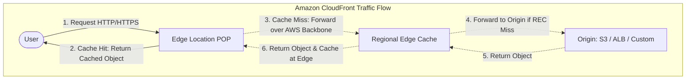
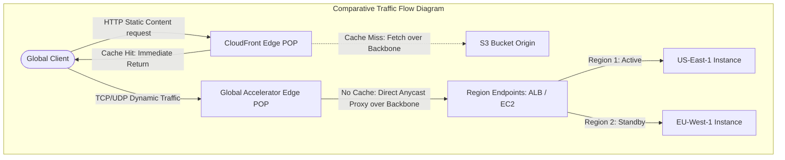

---
domains:
  - "aws"
class: reference-note
tier: reference-note
tags:
  - aws/cloudfront
---

# Module 3-13: AWS CloudFront CDN & AWS Global Accelerator

## 1. Amazon CloudFront Core Architecture

Amazon CloudFront is a fast, highly secure, and globally distributed Content Delivery Network (CDN) service that caches static and dynamic web content closer to users at global Edge Locations.

### A. Points of Presence (POPs)
CloudFront utilizes a two-tier caching architecture to optimize content delivery and reduce load on origin servers:
1.  **Edge Locations:** Hundreds of globally distributed points of presence (POPs) where content is cached and served directly to nearby users with low latency.
2.  **Regional Edge Caches:** Larger caching facilities located between Edge Locations and origin servers. They have larger storage capacities and hold content that is less frequently requested, preventing cache evictions from requiring a trip all the way back to the origin.

### B. Request Workflow (Cache Hit vs. Miss)
*   **Request Routing:** A user requests a resource (e.g., `https://example.com/image.png`). DNS routes the request to the geographically closest Edge Location.
*   **Cache Hit:** The Edge Location has the requested object in its cache and its TTL has not expired. The object is served directly to the user.
*   **Cache Miss:** The Edge Location does not have the object (or it has expired). The request is forwarded to the Regional Edge Cache or the Origin server over the private AWS global network. The origin returns the object; the Edge Location caches it locally for subsequent requests and returns it to the user.



### C. DDoS and Security Protection
By distributing incoming traffic across a global network of edge locations, CloudFront naturally absorbs massive volumetric traffic spikes.
*   **AWS Shield Standard:** Automatically enabled on all CloudFront distributions, providing Layer 3/4 DDoS protection.
*   **AWS WAF (Web Application Firewall):** Can be integrated with CloudFront to filter Layer 7 requests (e.g., blocking SQL injection, cross-site scripting (XSS), or specific IP address lists).

---

## 2. CloudFront Origins & Access Control

An origin is the backend resource containing the source of truth for the files served by CloudFront.

### A. Amazon S3 Origin with Origin Access Control (OAC)
To distribute static files from an S3 bucket securely:
*   **Origin Access Control (OAC):** Replaces the legacy Origin Access Identity (OAI). OAC secures the S3 origin by requiring all requests to be signed using AWS Signature Version 4 (SigV4).
*   **S3 Bucket Policy Restriction:** The S3 bucket permissions must be configured to deny all public access, allowing read (`s3:GetObject`) only to the CloudFront distribution's service principal:
    ```json
    {
      "Version": "2012-10-17",
      "Statement": [
        {
          "Sid": "AllowCloudFrontServicePrincipalReadOnly",
          "Effect": "Allow",
          "Principal": {
            "Service": "cloudfront.amazonaws.com"
          },
          "Action": "s3:GetObject",
          "Resource": "arn:aws:s3:::your-bucket-name/*",
          "Condition": {
            "ArnEquals": {
              "AWS:SourceArn": "arn:aws:cloudfront::YOUR_ACCOUNT_ID:distribution/YOUR_DISTRIBUTION_ID"
            }
          }
        }
      ]
    }
    ```

### B. VPC Origins (Private Backends)
A VPC Origin allows CloudFront to connect directly to private resources within a VPC without requiring public IP addresses:
*   **Supported Private Endpoints:** Private Application Load Balancers (ALBs), private Network Load Balancers (NLBs), or private EC2 instances.
*   **Architecture:** Traffic flows from the CloudFront Edge Location to a managed endpoint (VPC Origin) in your private subnets, securing traffic inside the AWS private network and eliminating public exposure risks.

### C. Custom HTTP Origins
Connects CloudFront to any custom HTTP server over the internet:
*   **Types:** Public ALBs, public EC2 instances, S3 buckets configured as static websites (requires the bucket's static website endpoint, not the REST API endpoint), or on-premises servers.
*   **Legacy Security Method:** To restrict access to custom origins so they only accept traffic from CloudFront, administrators had to download the published CloudFront global IP ranges JSON file and manually configure local Security Groups to whitelist those IPs. This approach is tedious, limits-constrained, and prone to configuration drift.

---

## 3. CloudFront Cache Behaviors

Cache Behaviors define how CloudFront handles requests for specific file paths:
*   **Path Patterns:** Allows setting different rules based on the request URL (e.g., `/images/*.jpg` routed to an S3 origin with a high cache TTL, while `/api/*` routed to an ALB with caching disabled).
*   **Protocol Policies:** Force HTTP to HTTPS redirection or restrict traffic to HTTPS only.
*   **HTTP Methods:** Restrict allowed methods (e.g., `GET, HEAD` vs. `GET, HEAD, OPTIONS, PUT, POST, PATCH, DELETE`).
*   **TTL Controls:** Set Minimum, Maximum, and Default Time-To-Live (TTL) values in seconds to control how long objects remain cached.
*   **Query String / Header / Cookie Forwarding:** Configure what parameters CloudFront forwards to the origin. Forwarding increases origin requests (reducing cache hit ratio) but is necessary for personalized content.

---

## 4. Geo Restriction

CloudFront can restrict content delivery based on the geographic location of the requester:
*   **Allow List:** Whitelists approved countries, blocking access to all others.
*   **Block List:** Blacklists banned countries, allowing access to all others.
*   **Mechanism:** Uses a third-party GeoIP database to map the client's public IP address to their country of origin.
*   **Use Cases:** Managing copyright distribution rights, regulatory compliance, and licensing.
*   **Configuration Constraints:** Full access to geographic restrictions and advanced WAF configurations is standard on Paid/Pay-As-You-Go plans, whereas standard routing features are active on Free/Basic tiers.

---

## 5. Cache Invalidation

When files are updated on the origin, CloudFront continues to serve the old cached versions from Edge Locations until their TTL expires. To update files immediately, a cache invalidation must be triggered:
*   **Invalidation Operation:** Removes specified objects from the edge caches immediately. The next user request results in a cache miss, forcing CloudFront to fetch the updated files from the origin.
*   **Path Patterns:**
    *   Specific File: `/index.html`
    *   Wildcard Directory: `/images/*`
    *   Entire Cache: `/*`

---

## 6. Signed URLs vs. Signed Cookies

To protect premium or private content (e.g., paid videos, documents, downloads), CloudFront can require users to present cryptographic signatures.

| Attribute | Signed URLs | Signed Cookies |
| :--- | :--- | :--- |
| **Scope** | Access to a single file / specific resource. | Access to multiple files or entire subdirectories. |
| **URL Formatting** | Signature parameters are appended directly to the query string (breaks clean URLs). | URL remains clean and unchanged. |
| **Client Type** | Best for clients that do not support cookies (e.g., mobile apps, IoT devices, media players). | Best for web browsers where cookies are natively managed. |
| **Implementation** | The application generates a unique signed URL for every file resource request. | The application sets cookies on the user's browser, allowing subsequent requests to the path. |

---

## 7. AWS Global Accelerator

AWS Global Accelerator is a networking service that improves the availability and performance of applications for global users by routing traffic over the AWS private global fiber network.

### A. Core Architecture & Anycast IPs
*   **Anycast IP Addresses:** Global Accelerator provides **two static Anycast IP addresses** for your application.
*   **IP Anycast Routing:** The static Anycast IPs are announced from multiple AWS edge locations worldwide. When global clients send traffic to these IPs, routers automatically direct packets to the geographically nearest edge location.
*   **AWS Backbone Transit:** From the edge location, the accelerator routes client TCP/UDP traffic directly over the high-speed, private AWS global network infrastructure to the endpoint application.
*   **Unicast vs. Anycast Comparison:**
    *   *Unicast IP:* One server owns one IP address. Clients must route directly to that specific machine (e.g., routing over many public internet hops to a load balancer in another region).
    *   *Anycast IP:* Multiple global locations share the same IP address. Clients connect to the closest edge point of presence, reducing public internet transit hops.

### B. Supported Endpoints
*   Elastic IP addresses.
*   Amazon EC2 instances (public or private).
*   Application Load Balancers (ALBs) (public or private).
*   Network Load Balancers (NLBs) (public or private).

### C. Traffic Features & Disaster Recovery
*   **Zero Client DNS Caching Issues:** Unlike DNS-based failover (which relies on clients honoring low TTLs), Global Accelerator failover does not depend on DNS updates. The two Anycast IP addresses never change.
*   **Health Checks & Rapid Failover:** Performs continuous health checks on regional endpoints. If an endpoint fails, the accelerator automatically shifts traffic to a healthy endpoint in another region in less than 30 seconds.
*   **Client Affinity (Session Sticky):** Routes subsequent traffic from a specific client IP to the same endpoint resource.

---

## 8. Comparative Analysis: CloudFront vs. AWS Global Accelerator

Both services leverage the AWS global network and points of presence to minimize latency, and both integrate with AWS Shield for DDoS mitigation. However, their use cases and traffic-handling methods differ:

| Dimension | Amazon CloudFront | AWS Global Accelerator |
| :--- | :--- | :--- |
| **Primary Goal** | Caching content to reduce latency and origin load. | Accelerating TCP/UDP paths over the private network. |
| **OSI Layer** | Layer 7 (HTTP/HTTPS content delivery). | Layer 4 (TCP/UDP socket traffic routing). |
| **Caching** | **Yes.** Caches images, videos, APIs, and HTML files at edge POPs. | **No.** Proxies all packets in real-time to the origin backend. |
| **IP Addresses** | Dynamic IP addresses resolved via DNS CNAME. | Two fixed, static Anycast IP addresses globally. |
| **Protocol Support** | Only HTTP, HTTPS, and WebSockets. | Any TCP/UDP traffic (HTTP, Gaming, VoIP, IoT, SIP). |
| **Failover Basis** | Cache settings, origin groups, DNS routing. | High-speed (sub-30s) IP Anycast endpoint redirection. |



---

## 9. Hands-On Lab Walkthroughs

### Lab A: CloudFront S3 Distribution with Origin Access Control (OAC)
1.  **S3 Bucket Configuration:**
    *   Create an S3 bucket named `demo-cloudfront-vault-cdn-v4`.
    *   Set access permissions: Disable "Block all public access" to ensure security, keeping all objects completely private.
    *   Upload three test files: `index.html`, `beach.jpeg`, and `coffee.jpg`.
    *   *Verify:* Attempting to access the objects using their direct S3 Object URLs returns `Access Denied`.
2.  **CloudFront Distribution Setup:**
    *   Navigate to CloudFront Console, click **Create Distribution**.
    *   **Origin Domain:** Choose the S3 bucket `demo-cloudfront-vault-cdn-v4.s3.amazonaws.com`.
    *   **Origin Access:** Select **Origin Access Control (OAC)** (Recommended). Create a new control setting and choose the signature behavior.
    *   **Cache Behavior:** Set Allowed HTTP Methods to `GET, HEAD`. Select Redirect HTTP to HTTPS.
    *   **WAF:** Disable Web Application Firewall to avoid lab costs.
    *   **Deployment:** Save changes. CloudFront displays an alert prompt containing the generated S3 bucket policy. Copy this policy.
3.  **Applying Bucket Policy:**
    *   Return to the S3 bucket's **Permissions** tab.
    *   Edit the **Bucket Policy** and paste the copied JSON policy, which authorizes the CloudFront distribution service principal (`cloudfront.amazonaws.com`) to read bucket objects.
4.  **Verification:**
    *   Once the distribution status transitions to *Deployed*, copy the CloudFront Domain Name (e.g., `d111111abcdef8.cloudfront.net`).
    *   Navigate to `https://d111111abcdef8.cloudfront.net/index.html` in a web browser. The page and the embedded private images load successfully.
    *   Repeated reloads load instantaneously, demonstrating edge caching behavior.

### Lab B: Multi-Region Failover with AWS Global Accelerator
1.  **Multi-Region Infrastructure Provisioning (Compute Layer):**
    *   Launch an EC2 instance in region **US-East-1**:
        *   AMI: Amazon Linux 2023. Instance Type: `t3.micro`.
        *   Security Group: Allow HTTP (Port 80) from Anywhere.
        *   User Data Script:
            ```bash
            #!/bin/bash
            dnf install -y httpd
            systemctl start httpd
            systemctl enable httpd
            echo "Hello World from EC2 in US-East-1" > /var/www/html/index.html
            ```
    *   Launch a matching EC2 instance in region **EU-West-1** with User Data:
            ```bash
            #!/bin/bash
            dnf install -y httpd
            systemctl start httpd
            systemctl enable httpd
            echo "Hello World from EC2 in EU-West-1" > /var/www/html/index.html
            ```
    *   *Verify:* Confirm that both instances are reachable directly via their public IPs and display their respective regional welcome pages.
2.  **Accelerator Creation:**
    *   In the Global Accelerator console, click **Create Accelerator**.
    *   Name: `DemoStandardAccelerator`. Type: Standard.
    *   **Listeners:** Add a listener on Port `80` using protocol `TCP`. Set Client Affinity to `None`.
    *   **Endpoint Groups:** Create two endpoint groups for the port 80 listener:
        1.  Group 1: Region `us-east-1` (US East).
        2.  Group 2: Region `eu-west-1` (EU Ireland).
    *   **Configure Endpoints:**
        *   Under the `us-east-1` group, add an endpoint type **EC2 Instance** and select the US-East-1 EC2 instance.
        *   Under the `eu-west-1` group, add an endpoint type **EC2 Instance** and select the EU-West-1 EC2 instance.
    *   **Health Checks:** Configure HTTP health checks on path `/` on Port `80` with an evaluation interval of 10 seconds and an unhealthy threshold of 2.
3.  **Verification & Traffic Routing:**
    *   AWS provisions the accelerator and assigns **two static Anycast IP addresses** (e.g., `15.197.x.x` and `3.33.x.x`).
    *   Access the Anycast IP from a local browser in Europe. The page returns "Hello World from EC2 in EU-West-1" due to routing to the closest geographical POP.
    *   Activate a VPN connection routed through the United States. Refresh the same Anycast IP. The page updates to "Hello World from EC2 in US-East-1".
4.  **Resource Cleanup:**
    *   Disable the `DemoStandardAccelerator` in the AWS console, then delete it to release the static Anycast IPs.
    *   Terminate both EC2 instances in US-East-1 and EU-West-1.
