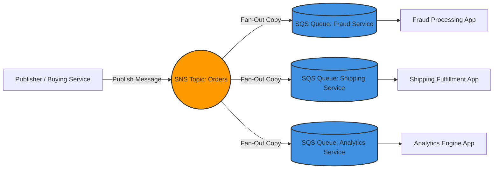

---
domains:
  - "aws"
class: reference-note
tier: reference-note
tags:
  - aws/decoupling
  - aws/sqs
  - aws/sns
  - aws/kinesis
  - aws/mq
---

# Module 3-14: AWS SQS & SNS Decoupling

## 📑 Application Communication Patterns
When deploying distributed services, components must communicate. There are two primary integration patterns:
1. **Synchronous Communication:** Direct service-to-service connection (e.g., Buying Service calling Shipping Service). Spikes in traffic or failure of the receiving service can lead to cascading failures, performance degradation, and data loss.
2. **Asynchronous (Event-Driven) Communication:** Decoupled communication utilizing middleware (queues, topics, or streams) acting as a buffer. The buying service pushes events to a buffer, and the shipping service processes them asynchronously. This allows services to scale independently and improves resilience.

---

## 📑 SQS: Amazon Simple Queue Service
Amazon SQS is a fully managed, highly scalable, and durable message queuing service used to decouple application tiers. SQS serves as a buffer between message producers (SDK `SendMessage` API) and message consumers (polling messages via `ReceiveMessage` API, processing, and then removing via `DeleteMessage` API).

### SQS Standard vs. FIFO Queues
| Characteristic | SQS Standard Queue | SQS FIFO Queue (First-In-First-Out) |
| :--- | :--- | :--- |
| **Throughput** | Unlimited throughput. | Up to 300 msgs/sec (without batching); 3,000 msgs/sec (with batching). |
| **Delivery Guarantee** | At-least-once delivery (occasional duplicate messages). | Exactly-once delivery (duplicates removed within a 5-minute window). |
| **Ordering** | Best-effort ordering (messages can arrive out of sequence). | First-In-First-Out ordering guaranteed at the Message Group ID level. |
| **Use Cases** | Decoupling generic workloads, video transcoding requests, transaction buffering. | Financial transaction order, inventory updates, sequential order processing. |
| **Naming** | Any alphanumeric name. | Must end with the `.fifo` suffix. |
| **Deduplication** | None (application must handle idempotency). | Handled via Deduplication ID (SHA-256 hash or explicit ID). |

### Key SQS Configuration Settings
*   **Message Size Limit & Extended Client:**
    *   Maximum standard message size is 256 KB.
    *   For larger payloads, store the payload in Amazon S3 and send an S3 pointer in the queue message.
    *   The **Amazon SQS Extended Client Library for Java** handles this automatically, allowing payloads from 256 KB up to 2 GB.
*   **Message Retention Period:**
    *   Default retention is 4 days.
    *   Configurable from 60 seconds up to 14 days. Messages not deleted within the retention period are discarded automatically.
*   **Message Visibility Timeout:** 
    *   The period during which SQS prevents other consumers from receiving and processing a message that has already been polled.
    *   Default is 30 seconds (range: 0 seconds to 12 hours).
    *   If a consumer needs more time to finish processing a message, it must call the `ChangeMessageVisibility` API to prevent duplicate processing.
    *   If the visibility timeout expires before the consumer deletes the message, the message becomes visible again in the queue and can be processed twice.
*   **SQS Long Polling:**
    *   Reduces empty responses, API call counts, and overall latency by allowing the consumer to wait for messages to arrive if the queue is empty.
    *   Configured using `WaitTimeSeconds` (set between 1 and 20 seconds). Preferable over short polling (which returns immediately, incurring high API costs).
*   **Dead-Letter Queues (DLQs):**
    *   Used to isolate messages that cannot be processed successfully (poison pill messages).
    *   Configured using a **Redrive Policy** with a `maxReceiveCount` (number of times a message can be received before being moved to the DLQ).
    *   A DLQ must be of the same type (Standard to Standard, FIFO to FIFO) as the source queue.
    *   Once isolated in the DLQ, administrators can debug the messages or use DLQ redrive to move them back to the source queue.

### SQS + Auto Scaling Group (ASG) Integration Pattern
1.  **Metric-Based Scaling:** An ASG running consumer instances can scale dynamically based on the queue length.
2.  **CloudWatch Metric:** Scales using `ApproximateNumberOfMessages`.
3.  **Alarm Configuration:** If the queue length exceeds a threshold (e.g., > 1,000 messages), a CloudWatch alarm triggers the ASG to launch more EC2 instances to process the backlog.
4.  **Database Write Buffer Pattern:**
    *   To prevent database overload (RDS, Aurora, DynamoDB) during sudden traffic spikes, front-end applications write transaction messages to an SQS queue.
    *   An ASG of backend workers pulls messages from SQS at a controlled rate and writes them to the database, ensuring zero message loss and database stability.

### SQS Security & Access Control
*   **Encryption in Flight:** Achieved using HTTPS API endpoints.
*   **Encryption at Rest:** Server-Side Encryption (SSE) via KMS keys. Options include default SQS-managed keys (`SSE-SQS`) or customer-managed CMKs (`SSE-KMS`).
*   **Access Control:** Regulated by IAM Policies for SQS APIs, and **SQS Access Policies** (resource-based policies similar to S3 bucket policies) for cross-account access or allowing services like Amazon SNS or S3 to write events to the queue.

---

## 📑 SNS: Amazon Simple Notification Service
Amazon SNS is a fully managed Pub/Sub (Publish-Subscribe) messaging service. Publishers send a single message to an SNS Topic, and SNS automatically duplicates and pushes the message to all subscribed endpoints.

### Key Characteristics & Features
*   **Scale:** Supports up to 100,000 topics and over 12 million subscriptions per topic.
*   **Subscribers / Endpoints Support:** Endpoints can be SQS queues, AWS Lambda functions, HTTP/HTTPS webhooks, email addresses, SMS, or mobile push notifications (APNS, GCM/FCM, ADM).
*   **Persistence:** SNS messages are *not* persistent. If a subscriber endpoint is offline and retries fail, the message may be lost (unless SQS is used as a buffer or dead-letter queues are configured).
*   **Cross-Region Delivery:** SNS topics can deliver messages to SQS queues in other AWS regions.
*   **Message Filtering:** Subscriptions can specify a JSON **Filter Policy**. If the attributes of an incoming message match the filter policy (e.g., `State = "Placed"` vs. `State = "Canceled"`), the message is delivered; otherwise, it is skipped for that specific subscriber.
*   **SNS FIFO Topics:** Provides message ordering (by Message Group ID) and deduplication (using a Deduplication ID or content-based deduplication) when used in conjunction with SQS FIFO queues as subscribers.

---

## 📑 SNS-to-SQS Fan-Out Pattern
The **Fan-Out Pattern** is a powerful architecture where an SNS Topic is combined with multiple SQS Queues. A producer publishes a message once to an SNS Topic, which automatically distributes copies to multiple independent SQS Queues. Each queue is polled by a different downstream microservice for parallel processing.

### Key Benefits
*   **Decoupled Parallel Processing:** Independent teams can process the same event concurrently without modifying the producer application.
*   **Durability and Retries:** If one downstream service fails, its SQS queue retains the message for retries, while other services continue processing successfully.
*   **Extensibility:** Adding a new service requires only subscribing a new SQS queue to the SNS topic.

### Special Case: S3 Event Notification Fanning
*   Amazon S3 has a limitation where a bucket event notification rule (for a combination of event type and prefix/suffix) can only have one target destination.
*   To fan out the same S3 event notification (e.g., `ObjectCreated`) to multiple SQS queues or email endpoints, developers configure S3 to publish events to an SNS topic, and subscribe multiple SQS queues to that SNS topic.

### Mermaid Diagram: SNS-to-SQS Fan-Out Integration


---

## 📑 Amazon Kinesis: Real-Time Data Streaming
Amazon Kinesis is designed to collect, process, and analyze real-time streaming data at scale. It is suited for high-throughput big data ingestions (e.g., application logs, clickstreams, IoT telemetry).

### Kinesis Data Streams
*   **Producers:** Custom applications using the SDK, the Kinesis Producer Library (KPL), or the Kinesis Agent installed on servers to stream logs.
*   **Retention:** Data is persisted in the stream for 1 to 365 days, enabling consumers to replay or reprocess past data. Once written, data cannot be deleted manually; it must expire.
*   **Scale (Shards):** Data Streams are divided into shards.
    *   **Provisioned Mode:** You specify the number of shards. Each shard provides 1 MB/s (or 1,000 records/s) input and 2 MB/s output. You scale shards manually (splitting or merging) and pay per shard hour.
    *   **On-Demand Mode:** Automatically scales shards based on traffic. Defaults to 4 MB/s (or 4,000 records/s) write capacity and scales dynamically based on peak throughput in the past 30 days. Pay per stream-hour and data volume.
*   **Ordering:** Guaranteed within a shard. **Partition Keys** are used to group related events onto the same shard.
*   **Consumers:** Custom consumer applications using the SDK, Kinesis Client Library (KCL), AWS Lambda, or Managed Service for Apache Flink.
    *   *Standard Consumers:* Consumers poll shards (2 MB/s aggregate limit per shard).
    *   *Enhanced Fan-Out (EFO):* Pushes data to consumers over HTTP/2, giving each consumer its own dedicated 2 MB/s throughput per shard.

### AWS CLI Command Examples for Kinesis Data Streams
To write and read data at a low level using the AWS CLI:
1.  **Write a Record (put-record):**
    ```bash
    aws kinesis put-record \
      --stream-name DemoStream \
      --partition-key user1 \
      --data "user signup" \
      --cli-binary-format raw-in-base64-out
    ```
2.  **Describe the Stream (get Shard IDs):**
    ```bash
    aws kinesis describe-stream --stream-name DemoStream
    ```
3.  **Get Shard Iterator:**
    ```bash
    aws kinesis get-shard-iterator \
      --stream-name DemoStream \
      --shard-id shardId-000000000000 \
      --shard-iterator-type TRIM-HORIZON
    ```
4.  **Read Records:**
    ```bash
    aws kinesis get-records --shard-iterator <ShardIterator_Value>
    ```

### Amazon Data Firehose (formerly Kinesis Data Firehose)
*   **Purpose:** A serverless, near real-time delivery stream designed to load data directly into destinations like Amazon S3, Redshift, OpenSearch, Splunk, or custom HTTP endpoints.
*   **Near Real-Time Buffer:** Accumulates records in a buffer based on Buffer Size (1MB to 128MB) or Buffer Interval (60 seconds to 900 seconds) before flushing to target destinations.
*   **Transformation:** Can invoke an AWS Lambda function to transform data format (e.g., CSV to JSON, Parquet, or ORC conversion) and compress data (gzip, snappy) on the fly.
*   **Management:** Fully serverless, scales automatically, no storage, no replay capability, and you pay only for processed data volume.

---

## 📑 Decoupling Service Comparison: SQS vs. SNS vs. Kinesis
| Feature | SQS | SNS | Kinesis Data Streams |
| :--- | :--- | :--- | :--- |
| **Model** | Consumer Pull (Polling) | Producer Push (Pub/Sub) | Consumer Pull/Push (Streaming shards) |
| **Persistence** | Yes (up to 14 days) | No (temporary delivery) | Yes (1 to 365 days, replayable) |
| **Scale** | Fully managed, scales instantly | Fully managed, scales instantly | Shard-based (Provisioned or On-Demand) |
| **Consumers** | Multiple (compete for messages) | Multiple (each gets a copy) | Multiple (via shard read limits or EFO) |
| **Ordering** | Best-effort (Standard) / Strict (FIFO) | None (Standard) / Strict (FIFO) | Shard-level ordering via Partition Keys |
| **Main Use Case** | Decoupling application worker tiers | Fan-out event routing, notifications | Real-time big data analytics and ingestion |

---

## 📑 Amazon MQ: Legacy Message Brokers
Amazon MQ is a managed message broker service for **RabbitMQ** and **ActiveMQ** engines. It is designed to simplify migrating legacy architectures to AWS.

### Why use Amazon MQ?
*   **Legacy Protocols:** Traditional applications on-premises rely on open-standard industry protocols such as **AMQP, MQTT, STOMP, OpenWire, and WSS** rather than AWS-native proprietary SQS/SNS APIs.
*   **Re-architecting Avoidance:** Using Amazon MQ allows you to lift-and-shift microservices without rewriting message integration code.

### Scaling and High Availability (HA)
*   Unlike SQS and SNS, Amazon MQ runs on dedicated virtual server instances and does not scale infinitely.
*   **HA Active-Standby Pattern:**
    *   An Active MQ broker resides in one Availability Zone (e.g., `us-east-1a`) and a Standby MQ broker resides in another (e.g., `us-east-1b`).
    *   They are connected to a shared storage layer on **Amazon EFS** (Elastic File System), which automatically replicates files across AZs.
    *   If the Active broker goes down, Amazon MQ automatically fails over to the Standby broker, which mounts the EFS storage and resumes message processing without data loss.

---

*For conceptual landing notes, refer to: [[Amazon SQS]], [[Amazon SNS]], [[Amazon Kinesis]], and [[Amazon MQ]]*
