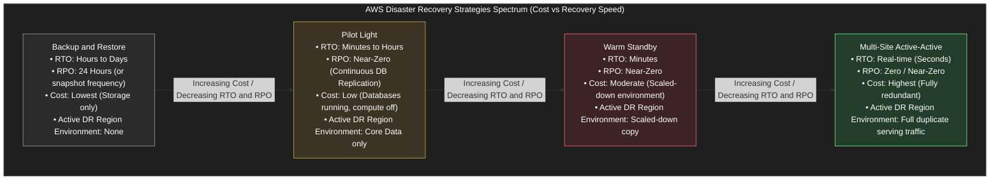

---
domains:
  - "aws"
class: reference-note
tier: reference-note
tags:
  - aws/disaster-recovery
  - aws/dr
  - aws/migration
---

# Module 3-15: AWS Disaster Recovery (DR) and Database Migrations

This module details disaster recovery metrics, strategies, migration patterns, and automated failover architectures on AWS. It covers block-level continuous replications, database schema conversions, centralized backup governance, high-performance computing configurations, and decoupled event processing.

---

## 📑 Disaster Recovery Metrics: RPO and RTO

Disaster Recovery planning is driven by two key business metrics:
*   **Recovery Point Objective (RPO):** The maximum acceptable age of data that can be lost when a system fails. It defines the frequency of backups/replication.
    *   *Example:* If backups are transferred once a week using AWS Snowball, the RPO is 1 week (up to 1 week of data loss). If database snapshots are scheduled hourly, the RPO is 1 hour.
*   **Recovery Time Objective (RTO):** The maximum acceptable duration of downtime before the application must be restored to service.
*   **Optimization Trade-off:** The smaller the RPO and RTO requirements, the higher the architecture cost.

---

## 📑 Disaster Recovery Strategies: The 4 Approaches

AWS supports four primary strategies for disaster recovery, transitioning from offline backup recovery to real-time multi-region active-active deployments:

### 1. Backup and Restore (High RTO/RPO, Lowest Cost)
*   **Operational Mechanics:** Create periodic EBS snapshots, RDS automated backups, and AMI configurations, and copy them to a target disaster recovery region. Storage Gateway or lifecycle policies can transition backups to Glacier. Large datasets can be moved weekly using Snowball.
*   **Infrastructure Status:** No infrastructure resources (e.g., EC2 instances, Load Balancers) run in the DR region until a disaster is declared. Only backup storage costs are incurred.
*   **Recovery Method:** Recreate resources on-demand from snapshots and AMIs (e.g., using CloudFormation or Terraform).

### 2. Pilot Light (Moderate RTO/RPO, Low Cost)
*   **Operational Mechanics:** The critical data layer (e.g., relational databases) is always running and replicating data continuously from the primary region to the DR region (e.g., via RDS Read Replicas or Aurora Global Databases).
*   **Infrastructure Status:** App servers, load balancers, and caching nodes are shut down or not provisioned in the DR region. They exist only as templates/AMIs.
*   **Recovery Method:** Scale up the database to act as the primary, and spin up compute instances and load balancers to route traffic via Route 53 failover.

### 3. Warm Standby (Low RTO/RPO, Moderate Cost)
*   **Operational Mechanics:** A scaled-down but fully functional duplicate of the primary environment is always running in the DR region (e.g., an Auto Scaling Group running at a minimum capacity of 1 instance instead of 10).
*   **Infrastructure Status:** All tiers are active but provisioned at minimal size/capacity.
*   **Recovery Method:** Reroute DNS traffic to the standby load balancer via Route 53 and trigger auto-scaling policies to scale up the DR environment to handle production loads.

### 4. Multi-Site Active-Active / Hot Site (Near-Zero RTO/RPO, Highest Cost)
*   **Operational Mechanics:** Complete, identical production-scale environments run concurrently in multiple regions.
*   **Infrastructure Status:** All environments actively serve traffic under a split-routing model.
*   **Data Replication:** Aurora Global Databases or DynamoDB Global Tables provide bidirectional/cross-region replication with sub-second replication latency.
*   **Recovery Method:** Failover is instantaneous. Route 53 DNS routing policies (latency or geolocation) drop the dead region and route 100% of traffic to the healthy active region.

---

## 🛡️ AWS Elastic Disaster Recovery (DRS)

AWS Elastic Disaster Recovery (DRS) (formerly CloudEndure Disaster Recovery) provides continuous block-level replication of physical, virtual, or cloud-based servers into AWS.

*   **Continuous Replication:** An **AWS Replication Agent** installed on the source server captures all disk writes in real-time and replicates them securely over HTTPS to a low-cost staging environment in AWS.
*   **Staging Environment:** Employs low-cost, small footprint EC2 instances and EBS volumes to minimize ongoing replication costs.
*   **Failover Execution:** When a disaster strikes, DRS provisions full production-grade EC2 instances and high-performance EBS volumes within minutes, matching the source server configuration.
*   **Failback Execution:** Once the source data center recovers, DRS replicates differences back to the source server and returns operations to normal.

---

## 🗄️ Database Migration Service (DMS) and Schema Conversion Tool (SCT)

AWS DMS is a managed migration service that copies and replicates data from source databases to target databases.

*   **Zero Downtime:** The source database remains fully functional and accessible throughout the migration.
*   **Homogeneous Migrations:** Migrations between identical database engines (e.g., Oracle to Oracle, PostgreSQL to RDS PostgreSQL). Does *not* require the Schema Conversion Tool.
*   **Heterogeneous Migrations:** Migrations between different database engines (e.g., Microsoft SQL Server to Amazon Aurora MySQL).
    *   **AWS SCT (Schema Conversion Tool):** Must be installed on-premises (best practice) to convert tables, views, stored procedures, and functions to the target database engine before DMS copies the raw data.
*   **Change Data Capture (CDC):** Uses source database transaction logs to continuously replicate data changes from the source to the target, allowing a low-downtime cutover.
*   **DMS Replication Instance:** Runs on a dedicated EC2 instance.
    *   **Provisioned Mode:** Select specific instance sizes (e.g., `dms.t3.medium`) and configure Multi-AZ failovers for high availability. Multi-AZ deployment provides synchronous replication to a standby replica in another AZ to survive failures, eliminate IO freezes, and minimize latency spikes.
    *   **Serverless Mode:** Automatically scales compute resources based on data replication throughput, eliminating capacity management.
*   **Source Options:** On-premises or EC2 databases (Oracle, SQL Server, MySQL, MariaDB, PostgreSQL, MongoDB, SAP, DB2), Azure SQL Database, Amazon RDS (including Aurora), S3, DocumentDB.
*   **Target Options:** On-premises or EC2 databases (Oracle, SQL Server, MySQL, MariaDB, PostgreSQL, SAP), Amazon RDS (including Aurora), Redshift, DynamoDB, Amazon S3, Kinesis Data Streams, Apache Kafka, DocumentDB, Amazon Neptune, Redis, Babelfish.

---

## 🗃️ RDS and Aurora Migration Paths

AWS provides multiple strategies to migrate databases into Amazon Aurora MySQL or PostgreSQL:

### RDS MySQL to Aurora MySQL
1.  **RDS Snapshot Restore:** Take a database snapshot of the RDS MySQL instance and restore it directly as an Amazon Aurora database cluster. (Requires stopping writes during snapshot to prevent data drift).
2.  **Aurora Read Replica:** Create an Amazon Aurora Read Replica on top of the RDS MySQL instance. Wait for replication lag to drop to zero, then promote the Aurora Read Replica to a standalone cluster. (Minimizes downtime).
3.  **Percona XtraBackup (External DB):** For MySQL databases external to RDS, back up the database using Percona XtraBackup, upload the backup file to Amazon S3, and import it directly into a new Aurora MySQL DB cluster. (Only Percona XtraBackup is supported for this direct S3 import path).
4.  **MySQL Dump Utility:** Run `mysqldump` and pipe the output into Aurora MySQL. (Slower, does not leverage S3, but works across versions).
5.  **AWS DMS:** Set up source and target endpoints and run continuous replication via a DMS task.

### RDS PostgreSQL to Aurora PostgreSQL
1.  **RDS Snapshot Restore:** Take a snapshot of the RDS PostgreSQL instance and restore it directly as an Aurora PostgreSQL cluster.
2.  **Aurora Read Replica:** Create an Aurora Read Replica of the RDS PostgreSQL database, wait for replication lag to drop to zero, and promote the replica.
3.  **S3 Export and Import (External DB):** Back up the external database using `pg_dump`, upload the backup file to Amazon S3, and import using the `aws_s3` Aurora extension.
4.  **AWS DMS:** Set up source and target endpoints and run continuous replication via a DMS task.

---

## 🪣 AWS Backup

AWS Backup is a fully managed, centralized backup service that automates backup execution across multiple AWS services (EC2, EBS, RDS, Aurora, DynamoDB, DocumentDB, Neptune, EFS, FSx, and Storage Gateway).

*   **Backup Plans:** Define backup rules including frequency (e.g., hourly, daily), backup window, retention period, and lifecycle transitions (e.g., moving snapshots to Cold Storage after a defined timeframe).
*   **Cross-Region / Cross-Account Backups:** Configured in the backup rule to automatically copy backups to another region or AWS account for geographic separation and compliance.
*   **Resource Assignment:** Assign resources to backup plans automatically using tags (e.g., `Environment = Production`).
*   **Vault Lock:** Enforces a WORM (Write Once Read Many) policy on a Backup Vault.
    *   Once enabled and locked, backups cannot be deleted or modified, even by the root user.
    *   Provides protection against ransomware attacks, compromised credentials, or accidental deletes.

---

## 💻 AWS Application Migration Service (MGN)

AWS Application Migration Service (MGN) is the primary service for lift-and-shift migrations of physical, virtual, or cloud servers to AWS.

*   **Mechanics:** Uses a replication agent installed on the source server to continuously replicate block-level storage disks into a low-cost staging environment (EC2 instances and EBS volumes) in AWS.
*   **Cutover:** On migration day, trigger a cutover to launch full-capacity EC2 instances in production.
*   **Application Discovery Service:** Scans on-premises infrastructure to map out hardware utilization and server dependency maps.
    *   **Agentless Discovery:** Deploy a Connector VM to gather virtual machine configuration and performance history (CPU, memory, disk usage).
    *   **Agent-based Discovery:** Install an agent on VMs to collect system configuration, performance, running processes, and details of all network connections to construct dependency maps.
*   **Migration Hub:** Provides a single pane of glass to track migration status across discovery, replication, and cutover.

---

## 🌐 VMware Cloud on AWS

For organizations managing on-premises virtual machines via VMware ESXi, vSphere, vSAN, and NSX:
*   **Hybrid Capacity Extension:** Run the VMware Software-Defined Data Center (SDDC) stack directly on bare metal AWS infrastructure.
*   **Workload Portability:** Migrate VM workloads dynamically to AWS without refactoring or rewriting hypervisor configurations.
*   **Disaster Recovery:** Use VMware Cloud tools to quickly configure failovers between local infrastructure and AWS.
*   **AWS Native Service Access:** Connect VM nodes over high-speed networks to native AWS resources (RDS, S3, EC2, FSx, Direct Connect, Redshift).

---

## ⚙️ EC2 High Availability Patterns

To make a single EC2 instance highly available across availability zones:

### 1. Elastic IP Failover via Lambda
*   **Architecture:** Maintain a primary EC2 instance and a standby instance in separate AZs. Point public DNS records to an Elastic IP.
*   **Detection:** Configure a CloudWatch Alarm/Event to monitor the primary instance health (e.g., `StatusCheckFailed`).
*   **Action:** Trigger an AWS Lambda function to detach the Elastic IP from the failed primary instance and attach it to the healthy standby instance.

### 2. Auto Scaling Group Active-Passive (Min=1, Max=1, Desired=1)
*   **Architecture:** Place an ASG across two Availability Zones. Set configuration constraints: min=1, max=1, and desired=1.
*   **Process:** If the active EC2 instance in AZ-1 fails its health checks, the ASG terminates it and provisions a new replacement instance in AZ-2.
*   **Networking:** The launch template includes User Data scripts that query instance tags and dynamically associate the shared Elastic IP to the new instance on startup. The instance role must include permissions for `ec2:AssociateAddress`.

### 3. Stateful ASG Failover with EBS Volume Lifecycle Hooks
*   **ASG Terminate Hook:** When the instance starts terminating, the lifecycle hook pauses termination to trigger an AWS Systems Manager Automation script or Lambda to take a final EBS Snapshot of the attached EBS volume.
*   **ASG Launch Hook:** During replacement instance launch, a lifecycle hook runs a script to create a new EBS Volume from the latest snapshot in the new AZ, attaches it to the replacement instance, and then allows the boot process to complete.

---

## ⚡ High Performance Computing (HPC) on AWS

HPC workloads require specialized compute, networking, and storage components to run massive parallel calculations:

### HPC Networking Primitives
*   **Enhanced Networking (SR-IOV):** Provides higher bandwidth, higher packets per second (PPS), and lower latency.
    *   **Elastic Network Adapter (ENA):** Supports network speeds up to 100 Gbps.
    *   **Intel 82599 VF (Legacy):** Supports up to 10 Gbps (used for older instance families).
*   **Elastic Fabric Adapter (EFA):** An ENA adapter modified for Linux workloads that bypasses the underlying OS kernel.
    *   Uses the **MPI (Message Passing Interface)** standard to route network traffic directly to instance memory.
    *   Provides microsecond-level latency and highly reliable transport, suited for tightly coupled HPC and distributed machine learning workloads.

### HPC Storage Primitives
*   **EBS io2 Block Express:** Delivers up to 256,000 IOPS and sub-millisecond latencies for single-instance databases.
*   **Local Instance Store:** Temporary physical storage attached to the host hypervisor. Delivers millions of IOPS with sub-millisecond latencies, but is ephemeral (data lost on instance stop/termination).
*   **Amazon FSx for Lustre:** An HPC-optimized file system designed for Linux compute clusters. Delivers millions of IOPS with sub-millisecond latencies, backed natively by S3 buckets (loads objects into the file system on first access, and writes back changes).

### HPC Automation
*   **AWS Batch:** Serverless scheduler that manages multi-node parallel container jobs across EC2 fleets.
*   **AWS Parallel Cluster:** Open-source command-line tool that deploys HPC clusters using text configuration files, automating VPC, subnet, EFA network bindings, and auto-scaling scheduler configurations.

---

## ✉️ Event Processing and Decoupling Patterns

### SQS and Lambda Retries
*   **Polled Architecture:** AWS Lambda automatically polls the SQS queue, processes batches of messages, and deletes them if successful.
*   **Dead-Letter Queue (DLQ):** If a message fails processing, Lambda retries. To avoid infinite processing loops (poison pill messages), set up an SQS DLQ. SQS moves the message to the DLQ after a defined number of failed attempts (configured on the SQS queue side). SQS FIFO queues require a DLQ to prevent blocked queues from halting all processing.

### SNS and Lambda Retries
*   **Asynchronous Push Architecture:** SNS pushes messages directly to Lambda.
*   **Retries:** If the Lambda function fails, the Lambda service retries internally up to 3 times before discarding the message.
*   **Dead-Letter Queue (DLQ):** To prevent message loss, configure a DLQ at the Lambda function execution layer (configured on the Lambda side, not the SNS side).

### Fan-Out Pattern
*   **Design:** Integrate an SNS Topic in the middle of the flow. Producers publish messages to the SNS Topic once.
*   **Execution:** SQS queues subscribe to the SNS Topic. The SNS service duplicates and pushes the message to all queues, allowing parallel, decoupled processing.

### S3 Event Notifications
*   **S3 Actions:** Triggers events on object creation, deletion, restore, or replication.
*   **Direct Destinations:** S3 can publish event notifications directly to SNS Topics, SQS Queues, or Lambda functions (using resource-based SQS/SNS access policies).
*   **Amazon EventBridge Integration:** If enabled on the S3 bucket, S3 routes all events to EventBridge. This allows advanced JSON filtering (on metadata, object size, file extensions) and routes to over 18 AWS service targets (including Step Functions, Kinesis Data Firehose, or custom endpoints).

### CloudTrail and EventBridge Integration
*   **Audit Interception:** CloudTrail logs all API calls (e.g., `DeleteTable` for DynamoDB).
*   **Event Bridge Rule:** EventBridge intercepts CloudTrail log events matching specific API signatures and triggers automated reactions (e.g., sending an alert via SNS or executing a corrective Lambda function).

---

## 🔑 Caching and Web Security Patterns

### Caching Tiers
*   **CloudFront Edge Caching:** Caches static and dynamic content at geographic edge locations (Point of Presence - POP) closest to users, reducing latency and backend compute loads.
*   **API Gateway Caching:** Caches API responses regionally at the gateway layer, reducing calls to regional backend microservices.
*   **ElastiCache (Redis / Memcached) and DynamoDB DAX:** Caches frequently accessed database query results in-memory, protecting relational/NoSQL databases from read overload. (S3, RDS, and standard databases do not have built-in caching).

### Subnet Blocking and Network Firewalls
*   **NACLs (Network Access Control Lists):** Stateless firewall filters at the subnet boundary. Natively supports explicit `Deny` and `Allow` rules (useful for blocking malicious IP addresses cheaply at the entry gate).
*   **Security Groups:** Stateful firewall filters at the network interface (ENI) level. Supports `Allow` rules only.
*   **Host Firewalls:** Running firewall software on EC2 instances incurs CPU overhead and latency.
*   **AWS WAF (Web Application Firewall):** Integrates with Application Load Balancers (ALBs) or CloudFront. Provides advanced IP filtering, rate limiting, and SQL injection blocking.
*   **CloudFront Country Blocking (Geo-Restriction):** Blocks traffic at the edge location based on the country of origin.
*   **Security Configuration:** When pairing CloudFront with an ALB, configure the ALB's Security Group to only allow CloudFront public IPs to prevent clients from bypassing CloudFront.

---

## 🐒 Chaos Testing (Netflix Simian Army)

Chaos testing validates system resilience by deliberately injecting failures into production environments.
*   **Netflix Simian Army:** An automated suite of chaos tools.
*   **Chaos Monkey:** Randomly terminates EC2 instances in production to verify that the Auto Scaling Group, health checks, and stateful volume failover designs behave correctly without impacting end-users.

---

*For conceptual landing notes, refer to:*
*   [[AWS Disaster Recovery]] ([AWS Disaster Recovery.md](file:///home/karim/Desktop/BrainDump/Main%20Notes/AWS%20Disaster%20Recovery.md))
*   [[AWS Elastic Disaster Recovery]] ([AWS Elastic Disaster Recovery.md](file:///home/karim/Desktop/BrainDump/Main%20Notes/AWS%20Elastic%20Disaster%20Recovery.md))
*   [[AWS Database Migration Service]] ([AWS Database Migration Service.md](file:///home/karim/Desktop/BrainDump/Main%20Notes/AWS%20Database%20Migration%20Service.md))
*   [[AWS Backup]] ([AWS Backup.md](file:///home/karim/Desktop/BrainDump/Main%20Notes/AWS%20Backup.md))
*   [[aws - Disaster Recovery Strategies]] ([aws - Disaster Recovery Strategies.md](file:///home/karim/Desktop/BrainDump/Main%20Notes/aws%20-%20Disaster%20Recovery%20Strategies.md))
