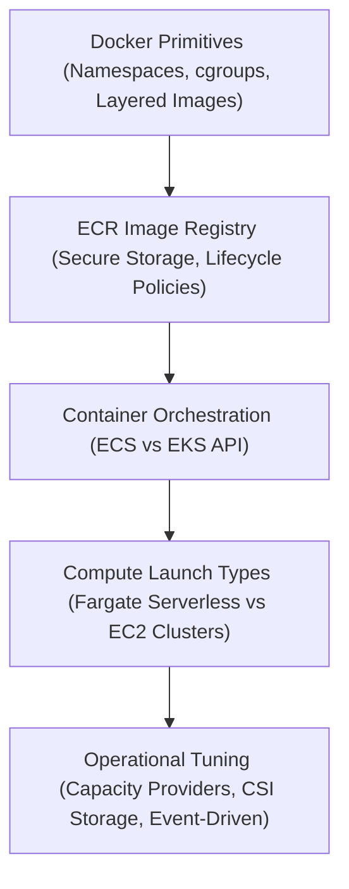
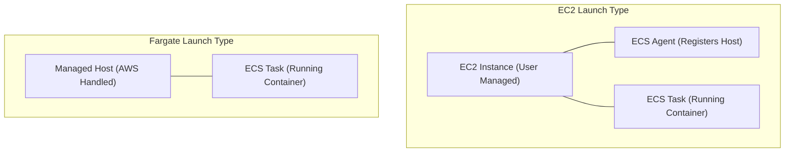

---
domains:
  - "aws"
class: reference-note
tier: reference-note
tags:
  - aws/containers
  - aws/ecs
  - aws/eks
  - aws/ecr
---

# Module 3-17: AWS Containers (ECS, EKS & ECR)

This module covers container technologies and orchestration services on AWS, detailing Docker primitives, Amazon Elastic Container Service (ECS), Amazon Elastic Kubernetes Service (EKS), and Amazon Elastic Container Registry (ECR).

---

## 🗺️ Cognitive Map: How to Think About the Flow of Knowledge

To build a strong intuition for containerized architectures on AWS, think of the topics as moving from local execution primitives to global orchestration models:

1. **Step 1: Container Primitives (Section 1):** Understand Docker container layout, namespace boundaries, and how ECR securely hosts these images.
2. **Step 2: Amazon ECS Architecture (Section 2):** Explore ECS task concepts, launch patterns, service routing via ALBs, and granular IAM roles.
3. **Step 3: Amazon EKS Managed Kubernetes (Section 3):** Study EKS node group patterns, EKS Auto Mode dynamic node scaling, and container storage interfaces.

By following this flow, you progress from **Container Isolation → Managed Orchestration → Dynamic Infrastructure Control**.

---

## 1. Docker Fundamentals & Container Registration

### VM Hypervisors vs. Container Runtimes
Virtual Machines (VMs) virtualize physical hardware. Each VM includes a complete guest operating system, a virtual copy of hardware, and application binaries, managed by a hypervisor (e.g., AWS Nitro). This results in strong security isolation but high boot times and storage footprints.

Containers virtualize the host operating system kernel instead of the hardware. Multiple container sandboxes share the same host OS kernel via kernel boundaries, managed by a container daemon (e.g., Docker, containerd). 
*   **Linux Namespaces (Isolation Walls):** Separate system resources per container (UTS for hostname, PID for processes, NET for network interfaces, IPC for inter-process communication, MNT for mount points).
*   **Linux Control Groups / cgroups (Resource Limits):** Limit the amount of physical resources (CPU, Memory, Disk I/O) a container sandbox can consume.

### ECR: Amazon Elastic Container Registry
Amazon ECR is a fully managed, secure Docker registry backed by **Amazon S3** for image layer durability.
*   **Access Control:** Protected natively via IAM policies. Users must run `aws ecr get-login-password` to fetch a temporary token before running `docker push` or `docker pull`.
*   **Vulnerability Scanning:** Scans image layers for software vulnerabilities (Basic scanning powered by Clair, Advanced scanning integrated with Amazon Inspector).
*   **Image Lifecycle Policies:** Automates registry cleanup by setting rules to expire untagged images or old image versions, reducing S3 storage costs.
*   **Public Gallery:** Allows publishing images to public repositories with AWS-backed global distribution.

---

## 2. Amazon ECS (Elastic Container Service)

Amazon ECS is AWS's proprietary container orchestrator designed for running Docker applications at scale without Kubernetes API complexity.

### ECS Compute Launch Types
*   **EC2 Launch Type:** Tasks are placed on EC2 instances provisioned and maintained by the user. Instances must run the **ECS Agent** (which registers the instance into the ECS cluster). The user is responsible for OS patching, agent upgrades, and scaling the underlying EC2 fleet.
*   **Fargate Launch Type (Serverless):** AWS provisions, manages, and secures the underlying compute servers. Users specify task CPU/Memory requirements, and AWS runs the containers in isolated environments. There are no EC2 instances in the user's account.

### ECS Granular IAM Roles
*   **EC2 Instance Profile Role (EC2 Launch Type Only):** Associated with the host EC2 instance. Used by the ECS Agent to register the host with the ECS API, send metric/agent logs to CloudWatch Logs, and pull container images from ECR.
*   **ECS Task Execution Role:** Used by the ECS container agent to prepare the task before boot. Required on both Fargate and EC2 launch types to retrieve container images from ECR, retrieve environment variables from SSM Parameter Store, or decrypt configurations from Secrets Manager.
*   **ECS Task Role:** The runtime role associated with the container application. Dictates what AWS API requests (e.g., S3 read, DynamoDB query) the container program can run once it is active.

### ECS Load Balancing & Data Storage
*   **ALB Integration:** The Application Load Balancer supports **Dynamic Port Mapping** with the EC2 Launch Type. If a host runs multiple tasks of the same container, ECS maps them to dynamic ephemeral host ports (e.g., 32768-65535) and updates the ALB target group dynamically. On Fargate, tasks get their own Elastic Network Interface (ENI), so the ALB targets their private IPs directly on port 80.
*   **EFS Shared Storage:** ECS supports mounting **Amazon EFS** (Elastic File System) as directory volume mounts inside tasks. This provides multi-AZ persistent shared storage, allowing Fargate tasks to share state or configuration files seamlessly.

### ECS Service Auto Scaling
ECS leverages **Application Auto Scaling** to scale the count of running tasks based on CloudWatch metrics:
1.  **Metrics:** CPU Utilization, Memory Utilization, and ALB Request Count per Target.
2.  **Target Tracking:** Scales task count to keep a metric at a set target (e.g., keep average CPU at 60%).
3.  **ECS Cluster Capacity Providers:** Used with the EC2 Launch Type to connect ECS Service scaling with Auto Scaling Group (ASG) scaling. If tasks are pending due to a lack of host EC2 capacity, the Capacity Provider automatically instructs the ASG to launch more EC2 instances.

---

## 3. Amazon EKS (Elastic Kubernetes Service)

Amazon EKS is a managed service that runs Kubernetes control plane components (API server, etcd) across multiple Availability Zones for high availability.

### EKS Node Provisioning Models
*   **Managed Node Groups:** AWS automatically provisions, updates, and scales EC2 worker nodes as part of an Auto Scaling Group. AWS handles node OS AMI upgrades and patches.
*   **Self-Managed Nodes:** The user creates the EC2 instances, applies custom configurations (e.g., customized AMIs), and registers them manually to the EKS cluster.
*   **EKS Fargate:** Serverless mode. Pods are mapped to AWS-managed serverless compute nodes, removing EC2 node management entirely.
*   **EKS Auto Mode:** The EKS service automatically manages node provisioning, scaling (utilizing built-in Karpenter engines), and networking. When a pod spec requests resources that do not fit on active nodes, EKS immediately scales a new EC2 instance matching the exact requirements.

### Container Storage Interface (CSI) Drivers
To mount persistent volumes in EKS, Kubernetes utilizes CSI drivers to interface with AWS storage systems:
*   **EBS CSI Driver:** Provisions block volumes (`gp3`, `io2`). Pods must reside in the same AZ as the EBS volume to mount.
*   **EFS CSI Driver:** Provisions shared file systems. Allows multi-AZ mounts and is the only storage class supported when running pods on **EKS Fargate**.

---

## 4. Deep-Intuition Architectural Breakdowns (AARF)

### ECS Compute: Fargate vs. EC2 Launch Type
*   **The Answer:** Select Fargate for serverless scaling; select EC2 for custom VM configurations or hardware requirements.
*   **The Assumptions:** Fargate tasks require their own public/private subnets and NAT Gateways to pull images. EC2 launch types require the ECS optimized AMI with Docker and the ECS Agent installed.
*   **The Rationale (Why):** Fargate abstracts the virtualization layer by placing tasks directly in AWS-managed VPC micro-VMs. EC2 launch types place tasks as standard Docker containers on virtual machines inside the user's VPC.
*   **The Failure Loop (What if not):** If Fargate subnets do not have a route to a NAT Gateway or VPC Endpoint, the task will fail to pull the image from ECR, throwing `TaskFailedToStart: ResourceInitializationError: unable to pull image`.
*   **Alternative Case (When to use 'if not'):** If the application requires low-level kernel modifications, custom cgroup rules, access to GPU hardware, or runs a legacy daemon configuration on the host, EC2 launch types are required.

### ECS Roles: Task Role vs. Task Execution Role
*   **The Answer:** Assign container credentials to the **Task Role**; assign container startup/pull credentials to the **Task Execution Role**.
*   **The Assumptions:** ECS services require both roles for security isolation.
*   **The Rationale (Why):** The container agent needs credentials to pull the image from ECR *before* the container starts. The application code inside the container needs credentials to query DynamoDB *after* it starts.
*   **The Failure Loop (What if not):** If the Task Execution Role lacks ECR permissions, the task fails immediately on boot with `AccessDeniedException` during pull. If the Task Role lacks DynamoDB permissions, the task boots successfully but throws application runtime errors when attempting database calls.

---

## 5. Decoupled Verification Projects

Hands-on deployment scripts, task JSON configurations, and EKS scaling validations are compiled as a separate playbook:
*   *See complete implementation in [[Projects/kubernetes/Project - ECS and EKS Cluster Deployments.md]]*
