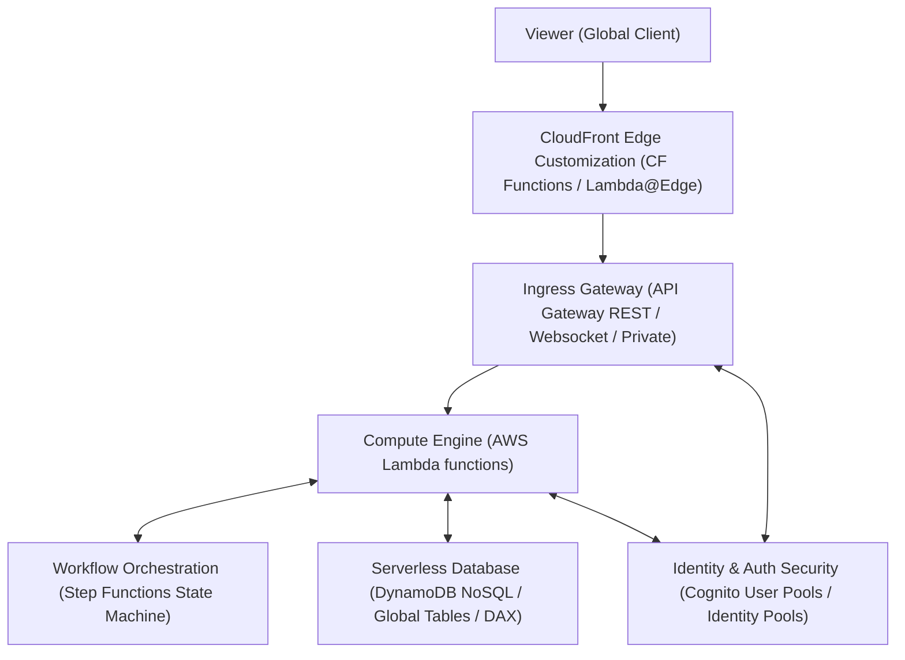
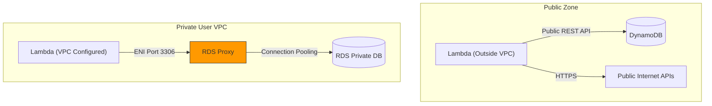

---
domains:
  - "aws"
class: reference-note
tier: reference-note
tags:
  - aws/serverless
  - aws/lambda
  - aws/api-gateway
  - aws/dynamodb
  - aws/cognito
---

# Module 3-18: AWS Serverless (Lambda, API Gateway, DynamoDB & Cognito)

This module covers serverless architectures on AWS, detailing AWS Lambda, Amazon API Gateway, Amazon DynamoDB, AWS Step Functions, and Amazon Cognito. It highlights integration patterns for building highly available, decoupled, and secure cloud applications.

---

## 🗺️ Cognitive Map: How to Think About the Flow of Knowledge

To build a strong intuition for serverless architectures, think of the components as layers in a request processing flow:



1. **Step 1: Ingress & Edge (Section 1 & 2):** Route and optimize incoming client traffic at Edge locations, passing it securely to API Gateway.
2. **Step 2: Serverless Compute (Section 3):** Execute code on-demand using Lambda, managing timeouts, environments, and concurrency limits.
3. **Step 3: Serverless Storage & Identity (Section 4 & 5):** Persist data dynamically using DynamoDB and authorize users securely using Cognito.
4. **Step 4: Architectural Case Studies (Section 6):** Synthesize these components into production-ready E2E application patterns.

By following this flow, you progress from **Client Edge Ingress → On-Demand Processing → Serverless Data Isolation**.

---

## 1. CloudFront Edge Customization

Edge functions customize content delivery close to users, reducing latency by executing logic at CloudFront Edge locations.

### CloudFront Functions vs. Lambda@Edge
| Characteristic | CloudFront Functions | Lambda@Edge |
| :--- | :--- | :--- |
| **Runtime Support** | JavaScript only (lightweight engine) | Node.js and Python (full environments) |
| **Scale / Throughput** | Millions of requests/second | Thousands of requests/second |
| **Execution Trigger Points** | Viewer Request, Viewer Response | Viewer Request, Origin Request, Origin Response, Viewer Response |
| **Maximum Execution Time** | Less than 1 millisecond | Up to 5 seconds (viewer trigger), 10 seconds (origin trigger) |
| **Code Size / Dependencies** | Small scripts (< 10 KB), no third-party libraries | Up to 50 MB, supports full SDK/external dependencies |
| **VPC & Internet Access** | No network or file system access | Full access to private VPC resources, internet APIs, and files |
| **Common Use Cases** | URL rewrites, redirecting HTTP to HTTPS, header additions, basic token validation. | Advanced JWT decoding, image optimization, A/B testing logic, VPC DB querying. |

---

## 2. Amazon API Gateway

API Gateway is a managed service for creating, publishing, and securing REST, HTTP, and WebSocket APIs at scale.

### Core Features & Limits
*   **Protocol Support:** Exposes RESTful APIs (backed by OpenAPI/Swagger definition imports) and full-duplex WebSocket connections.
*   **API Gateway Timeout Limit:** API Gateway enforces a strict **maximum timeout of 29 seconds** for all integrations. If the backend resource (like a Lambda function) takes longer, API Gateway immediately closes the connection and returns `504 Gateway Timeout`.
*   **Throttling:** Protects backends from spikes by enforcing token-bucket rate limits (configured per method or client API key).
*   **Response Caching:** Caches method responses to reduce the number of calls made to backend Lambda functions.

### Endpoint Types
1.  **Edge-Optimized (Default):** Routes requests through CloudFront Edge locations for global clients. The custom SSL certificate must reside in the `us-east-1` region.
2.  **Regional:** Best for clients residing in the same region. The SSL certificate must reside in the same region as the API Gateway.
3.  **Private:** Internal endpoint only, accessible exclusively inside a user's VPC via Interface VPC Endpoints (PrivateLink).

---

## 3. AWS Lambda

AWS Lambda runs code on-demand without provisioning or managing servers, scaling instances automatically in response to invocation volume.

### Operating Parameters & Configuration
*   **Resource Sizing:** Configurable memory from 128 MB to 10 GB (in 64 MB increments). Increasing memory automatically scales CPU and network throughput.
*   **Ephemeral Storage:** Provides writeable storage in the `/tmp` directory (up to 10 GB).
*   **Execution Timeout:** Maximum execution limit is **15 minutes (900 seconds)**.
*   **Packaging Limits:** Max zip file size is 50 MB (compressed) and 250 MB (uncompressed).

### Concurrency and Throttling
*   **Account-Level Limit:** A default concurrency pool (typically 1,000) is shared across all functions in an account per region. A traffic spike on one function can exhaust the pool, causing other functions to throttle.
*   **Reserved Concurrency:** Dedicates a portion of the account concurrency to a specific function, ensuring it always has capacity while also capping its maximum concurrency.
*   **Provisioned Concurrency:** Allocates warm execution environments in advance, eliminating the cold start latency (initialization of runtime/dependencies outside the handler).
*   **Lambda SnapStart:** Optimizes cold start latency (up to 10x) for Java, Python, and .NET. When a version is published, Lambda pre-initializes the code, takes a snapshot of the memory and disk state, and uses it to boot future instances.

### VPC Networking Primitives
*   **Default Behavior (No VPC):** By default, Lambda functions run in an AWS-managed network boundary and cannot access private resources inside a user's VPC (e.g., private RDS databases, internal load balancers). They have default public access to DynamoDB, S3, and internet-facing APIs.
*   **VPC Configuration:** To access private resources, configure Lambda with target VPC IDs, private subnets, and security groups. AWS dynamically attaches Elastic Network Interfaces (ENIs) inside those subnets.
*   **RDS Proxy Integration:** Lambda functions booting dynamically can exhaust RDS connection pools due to rapid scaling. RDS Proxy pools database connections, maintains warm connections, and reduces RDS failover times by up to 66%. To access RDS Proxy, the Lambda function must be configured to run inside the VPC.
*   **🌉 Evolutionary Bridge: VPC Cold Start ENI Allocation (Hyperplane):**
    *   *Core Classic Behavior:* Historically, when a Lambda function was placed in a VPC, AWS dynamically created and attached a new ENI to the execution container *during* the cold start invocation phase. This network provisioning penalty added a strict latency overhead of 10 to 30 seconds, rendering VPC Lambda functions unusable for latency-sensitive public API endpoints.
    *   *Modern Implementation (Hyperplane):* In late 2019, AWS transitioned to AWS Hyperplane (a shared network virtualization system). During function creation or configuration updates, AWS pre-allocates dedicated Hyperplane ENIs inside the user's subnet. At invocation time, the Lambda execution environment attaches to a pre-existing, shared Hyperplane ENI, eliminating the dynamic network creation latency and dropping VPC cold start times to sub-second levels. This also drastically conserves private subnet IP addresses since multiple concurrent functions share the same ENIs.



---

## 4. Amazon DynamoDB

Amazon DynamoDB is a fully managed, multi-AZ replicated NoSQL database offering consistent single-digit millisecond response latencies.

### Storage & Schema Flexibility
*   **Structure:** Composed of Tables containing items (rows). Items contain attributes (columns) that can vary dynamically, allowing schemas to evolve.
*   **Primary Key:** Composed of a Partition Key (used to distribute items internally) and an optional Sort Key.
*   **Item Limit:** Maximum size of a single item is 400 KB.

### Read/Write Capacity Modes
*   **Provisioned Mode:** You specify Read Capacity Units (RCUs) and Write Capacity Units (WCUs) in advance. Best for predictable traffic workloads; handles spikes using auto-scaling.
*   **On-Demand Mode:** Automatically scales RCU/WCU in response to traffic. Pay-per-request model; optimal for highly unpredictable, sudden spike workloads or very low utilization apps.

### Advanced Features
*   **DynamoDB Accelerator (DAX):** A fully managed, API-compatible in-memory write-through cache placed in front of DynamoDB tables. Reduces read latencies to microseconds. (Note: Use ElastiCache for complex database computation/aggregation results; use DAX for caching raw reads/queries).
*   **DynamoDB Streams:** Captures item modifications (create, update, delete) in a rolling 24-hour log. Integrates with Lambda triggers to enable event-driven architectures.
*   **Global Tables:** Active-Active, multi-region database replication. Uses DynamoDB Streams to synchronize tables globally, allowing local low-latency reads and writes.
*   **Time-to-Live (TTL):** Automatically deletes items after an epoch timestamp is exceeded, reducing storage costs without consuming write capacity. Common for expiring session tokens.

---

## 5. Amazon Cognito

Amazon Cognito handles user signup, signin, and security authorization for web and mobile applications.

### Cognito User Pools (CUP)
A serverless directory database of users. Identifies and authenticates application users via passwords, social sign-ins (Google, Facebook), or SAML/OIDC federations. Integrates directly with API Gateway and Application Load Balancers (ALB) to handle authentication validation before traffic reaches the backend.

### Cognito Identity Pools (Federated Identity)
Exchanges authentication tokens (from CUP, social logins, or guest states) for **temporary AWS credentials** (IAM policies). This allows clients to directly make secure AWS API calls (e.g. uploading a photo to a specific S3 folder or querying a table) without passing through a custom backend API.
*   **Row-Level Security:** Secures DynamoDB tables by configuring IAM policies with conditions checking `dynamodb:LeadingKeys` against the user's Cognito identity ID (`cognito-identity.amazonaws.com:sub`).

---

## 6. Deep-Intuition Architectural Breakdowns (AARF)

### Edge Customization: CloudFront Functions vs. Lambda@Edge
*   **The Answer:** Select CloudFront Functions for lightweight viewer redirections; select Lambda@Edge for heavy origin transformations.
*   **The Assumptions:** CloudFront Functions execute in a sandboxed V8 runtime; Lambda@Edge runs in full Node.js or Python instances.
*   **The Rationale (Why):** Viewer requests require sub-millisecond scaling without cold-start penalties. Origin requests execute less frequently, permitting full runtime container boot times.
*   **The Failure Loop (What if not):** If a developer writes a Lambda@Edge function querying an external database on a viewer request, the page load latency will spike during execution, resulting in timeouts and broken page loads.

### Cognito Flows: User Pools vs. Identity Pools
*   **The Answer:** Use User Pools to handle user signup and login; use Identity Pools to grant users secure AWS access.
*   **The Assumptions:** Identity Pools require a trusted authentication provider (which can be a Cognito User Pool).
*   **The Rationale (Why):** User Pools act as the Directory Service (holding usernames, password salts, and tokens). Identity Pools act as the Security Token Service (STS) mapping tokens to actual IAM roles.
*   **The Failure Loop (What if not):** If an architect uses only Cognito User Pools, the mobile app cannot make direct API calls to S3 or DynamoDB, forcing them to route all file transfer binary streams through API Gateway/Lambda (which will cause timeouts and high compute costs).

---

## 7. Decoupled Verification Projects

Step-by-step configurations for REST API gateways, Lambda handler structures, and throttling/concurrency verification scripts are compiled as a separate playbook:
*   *See complete implementation in [[Projects/kubernetes/Project - Serverless REST API with Lambda and API Gateway.md]]*

---

## 8. Terraform Resource Primitives for Serverless Pipelines

Provision Lambda event triggers and execution contexts using Terraform HCL resources.

### A. S3 Event-Driven Lambda Function and Permissions
```hcl
# 1. Lambda IAM Execution Role
resource "aws_iam_role" "lambda_role" {
  name = "lambda-s3-trigger-role"

  assume_role_policy = jsonencode({
    Version = "2012-10-17"
    Statement = [{
      Action    = "sts:AssumeRole"
      Effect    = "Allow"
      Principal = { Service = "lambda.amazonaws.com" }
    }]
  })
}

# 2. Lambda Function definition
resource "aws_lambda_function" "processor" {
  filename      = "function_payload.zip"
  function_name = "s3-event-processor"
  role          = aws_iam_role.lambda_role.arn
  handler       = "index.handler"
  runtime       = "python3.10"
}

# 3. Grant invocation permissions to the source S3 bucket
resource "aws_lambda_permission" "allow_s3" {
  statement_id  = "AllowS3Invocation"
  action        = "lambda:InvokeFunction"
  function_name = aws_lambda_function.processor.function_name
  principal     = "s3.amazonaws.com"
  source_arn    = "arn:aws:s3:::my-trigger-bucket-12345"
}

# 4. S3 Bucket Notification Trigger
resource "aws_s3_bucket_notification" "s3_trigger" {
  bucket = "my-trigger-bucket-12345"

  lambda_function {
    lambda_function_arn = aws_lambda_function.processor.arn
    events              = ["s3:ObjectCreated:*"]
  }

  depends_on = [aws_lambda_permission.allow_s3]
}
```

