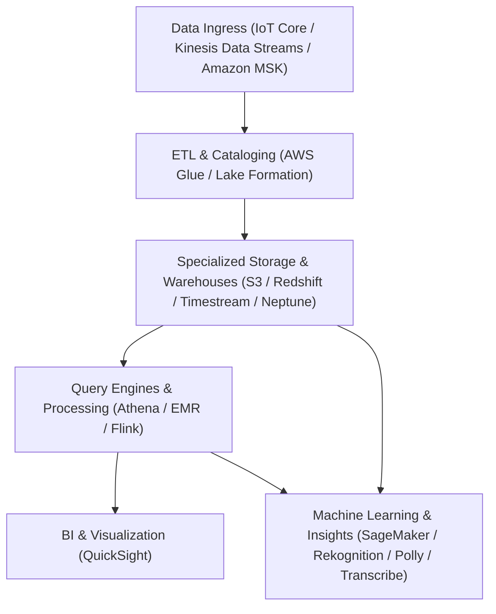

---
domains:
  - "aws"
class: reference-note
tier: reference-note
tags:
  - aws/databases
  - aws/analytics
  - aws/machine-learning
---

# Module 3-19: AWS Databases, Analytics & Machine Learning Services

This module covers AWS's specialized databases (Redshift, Neptune, Timestream, Keyspaces), data lakes and analytics platforms (Athena, EMR, Glue, Lake Formation), real-time streaming analytics (Flink, MSK), and the comprehensive suite of AWS Machine Learning services.

---

## 🗺️ Cognitive Map: How to Think About Data Flows

To build a strong intuition for AWS Databases, Analytics, and ML services, think of the system as a pipeline processing data from ingress to visualization and inference:



---

## 1. Specialized AWS Databases

AWS offers purpose-built databases tailored for specific data access patterns, moving away from the "one-size-fits-all" relational database model.

### Amazon Redshift (OLAP Columnar Data Warehousing)
*   **Architecture:** An OLAP (Online Analytical Processing) columnar data warehouse. Columnar storage processes queries extremely fast compared to row-based databases because only the targeted columns are read from disk.
*   **Node Topology:** Consists of a **Leader Node** (receives queries, compiles execution plans, and coordinates compute nodes) and **Compute Nodes** (execute queries, store data, and send results back to the leader node).
*   **Enhanced VPC Routing:** Forces all COPY and UNLOAD traffic between your Redshift cluster and other AWS services (like S3) to route internally through your private VPC subnets instead of traversing the public internet.
*   **Redshift Spectrum:** Allows querying data directly from Amazon S3 without loading it into Redshift compute nodes, utilizing the Athena or Glue Data Catalog schema.
*   **Disaster Recovery:** Supports cross-region automated snapshots for disaster recovery (snapshots are copied to a secondary region and can be restored into a new Redshift cluster).

### Amazon Neptune (Graph Database)
*   **Purpose:** Purpose-built graph database optimized for storing and querying highly connected datasets (e.g., social networks, recommendation engines, fraud detection, knowledge graphs).
*   **Features:** Multi-AZ replication with up to 15 read replicas.
*   **Neptune Streams HTTP API:** Captures real-time changes to graph data in a strict ordered sequence with no duplicates, exposed via an HTTP REST API to trigger downstream workflows or synchronize other data stores.

### Amazon Timestream (Time Series Database)
*   **Purpose:** Serverless time-series database optimized for IoT telemetry, application metrics, and DevOps monitoring.
*   **Tiers:** Automatically adjusts capacity up and down. Keeps recent data in a high-speed in-memory storage tier for sub-second writes and transitions historical data to a cost-optimized magnetic storage tier based on user-defined retention policies.

### Amazon Keyspaces (Cassandra Compatible)
*   **Purpose:** Serverless, managed Apache Cassandra-compatible database service.
*   **CQL, PITR & Multi-Region:** Uses the Cassandra Query Language (CQL). Scales tables automatically in response to request traffic, offering single-digit millisecond latency, Point-in-Time Recovery (PITR) up to 35 days, and multi-region replication.

---

## 2. Analytics Query, ETL & Data Lakes

### Amazon Athena
*   **Purpose:** A serverless, interactive query service that enables SQL queries directly on data stored in Amazon S3. Uses Presto under the hood.
*   **Performance Optimization:**
    *   **Columnar Formats:** Storing S3 data in columnar formats (Parquet or ORC) reduces the volume of data Athena needs to scan from disk, optimizing speed and reducing cost (Athena is billed at $5 per TB scanned).
    *   **Path Partitioning:** Organizing S3 paths (e.g., `s3://bucket/year=2026/month=06/`) restricts Athena to scan only files in the queried partitions.
*   **Athena Federated Query:** Allows running SQL queries across data stored in relational, non-relational, object, and custom data sources (RDS, DynamoDB, on-premises) using AWS Lambda connectors.

### Amazon EMR (Managed Hadoop/Spark Clusters)
*   **Purpose:** Managed Hadoop, Spark, HBase, Flink, and Presto clusters on AWS used to process petabyte-scale big data workloads.
*   **Node Topology:**
    *   **Master Node:** Coordinates the cluster, manages workloads, and tracks health. Must be long-running.
    *   **Core Node:** Runs tasks and stores data locally in the Hadoop Distributed File System (HDFS). Must be long-running.
    *   **Task Node:** Compute-only node that runs tasks but does not store HDFS data. Optional, and can be scaled dynamically using Spot Instances for cost savings.
*   **Deployment Models:** Long-running clusters (for continuous workloads) or transient clusters (provisioned on-demand, run analysis, and automatically terminate).

### AWS Glue (Serverless ETL)
*   **ETL Pipeline:** Serverless Extract, Transform, and Load (ETL) service.
*   **Glue Data Catalog (Shared Metadata):** Central shared metadata repository. Glue Crawlers scan S3, RDS, DynamoDB, or JDBC sources to automatically infer schemas and register metadata tables in the catalog. The catalog is shared across Athena, Redshift Spectrum, and EMR.
*   **Job Bookmarks:** Persists state across execution runs, preventing the ETL job from reprocessing historical data.
*   **Glue Data Brew:** Visual data preparation tool with pre-built transformations for cleaning and normalizing data.
*   **Glue Streaming ETL:** Runs continuous Apache Spark structured streaming jobs to process real-time data from Kinesis Data Streams or Kafka.

### AWS Lake Formation
*   **Purpose:** Centralized data lake governance built on top of AWS Glue that simplifies the setup, securing, and management of data lakes in S3.
*   **Access Control:** Provides centralized, fine-grained access control at the database, table, row, and column levels. Permissions are enforced regardless of which query service (Athena, Redshift, EMR) is accessing the data.

---

## 3. Streaming Analytics

### Managed Apache Flink (Streaming Analytics)
*   **Purpose:** Real-time stream processing framework using SQL, Java, or Scala. Formerly Kinesis Data Analytics.
*   **Ingress Limits:** Reads streams from Kinesis Data Streams (KDS) or Amazon MSK.
    *   *Exam Trick:* Flink **cannot** read directly from Kinesis Data Firehose (use Kinesis Data Streams instead).
*   **Fault Tolerance:** Automatically scales compute resources and manages state backups using snapshots and checkpoints.

### Amazon MSK (Managed Kafka)
*   **Purpose:** Fully managed Apache Kafka cluster service on AWS, serving as an open-source alternative to Kinesis Data Streams.
*   **Topology:** Deploys Kafka broker and ZooKeeper nodes across up to 3 Availability Zones inside your private VPC. Data is persisted on high-performance EBS volumes.
*   **Partition Scaling Limits:** You can dynamically add partitions to Kafka topics to scale throughput, but **you cannot decrease partition count**.
*   **MSK Serverless:** Serverless option that scales compute and storage automatically without manual capacity provisioning.

---

## 4. Business Intelligence & Reporting

### Amazon QuickSight
*   **Purpose:** Serverless, machine learning-powered business intelligence (BI) service used to build interactive dashboards.
*   **SPICE Engine Cache:** Super-fast, Parallel, In-memory Calculation Engine. Accelerates dashboard performance by caching data in-memory (requires importing S3, RDS, or Redshift data directly into QuickSight).
*   **User and Security Administration:**
    *   QuickSight manages users and groups independently from IAM. IAM users are reserved for administrative access.
    *   **Column-Level Security (CLS):** Enterprise feature allowing restrictions on specific columns so they are visible only to authorized users.
*   **Dashboards vs. Analyses:**
    *   **Analysis:** The active workspace where authors create visuals, apply filters, and build sheets.
    *   **Dashboard:** A read-only, published snapshot of an analysis shared with readers.

---

## 5. Architectural Solution: Big Data Ingestion Pipeline

The following architecture pattern demonstrates a complete serverless ingestion, transformation, querying, and visualization pipeline:

```mermaid
flowchart LR
    IoT["IoT Devices"] -->|MQTT / HTTPS| IoTCore["AWS IoT Core"]
    IoTCore -->|Direct Route| KDS["Kinesis Data Streams"]
    KDS -->|Stream Delivery| KDF["Kinesis Data Firehose"]
    KDF -->|JSON Transformation (Lambda)| S3Raw["S3 Ingestion Bucket (Raw)"]
    S3Raw -->|S3 Event Notification| LambdaTrigger["AWS Lambda"]
    LambdaTrigger -->|Initiate Query| Athena["Amazon Athena"]
    Athena -->|Scan S3Raw / Output CSV| S3Report["S3 Reporting Bucket"]
    S3Report -->|Visualize / BI| QuickSight["Amazon QuickSight"]
    S3Report -->|Bulk Load (COPY)| Redshift[(Amazon Redshift)]
```

---

## 6. AWS Machine Learning Services

AWS offers a split portfolio of ML services, categorized into purpose-built managed API engines and the complete development platform (SageMaker).

### Purpose-Built ML Services (Managed API Engine)
*   **Amazon Rekognition:** Computer vision service for analyzing images and videos (face detection, pathing, text extraction, celebrity recognition).
    *   **Content Moderation:** Automatically flags inappropriate content. Uses a **minimum confidence threshold** to control flagging sensitivity. Optional manual human reviews are handled via **Amazon Augmented AI (A2I)**.
*   **Amazon Transcribe:** Converts speech/audio into text using Automatic Speech Recognition (ASR). Supports automatic language identification and **PII redaction** (Personally Identifiable Information).
*   **Amazon Polly:** Converts text into lifelike speech.
    *   **Pronunciation Lexicons:** Custom XML files used to modify the pronunciation of stylized words or acronyms (e.g., forcing Polly to speak "AWS" as "Amazon Web Services").
    *   **SSML (Speech Synthesis Markup Language):** Markup tags allowing granular control over pauses, whispering, newscaster styles, and phonetic pronunciations.
*   **Amazon Translate:** High-accuracy, real-time translation of text across multiple languages.
*   **Amazon Lex:** Natural Language Understanding (NLU) chatbot engine used to build conversational chatbots (same tech powering Amazon Alexa).
*   **Amazon Connect:** Cloud-based contact center. Integrates directly with Lex chatbot NLU to analyze customer voice intent and execute backend Lambda functions (e.g., to query databases and schedule appointments).
*   **Amazon Comprehend:** Natural Language Processing (NLP) engine. Analyzes unstructured text to extract key phrases, entities, sentiment (positive/negative), and group files by topic.
*   **Amazon Comprehend Medical:** Specialized NLP service trained to extract Protected Health Information (PHI), medical dosages, and clinical terms from doctor notes and summaries.
*   **Amazon Kendra:** Semantic document search engine powered by ML. Indexes internal documents (PDF, Word, HTML, FAQs) from multiple data sources, providing natural language search and incremental learning (adjusts results based on user interactions).
*   **Amazon Personalize:** Recommender engine built on the same technology powering Amazon.com. Feeds user interactions from S3 to output real-time product recommendations.
*   **Amazon Textract:** Automatically extracts text and tables from scanned PDF/image documents.

### Amazon SageMaker (Machine Learning Platform)
*   **Purpose:** Fully managed platform equipping developers and data scientists to build, train, tune, and deploy custom machine learning models at scale.
*   **The ML Lifecycle in SageMaker:**
    1.  **Ground Truth Labeling:** Prepares and labels training datasets.
    2.  **Builds:** Notebook environments with pre-loaded frameworks (TensorFlow, PyTorch, Scikit-learn).
    3.  **Temporary Training Clusters:** Spins up temporary compute instances to train models, optimizing hyperparameters automatically.
    4.  **Deployment Endpoints:** Packages models into persistent HTTPS endpoints for real-time predictions.

---

## 7. Deep-Intuition Architectural Breakdowns (AARF)

### Stream Ingress: Kinesis Data Streams vs. Amazon MSK (Kafka)
*   **The Answer:** Select Kinesis Data Streams for serverless, low-overhead AWS-native integrations; select Amazon MSK when migrating open-source Kafka workloads or handling messages larger than 1 MB (up to 10 MB).
*   **The Assumptions:** Kinesis uses Shards and charges per shard-hour; Kafka uses Partition-based topics and charges for the underlying EC2 broker instances and EBS volume storage.
*   **The Rationale (Why):** Kinesis integrates natively with IAM, CloudWatch, and Firehose. Kafka requires custom networking configurations (brokers in VPC), ZooKeeper consensus, and custom authentication (Plaintext/TLS), but provides deeper configuration controls for high throughput.
*   **The Failure Loop (What if not):** If you deploy Kinesis Data Streams for a system requiring 5 MB message sizes, the ingress API will immediately fail with payload size limits (since Kinesis strictly caps messages at 1 MB).

### Document Auditing: Textract vs. Comprehend vs. Kendra
*   **The Answer:** Use Textract to scan and extract structure from documents; use Comprehend to extract sentiment and metadata; use Kendra to build a searchable knowledge portal.
*   **The Assumptions:** Textract outputs raw text/tables; Comprehend processes unstructured text strings; Kendra builds semantic indexing schemas.
*   **The Rationale (Why):** Textract replaces OCR (optical character recognition) by scanning files. Comprehend applies NLP to parse meaning from the scanned text. Kendra integrates these outputs into a search index that processes natural language questions (e.g., "Where is my W2?").
*   **The Failure Loop (What if not):** If you attempt to use Kendra to parse tables from scanned PDFs to populate a SQL database, the integration will fail because Kendra provides user search results, not structured data layouts.

---

## 8. Decoupled Verification Projects

Step-by-step configurations for running serverless log analytics queries, mapping access log columns, and auditing HTTP status frequencies are compiled in the following project:
*   *See complete implementation in [[Projects/aws-cloudops/Project - Athena S3 Access Log Analytics.md]]*
