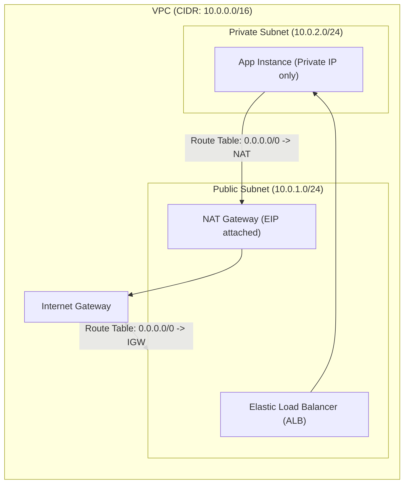

---
domains:
  - "aws"
  - "infra"
class: reference-note
tier: reference-note
tags:
  - aws/infrastructure
  - aws/regions
  - aws/vpc
  - aws/well-architected
---

# Module 3-1: AWS Global Infrastructure & Network Architecture

This module details the physical footprint of Amazon Web Services (AWS), core cloud computing paradigms, structural design patterns of the **AWS Well-Architected Framework**, logical networking through **Virtual Private Cloud (VPC)**, and hybrid cloud connectivity.

---

## 🗺️ Cognitive Map: VPC Network Routing Topology

---

## 1. Cloud Foundational Concepts & Virtualization

### A. Virtualization Foundations
Virtualization abstractions partition physical host resources into isolated logical environments:
*   **Physical Host:** Underlying bare-metal computing hardware.
*   **Hypervisor (Hardware Abstraction Layer - HAL):** Hypervisors split physical compute, memory, and network resources.
*   **Virtual Machine (VM):** The guest operating system running on simulated hardware, exposed in AWS as an **Amazon EC2 instance**.

### B. Cloud Deployment Models
*   **Public Cloud:** Computing resources owned and operated by a third-party Cloud Service Provider (CSP) (e.g., AWS, GCP, Azure) and delivered over the public internet.
*   **Private Cloud:** On-premises virtualization environments (e.g., OpenStack, VMware Cloud Foundation) managed internally.
*   **Hybrid Cloud:** Integrating on-premises infrastructure and public cloud environments via secure tunnels (VPN/Direct Connect) so they present as a single logical network.
*   **Multi-Cloud:** Combining multiple distinct public cloud vendors (AWS + GCP + Azure) to leverage best-of-breed services or avoid vendor lock-in.

### C. Cloud Provisioning Models (Shared Responsibility Boundary)
*   **Infrastructure as a Service (IaaS):** AWS handles physical hardware and virtualization. The customer manages OS patching, runtimes, and application layers (e.g., EC2, EBS).
*   **Platform as a Service (PaaS):** AWS manages the OS, runtime, and infrastructure. The customer only manages code deployments and config (e.g., Elastic Beanstalk, RDS).
*   **Software as a Service (SaaS):** AWS manages the complete application stack. The customer only consumes the software interface (e.g., AWS Artifact).

---

## 2. Six Advantages of Cloud Computing & Economics
*   **Trade Capital Expense (CAPEX) for Variable Expense (OPEX):** Avoid massive upfront investments in data centers; pay only for consumed resources.
*   **Benefit from Massive Economies of Scale:** AWS's massive size allows them to procure hardware cheaper and pass savings to customers.
*   **Stop Guessing Capacity:** Avoid over-provisioning (paying for idle hardware) or under-provisioning (crashing during peak traffic) through cloud elasticity.
*   **Increase Speed & Agility:** Deploy resources in minutes with a few clicks.
*   **Stop Spending Money Running & Maintaining Data Centers:** Eliminate undifferentiated heavy lifting (cooling, security, hardware maintenance).
*   **Go Global in Minutes:** Deploy applications worldwide with ultra-low latency.

---

## 3. AWS Physical footprint & Edge Caching
AWS operates a global infrastructure designed to achieve maximum resilience and lowest latency:
*   **AWS Regions:** Isolated geographic locations containing multiple physically separated **Availability Zones (AZs)**. Choosing regions depends on data compliance, latency, cost, and service availability.
*   **Availability Zones (AZs):** One or more data centers with redundant power, cooling, and physical security.
*   **Edge Locations:** Points of Presence (PoPs) used by **Amazon CloudFront** to cache content close to end users.
    *   *CloudFront Invalidation:* A process to purge cached assets from edge locations before their Time-To-Live (TTL) expires.

---

## 4. AWS Well-Architected Framework: The 6 Pillars
Architectural decisions should align with AWS's core design pillars:
1.  **Operational Excellence:** Automate with Infrastructure as Code (IaC), perform small, reversible changes, and anticipate failures.
2.  **Security:** Implement a strong identity foundation (least privilege), protect data at rest and in transit, and enable auditing (CloudTrail).
3.  **Reliability:** Design for failure, test disaster recovery, scale horizontally, and manage capacity dynamically.
4.  **Performance Efficiency:** Match resource types to workload demands, delegate heavy lifting, and use serverless.
5.  **Cost Optimization:** Implement Cloud Financial Management, pay only for consumed capacity, and analyze spending.
6.  **Sustainability:** Maximize utilization, minimize idle resources, and utilize energy-efficient services.

---

## 5. SAA Foundation & Global Infrastructure Details

---

## 6. VPC Deep Dive & Network Architecture
A **Virtual Private Cloud (VPC)** is a customer-defined private logical network inside an AWS Region.

### A. VPC Foundations
*   **CIDR Block:** Primary private IP range.
*   **Subnets:** Segmentations of the VPC CIDR confined to a single Availability Zone.
    *   *Public Subnets:* Have route entries to an **Internet Gateway (IGW)**.
    *   *Private Subnets:* Do not have direct routes to the internet.
*   **Route Tables:** Lists of paths directing network packages.
*   **Implied Router:** Managed routing fabric linking all subnets inside the VPC.

### B. VPC Components & Deeper Details

---

## 7. Deep-Intuition (AARF) Breakdowns

### AARF Breakdown: NAT Gateway vs. NAT Instance
1.  **The Answer (Core Pattern):** Deploy highly available, managed **NAT Gateways** within each Availability Zone where private subnets reside, configuring separate route tables per AZ pointing outbound traffic to the local NAT Gateway.
2.  **The Assumptions (Context):** A NAT Gateway requires an Elastic IP and must be launched in a public subnet with a route pointing to an Internet Gateway.
3.  **The Rationale (Why):** NAT Gateways are fully managed, scale up to 45 Gbps, and provide built-in redundancy. NAT Instances are single-node EC2 instances requiring manual security patching, source/destination check disabling, and custom failover scripts.
4.  **The Failure Loop (What if not):** Operating a single NAT Instance for multiple AZ private subnets creates a single point of failure. If that instance crashes, all outbound connections from private subnets fail, breaking database syncs and application API requests.
5.  **Alternative Case (When to use 'if not'):** In low-budget development/sandbox environments, use a single t3.micro NAT Instance to save costs.

### AARF Breakdown: SG and NACL Ephemeral Ports
1.  **The Answer (Core Pattern):** Layer security by applying restrictive instance-level Security Groups combined with subnet-level NACLs. When configuring custom NACLs, always ensure outbound rules permit return traffic to the client's ephemeral port range (typically TCP 1024-65535).
2.  **The Assumptions (Context):** TCP handshakes require two-way communication. Client browsers establish connections by selecting a random high-numbered port to receive responses.
3.  **The Rationale (Why):** SGs are stateful; they track connection state tables and allow return packets automatically. NACLs are stateless and evaluate every packet. Failing to configure outbound ephemeral port rules on a custom NACL blocks the return packet from leaving the subnet.
4.  **The Failure Loop (What if not):** If a custom NACL has inbound rules allowing port 80/443, but lacks an outbound rule allowing ports 1024-65535, a client attempting to load a website will experience connection timeouts. The packet enters the subnet, the server processes it, but the return packet is blocked at the subnet boundary by the stateless NACL.
5.  **Alternative Case (When to use 'if not'):** In development environments where network segmentation auditing is not required, use default Open NACLs (Allow All) and rely exclusively on Security Groups.

