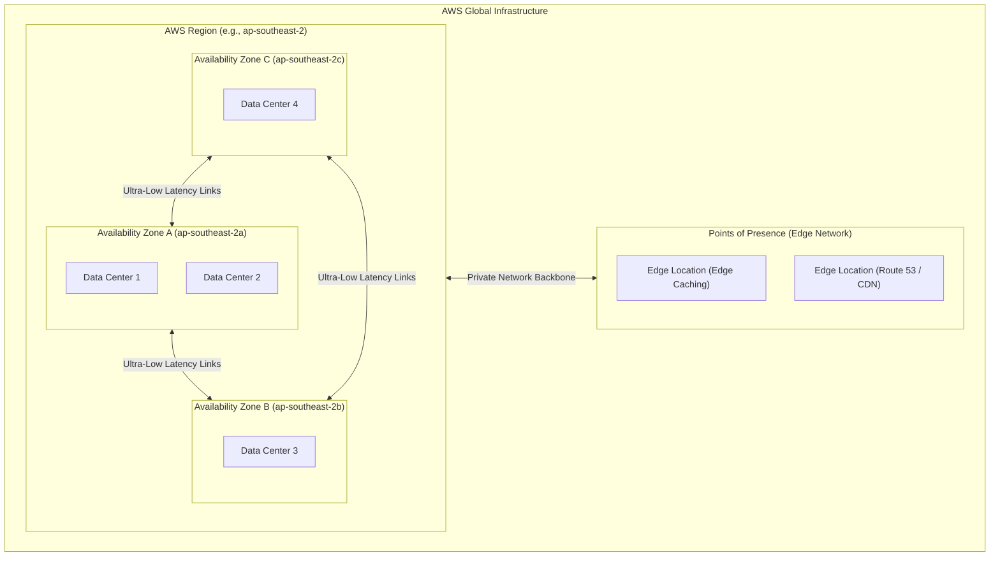

---
domains:
  - "aws"
class: reference-note
tier: reference-note
tags:
  - aws/infrastructure
---

# Module 3-1: AWS Global Infrastructure & Network Architecture

This module details the physical footprint of Amazon Web Services (AWS), core cloud computing paradigms, structural design patterns of the **AWS Well-Architected Framework**, logical networking through **Virtual Private Cloud (VPC)**, and hybrid cloud connectivity.

---

## 1. Cloud Foundational Concepts & Virtualization
### A. Virtualization Foundations
Virtualization abstractions partition physical host resources into isolated logical environments:
*   **Physical Host:** Underlying bare-metal computing hardware.
*   **Hypervisor (Hardware Abstraction Layer - HAL):** Hypervisors split physical compute, memory, and network resources.
*   **Virtual Machine (VM):** The guest operating system running on simulated hardware, exposed in AWS as an **Amazon EC2 instance**.
    *   *AWS Responsibility:* Power, hardware maintenance, hypervisor patching, and physical security are fully managed by AWS. Once a virtual machine is terminated, you only pay for the exact compute time consumed.

### B. AWS Historical Evolution
*   **2002:** Launched internally at Amazon.com to address resource sharing bottlenecks and realize the value of externalizing IT departments.
*   **2004:** First public service launched: **Simple Queue Service (SQS)**.
*   **2006:** Expanded and relaunched public cloud offerings with the availability of **SQS**, **Simple Storage Service (S3)**, and **Elastic Compute Cloud (EC2)**.
*   **Global Footprint:** Expanded beyond North America to Europe (commencing with Ireland) and subsequently globally.
*   **Market Leadership:** Recognized as a pioneer and industry leader (Leader in Gartner Magic Quadrant for 13+ consecutive years; generated $90B revenue in 2023 with 31% cloud market share in Q1 2024).
*   **Customer Base:** Powering millions of active customers, including Dropbox, Netflix, Airbnb, and NASA.

### C. Cloud Deployment Models
*   **Public Cloud:** Computing resources owned and operated by a third-party Cloud Service Provider (CSP) (e.g., AWS, GCP, Azure) and delivered over the public internet.
*   **Private Cloud:** On-premises virtualization environments (e.g., OpenStack, VMware Cloud Foundation) managed internally. This deployment operates under a CAPEX model but offers automation and orchestration similar to public clouds.
*   **Hybrid Cloud:** Integrating on-premises infrastructure and public cloud environments via secure tunnels (VPN/Direct Connect) so they present as a single logical network.
*   **Multi-Cloud:** Combining multiple distinct public cloud vendors (AWS + GCP + Azure) to leverage best-of-breed services or avoid vendor lock-in.

### D. Cloud Provisioning Models (Shared Responsibility Boundary)
*   **Infrastructure as a Service (IaaS):** AWS handles physical hardware and virtualization. The customer manages OS patching, runtimes, and application layers (e.g., EC2, EBS).
*   **Platform as a Service (PaaS):** AWS manages the OS, runtime, database engines, and infrastructure. The customer only manages code deployments and config (e.g., Elastic Beanstalk, RDS).
*   **Software as a Service (SaaS):** AWS manages the complete application stack. The customer only consumes the software interface over the web (e.g., AWS Artifact, Microsoft 365, Salesforce).

---

## 2. Six Advantages of Cloud Computing & Economics
*   **Trade Capital Expense (CAPEX) for Variable Expense (OPEX):** Avoid massive upfront capital investments in physical data centers; pay only for consumed capacity (pay-as-you-go).
*   **Benefit from Massive Economies of Scale:** AWS aggregates resource consumption across millions of active users, allowing them to purchase hardware at lower costs and pass savings to customers.
*   **Stop Guessing Capacity:** Avoid over-provisioning (idle resource waste) or under-provisioning (crashes during traffic peaks) by using elasticity to expand and shrink resources on demand.
*   **Increase Speed & Agility:** Provision and configure infrastructure globally in minutes with a few clicks or API calls, reducing procurement cycles from months to seconds.
*   **Stop Spending Money Running & Maintaining Data Centers:** Eliminate the undifferentiated heavy lifting of rack installation, cooling, real estate, and physical site security.
*   **Go Global in Minutes:** Deploy workloads globally across multiple geographic locations with ultra-low latency and robust disaster recovery capabilities.

---

## 3. AWS Physical Footprint & Edge Caching
AWS operates a highly resilient global infrastructure designed for high availability, fault tolerance, and minimal user latency.

### A. Infrastructure Hierarchy & Topology
*   **AWS Regions:** Isolated geographic areas containing multiple physically separated **Availability Zones (AZs)**.
    *   *Private Network Backbone:* Regions are interconnected via AWS's private, high-speed, dedicated fiber-optic network backbone.
*   **Availability Zones (AZs):** One or more discrete data centers with redundant power, cooling, and network connectivity.
    *   *Design:* Each region has a minimum of 3 (up to 6) AZs (e.g., Sydney region `ap-southeast-2` consists of `ap-southeast-2a`, `ap-southeast-2b`, and `ap-southeast-2c`).
    *   *Disaster Isolation:* AZs are isolated from geographic disasters (designed to prevent cascading failures) while staying physically close enough to connect via ultra-low-latency, high-bandwidth private networks.
*   **Edge Locations (Points of Presence - PoPs):** Edge nodes used to cache content closer to end-users (e.g., via **Amazon CloudFront** CDN) and route DNS (via **Amazon Route 53**).
    *   *Scale:* Over 400 Points of Presence in 90 cities across 40 countries.
    *   *CloudFront Invalidation:* A process to purge cached assets from edge locations before their Time-To-Live (TTL) expires.

### B. AWS Region Selection Criteria
When deploying resources, choosing the optimal AWS region depends on four primary factors:
1. **Compliance and Data Governance:** Legal or regulatory requirements mandating that data remain within specific geographic boundaries (e.g., France requiring local storage, thus choosing `eu-west-3` Paris).
2. **User Latency:** Deploying workloads in the region closest to the user base to minimize network latency (e.g., users in Europe should target `eu-west-1` Ireland).
3. **Service Availability:** Not all AWS services or features are available in every region. Services availability must be audited on the AWS Regional Services Table.
4. **Pricing and Cost:** Service rates vary between regions based on local power tariffs, real estate costs, and taxation.

### C. Resource Scope: Global vs. Regional Services
*   **Global Services:** Shared across the entire AWS platform; do not require region selection. Examples: **IAM**, **Route 53**, **CloudFront**, and **WAF**.
*   **Regional Services:** Scoped and isolated within a single AWS region. Resources in one region are invisible to others unless explicitly configured. Examples: **EC2**, **Lambda**, **Elastic Beanstalk**, **RDS**, and **Rekognition**.

EC2 SLIDES

---

---

## 4. AWS Well-Architected Framework: The 6 Pillars
Architectural decisions should align with AWS's core design pillars:
1.  **Operational Excellence:** Automate with Infrastructure as Code (IaC), perform small, reversible changes, and anticipate failures.
2.  **Security:** Implement a strong identity foundation (least privilege), protect data at rest and in transit, and enable auditing (CloudTrail).
3.  **Reliability:** Design for failure, test disaster recovery, scale horizontally, and manage capacity dynamically.
4.  **Performance Efficiency:** Match resource types to workload demands, delegate heavy lifting, and use serverless.
5.  **Cost Optimization:** Implement Cloud Financial Management, pay only for consumed capacity, and analyze spending.
6.  **Sustainability:** Maximize utilization, minimize idle resources, and utilize energy-efficient services.

---
title: Cloud-Deployment-Models-2
tags:
Date:
DeeperDive:
---
### Cloud provisioning models 

SaaS --> Microsoft 365 suite is the biggest example of SaaS I don't care about neither Infrastructure nor the platform highest level of provisioning 

PaaS --> Elastic Beanstalk service the service will handle the run time environment for my application so the platform is ready for deployment which is my responsibility (Application , Database)  

IaaS --> The infrastructure Hardware is AWS responsibility the rest is on me setting the machine from scratch

![[Screenshot from 2025-04-15 21-17-29.png]]
### Module 3:AWS Global Infrastructure Overview
#### Regions and AZs

![[Pasted image 20250719153509.png]]

![[Pasted image 20250719153531.png]]

![[Pasted image 20250719153624.png]]

![[Pasted image 20250719153735.png]]

--------------------------
#### CloudFront service 

The website shows AWS global infrastructure with all its AZs and regions 

cloudFront is inside the edge locations 

the internet routes is not predictable so it can use a route in the request and use a completely different one in the reply so it will cause delay 

![[Pasted image 20250719154304.png]]

![[Pasted image 20250719154322.png]]

Request goes to the nearest edge location if is wasn't there its considered a miss a cache the CDN use aws backbone network to retrieve the data from the source and reply the data to the requester and when other users request the same data its cache hit faster in replying 

![[Pasted image 20250719154504.png]]

![[Pasted image 20250719154825.png]]![[Pasted image 20250719154834.png]]

------------
#### Services from the slides 
 services 
  ![[Pasted image 20250721012623.png]]

  ![[Pasted image 20250721012637.png]]

  ![[Pasted image 20250721012645.png]]

  ![[Pasted image 20250721012655.png]]

  ![[Pasted image 20250721012726.png]]

Security Groups
	  have only permit rules. no deny rules. If no permits are found it is considered as an implied deny.
	- Can add up to 16 (5 default maximum) Security Groups per EC2 instance.
	- Security Groups are stateful, meaning that if the traffic is allowed either if its inbound or outbound, the opposite direction response is automatically allowed even if no permit rules were found.
	

NACL
	- NACL functions at a subnet level, so it's applied to all EC2 instances inside the subnet.
	- It's applied at the implied router
	- NACLs are **Stateless** "one way only".
	- It includes permit & deny rules.
	- Each NACL rule has a sequence number, rules are elevated from lowest to highest sequence number.
	- Once a rule is found either permit or deny the process is stopped "no reading for rest of the rules", if none are found it ends with explicit deny.
	- Traffic going into Subnet is called inbound traffic, & traffic from the Subnet is called outbound traffic.

-----------

### Module 4: AWS Cloud Security
#### shared responsibility model 
![[Pasted image 20250508105843.png]]

![[Pasted image 20250721002936.png]]

![[Pasted image 20250721003315.png]]

![[Pasted image 20250721003928.png]]

![[Pasted image 20250721004105.png]]

![[Pasted image 20250721004124.png]]

![[Pasted image 20250721004223.png]]

![[Pasted image 20250721004235.png]]

![[Pasted image 20250721004038.png]]

#### Securing new AWS account 

Walk-through 
 
![[Pasted image 20250508134144.png]] 

Cloud Trail
	 Any actions "APIs" taken by IAM users, roles or AWS services are recorded in CloudTrail.
	- Events can be viewed & downloaded.
	- It helps in governance & auditing the account.
	- Events history are maintained for 90 days.
	- Logs can be stored in a S3 Bucket for more than 90 days if desired, **this is encrypted by default.**
	- CloudTrail is integrated with SNS.
	- A trail created in the console is a multi-region trail, use the command interface to make a region trail.
	  so Console cloud trail is multi-region scope
	  And CLI if I want to make a single region trail 

#### AWS KMS

![[Pasted image 20250721011129.png]]

![[Pasted image 20250721011108.png]]

![[Pasted image 20250721011156.png]]

#### AWS Cognito
![[Pasted image 20250721010454.png]]

#### AWS Shield
![[Pasted image 20250721011337.png]]

![[Pasted image 20250721011429.png]]

#### AWS Artifact 
![[Pasted image 20250721011753.png]]

AWS Config
![[Pasted image 20250721012119.png]]
Enterprise and Enterprise Ramp-On 
TAM --- Support Roles ,Proactive Approaches

![[Pasted image 20250722211238.png]]

AWS Expects 
 - operational Excellence through 
	- use automation whenever possible --> 
	  speed , less human intervention = less human errors

	- Monitor and track everything --> track running metrics (CPU,NETWORK,BOTTLENECK,IO)
	
	- Continuous improvement

 - Security 
	- Use "least-privilege" access --> each service/user has the least needed privileges to operate (المعرفه علي قدر الاحتياج)
	
	- Use Multifactor Authentication
	
	- Use IAM (Identity and Access Management) --> AWS expects us to use this service to set policies for users 
	
	- Protect data in-transit and at rest --> AWS expects us encrypt data in both states 
	
	- Monitor and Audit continuously
	  Audit : event logs for actions that happens on the system

 - Reliability  موثوقيه 
	- Implement Disaster Recovery techniques --> 
	  Design for failure
	
	- Make use of Autoscaling 
	
	- Test and validate regulary --> Try fail over scenario in disaster recovery  

 - Performance Efficiency 
	- choose the right tool for the job 
	  Lets we used EBS storage services for storage only while it is designed to able to work with EC2 instances so it was more appropriate to use S3 bucket, using EBS is money waste we didn't fully utilize its function
	
	- Optimize resource utilization and implement scaling --> start with average needed resources and scale when in demand, Cost effective approach.
	
	- user performance benchmarks --> Test the application on different traffic scenarios to have a sense of accurate Resource requirement according to demand and traffic on my app for better performance efficiency (creating a benchmark)

 - Cost Optimization 
	- use the right instance type
	
	- use AWS cost saving plans(Reserved Instance , Spot instances)
	
	- monitor and track costs 

 - Sustainability   استدامه 
	- Use environment friendly resources 
	- terminate any unused (idle) resources

Fault Tolerance 

 ![[Pasted image 20250722214026.png]]

  With the load balancer and the two EC2 instance we achieved high availability, Now suppose we added an Autoscaling group to guarantee the existence of two EC2 instance so if of one of the two EC2 terminated the AG will create another one in any of the two AZ either the same or another available its AG responsibility, so by adding two EC2 with LB we are highly available but the AG should be added and its always comes with a package when LB is mentioned  

 But are we 100% fault tolerant ?? 
 Absolutely not because when AG executes the Boot time may be minutes so the application behavior will be affected until its ready to receive traffic  

 In case of using container instead of VM the boot process will be faster and in scenarios like these we may be fault tolerant 

 To be fault tolerant 
 Suppose a third AZ and its in the AG and the three instance is up and they are the minimum to run my app , with threshold 60% cpu usage now we guaranteed 100% fault tolerance and elasticity  

Trusted Advisor 
  slides 

---

---

## 5. SAA Foundation & Global Infrastructure Details
---
tags:
  - AWS-EISSA-ABO-SHERIF
Type: Reference Note
source: DOLPHIN-ED-Video-1-3
page: 
links: 
flogetzzel:
---

---

# Introduction To what is Cloud
Key Architecture Pillars: To speak architecture language to a client...

Course approach:
![[Pasted image 20250508104234.png]]

Blue --> course services 
Green -->  Content delivery  

Never to skipping a section again without hands-on every day Reviewing Reviewing Reviewing Reviewing Reviewing Reviewing Reviewing Reviewing Reviewing Reviewing Reviewing Reviewing Reviewing Reviewing Reviewing Reviewing Reviewing Reviewing Reviewing Reviewing Reviewing Reviewing Reviewing Reviewing 

------------

![[Pasted image 20250508105636.png]]

![[Pasted image 20250508105843.png]]

-------------

---

# Part 1: Basics & Concepts

---

## Cloud types:
Using Cloud Servers provide much more efficiency than on-Premises data centers, regarding cost, reliability & time.
### - Public Cloud & Private Cloud
Public cloud is Publicly shared among customers, while Private cloud is for only one customer...
 
So Private cloud is also a CAPEX model like traditional data centers but it comes with the sense of automation and orchestration found in public cloud

cloud = Infrastructure + Automation  + Orchestration (Add and remove services )

### - Hybrid cloud
A mix between public cloud & on-premises Private Cloud, to provide privacy & security for specific services while the other services are on Public cloud.
- It's a more complex solution as the organization has to manage multiple plat forms.
- Suitable for effectiveness, backup, disaster recovery, development & testing.
### - Multi cloud
The use of multiple & different cloud computing & storage services in a single structure. Mostly because some services are better in each cloud provider than others for a specific use.
### - Hybrid Multi Cloud
Using Hybrid cloud concept but with multiple vendors and a On premise all of that is connected.

---

## "Automation & Orchestration" Concept
- Automation concept is making the cloud processes automatic, like deployment, provisioning, upgrading, testing, etc.
- Orchestration concept is the idea of expanding your infrastructure.

---

## "Vendor lock-in" Concept
Using a specific cloud vendor in a major way & concentrating on its services makes it difficult to move to another vendor if required.
Vendor lock-in is using cloud formation EKS instead of terraform and kubernetes which can be used with any cloud provider

---

## AWS Cloud Services

---

## AWS Global presence 
8th of May 2025 
![[Pasted image 20250508114815.png]]

---

## Creating Billing Alarms
Using the Root User, limiting bills to as low as 1$ & setting Billing alarms can be done through the Budgets tab in the Billing Dashboard.
This can be set to be a continuous **"Recurring budget"** or an **"Expiring Budget"**.
This is very important step to avoid unexpected bills over the budget plan.

---

# Part 2: VPC Deep Dive
----------
