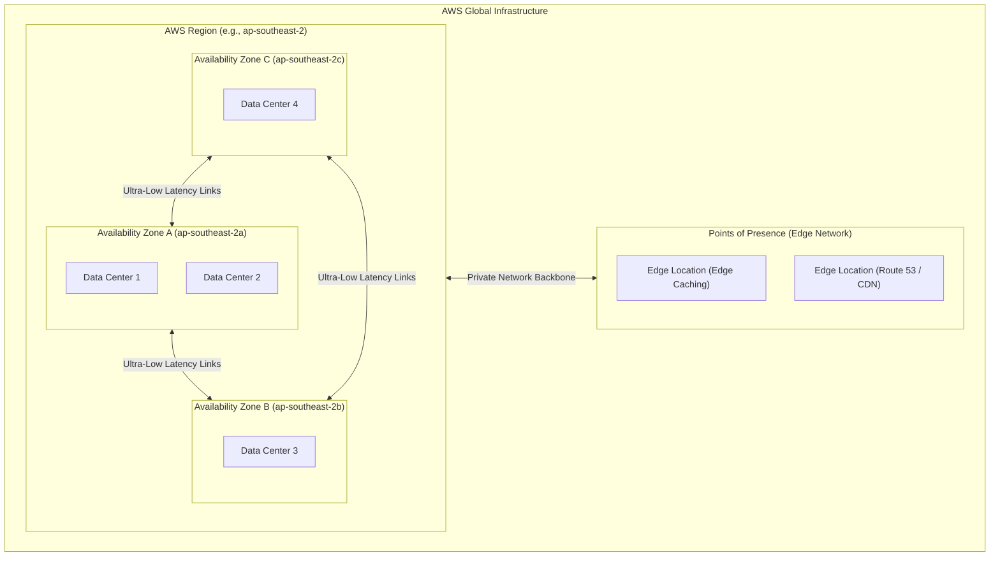

---
domains:
  - "aws"
class: reference-note
tier: reference-note
tags:
  - aws/infrastructure
---

# Module 3-1: AWS Global Infrastructure & Console Architecture

This module details the historical evolution, market scale, physical footprint of Amazon Web Services (AWS), core cloud computing paradigms, and the logical/physical design patterns of regions, availability zones, and edge locations.

---

## 1. Cloud Foundational Concepts & Virtualization
### A. Virtualization Foundations
Virtualization abstractions partition physical host resources into isolated logical environments:
*   **Physical Host (Bare-Metal):** The underlying physical computing hardware.
*   **Hypervisor (Hardware Abstraction Layer - HAL):** Software/firmware layer that splits physical compute, memory, and network resources.
*   **Guest Operating System (Virtual Machine):** The OS running on simulated hardware, exposed in AWS as an **Amazon EC2 instance**.
    *   *AWS Responsibility:* Power, hardware maintenance, hypervisor patching, and physical security are fully managed by AWS.
    *   *Pricing Model:* Once a virtual machine is terminated, you only pay for the exact compute time consumed (on-demand variable model).

### B. Cloud Deployment Models
*   **Public Cloud:** Computing resources owned and operated by a third-party Cloud Service Provider (CSP) (e.g., AWS, GCP, Azure) and delivered over the public internet.
*   **Private Cloud:** On-premises virtualization environments (e.g., OpenStack, VMware Cloud Foundation) managed internally. While it operates under a CAPEX model, it introduces cloud-like automation and orchestration.
*   **Hybrid Cloud:** Integrating on-premises infrastructure and public cloud environments via secure tunnels (VPN/Direct Connect) to form a single logical network.
*   **Multi-Cloud:** Combining multiple distinct public cloud vendors (e.g., AWS + GCP + Azure) to leverage best-of-breed services or avoid vendor lock-in.

### C. Cloud Provisioning Models (Shared Responsibility Boundary)
*   **Infrastructure as a Service (IaaS):** AWS handles physical hardware and virtualization. The customer manages OS patching, runtimes, and application layers (e.g., EC2, EBS).
*   **Platform as a Service (PaaS):** AWS manages the OS, runtime, database engines, and underlying infrastructure. The customer only manages code deployments and configurations (e.g., Elastic Beanstalk, RDS).
*   **Software as a Service (SaaS):** AWS manages the complete application stack. The customer only consumes the software interface over the web (e.g., AWS Artifact, Microsoft 365, Salesforce).

---

## 2. Six Advantages of Cloud Computing & Economics
*   **Trade Capital Expense (CAPEX) for Variable Expense (OPEX):** Avoid massive upfront capital investments in physical data centers; pay only for consumed capacity (pay-as-you-go).
*   **Benefit from Massive Economies of Scale:** AWS aggregates resource consumption across millions of active users, allowing them to purchase hardware at lower costs and pass savings to customers.
*   **Stop Guessing Capacity:** Avoid over-provisioning (idle resource waste) or under-provisioning (crashes during traffic peaks) by using elasticity to expand and shrink resources on demand.
*   **Increase Speed & Agility:** Provision and configure infrastructure globally in minutes with a few clicks or API calls, reducing procurement cycles from months to seconds.
*   **Stop Spending Money Running & Maintaining Data Centers:** Eliminate the undifferentiated heavy lifting of rack installation, cooling, real estate, and physical site security.
*   **Go Global in Minutes:** Deploy workloads globally across multiple geographic locations with ultra-low latency and robust disaster recovery capabilities.

---

## 3. AWS Historical Evolution & Market Leadership
*   **2002:** Launched internally at Amazon.com to address resource sharing bottlenecks and realize the value of externalizing IT departments.
*   **2004:** First public service launched: **Simple Queue Service (SQS)**.
*   **2006:** Expanded and relaunched public cloud offerings with the availability of **SQS**, **Simple Storage Service (S3)**, and **Elastic Compute Cloud (EC2)**.
*   **Global Footprint:** Expanded beyond North America to Europe (commencing with Ireland) and subsequently globally.
*   **Market Leadership:** 
    *   Recognized as a pioneer and industry leader (Leader in Gartner Magic Quadrant for 13+ consecutive years).
    *   Generated $90B revenue in 2023.
    *   Holds approximately 31% cloud market share in Q1 2024 (with Microsoft Azure second at 25%).
    *   Powers over 1 million active users.
*   **Customer Base & Use Cases:** Powering millions of active customers, including Dropbox, Netflix, Airbnb, and NASA. Applicable use cases range from enterprise IT migration and big data analytics to website hosting, mobile backends, and gaming servers.

---

## 4. AWS Physical Footprint & Global Infrastructure
AWS operates a highly resilient global infrastructure designed for high availability, fault tolerance, and minimal user latency.

### A. Infrastructure Hierarchy & Topology
*   **AWS Regions:** Isolated geographic areas containing multiple physically separated **Availability Zones (AZs)**.
    *   *Private Network Backbone:* Regions are interconnected via AWS's private, high-speed, dedicated fiber-optic network backbone.
*   **Availability Zones (AZs):** One or more discrete data centers with redundant power, cooling, and network connectivity.
    *   *Design:* Each region has a minimum of 3 (up to 6) AZs (e.g., Sydney region `ap-southeast-2` consists of `ap-southeast-2a`, `ap-southeast-2b`, and `ap-southeast-2c`).
    *   *Disaster Isolation:* AZs are isolated from geographic disasters (designed to prevent cascading failures) while staying physically close enough to connect via ultra-low-latency, high-bandwidth private networks.
*   **Edge Locations (Points of Presence - PoPs):** Edge nodes used to cache content closer to end-users (e.g., via **Amazon CloudFront** CDN) and route DNS (via **Amazon Route 53**).
    *   *Scale:* Over 400 Points of Presence in 90 cities across 40 countries.

### B. AWS Region Selection Criteria
When deploying resources, choosing the optimal AWS region depends on four primary factors:
1. **Compliance and Data Governance:** Legal or regulatory requirements mandating that data remain within specific geographic boundaries (e.g., France requiring local storage, thus choosing `eu-west-3` Paris).
2. **User Latency:** Deploying workloads in the geographic region closest to the user base to minimize network latency (e.g., users in Europe should target `eu-west-1` Ireland).
3. **Service Availability:** Not all AWS services or features are available in every region. Services availability must be audited on the AWS Regional Services Table.
4. **Pricing and Cost:** Service rates vary between regions based on local power tariffs, real estate costs, and taxation.

### C. Resource Scope: Global vs. Regional Services
*   **Global Services:** Shared across the entire AWS platform; do not require region selection. Examples: **IAM**, **Route 53**, **CloudFront**, and **WAF**.
*   **Regional Services:** Scoped and isolated within a single AWS region. Resources in one region are invisible to others unless explicitly configured. Examples: **EC2**, **Lambda**, **Elastic Beanstalk**, **RDS**, and **Rekognition**.

---

## 5. AWS Console Tour & UI Architecture
*   **Console Home Selector:** Users can select their active working region via the dropdown in the top-right corner of the AWS Console (e.g., choosing `eu-west-1` for Ireland). It is recommended to choose a region closest to the user's location to minimize latency.
*   **Navigation Options:**
    *   *Services Menu:* Located in the top-left corner, organizing services alphabetically or by category (Compute, Storage, Database, etc.).
    *   *Search Bar:* Allows users to quickly search for specific services, key features, blog posts, documentation, and knowledge base articles.
*   **Console Home Widgets:** Provides dashboard widgets for health notifications, cost/usage summary, and quick-start tutorials.
*   **UI Modernization Updates:**
    *   *Visual Changes:* The updated AWS Console features rounded, bright-blue buttons and modern shapes compared to the older UI which used gray, square buttons and a paler blue scheme.
    *   *Usability:* From a functional and usability perspective, both UIs operate identically. Buttons remain in the same logical locations despite the aesthetic refresh.
