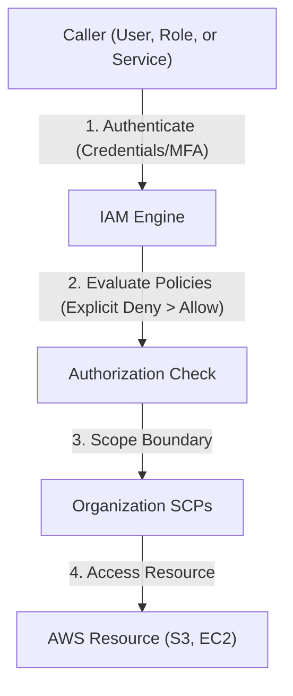

---
domains:
  - "aws"
  - "infra"
---

# Module 3-1: AWS Global Infrastructure & Identity (IAM)

This module covers the global physical footprint of AWS and secure identity configuration. It details global infrastructure layers, IAM access controls, AWS Organizations governance, billing management, and KMS encryption.

---

## 🗺️ Cognitive Map: IAM Authentication and Authorization



---

## 1. AWS Global Infrastructure Primitives

AWS provides cloud services globally through a highly available physical infrastructure split into Regions, Availability Zones, and Edge Locations.

*   **Regions:** Geographic areas containing multiple isolated and physically separated Availability Zones.
*   **Availability Zones (AZs):** One or more discrete data centers with redundant power, networking, and connectivity. Designed for fault isolation.
*   **Edge Locations:** Points of presence used by Amazon CloudFront (CDN) to cache content close to end users for low-latency delivery.

---

## 2. Identity & Access Management (IAM)

IAM securely controls access to AWS resources.

### A. Core Components:
*   **Users:** Physical people or applications requiring direct API access.
*   **Groups:** Collections of IAM users. Policies attached to a group apply to all its users.
*   **Roles:** Temporary identities assumed by users, applications, or AWS services (like EC2) using token-based credentials.
*   **Policies:** JSON documents defining permissions (Allow/Deny actions on specific resources).

### B. AWS KMS Encryption
AWS Key Management Service (KMS) manages cryptographic keys used to encrypt data at rest.

#### Deep-Intuition (AARF) Breakdown:
1. **The Answer (Core Pattern):** Utilize KMS Customer Managed Keys (CMK) with defined key rotation and explicit IAM Key Policies:
    ```json
    {
      "Sid": "AllowUseOfTheKey",
      "Effect": "Allow",
      "Principal": {"AWS": "arn:aws:iam::123456789012:role/AppRole"},
      "Action": ["kms:Decrypt", "kms:GenerateDataKey*"],
      "Resource": "*"
    }
    ```
2. **The Assumptions (Context):** The calling application role must have permission to access both the S3 bucket/EBS volume *and* the KMS key used to encrypt them.
3. **The Rationale (Why):** Separates administrative keys from data access. S3 default encryption handles encryption transparently, but KMS permits fine-grained auditing of key usage via CloudTrail.
4. **The Failure Loop (What if not):** If IAM roles lack key permissions, attempts to write or read encrypted S3 objects fail with an `Access Denied` error, even if the user has full S3 permissions.
5. **Alternative Case (When to use 'if not'):** For non-sensitive data where access auditing is not a regulatory requirement, use S3 Managed Keys (SSE-S3) to avoid KMS API transaction costs.

---

## 3. AWS Organizations & Service Control Policies (SCPs)

AWS Organizations allows managing multiple AWS accounts from a consolidated console.

#### Deep-Intuition (AARF) Breakdown:
1. **The Answer (Core Pattern):** Configure Service Control Policies (SCPs) at the Organization Unit (OU) level to restrict maximum permissions:
    ```json
    {
      "Version": "2012-10-17",
      "Statement": [
        {
          "Effect": "Deny",
          "Action": "organizations:LeaveOrganization",
          "Resource": "*"
        }
      ]
    }
    ```
2. **The Assumptions (Context):** SCPs apply only to member accounts, not the management (root) account. They restrict maximum permissions but do not grant access on their own (an IAM policy is still required).
3. **The Rationale (Why):** Implements strong organizational guardrails. Prevents member accounts from disabling auditing tools (like CloudTrail) or spinning up unapproved expensive resources, regardless of local administrator permissions.
4. **The Failure Loop (What if not):** Without SCPs, a compromised administrator account in a member VPC can delete logs, disable security agents, and launch massive GPU clusters for malicious crypto-mining, incurring runaway costs.
5. **Alternative Case (When to use 'if not'):** For isolated research and development sandboxes where developers need unrestricted API freedom, apply relaxed SCP boundaries.
