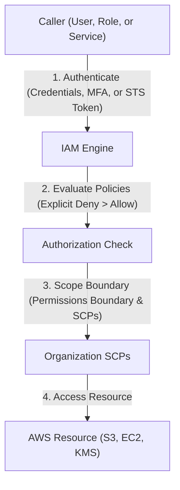

---
domains:
  - "aws"
  - "infra"
---

# Module 3-1: AWS Global Infrastructure & Identity (IAM)

This module covers the physical footprint of AWS, cloud deployment/service models, foundational design principles, secure identity controls, governance structures, billing architectures, and key management services.

---

## 🗺️ Cognitive Map: IAM Authentication and Authorization



---

## 1. AWS Global Infrastructure Primitives

AWS operates a global, resilient, and low-latency physical infrastructure consisting of three primary layers:

### A. Regions
*   **Definition:** Geographic areas containing multiple isolated and physically separated Availability Zones.
*   **Scope:** Services are typically scoped regionally (e.g., S3, KMS) or globally (e.g., IAM, Route 53).
*   **Design Considerations:** Choose regions based on compliance/governance (e.g., GDPR), latency to end users, service availability, and cost.

### B. Availability Zones (AZs)
*   **Definition:** One or more discrete data centers with redundant power, cooling, physical security, and ultra-low-latency network connectivity.
*   **Fault Isolation:** Each AZ is physically isolated from others to prevent concurrent failure due to environmental disasters (e.g., floods, power outages). They communicate via private, high-speed fiber-optic links.

### C. Edge Locations & CloudFront CDN
*   **Definition:** Points of Presence (PoPs) used by **Amazon CloudFront** to cache content close to end users.
*   **Traffic Flow:**
    *   **Cache Hit:** Client requests content -> nearest Edge Location serves it instantly with minimal latency.
    *   **Cache Miss:** Edge Location forwards request to the source (e.g., S3 or ALB) via the high-speed AWS backbone network, caches the response, and returns it to the client.
*   **CloudFront Invalidation:** A process to purge cached files from edge locations before their Time-To-Live (TTL) expires, ensuring users immediately receive updated assets.

---

## 2. Cloud Deployment & Service Models

Understanding virtualization and service categorization is critical for cloud economics and architecture design.

### A. Virtualization Basics
*   **Physical Machine:** The physical hardware host.
*   **Hypervisor:** The hardware abstraction layer that splits physical resources into multiple virtual environments.
*   **Virtual Machine (VM):** The guest operating system running on simulated hardware (represented by **Amazon EC2**).

### B. Service Models (Shared Responsibility Boundary)
*   **Infrastructure as a Service (IaaS):** AWS manages physical hardware, cooling, and virtualization. The client is responsible for OS patching, applications, runtime, and network security (e.g., EC2, EBS).
*   **Platform as a Service (PaaS):** AWS manages the OS, runtime, and deployment environments. The client only manages code deployment and configurations (e.g., Elastic Beanstalk, RDS).
*   **Software as a Service (SaaS):** AWS manages the complete application stack. The client only consumes the product (e.g., Microsoft 365, Salesforce, AWS Artifact).

### C. Deployment Models
*   **Public Cloud:** Computing resources owned and operated by a third-party CSP, accessible over the internet (e.g., AWS, GCP).
*   **Private Cloud:** On-premise infrastructure running virtualization/orchestration stacks (e.g., OpenStack), managed internally.
*   **Hybrid Cloud:** Integration of on-premise and public cloud via secure channels (VPN or Direct Connect), presenting as a unified network.
*   **Multi-Cloud:** Utilizing multiple distinct cloud vendors (AWS + GCP + Azure) to avoid vendor lock-in or leverage specific best-of-breed services.

---

## 3. AWS Well-Architected Framework: The 6 Pillars

AWS architectural choices must align with the six design pillars:

1.  **Operational Excellence:** Use Infrastructure as Code (IaC) / automation, perform frequent, small, reversible changes, and anticipate failures.
2.  **Security:** Implement a strong identity foundation (least privilege, MFA), enable traceability (CloudTrail), protect data in transit and at rest (encryption), and automate security response.
3.  **Reliability:** Design for failure, test disaster recovery procedures, scale horizontally (Auto Scaling), and manage capacity via auto-scaling.
4.  **Performance Efficiency:** Democratize advanced technologies, use serverless architectures, and match resource types to workloads.
5.  **Cost Optimization:** Implement Cloud Financial Management, adopt a consumption model, measure overall efficiency, and stop spending money on undifferentiated heavy lifting.
6.  **Sustainability:** Maximize utilization, minimize idle resources, and utilize energy-efficient hardware.

---

## 4. Identity & Access Management (IAM)

IAM secures resources through authentication (who you are) and authorization (what you can do).

### A. Core Components
*   **Root User:** The account creator. Has absolute power. Best practice: Enable MFA, lock away credentials, and use IAM roles for daily administration.
*   **IAM Users:** Permanent identity assigned to a person or application.
*   **IAM Groups:** Collections of users. Policies attached to a group apply to all members.
*   **IAM Roles:** Temporary identities assumed by trusted entities (users, services like EC2, or federated identities). Utilizes **AWS STS** to issue short-lived credentials.
*   **Policies:** JSON documents defining allowed/denied actions.
    *   *Explicit Deny:* Overrides any Allow.
    *   *Default Deny:* Access is blocked unless explicitly allowed.

### B. Programmatic Access
*   Access keys (Access Key ID and Secret Access Key) must be configured via AWS CLI (`aws configure`) or SDKs. Never hardcode access keys; use IAM Roles with STS instead.

#### Deep-Intuition (AARF) Breakdown: IAM Roles (STS) vs. Permanent Credentials
1.  **The Answer (Core Pattern):** Utilize IAM Roles associated with service execution profiles (e.g., EC2 Instance Profiles) to dynamically request short-lived credentials from AWS STS instead of storing static Access Keys on disk.
2.  **The Assumptions (Context):** The calling application or user must be inside a trust boundary recognized by the IAM trust policy, and local processes must fetch credentials dynamically from the IMDSv2 metadata endpoint (`http://169.254.169.254/latest/meta-data/iam/security-credentials/`).
3.  **The Rationale (Why):** Eliminates key leakage risks. Permanent credentials hardcoded in git repositories or saved on EC2 volumes are vulnerable to compromise. STS tokens expire automatically (configurable from 15 minutes to 12 hours), neutralizing leaked tokens.
4.  **The Failure Loop (What if not):** Storing static access keys in configurations on an EC2 instance that becomes compromised allows attackers to steal keys, bypass host controls, and directly call AWS APIs to spawn resources or extract database contents.
5.  **Alternative Case (When to use 'if not'):** For legacy on-premises applications that cannot integrate with IAM Roles or OpenID Connect (OIDC) identity providers, use strictly scoped IAM User access keys with aggressive rotation schedules managed via AWS Secrets Manager.

---

## 5. AWS Key Management Service (KMS) & Encryption

AWS KMS manages cryptographic keys (Customer Master Keys - CMKs) for data encryption at rest.

### A. KMS Envelope Encryption Mechanics
Envelope encryption uses a master key (CMK) to protect a data key, which is then used to encrypt the actual payload.

```
+---------------------+
|  Your Application   |
+---------------------+
          |
          | 1. Request Data Key from KMS
          v
+---------------------+
|        AWS KMS      |
|  (with your CMK)    |
+---------------------+
          |
          | 2. Returns:
          |    - Plaintext Data Key
          |    - Encrypted Data Key (encrypted with CMK)
          v
+---------------------+
|  Your Application   |
+---------------------+
          |
          | 3. Uses Plaintext Data Key to Encrypt Data
          v
+---------------------+
| Encrypted Data File |
| + Encrypted Data Key|
+---------------------+
```

1.  **Request:** Application requests a Data Key from KMS using a CMK.
2.  **Response:** KMS returns a Plaintext Data Key and an Encrypted Data Key (encrypted by the CMK).
3.  **Encryption:** Application encrypts the data with the Plaintext Data Key, then deletes the Plaintext Data Key from RAM.
4.  **Storage:** Application stores the encrypted data along with the Encrypted Data Key.
5.  **Decryption:** To decrypt, the application sends the Encrypted Data Key to KMS, which decrypts it using the CMK, and returns the Plaintext Data Key to decrypt the payload.

### B. Key Types & Properties
*   **Symmetric Keys:** Single 256-bit AES key used for encrypting and decrypting data. KMS CMKs never leave KMS.
*   **Asymmetric Keys:** Public/Private key pairs used for signing/verification or encryption/decryption (public key can be downloaded).
*   **AWS-Managed Keys:** Created by AWS on your behalf (e.g., `aws/s3`). Free, rotated automatically every 3 years. Cannot be shared or modified.
*   **Customer-Managed Keys:** Created and managed by you. Cost $1/month. Allow granular key policies, optional 1-year rotation, and sharing across accounts.

#### Deep-Intuition (AARF) Breakdown: KMS Customer Managed Keys (CMK)
1.  **The Answer (Core Pattern):** Utilize KMS Customer Managed Keys (CMKs) with explicit IAM Key Policies restricting access to authorized execution roles:
    ```json
    {
      "Sid": "AllowUseOfTheKey",
      "Effect": "Allow",
      "Principal": {"AWS": "arn:aws:iam::123456789012:role/AppExecutionRole"},
      "Action": [
        "kms:Decrypt",
        "kms:GenerateDataKey*"
      ],
      "Resource": "*"
    }
    ```
2.  **The Assumptions (Context):** The calling application role must have permission to access both the target storage resource (e.g., S3 bucket, EBS volume) *and* the KMS key used for envelope encryption.
3.  **The Rationale (Why):** Implements separation of duties. Restricting key permissions ensures that even if a user bypasses S3 bucket policies, they cannot read data without decrypting it, providing a double-barrier security topology and complete CloudTrail auditing.
4.  **The Failure Loop (What if not):** If IAM roles have S3 access but lack KMS Decrypt permissions on the custom CMK, application read API requests fail with `Access Denied` or `KMS.AccessDeniedException`, causing application crashes during startup or retrieval.
5.  **Alternative Case (When to use 'if not'):** For non-sensitive, high-volume workloads where API call costs are a major concern, use S3 Managed Keys (SSE-S3) to completely bypass KMS transaction charges.

---

## 6. AWS Organizations & Governance

AWS Organizations consolidated control allows managing multiple AWS accounts.

### A. Organizational Structure
*   **Management (Root) Account:** Handles consolidation, billing, and organizational policies.
*   **Member Accounts:** Standard accounts containing workloads.
*   **Organizational Units (OUs):** Logical groups of accounts used to apply policies hierarchically.

### B. Service Control Policies (SCPs)
SCPs act as organizational guardrails, defining the maximum permissions allowed in member accounts (but do not grant permissions on their own).

#### Deep-Intuition (AARF) Breakdown: Service Control Policies (SCPs)
1.  **The Answer (Core Pattern):** Enforce strict Deny policies at the Organizational Unit (OU) level to prevent root/admin users in member accounts from bypassing security configurations (e.g., disabling CloudTrail or leaving the organization):
    ```json
    {
      "Version": "2012-10-17",
      "Statement": [
        {
          "Effect": "Deny",
          "Action": [
            "organizations:LeaveOrganization",
            "cloudtrail:StopLogging",
            "cloudtrail:DeleteTrail"
          ],
          "Resource": "*"
        }
      ]
    }
    ```
2.  **The Assumptions (Context):** SCPs apply only to member accounts within the Organization, not to the master/management root account. An IAM policy is still required within the member account to grant access.
3.  **The Rationale (Why):** Enforces global corporate compliance rules. Even if a member account's administrator credentials are stolen, the attacker cannot delete audit logs or disable compliance tools because the SCP explicitly blocks those actions at the organization level.
4.  **The Failure Loop (What if not):** Without SCPs, a compromised admin account in a child sandbox can delete CloudTrail logs, delete backups, and spin up runaway GPU clusters for crypto-mining, rendering the incident untraceable.
5.  **Alternative Case (When to use 'if not'):** In standalone accounts or developer sandboxes not bound to corporate compliance frameworks, bypass SCPs to maximize API freedom and speed of experimentation.

---

## 7. Security, Auditing, & Monitoring Services

### A. AWS CloudTrail
Logs all API calls made to the account by users, roles, or services.
*   **Management Events:** Operations performed on resources (e.g., creating a subnet). Enabled and free by default.
*   **Data Events:** Resource-level data operations (e.g., S3 `GetObject`, Lambda invokes). Chargeable, disabled by default.
*   **Insights Events:** Detects anomalous write API activity. Chargeable, disabled by default.
*   **Scope:** Consoles create multi-region trails. The CLI can create single-region trails.
*   **Log File Integrity Validation:** Generates SHA-256 hashes for delivered log files. If a log is altered or deleted in S3, the digest signature validation will fail, revealing tampering.

### B. Additional Security Services
*   **AWS Config:** Monitors resource configurations over time, validating them against predefined compliance rules (e.g., "Ensure S3 buckets are private").
*   **AWS Cognito:** User identity and sync service for mobile/web apps (User Pools for signup/login, Identity Pools for accessing AWS resources).
*   **AWS Shield:** DDoS protection service. Standard (free, automated layer 3/4 protection) and Advanced (paid, layer 7 protection, WAF integration, DDoS response team).
*   **AWS Artifact:** Portal for on-demand access to AWS compliance reports and agreements (PCI, SOC, ISO).

---

## 8. Billing, Cost Management, & Support Plans

### A. Cloud Economics
*   **CAPEX (Capital Expenditure):** High upfront costs (data center construction, server procurement).
*   **OPEX (Operational Expenditure):** Dynamic, variable consumption costs (pay for only what you run).
*   **Pricing Drivers:** Compute (duration, size), Storage (volume, duration), and Outbound Data Transfer (ingress is free).
*   **Cost Management Tools:**
    *   **AWS Budgets:** Set recurring or expiring spending thresholds with custom alerts sent to SNS/emails.
    *   **AWS Pricing Calculator:** Web-based planning tool to model and estimate workload costs before deployment.

### B. AWS Support Plans
*   **Developer:** Business hour email access to support, general guidance.
*   **Business:** 24/7 phone/email access, architectural advice, 1-hour response for production-down issues.
*   **Enterprise:** TAM (Technical Account Manager - proactive architecture review, operational planning), 15-minute response for business-critical issues, Infrastructure Event Management.
