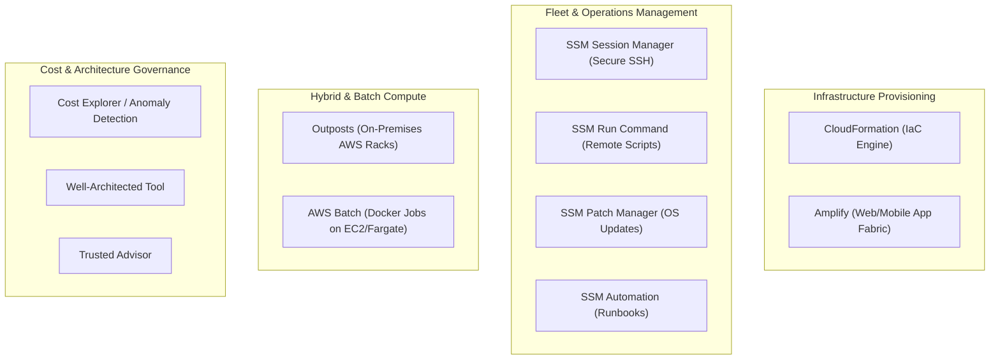

---
domains:
  - "aws"
class: reference-note
tier: reference-note
tags:
  - aws/management
  - aws/deployment
  - aws/billing
  - aws/governance
---

# Module 3-20: AWS Deployment, Management & Optimization Services

This module covers infrastructure deployment tools (CloudFormation, Amplify), hybrid cloud configurations (Outposts), batch operations (Batch), system management utilities (Systems Manager suite), marketing communications (SES, Pinpoint), billing tools, and the AWS Well-Architected Framework.

---

## 🗺️ Cognitive Map: Management & Observability Operations

To build a strong intuition for deployment and management operations, think of the services grouped by operational domains:

---

## 1. Infrastructure Provisioning as Code

### AWS CloudFormation
*   **Purpose:** Declarative Infrastructure as Code (IaC) engine. Outlines infrastructure stacks in JSON or YAML templates.
*   **Change Sets:** Previews changes before they are applied. Displays whether resources will be added, modified, or replaced.
    *   *Replacement behavior:* Certain properties (like AvailabilityZone or DB engines) require recreating the resource (`Replacement: True`). This causes downtime and deletes ephemeral data.
*   **Tag Propagation:** Stack-level tags are automatically inherited and applied to all supported resources in the stack.
*   **CloudFormation Service Roles:** Dedicated IAM roles that delegate permissions to CloudFormation to create, update, and delete stack resources on your behalf. This enforces the least-privilege model because users only need permissions to execute the stack, not direct access to resources (requires the user to have the `iam:PassRole` permission to pass the service role to CloudFormation).

### AWS Amplify
*   **Purpose:** A mobile and web application development fabric and hosting service. It acts as a pre-configured framework for fast application builds.
*   **Backend Automation:** Automatically provisions backend resources (Cognito for auth, S3 for storage, AppSync/API Gateway for GraphQL/REST APIs, and DynamoDB/Lambda for databases/functions) using a single framework.
*   **CLI Build Integrations:** Offers CLI-based workflows to initialize, configure, and connect backend components to frontend client libraries.
*   **Frontend Deployment:** Connects to repository hosts (GitHub, GitLab, Bitbucket) to automate CI/CD frontend builds and deploy assets to the Amazon CloudFront CDN.

---

## 2. Fleet & Operations Management (AWS Systems Manager)

AWS Systems Manager (SSM) provides operational control over EC2 instances and on-premises servers via the **SSM Agent**.

### SSM Agent Prerequisites & Setup
*   **Agent Requirement:** The SSM Agent must be installed and running on the target EC2 instances or on-premises servers (pre-installed on standard Amazon Linux AMIs).
*   **IAM Instance Profile:** The managed node must have an attached IAM role or instance profile containing the `AmazonSSMManagedInstanceCore` policy.
*   **Connectivity:** Nodes must have outbound connectivity to the Systems Manager API endpoints (via an Internet Gateway, NAT Gateway, or VPC Endpoints).

### SSM Session Manager
*   **Purpose:** Starts a secure, keyless CLI shell session on EC2 instances or on-premises servers.
*   **Port Hardening:** Works entirely over Systems Manager tunnels, allowing port 22/3389 to be completely closed in Security Groups.
*   **Auditing:** Streams and logs terminal session inputs and outputs directly to Amazon S3 or CloudWatch Logs for security auditing.

### SSM Run Command
*   **Purpose:** Executes shell commands or SSM Documents (scripts) on multiple instances simultaneously using Resource Groups.
*   **Features:** Operates without SSH. Command outputs are saved to S3/CloudWatch, status updates route to SNS, and executions are audited via CloudTrail.

### SSM Patch Manager
*   **Purpose:** Automates patching operating systems, applications, and security updates on Linux, macOS, and Windows.
*   **Execution:** Scans or installs patches on-demand or on schedules defined by **Maintenance Windows** (which specify triggers, duration, targets, and tasks). Generates compliance reports of patch states.

### SSM Automation
*   **Purpose:** Simplifies common maintenance tasks (e.g., stopping/starting fleets, building AMIs, taking snapshots) using declarative SSM Documents called Runbooks.
*   **Triggers:** Executed manually, or automatically via EventBridge, Maintenance Windows, and AWS Config remediation rules.

---

## 3. Hybrid & Batch Compute

### AWS Outposts
*   **Purpose:** Extends AWS infrastructure, APIs, and tools directly to on-premises data centers by deploying physical, AWS-managed server racks in customer data centers.
*   **Supported Services:** EC2, EBS, S3, EKS, ECS, RDS, EMR.
*   **Shared Responsibility:** AWS manages the hardware, but **the customer is responsible for the physical security of the Outposts rack**.
*   **Benefits:** Sub-millisecond latency to local systems, local data processing, and compliance with data residency requirements.

### AWS Batch
*   **Purpose:** Managed batch processing scheduler that runs containerized jobs at scale.
*   **Compute Tier:** Dynamically provisions EC2 or Spot Instances to process job queues, executing Docker images on ECS, EKS, or Fargate.
*   **Batch vs. Lambda:**
    *   **Lambda:** Serverless, strictly capped at a 15-minute timeout, limited runtime environments, and up to 10 GB ephemeral `/tmp` storage.
    *   **Batch:** No execution time limit, runs any runtime packaged as a Docker image, has access to EC2 storage (EBS/Instance Store), but requires managing container execution parameters.

---

## 4. Marketing & Integration Services

### AWS Marketing: Amazon SES vs. Amazon Pinpoint
*   **Amazon SES (Simple Email Service):**
    *   **Purpose:** High-volume transactional and bulk SMTP/API email service.
    *   **Features:** Sends transactional alerts (password resets, notifications) and marketing campaigns via SMTP or SES APIs. Supports SPF and DKIM authentication. Includes reputation dashboards to track deliverability, bounces, and spam feedback loops.
*   **Amazon Pinpoint:**
    *   **Purpose:** Multichannel targeted campaign execution and customer engagement manager (Email, SMS, Push, Voice, In-app messaging).
    *   **Features:** Natively handles user segmentation, scheduling, customized templates, and full marketing campaigns, sending metrics back to S3/CloudWatch.
*   **Key Distinction (Pinpoint vs. SES/SNS):**
    *   **SNS/SES:** Low-level messaging utilities; application logic must manually handle lists, scheduling, templates, and metrics tracking.
    *   **Pinpoint:** High-level campaign manager; natively manages segments, template builders, delivery scheduling, and analytics.

### Amazon AppFlow
*   **Purpose:** Managed SaaS integration service.
*   **Functionality:** Automates data transfer between Software-as-a-Service (SaaS) applications (e.g., Salesforce, Slack, Zendesk, SAP) and AWS targets (Amazon S3, Amazon Redshift) privately using AWS PrivateLink.

---

## 5. Billing & Cost Management

### AWS Cost Explorer
*   **Purpose:** Visualizes, analyzes, and manages AWS cost and usage over time.
*   **Features:** Generates custom reports at monthly, daily, or hourly granularity. Forecasts future usage and spend up to 18 months and recommends optimal Savings Plans.

### AWS Cost Anomaly Detection
*   **Purpose:** Machine learning-powered cost checks that continuously monitor cost and usage data.
*   **Features:** Detects unusual spends (one-time spikes or continuous increases) without defining manual thresholds. Sends root-cause analysis alerts via Amazon SNS.

### AWS Instance Scheduler
*   **Purpose:** An AWS CloudFormation solution that schedules starting and stopping EC2 and RDS instances.
*   **Features:** Configures rules in a DynamoDB table, which are evaluated by Lambda functions, automatically starting/stopping instances to reduce costs (saving up to 70% in compute costs for development environments).

---

## 6. Architectural Governance & Whitepapers

### AWS Well-Architected Framework
Provides architectural best practices categorized into **six pillars**:
1.  **Operational Excellence:** Run and monitor systems, continually improving processes.
2.  **Security:** Protect data, systems, and assets.
3.  **Reliability:** Ensure workloads perform intended functions consistently and recover from failures.
4.  **Performance Efficiency:** Use compute resources efficiently as demand changes.
5.  **Cost Optimization:** Run systems to deliver business value at the lowest price point.
6.  **Sustainability:** Minimize the environmental impacts of running cloud workloads.

#### Core Design Principles:
*   Stop guessing capacity needs (use scaling).
*   Test systems at production scale.
*   Automate to make architectural experimentation easier.
*   Allow for evolutionary architectures.
*   Drive architectures using data.
*   Improve operations through game days (failure simulations).

### AWS Well-Architected Tool
*   **Purpose:** An assessment tool where users review workloads against the six pillars to generate risk identification reports (High/Medium risks) and improvement plans.

### AWS Trusted Advisor
*   **Purpose:** Scans the AWS account to recommend optimizations across six categories: Cost Optimization, Performance, Security, Fault Tolerance, Service Limits, and Operational Excellence.
*   **Support Tiers:**
    *   *Basic/Developer Support:* Limited access to core security and service limit checks.
    *   *Business/Enterprise Support:* Unlocks full checks (over 100+) and Support API access.

---

## 7. Deep-Intuition Architectural Breakdowns (AARF)

### Systems Access: Session Manager vs. EC2 Instance Connect vs. SSH
*   **The Answer:** Use SSM Session Manager for secure, keyless CLI shell access with port 22 closed; use EC2 Instance Connect to push temporary SSH keys when SSH client tools are required; use traditional SSH only when SSM or IAM integrations are unavailable.
*   **The Assumptions:** Session Manager requires the SSM Agent and private network access to the SSM endpoint; EC2 Instance Connect requires port 22 to be open to the service's IP ranges and public IP access.
*   **The Rationale (Why):** Closing port 22 eliminates the threat of external brute-force port scans. Logging terminal actions directly to CloudWatch Logs provides audit trails that cannot be modified by local users.
*   **The Failure Loop (What if not):** If you configure EC2 Instance Connect but block port 22 in the instance's Security Group, the browser-based connect terminal will timeout and fail to connect.

### Marketing Operations: Amazon SES vs. Amazon Pinpoint
*   **The Answer:** Select SES to send transactional emails triggered by code (e.g., password reset emails); select Pinpoint to manage targeted marketing campaigns and SMS blasts.
*   **The Assumptions:** SES requires domain validation and handles raw message delivery; Pinpoint sits on top of SES/SMS channels, managing campaign schedules, user lists, and templates.
*   **The Rationale (Why):** Transactional emails are single, code-initiated notifications. Marketing campaigns require audience segmentation, A/B testing, and campaign scheduling.
*   **The Failure Loop (What if not):** If a marketing team attempts to run a newsletter campaign using raw SES API calls, developers must write custom database systems to handle user subscription preferences, tracking metrics, and email bounces, introducing code complexity.

---

## 8. Decoupled Verification Projects

Step-by-step configurations for declaring stacks as code, launching updates, and evaluating change set replacements are compiled in the following project:
*   *See complete implementation in [[Project - CloudFormation Stack Updates and Change Sets]]*
