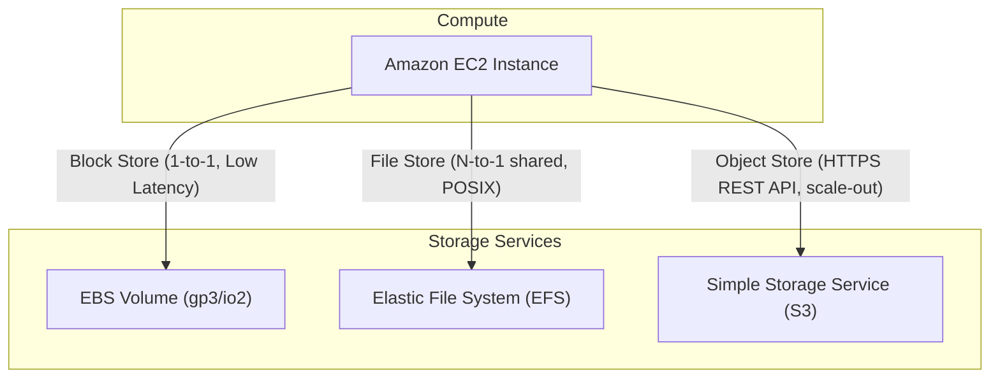
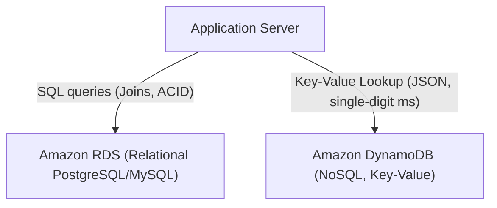

---
domains:
  - "aws"
  - "infra"
---

# Module 3-2: AWS Compute & Storage Services

This module details core AWS compute instances and storage architectures. It covers EC2 instance provisioning, block storage (EBS), shared storage (EFS), and managed database services (RDS and DynamoDB).

---

## 🗺️ Cognitive Map: Storage Architectures in AWS

---

## 1. Amazon EC2 & Virtual Machine Compute

Elastic Compute Cloud (EC2) provides resizable compute capacity.
*   **Instance Families:** Optimized for different workloads (General Purpose `M`, Compute `C`, Memory `R`, Storage `I`).
*   **AMI (Amazon Machine Image):** Pre-configured template containing OS and packages.
*   **User Data:** Startup scripts executed once during initial launch (used for bootstrapping).

---

## 2. Block Storage (EBS) vs. Shared Storage (EFS)

Applications require matching filesystem latency and concurrency requirements to the correct storage type.

### A. Elastic Block Store (EBS)
Provides raw block-level storage volumes that can be attached to a single EC2 instance.
*   **gp2/gp3:** General-purpose SSD. gp3 provides independent IOPS and throughput tuning.
*   **io2:** Provisioned IOPS for high-performance databases (e.g., IOPS up to 64,000).

#### Deep-Intuition (AARF) Breakdown:
1. **The Answer (Core Pattern):** Utilize EBS gp3 volumes for standard workloads and tune IOPS/Throughput independently based on database read/write ratios.
2. **The Assumptions (Context):** EBS volumes are replication-locked inside a single Availability Zone; they cannot be attached to instances in other AZs.
3. **The Rationale (Why):** Designed for low-latency, high-performance direct disk operations. Shares the virtual host's SAN networking bandwidth.
4. **The Failure Loop (What if not):** Attaching a database on an overloaded gp2 volume exhausts the burst credit balance, causing the system to throttle to baseline IOPS (as low as 100). Database queries backlog, connection pools saturate, and application API layers crash.
5. **Alternative Case (When to use 'if not'):** For highly concurrent media hosting where multiple EC2 instances must read/write to the same directory path simultaneously, use EFS (POSIX file shares) instead.

---

## 3. Database Selection: RDS vs. DynamoDB

### A. Amazon RDS (Relational Database Service)
Provides managed relational databases (PostgreSQL, MySQL, Aurora) handling backups and patches.
*   **Scaling:** Vertical scaling (changing instance size) or Read Replicas.

### B. Amazon DynamoDB
A managed, serverless NoSQL database providing single-digit millisecond latency at scale.
*   **Scaling:** Automated partitioning based on partition keys.

#### Deep-Intuition (AARF) Breakdown:
1. **The Answer (Core Pattern):** Standardize on DynamoDB for write-heavy key-value operations (e.g., session state, transaction logs) utilizing partition keys with high cardinality.
2. **The Assumptions (Context):** The application queries must not require complex multi-table joins or relational schemas.
3. **The Rationale (Why):** DynamoDB partitions data across physical SSD storage blocks automatically using a hashing algorithm on the partition key, removing traditional single-host scaling limits.
4. **The Failure Loop (What if not):** Designing a query pattern that triggers DynamoDB full Table Scans instead of precise Query indexes causes complete performance degradation. The partition throttle triggers, latency spikes, and read provisioned throughput (RCU) is instantly exhausted.
5. **Alternative Case (When to use 'if not'):** If the application requires ad-hoc analytics queries, complex transactions, and relational schema integrity (SQL), deploy Amazon Aurora RDS instead.
