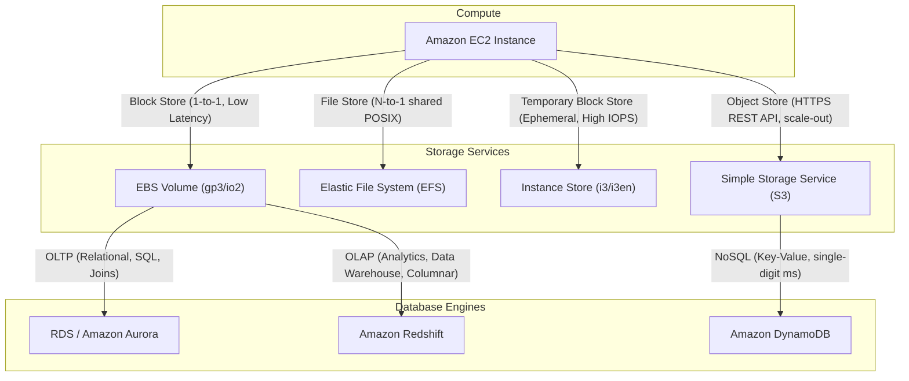

---
domains:
  - "aws"
  - "infra"
---

# Module 3-2: AWS Compute & Storage Services

This module details core AWS compute instances, block/file storage options, and relational/NoSQL database architectures.

---

## 🗺️ Cognitive Map: Storage and Database Selection



---

## 1. Amazon EC2 Compute Architecture

Amazon Elastic Compute Cloud (EC2) provides resizable compute capacity.

### A. Instance Families
*   **General Purpose (M/T):** Balanced compute, memory, and networking. T-family instances are burstable, accumulating CPU credits during low-utilization periods to burst during high demand.
*   **Compute Optimized (C):** High-performance processors for batch processing, web servers, and scientific modeling.
*   **Memory Optimized (R/X):** Large memory footprint for in-memory databases (e.g., SAP HANA) and caching layers.
*   **Storage Optimized (I/D/H):** High-throughput, low-latency local storage for distributed filesystems and OLTP databases.

### B. Lifecycle States
1.  **Pending:** Provisioning virtual hardware resources.
2.  **Running:** Active state; billing is active.
3.  **Stopping:** Preparing for shutdown.
4.  **Stopped:** Virtual CPU and RAM released; billing stops for compute (EBS and EIPs still billed).
5.  **Stop-Hibernate:** Freezes execution state. Writes RAM contents directly to the EBS root volume. Upon reboot, the instance restores the OS state, application processes, and private IP instantly without boot-time script executions. Ideal for pre-warming databases or slow-booting Java/monolith architectures.
6.  **Terminated:** Resource deleted; host hardware recycled.

### C. Instance Metadata (IMDS)
Instance Metadata contains attributes about the instance itself.
*   **Endpoint:** Accessed locally via non-routable link-local address `http://169.254.169.254/latest/meta-data/`.
*   **IMDSv2:** Mandates session-oriented requests using token authentication headers to protect against Server-Side Request Forgery (SSRF) vulnerabilities:
    ```bash
    TOKEN=$(curl -X PUT "http://169.254.169.254/latest/api/token" -H "X-aws-ec2-metadata-token-ttl-seconds: 21600")
    curl -H "X-aws-ec2-metadata-token: $TOKEN" http://169.254.169.254/latest/meta-data/instance-id
    ```

### D. User Data
*   **Mechanics:** Bootstrap shell scripts passed during instance creation. Limited to 16KB (plaintext). Runs once during the initial boot cycle of the instance (not on reboots, unless custom cloud-init scripts override this behavior).

---

## 2. EC2 Purchasing & Launch Types

Matching workload patterns to purchasing models minimizes waste:

*   **On-Demand:** Pay per second. Highest unit cost. Best for short-term, unpredictable workloads.
*   **Reserved Instances (RI):** Commit to 1 or 3 years. Standard (up to 75% savings, fixed family) or Convertible (up to 54% savings, allows swapping instance types/families).
*   **Savings Plans:** Flexible commitments based on hourly spend ($/hour) across compute services (EC2, Fargate, Lambda).
*   **Spot Instances:** Purchase spare AWS capacity for up to 90% savings. Can be terminated by AWS with a 2-minute interruption notice if capacity is clawed back. Interruption behavior includes Terminate, Stop, or Hibernate.
*   **Spot Fleet:** Orchestrates a collection of Spot and optionally On-Demand instances based on target capacity and allocation strategies (e.g., `lowestPrice`, `capacityOptimized`).
*   **Dedicated Hosts:** Physical servers dedicated to your account. Required for strict compliance, hardware-bound licensing models (BYOL), and socket-level hardware access.

#### Deep-Intuition (AARF) Breakdown: Spot Fleet vs. On-Demand for Batch Processing
1.  **The Answer (Core Pattern):** Deploy high-throughput, containerized batch processing tasks on a Spot Fleet utilizing the `capacityOptimized` allocation strategy across multiple instance pools and AZs, with a fallback configuration to On-Demand instances.
2.  **The Assumptions (Context):** The batch application must be stateless, support checkpointing (saving state to S3/DynamoDB), and handle unexpected instance terminations gracefully.
3.  **The Rationale (Why):** Spot capacity can be reclaimed by AWS at any moment. By choosing `capacityOptimized`, the fleet provisions from the least-congested pools, minimizing termination frequency. Combining this with multi-AZ configurations ensures batch pipeline execution progress continues even if a pool experiences reclaiming.
4.  **The Failure Loop (What if not):** Running a non-checkpointed, long-running single monolithic application on a standard Spot instance risks losing hours of computation if AWS terminates the instance mid-job, leading to missed SLA targets and repeated computing costs.
5.  **Alternative Case (When to use 'if not'):** For stateful, latency-sensitive production databases with strict transaction SLAs, deploy exclusively on On-Demand instances or reserved Capacity Reservations.

---

## 3. EC2 Placement Groups

Influence the physical placement of EC2 instances on the underlying hardware fabric:

*   **Cluster Placement Group:**
    *   *Layout:* Instances grouped in a single AZ on a shared rack.
    *   *Use Case:* High-Performance Computing (HPC), low latency, and high-throughput inter-node communication (uses enhanced networking).
    *   *Risk:* Rack failure disables the entire group; no high availability.
*   **Partition Placement Group:**
    *   *Layout:* Spreads instances across logical partitions (racks) that do not share power/hardware backplanes (up to 7 partitions per AZ).
    *   *Use Case:* Distributed big-data architectures (Hadoop HDFS, Cassandra, Kafka).
*   **Spread Placement Group:**
    *   *Layout:* Places each instance on a separate physical rack. Limits to 7 instances per AZ.
    *   *Use Case:* Small fleets of critical workloads (e.g., domain controllers, database primary nodes) requiring isolation from single-host hardware failures.

---

## 4. Block, File, & Ephemeral Storage Services

### A. Elastic Block Store (EBS)
EBS volumes act as virtual network block devices attached via the SAN layer.
*   **Zonal Limitation:** EBS volumes are locked to the Availability Zone they are created in; they cannot be attached to instances in other AZs.
*   **Volume Types:**
    *   **gp3:** General-purpose SSD. Decoupled throughput (up to 1,000 MB/s) and IOPS (up to 16,000) settings.
    *   **io2 Block Express:** Provisioned IOPS. High-performance databases. Supports up to 256,000 IOPS and 4,000 MB/s. Supports **Multi-Attach** (allowing up to 16 instances in the same AZ to mount a single raw block volume concurrently using cluster-aware filesystems like GFS2).
    *   **st1:** Throughput Optimized HDD. Large sequential data streams (Big Data, MapReduce).
    *   **sc1:** Cold HDD. Infrequently accessed data requiring lowest cost.

#### Deep-Intuition (AARF) Breakdown: EBS gp3 vs. io2 Volume Selection
1.  **The Answer (Core Pattern):** Utilize EBS gp3 for standard applications and database instances. Transition to io2 Block Express only when baseline storage performance requires sustained IOPS above 16,000 or absolute sub-millisecond write performance.
2.  **The Assumptions (Context):** The instance type must support EBS Optimization to utilize the dedicated network bandwidth to the storage system without saturating VM network interfaces.
3.  **The Rationale (Why):** gp3 provides independent performance configuration (3,000 IOPS and 125 MB/s baseline included free) which is highly cost-efficient. io2 offers 99.999% durability and consistent provisioned performance but at a steep pricing tier, which is wasted if the database is throttled by CPU or memory limits rather than storage bottlenecks.
4.  **The Failure Loop (What if not):** Provisioning high IOPS on gp2 volumes relies on a "burst credit balance" model. When credits are exhausted during peak database writes, the volume throttles to a baseline of 100 IOPS, database connections saturate, query latency spikes to seconds, and the app server connection pools fail.
5.  **Alternative Case (When to use 'if not'):** For distributed, scratch-pad filesystems or cache clusters requiring maximum read/write performance without persistence, deploy Instance Store NVMe disks.

### B. Instance Store (Ephemeral Storage)
*   **Properties:** Physically attached to the underlying hypervisor host server. Extremely fast read/write speeds (NVMe).
*   **Volatile Lifecycle:** Data is lost if the instance is stopped, terminated, or suffers hardware failure (data survives OS reboots).
*   **Use Cases:** Cache directories, scratch volumes, temp files, or distributed database clusters (Cassandra/ES) handling replication at the application layer.

### C. Elastic File System (EFS)
*   **Properties:** Fully managed shared file storage using the Network File System (NFSv4) protocol.
*   **VPC Wide Access:** Can be mounted concurrently by thousands of instances across multiple AZs under a single VPC.
*   **Performance Modes:** General Purpose (default) or Max I/O (high scale). Throughput can be provisioned or configured as elastic.

### D. Simple Storage Service (S3) (Object Storage)
*   **Properties:** Fully managed, highly scalable object storage service accessed via HTTPS REST APIs. Durable (designed for 99.999999999% durability).
*   **Storage Classes:** Standard (default), Intelligent-Tiering (auto-moves objects to cost-effective tiers), Standard-IA (Infrequent Access), One Zone-IA, Glacier (Archive), Glacier Deep Archive.
*   **S3 Transfer Acceleration:** Enables fast, easy, and secure transfers of files over long distances between clients and S3 buckets. It utilizes Amazon CloudFront’s globally distributed edge locations. As data arrives at an edge location, it is routed to S3 over an optimized network path.

---

## 5. Relational Databases: RDS & Amazon Aurora

### A. Amazon RDS (Relational Database Service)
Provides managed database engines (PostgreSQL, MySQL, SQL Server, Oracle).
*   **Automated Backups:** Daily full backups and continuous transaction logs stored in an AWS-owned S3 bucket. Allows point-in-time recovery (PITR) down to the second within a 35-day retention window. Backups are deleted upon instance termination.
*   **Manual Snapshots:** User-triggered database snapshots. Persisted in customer S3 until explicitly deleted, even if the RDS instance is terminated.
*   **Failover & Multi-AZ:** Synchronously replicates data to a standby instance in a different AZ. Upon primary AZ/host failure, AWS updates the DNS CNAME record to point to the standby, completing automated failover (typically 60-120 seconds).
*   **Read Replicas:** Asynchronously replicates data to up to 15 read-only instances. Replicas can reside in different AZs or Regions (Cross-Region). Can be promoted to independent databases. Used to scale read-heavy application traffic.
*   **Authentication & Encryption:** Supports KMS storage encryption, SSL/TLS database client communication, and IAM DB Authentication (token-based login expiring in 15 minutes).

### B. Amazon Aurora
AWS's cloud-native relational database engine (MySQL/PostgreSQL compatible).
*   **Storage Architecture:** Replicates data across a shared virtual storage volume spanning 3 AZs. Aurora maintains **6 copies** of the data (2 per AZ). Reads require a 3-of-6 quorum; writes require a 4-of-6 quorum.
*   **Failover:** Replica promotion replaces the failed master. If no replica exists, Aurora spins up a new DB instance. Failover is rapid (often <30 seconds) because the storage volume is shared and does not require replication catching up.
*   **Endpoints:**
    *   *Cluster (Writer) Endpoint:* Points to the current primary read-write instance.
    *   *Reader Endpoint:* Load-balances connection requests across available read replicas.
    *   *Instance Endpoint:* Direct connection to a specific database instance in the cluster.

#### Deep-Intuition (AARF) Breakdown: Aurora Multi-Master vs. Aurora Global Databases
1.  **The Answer (Core Pattern):** Utilize **Aurora Global Databases** for multi-region active-passive disaster recovery and low-latency local reads. Avoid **Aurora Multi-Master** unless application writers cannot tolerate a 30-second failover window and are engineered to handle database write conflicts.
2.  **The Assumptions (Context):** For Aurora Global DBs, replication is asynchronous, leading to sub-second replica lag under normal operations.
3.  **The Rationale (Why):** Aurora Global DB uses dedicated physical replication infrastructure, keeping regional replication lag under 1 second without impacting primary instance compute. Multi-Master clusters allow writes on all nodes in a single region, but require complex application handling to manage data write conflicts (optimistic locking), degrading overall system throughput.
4.  **The Failure Loop (What if not):** Implementing Aurora Multi-Master for an application with high write-concurrency on the same rows causes high database deadlock rates, transaction retries, and poor write performance.
5.  **Alternative Case (When to use 'if not'):** For simple single-region workloads requiring automatic capacity adjustments based on traffic, deploy Aurora Serverless v2.

---

## 6. Analytical Databases: Amazon Redshift

Historical Online Analytical Processing (OLAP) database engine.
*   **Columnar Storage:** Organizes data by columns instead of rows, minimizing disk I/O for aggregations and analytics queries.
*   **Massive Parallel Processing (MPP):** Distributes queries across a cluster containing a **Leader Node** (handles query execution planning and client connections) and multiple **Compute Nodes** (executes operations in parallel).
*   **Data Ingestion:** High-speed parallel reads from S3 using the `COPY` command.
*   **Enhanced VPC Routing:** Forces all Redshift COPY and UNLOAD traffic between the cluster and S3 to route internally through VPC endpoints rather than traversing the public internet.

---

## 7. NoSQL Databases: Amazon DynamoDB

Fully managed, serverless, single-digit millisecond latency NoSQL key-value store.

### A. Key Concepts
*   **Data Model:** Tables contain items, items contain attributes. Maximum item size is **400KB**. For larger datasets, store files in S3 and save the S3 URL pointer as an attribute in DynamoDB.
*   **Schema-less:** Attributes do not need to be predefined, except for the primary key attributes.
*   **Primary Keys:**
    *   *Partition Key (PK):* Hashed by DynamoDB to determine the physical partition where the data resides. Must be unique if used alone.
    *   *Sort Key (SK):* Used alongside the Partition Key (Composite Key) to group items logically and allow range queries.

### B. Capacity Units (Billing)
*   **Write Capacity Unit (WCU):** 1 WCU = 1 write per second for an item up to 1KB.
*   **Read Capacity Unit (RCU):** 1 RCU = 1 strongly consistent read per second OR 2 eventually consistent reads per second for an item up to 4KB.
*   **Throttling:** Occurs when request rates exceed the configured RCUs/WCUs, returning a `ProvisionedThroughputExceededException`.

#### Deep-Intuition (AARF) Breakdown: DynamoDB Partitioning and Hot Keys
1.  **The Answer (Core Pattern):** Design primary keys with high cardinality (e.g., UUIDs or timestamped transaction IDs) to ensure uniform data distribution across physical partitions.
2.  **The Assumptions (Context):** DynamoDB splits tables into physical partitions based on storage size (10GB per partition) or provisioned throughput (1,000 WCUs or 3,000 RCUs maximum per partition).
3.  **The Rationale (Why):** Uniform hash distribution prevents single partition bottlenecks. If an application repeatedly writes to the same partition key value, all requests target a single physical partition, quickly exhausting its allocated throughput and triggering throttling.
4.  **The Failure Loop (What if not):** Choosing a low-cardinality partition key (e.g., `Status: ACTIVE/INACTIVE` or `State: CA/NY`) creates a "Hot Key" scenario. During peak events, writes partition-lock, RCU/WCU throttling activates, client HTTP requests drop with 400 errors, and the UI times out.
5.  **Alternative Case (When to use 'if not'):** For read-heavy hot keys where data changes infrequently, enable DynamoDB Accelerator (DAX) to serve cache reads in microseconds without consuming RCU capacity.
