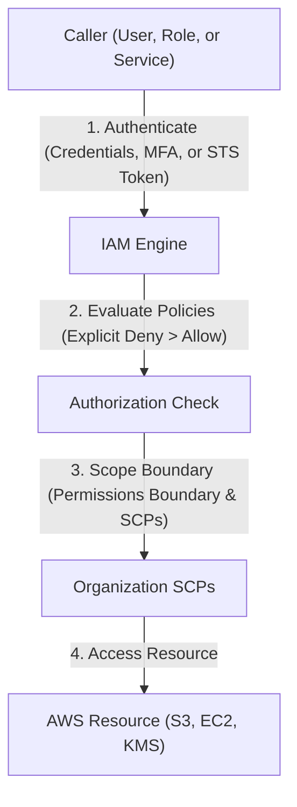
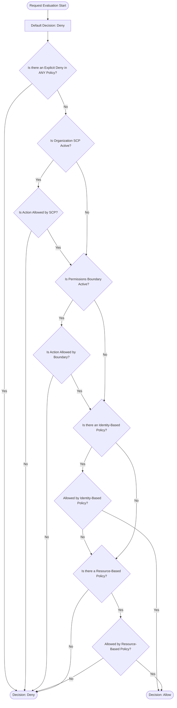

---
domains:
  - "aws"
class: reference-note
tier: reference-note
tags:
  - aws/iam
---

# Module 3-2: AWS IAM & Identity Management

**Breadcrumbs:** [[Reference Notes/3-Index - AWS|🏠 AWS Index]] > **AWS IAM & Identity Management**

---

## 🗺️ Cognitive Map: IAM Authentication and Authorization


---

## 1. Identity & Access Management (IAM) Deep Dive
IAM is a **global service** that manages access to AWS resources securely through authentication (verifying who you are) and authorization (verifying permissions). Since IAM is global, users, groups, policies, and roles are available across all AWS regions.

### A. Root User vs. IAM Users & Groups
*   **Root User:** Created by default when the AWS account is created. Has absolute, unrestricted access to all resources and billing information. 
    *   *Best Practice:* Only use the root user for initial account setup tasks (such as creating the first admin user, changing account settings, or enabling billing access), then protect it with MFA and lock it away.
*   **IAM User:** Represents a single physical person or application inside your organization (1-to-1 mapping). Each user has a password for AWS Console access and/or access keys for programmatic access.
    *   *Hands-on Details:* When creating a user (e.g., `Stephane`), you can specify an auto-generated password or a custom password, and require a password change at the next sign-in. You can also assign tags (e.g., `Department: engineering`) to users.
*   **IAM Group:** A logical container for IAM users. 
    *   *Best Practice:* Assign policies directly to groups rather than individual users, allowing users to inherit permissions dynamically.
    *   *Constraints:* Groups can only contain users, not other groups (no nested groups). Users can belong to multiple groups or no groups (though no groups is against best practice).

### B. Account Aliases & Sign-in URLs
To simplify the sign-in URL for users, administrators can create an **Account Alias**.
*   The default sign-in URL contains the 12-digit AWS Account ID (e.g., `https://123456789012.signin.aws.amazon.com/console`).
*   An Account Alias (e.g., `aws-stephane-v5`) replaces the Account ID in the sign-in URL. The alias must be unique across all of AWS.

### C. AWS Console Simultaneous Sign-in (Multi-Session Support)
AWS supports multi-session console access using the same browser. Users can click "Add Session" and sign into multiple identities or account IDs concurrently within the same browser session.
*   *Hands-on Trick:* Historically, operators had to use private browser windows (Incognito mode) or separate browsers to manage multiple active sessions (e.g., root user on the left, IAM admin user on the right) without disconnecting. The native multi-session feature represents a major workflow optimization for cloud administrators operating at scale.

---

## 2. IAM Policies & Evaluation Logic
Policies are JSON documents that define permissions. They can be attached to identities (identity-based policies) or resources (resource-based policies).

### A. Policy JSON Structure
An IAM policy consists of one or more statements, each containing:
*   **Version:** The policy language version (typically `"2012-10-17"`).
*   **Id:** An optional policy-wide identifier.
*   **Statement:** An array containing:
    *   **Sid:** Optional statement identifier.
    *   **Effect:** Either `"Allow"` or `"Deny"`.
    *   **Principal:** The entity (account, user, or role) that is allowed or denied access (used only in resource-based policies).
    *   **Action:** The list of API calls being allowed/denied (e.g., `iam:ListUsers`, `s3:GetObject`). Wildcards (e.g., `iam:Get*`) can be used to match multiple actions.
    *   **Resource:** The list of resources the actions apply to (specified by ARN or `*` for all resources).
    *   **Condition:** Optional constraints specifying when the statement is active.

Example of a custom policy:
```json
{
  "Version": "2012-10-17",
  "Statement": [
    {
      "Sid": "AllowIAMRead",
      "Effect": "Allow",
      "Action": [
        "iam:ListUsers",
        "iam:GetUser"
      ],
      "Resource": "*"
    }
  ]
}
```

### B. Visual Editor vs. JSON Editor
IAM policies can be created using the **JSON Editor** (directly writing or pasting JSON syntax) or the **Visual Editor** (selecting actions from categorization lists, e.g., selecting 1 out of 38 list actions and 1 out of 32 read actions for the IAM service).

### C. Advanced IAM Conditions & Variable Mapping
AWS policies support complex evaluation criteria via the `Condition` block. Key condition keys include:
*   `aws:SourceIP`: Restricts API access based on the caller's client IP address range. Commonly used to restrict calls to company corporate networks.
*   `aws:RequestedRegion`: Restricts calls to specific target AWS regions (e.g., `eu-west-1`), blocking access to unauthorized regions.
*   `ec2:ResourceTag/[Key]`: Evaluates resource tags on the target EC2 resource. Allows actions only on resources matching tags.
*   `aws:PrincipalTag/[Key]`: Evaluates tags assigned to the calling user or role (principal), enabling attribute-based access control (ABAC).
*   `aws:MultiFactorAuthPresent`: Boolean flag ensuring the caller has authenticated using MFA before executing high-risk operations (e.g., terminating instances).
*   `aws:PrincipalOrgID`: Limits resource-based policy access to only API calls originating from accounts within a specific AWS Organization.

### D. S3 Resource ARN Scopes: Buckets vs. Objects
When writing S3 policies, ARN structure dictates the permission scope:
*   **Bucket-Level Permissions:** Apply to the bucket resource itself. Actions like `s3:ListBucket` require the bucket ARN format without a trailing slash/wildcard:
    `"Resource": "arn:aws:s3:::my-bucket-name"`
*   **Object-Level Permissions:** Apply to files/keys within the bucket. Actions like `s3:GetObject`, `s3:PutObject`, and `s3:DeleteObject` require target objects to be specified using wildcards:
    `"Resource": "arn:aws:s3:::my-bucket-name/*"`

### E. Comprehensive Policy Evaluation Flowchart
AWS IAM operates on a default deny basis. Evaluation follows a strict hierarchy shown below:



---

## 3. Account Protection: Password Policies & MFA
Securing authentication is critical to preventing account compromise.

### A. Password Policy
Administrators can customize password complexity requirements in **Account Settings**:
*   Enforcing minimum length.
*   Requiring uppercase, lowercase, numbers, and non-alphanumeric characters.
*   Enforcing password expiration (e.g., requiring user resets every 90 days).
*   Preventing password reuse.
*   *Note:* New password policies apply immediately to new users, but existing users are only forced to change their password when it expires.

### B. Multi-Factor Authentication (MFA)
MFA adds an extra layer of defense by combining a password (something you know) with a device (something you own). Enforcing MFA on the Root User and all IAM users is a high-priority security best practice.
*   **Virtual MFA App:** Authenticator applications (Google Authenticator, Authy, Twilio Authenticator) running on a phone. Authy supports multiple tokens on a single device, making it highly portable. One virtual device can manage multiple AWS users and accounts.
    *   *Setup Steps:* Generate the virtual MFA device in IAM, click "Show QR Code", scan it with the mobile app, and input two consecutive, real-time generated MFA codes. Up to 8 MFA devices can be registered per user.
*   **Universal 2nd Factor (U2F) Security Key:** A physical USB/NFC token (e.g., YubiKey by Yubico) supporting multiple users and accounts.
*   **Hardware Key Fob TOTP:** A physical token (e.g., Gemalto) generating time-based one-time passwords.
*   **SurePassID Key Fob:** Specialized key fobs designed for the US GovCloud region.

---

## 4. Programmatic Access: CLI, SDK, and CloudShell
Programmatic access allows applications and operators to execute commands directly against public AWS APIs.

### A. Access Keys
To call APIs programmatically, users must generate **Access Keys**:
*   **Access Key ID:** Public identifier (analogous to a username).
*   **Secret Access Key:** Secret credential (analogous to a password).
*   *Security Constraints:* Access keys are only visible at the moment of creation. If lost, they cannot be retrieved and must be regenerated. They must never be shared or committed to code repositories.

### B. AWS CLI (Command Line Interface)
An open-source command-line tool built on the **AWS SDK for Python (Boto/Botocore)**.
*   **Installation Processes:**
    *   *Windows:* Install using the 64-bit MSI installer. Verification: `aws --version` (verifies CLI v2 is active).
    *   *macOS:* Download the PKG graphical installer, run, and verify using `aws --version`.
    *   *Linux:* Download the zip archive, unzip, and run the install script:
        ```bash
        curl "https://awscli.amazonaws.com/awscli-exe-linux-x86_64.zip" -o "awscliv2.zip"
        unzip awscliv2.zip
        sudo ./aws/install
        aws --version
        ```
*   **Configuration:** Configured by running `aws configure` in the terminal, which prompts for the Access Key ID, Secret Access Key, default Region (e.g., `eu-west-1`), and default output format (e.g., `json`).
*   **Testing Access:** Use the command `aws iam list-users` to confirm credential connectivity and permissions.

### C. AWS SDK (Software Development Kit)
Language-specific libraries embedded directly into application code to call AWS APIs programmatically.
*   Supports languages like JavaScript, Python (Boto/Botocore), PHP, .NET, Ruby, Java, Go, Node.js, C++, and includes specialized SDKs for mobile and IoT devices.

### D. AWS CloudShell
A browser-based, pre-authenticated terminal environment built directly into the AWS Console.
*   **Availability:** Free to use, but only available in specific AWS regions (the default region is determined by the console's active region).
*   **Features:**
    *   Preloaded with AWS CLI Version 2, Python, and other utilities.
    *   Pre-authenticated using the credentials of the logged-in console session.
    *   Includes a home directory (`/home/cloudshell-user`) that persists files across sessions (e.g., creating files like `demo.txt` that persist across terminal restarts).
    *   Supports splitting the console pane into multiple active columns/tabs and uploading/downloading files.

---

## 5. IAM Roles & AWS STS
AWS services (like EC2 instances or Lambda functions) often need permissions to access other resources (e.g., S3 buckets). Hardcoding permanent Access Keys inside applications or instances is a severe security risk.

### A. IAM Roles
An IAM Role is an identity with permission policies that can be temporarily assumed by a trusted service, resource, or federated user.
*   **Trust Policy:** Defines *which* trusted entity can assume the role (e.g., `ec2.amazonaws.com` is defined as a trusted relationship for Amazon EC2).
*   **Permission Policy:** Defines *what* actions the entity can take once the role is assumed (e.g., `IAMReadOnlyAccess`).
*   *Hands-on Details:* When creating a role (e.g., `DemoRoleForEC2`), select the trusted service, attach policies, name the role, and verify the trust relationships in the JSON view.

### B. AWS STS (Security Token Service)
A global service that issues **temporary security credentials** (access key ID, secret access key, and a security token) when a role is assumed.
*   Credentials issued by STS are short-lived (valid from 15 minutes up to 12 hours) and rotate automatically when managed by AWS (e.g., via EC2 Instance Profiles).
*   Applications running on EC2 fetch these temporary credentials dynamically via the Instance Metadata Service (IMDSv2) endpoint:
    ```bash
    curl http://169.254.169.254/latest/meta-data/iam/security-credentials/EC2-Role-Name
    ```

---

## 6. Audit & Governance: Security Tools, Billing, & Budgets

### A. IAM Security Tools
1.  **Credential Report (Account-Level):** Generates a CSV audit containing all users in the account, password usage, MFA status, access key generation/usage/rotation dates. Helpful for identifying inactive users or accounts violating security rules.
2.  **Access Advisor (User/Role-Level):** Shows which services are authorized for a user/role and when they were last accessed. Critical for enforcing the **Principle of Least Privilege** by identifying and removing unused permissions (e.g., detecting if a user has Alexa for Business permissions but has never used them).

### B. AWS Billing Access Activation
By default, even administrators cannot access the billing console.
*   *Action Required:* The **Root User** must explicitly enable "IAM User and Role Access to Billing Information" under account settings to delegate billing visibility to administrators.
*   *Activation Path:* Navigate to `Account` settings > Scroll to `IAM User and Role Access to Billing Information` > Click `Edit` > Select `Activate IAM Access` > Click `Update`.
*   *Bill Debugging:* Administrators can review bills month-by-month and view "Charges by Service" (e.g., isolating NAT Gateway or EBS storage charges) to resolve costing issues.

### C. AWS Budgets
A proactive cost-governance tool to alert administrators when spending thresholds are breached.
*   **Zero Spend Budget:** Alerts immediately via email when actual spending exceeds $0.01 (1 cent). Highly recommended for developer sandboxes to avoid unexpected charges.
*   **Monthly Cost Budget:** Triggers alerts when spending approaches a set limit (e.g., $10). Alerts are sent to designated emails when:
    1. Actual spend reaches 85% of the threshold.
    2. Actual spend reaches 100% of the threshold.
    3. Forecasted spend is expected to reach 100% of the threshold.

---

## 8. AWS Organizations & Multi-Account Governance
As organizations scale, managing multiple AWS accounts independently becomes operationally unfeasible. [[AWS Organizations]] provides a framework to consolidate and govern multiple AWS accounts from a central management console.

### A. Core Architecture & Organizational Units (OUs)
AWS Organizations implements a tree-like hierarchy:
*   **Root Organizational Unit (OU):** The outermost container of the organization.
*   **Management Account (formerly Master Account):** The administrative anchor of the organization. It pays the bills, invites member accounts, and manages policies.
*   **Member Accounts:** Accounts created under or invited to join the organization. Member accounts can only belong to one organization at a time.
*   **Sub-Organizational Units (Nested OUs):** Logical groups of member accounts (e.g., by environment like Dev, Test, Prod, or by business unit). OUs can contain other OUs, enabling nested hierarchies.

### B. Billing Consolidation & Aggregated Pricing Benefits
Organizations merges the billing lifecycle of all accounts:
*   **Consolidated Billing:** A single payment method on the management account covers all member account invoices.
*   **Aggregated Usage Discounts:** AWS volumes tiers are calculated across total aggregate usage of all accounts. S3 storage and EC2 usage are summed, resulting in lower volume unit pricing.
*   **Reservation Sharing:** Unused Reserved Instances (RIs) and Savings Plans in one member account automatically apply to eligible usage in other accounts under the organization, maximizing utilization.

### C. Service Control Policies (SCPs)
[[Service Control Policy|Service Control Policies (SCPs)]] are organization-level JSON policies used to establish permissions boundaries across member accounts.
*   **Inheritance:** Policies attached to the Root OU apply to all OUs and accounts. Policies attached to sub-OUs cascade to their nested accounts.
*   **Explicit Allow Requirement:** To execute any API call, every level of the hierarchy (Root, target OU, and the member account itself) must have an explicit Allow policy. By default, organizations attaches the `FullAWSAccess` SCP to the root and all child OUs.
*   **Management Account Immunity:** SCPs **never** apply to the management account. The management account maintains unrestricted administrative control.
*   **Evaluation Hook:** SCPs restrict permissions. They do not grant permissions; they filter the maximum permissions that identity-based and resource-based policies can grant in member accounts.

### D. Compliance Policies: Tag and Backup Policies
*   **Tag Policies:** Define standard tag keys and allowed values. Standardizes resource categorization for cost allocation tags and attribute-based access control (ABAC). Non-compliant tagging operations can be blocked or reported using EventBridge alerts.
*   **Backup Policies:** Enforce standardized, organization-wide AWS Backup plans to ensure accounts comply with backup retention requirements.

---

## 9. Advanced IAM Security Mechanics

### A. Resource-Based Policies vs. IAM Roles (Cross-Account Access)
When accessing resources across account boundaries (e.g., Account A accessing an S3 bucket in Account B), administrators choose between two delegation models:
1.  **IAM Roles (Trust Delegation):**
    *   *Action:* User in Account A assumes an IAM Role in Account B via `sts:AssumeRole`.
    *   *Permission Shift:* The user temporarily **relinquishes** their Account A permissions and inherits the target role's permissions in Account B.
    *   *Use Case:* High-security administration or where the target resource does not support resource policies.
2.  **Resource-Based Policies (Direct Access):**
    *   *Action:* A policy is attached directly to the resource (e.g., S3 bucket policy) in Account B, specifying the Account A principal as the `Principal` element.
    *   *Permission Shift:* The user in Account A accesses the resource **directly** without assuming a role. They **keep** all their Account A permissions.
    *   *Use Case:* Data transit operations, such as scanning a DynamoDB table in Account A and copying the output directly to an S3 bucket in Account B.

### B. EventBridge Target Invocations
Amazon EventBridge invokes target services using one of two security models:
*   **Resource-Based Policies:** Used when the target service supports resource-level access policies (e.g., Lambda functions, SNS topics, SQS queues, S3 buckets, API Gateways). EventBridge adds a policy to the target allowing invocation.
*   **IAM Roles:** Used when the target service does not natively support resource-based policies (e.g., Kinesis Streams, EC2 Auto Scaling, SSM Run Command, ECS tasks). EventBridge assumes an IAM service role to execute the target action.

### C. Permissions Boundaries
An **IAM Permissions Boundary** is a managed policy used to set the maximum permissions that an identity-based policy can grant to an IAM User or Role.
*   *Scope:* Supported only for IAM Users and Roles. They **cannot** be assigned to IAM Groups.
*   *Effective Permissions:* The intersection of the identity-based policy and the permissions boundary. If an action is not allowed in BOTH the policy and the boundary, access is denied.
*   *Use Case:* Safe delegation of administrator duties. Allows team leaders to create new developers and roles without allowing them to elevate their own privileges to full administrator access.

---

## 10. AWS IAM Identity Center & Identity Federation
[[AWS IAM Identity Center]] (successor to AWS Single Sign-On / SSO) centralizes identity federation and user console/API access across all accounts in an AWS Organization.

### A. Multi-Account and Multi-Application SSO
*   **Single Login Portal:** Users access a single URL, authenticate once, and gain one-click console or API access to authorized AWS accounts, business applications (e.g., Salesforce, Box, Microsoft 365 via SAML 2.0), and Windows EC2 instances.
*   **Integrated Directory Stores:** Supports the built-in Identity Center user directory or federates with external providers (Okta, OneLogin, Ping Identity, Active Directory).

### B. Permission Sets & Attribute-Based Access Control (ABAC)
*   **Permission Sets:** Managed templates of IAM policies defined in the management account. When a user/group is assigned a permission set on a member account, Identity Center automatically provisions a corresponding IAM Role inside that member account.
*   **ABAC Enablement:** Leverages user directory attributes (e.g., Title, CostCenter, Department) passed as session tags. Permissions boundaries are defined once, and access changes dynamically as attributes are updated in the directory.

---

## 11. AWS Directory Services (Active Directory Integration)
[[AWS Directory Services]] provides managed directory deployment options, enabling AWS resources to join Windows domains and authenticate users.

### A. Directory Service Flavors
*   **AWS Managed Microsoft AD:** A fully managed, actual Microsoft Active Directory hosted in AWS. Supports standard AD administration tools, local group policies, and multi-factor authentication (MFA). Available in Standard (up to 30,000 objects) and Enterprise (up to 500,000 objects) editions. Supports establishing trust relationships with on-premises directories.
*   **AD Connector:** A stateless active directory gateway acting as a proxy. Redirects authentication queries back to an existing on-premises Active Directory. MFA support is included. No users are stored or managed in AWS.
*   **Simple AD:** A lightweight, AD-compatible directory built on Samba 4. Standalone in the AWS cloud; cannot establish trust relationships or connect back to on-premises AD.

### B. Integration Scenarios with IAM Identity Center
When integrating IAM Identity Center with Active Directory, two paths exist:
1.  **Two-Way Trust (AWS Managed AD):** Establish a forest/domain trust relationship between AWS Managed Microsoft AD and the on-premises AD. Identity Center integrates with the AWS Managed AD out-of-the-box, allowing on-premises users to authenticate.
2.  **AD Connector Proxy:** Deploy AD Connector to proxy login requests from the Identity Center portal directly to the on-premises Active Directory.

---

## 12. AWS Control Tower & Governance
[[AWS Control Tower]] acts as an orchestration layer on top of AWS Organizations, automating the deployment and compliance of a multi-account AWS environment based on well-architected practices.

### A. Guardrails: Preventive vs. Detective
Control Tower governs member accounts using Guardrails:
*   **Preventive Guardrails:** Enforce compliance by blocking actions. Implemented using **Service Control Policies (SCPs)** via AWS Organizations (e.g., blocking S3 bucket public access organization-wide).
*   **Detective Guardrails:** Monitor environments and flag violations. Implemented using **AWS Config** rules. When a non-compliant resource is detected, it triggers an Amazon SNS notification, which can notify administrators or invoke an AWS Lambda function for automated remediation (e.g., deleting an untagged resource).

---

## 7. Deep-Intuition (AARF) Breakdowns

### AARF Breakdown: IAM Roles (STS) vs. Permanent Credentials
1.  **The Answer (Core Pattern):** Deploy applications using IAM Roles and EC2 Instance Profiles to fetch temporary, short-lived credentials via AWS STS, completely avoiding the use of permanent Access Keys.
2.  **The Assumptions (Context):** The calling application or user must be inside a trust boundary recognized by the IAM trust policy, and local processes must fetch credentials dynamically from the IMDSv2 metadata endpoint.
3.  **The Rationale (Why):** Permanent access keys stored in config files or git repositories risk leakage. STS credentials automatically expire (configurable from 15 minutes to 12 hours) and are rotated by the AWS platform, neutralizing leak vulnerabilities.
4.  **The Failure Loop (What if not):** Hardcoding static access keys in a codebase hosted on an EC2 instance that gets compromised allows attackers to steal those credentials and call AWS APIs directly, bypassing the OS and host controls.
5.  **Alternative Case (When to use 'if not'):** For legacy on-premises applications that cannot assume IAM Roles, use strictly scoped IAM User access keys with aggressive rotation managed by AWS Secrets Manager.

### AARF Breakdown: Service Control Policies (SCPs)
1.  **The Answer (Core Pattern):** Enforce strict Deny policies at the Organizational Unit (OU) level to prevent root/admin users in member accounts from bypassing security configurations (e.g., disabling CloudTrail or leaving the organization).
    ```json
    {
      "Version": "2012-10-17",
      "Statement": [
        {
          "Effect": "Deny",
          "Action": [
            "organizations:LeaveOrganization",
            "cloudtrail:StopLogging",
            "cloudtrail:DeleteTrail"
          ],
          "Resource": "*"
        }
      ]
    }
    ```
2.  **The Assumptions (Context):** SCPs apply only to member accounts within the Organization, not to the master/management root account. An IAM policy is still required within the member account to grant access.
3.  **The Rationale (Why):** Enforces global corporate compliance rules. Even if a member account's administrator credentials are stolen, the attacker cannot delete audit logs or disable compliance tools because the SCP explicitly blocks those actions at the organization level.
4.  **The Failure Loop (What if not):** Without SCPs, a compromised admin account in a child sandbox can delete CloudTrail logs, delete backups, and spin up runaway GPU clusters for crypto-mining, rendering the incident untraceable.
5.  **Alternative Case (When to use 'if not'):** In standalone accounts or developer sandboxes not bound to corporate compliance frameworks, bypass SCPs to maximize API freedom and speed of experimentation.

### AARF Breakdown: Permissions Boundaries vs SCPs
1.  **The Answer (Core Pattern):** Use **Permissions Boundaries** to restrict delegate admins (such as developers given user creation privileges) from granting full administrative access to their new entities, while using **SCPs** to enforce organization-wide restrictions that apply to all users and roles within a member account.
2.  **The Assumptions (Context):** Permissions boundaries apply only to IAM users and roles within a single account. SCPs apply organization-wide to entire member accounts. Neither affects the organization's management account.
3.  **The Rationale (Why):** If a developer creates a role and attaches a boundary policy to it, that role can never perform actions blocked by the boundary, even if the developer attaches `AdministratorAccess` to it. SCPs ensure corporate boundaries are never crossed at the account level.
4.  **The Failure Loop (What if not):** Delegating `iam:CreateUser` permissions without a boundary allows a developer to create a new user, attach the `AdministratorAccess` policy to it, and log in as that administrator, escalating their own privileges.
5.  **Alternative Case (When to use 'if not'):** In small organizations with centralized administrative control and no delegation of IAM management, skip boundaries and rely on tight IAM policies on administrator accounts.

### AARF Breakdown: AD Connector vs. Managed Microsoft AD
1.  **The Answer (Core Pattern):** Use **AD Connector** to federate on-premises users into AWS applications (like IAM Identity Center or WorkSpaces) without replicating directory database data into AWS, and use **Managed Microsoft AD** when you need a local domain controller in the AWS cloud to support trusted resource operations or schema extensions.
2.  **The Assumptions (Context):** AD Connector requires persistent VPN/Direct Connect connectivity back to on-premises domain controllers to proxy queries. Managed AD can run independently after initial sync/trust setup.
3.  **The Rationale (Why):** AD Connector is stateless and does not store user passwords, reducing directory synchronization management. Managed AD acts as a true directory forest, supporting trust relationships and low-latency local queries for EC2 instances.
4.  **The Failure Loop (What if not):** Using AD Connector when VPN connection is unstable results in immediate authentication failures for all cloud services, locking out WorkSpaces and SSO users.
5.  **Alternative Case (When to use 'if not'):** If there is no on-premises Active Directory infrastructure, use **Simple AD** to host local domain controllers at a lower tier cost.
