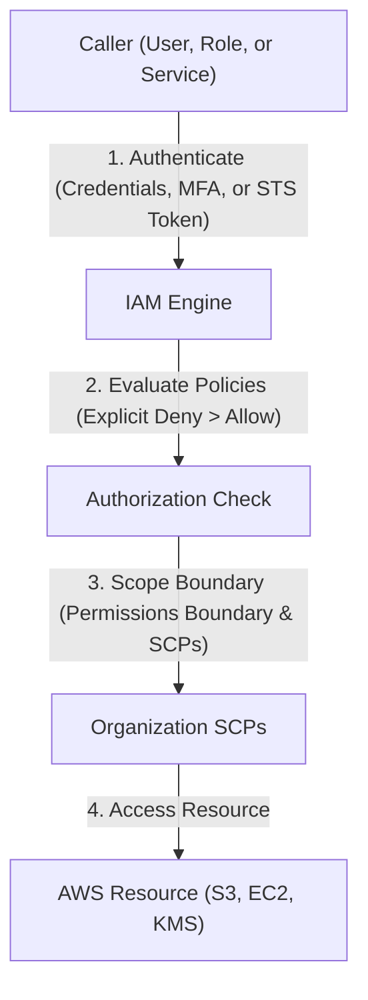

---
domains:
  - "aws"
  - "security"
class: reference-note
tier: reference-note
tags:
  - aws/iam
  - aws/organizations
  - aws/security
---

# Module 3-2: AWS IAM & Identity Management

This module covers identity federation, role assumption via **AWS Security Token Service (STS)**, programmatic access keys, root user security, and multi-account governance using **AWS Organizations** and **Service Control Policies (SCPs)**.

---

## 🗺️ Cognitive Map: IAM Authentication and Authorization



---

## 1. Identity & Access Management (IAM) Deep Dive
IAM manages access to AWS resources securely through authentication (verifying who you are) and authorization (verifying permissions).


---

## 2. Hands-on Lab: EC2 to S3 IAM Role Authentication
This lab demonstrates creating an IAM role and assigning it to an EC2 instance to list and copy files from an S3 bucket without using hardcoded access keys.

### A. IAM Policy Definition
Create a JSON policy (e.g., `s3-read-policy.json`) restricting access to the target bucket:
```json
{
  "Version": "2012-10-17",
  "Statement": [
    {
      "Effect": "Allow",
      "Action": [
        "s3:ListBucket",
        "s3:GetObject"
      ],
      "Resource": [
        "arn:aws:s3:::my-secure-config-bucket",
        "arn:aws:s3:::my-secure-config-bucket/*"
      ]
    }
  ]
}
```

### B. Role Configuration
1. Create a trust policy allowing EC2 to assume the role (`ec2-trust-policy.json`):
```json
{
  "Version": "2012-10-17",
  "Statement": [
    {
      "Effect": "Allow",
      "Principal": {
        "Service": "ec2.amazonaws.com"
      },
      "Action": "sts:AssumeRole"
    }
  ]
}
```
2. Create the IAM role using the CLI:
```bash
aws iam create-role --role-name EC2-S3-Read-Role --assume-role-policy-document file://ec2-trust-policy.json
```
3. Attach the S3 read policy to the role:
```bash
aws iam put-role-policy --role-name EC2-S3-Read-Role --policy-name S3ReadPolicy --policy-document file://s3-read-policy.json
```
4. Create an Instance Profile and associate it with the EC2 instance:
```bash
aws iam create-instance-profile --instance-profile-name EC2-S3-Profile
aws iam add-role-to-instance-profile --instance-profile-name EC2-S3-Profile --role-name EC2-S3-Read-Role
aws ec2 associate-iam-instance-profile --instance-id i-0123456789abcdef0 --iam-instance-profile Name=EC2-S3-Profile
```

### C. Validation from the EC2 Instance
Log into the EC2 instance and run verification commands:
```bash
# Verify credentials are temporary from STS metadata
curl http://169.254.169.254/latest/meta-data/iam/security-credentials/EC2-S3-Read-Role

# Test S3 listing (using internal gateway endpoint)
aws s3 ls s3://my-secure-config-bucket/
```

---

## 3. Deep-Intuition (AARF) Breakdowns

### AARF Breakdown: IAM Roles (STS) vs. Permanent Credentials
1.  **The Answer (Core Pattern):** Deploy applications using IAM Roles and EC2 Instance Profiles to fetch temporary, short-lived credentials via AWS STS, completely avoiding the use of permanent Access Keys.
2.  **The Assumptions (Context):** The calling application or user must be inside a trust boundary recognized by the IAM trust policy, and local processes must fetch credentials dynamically from the IMDSv2 metadata endpoint.
3.  **The Rationale (Why):** Permanent access keys stored in config files or git repositories risk leakage. STS credentials automatically expire (configurable from 15 minutes to 12 hours) and are rotated by the AWS platform, neutralizing leak vulnerabilities.
4.  **The Failure Loop (What if not):** Hardcoding static access keys in a codebase hosted on an EC2 instance that gets compromised allows attackers to steal those credentials and call AWS APIs directly, bypassing the OS and host controls.
5.  **Alternative Case (When to use 'if not'):** For legacy on-premises applications that cannot assume IAM Roles, use strictly scoped IAM User access keys with aggressive rotation managed by AWS Secrets Manager.

### AARF Breakdown: Service Control Policies (SCPs)
1.  **The Answer (Core Pattern):** Enforce strict Deny policies at the Organizational Unit (OU) level to prevent root/admin users in member accounts from bypassing security configurations (e.g., disabling CloudTrail or leaving the organization).
    ```json
    {
      "Version": "2012-10-17",
      "Statement": [
        {
          "Effect": "Deny",
          "Action": [
            "organizations:LeaveOrganization",
            "cloudtrail:StopLogging",
            "cloudtrail:DeleteTrail"
          ],
          "Resource": "*"
        }
      ]
    }
    ```
2.  **The Assumptions (Context):** SCPs apply only to member accounts within the Organization, not to the master/management root account. An IAM policy is still required within the member account to grant access.
3.  **The Rationale (Why):** Enforces global corporate compliance rules. Even if a member account's administrator credentials are stolen, the attacker cannot delete audit logs or disable compliance tools because the SCP explicitly blocks those actions at the organization level.
4.  **The Failure Loop (What if not):** Without SCPs, a compromised admin account in a child sandbox can delete CloudTrail logs, delete backups, and spin up runaway GPU clusters for crypto-mining, rendering the incident untraceable.
5.  **Alternative Case (When to use 'if not'):** In standalone accounts or developer sandboxes not bound to corporate compliance frameworks, bypass SCPs to maximize API freedom and speed of experimentation.

