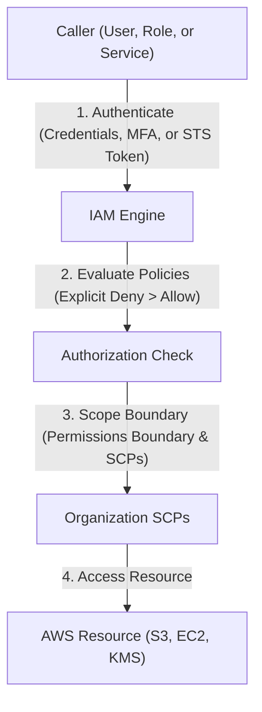

---
domains:
  - "aws"
class: reference-note
tier: reference-note
tags:
  - aws/iam
---

# Module 3-2: AWS IAM & Identity Management

## IAM - Identity & Access Management
IAM allows creating & managing multiple identities, authentication & authorization for AWS account.
So The same AWS account can have multiple users with different permissions, instead of only logging in as a ROOT User
### IAM Features:
- Shared access to AWS account
- Granular Permissions:
	Specific & strict permissions as desired.
- Secure access to AWS resources for applications that runs on AWS 
- Multi-factor authentication
- Identity Federation:
	The process of delegating a user authentication responsibility to a trusted external party. *ex:* Logging in by google authentication.
-  identity information logs
- PCI Compliance:
	Credit Card Compliance.
- Integrated with many AWS Services
- Eventually Consistent details & permissions 
	(IAM sticks with the user regardless his geolocation or the AWS  region he is operating in)
- Free to use
- AWS STS "AWS Secure Token Service":
	Temporary Sessions.


### IAM Identities
- Federated Users (outside AWS)
- IAM User
- IAM Group
- IAM Role:
	IAM Role is a set of permissions, acts as a badge for a determined temporary time "STS - Security Token Service".

![[Pasted image 20250508121336.png]]


### IAM Console
### *_USERS:*

### Creating IAM User :


### Setting Permissions or adding the user to a Group :

### User details

### Access Key
- A secret key that is download as .csv file, to login using it instead of username & password.
- If the access key or the file is lost, the access can be denied from the console, by selecting status to inactive.


### *_ACCOUNT SETTINGS:*

### Password Policy
Having restrictions over passwords in the system


*Note:* When applying a new password policy, only new users will be affected, & the old users will only be affected after password expiry "Enable passwords expiration".

![[Pasted image 20250508133827.png]]

### IAM Best Practice

![[Pasted image 20250508134144.png]]


---

# Module 3-2: AWS IAM & Identity Management

This module covers identity federation, role assumption via **AWS Security Token Service (STS)**, programmatic access keys, root user security, and multi-account governance using **AWS Organizations** and **Service Control Policies (SCPs)**.

---

---

## 🗺️ Cognitive Map: IAM Authentication and Authorization


---

---

## 1. Identity & Access Management (IAM) Deep Dive
IAM manages access to AWS resources securely through authentication (verifying who you are) and authorization (verifying permissions).

![[Pasted image 20250509095045.png]]

#AWS-SECURITYGROUP-SCOPE
On EC2 level and it can 
be connected to multiple EC2 
in **same region** ?
### Source & Destination Ports
Security Groups are basically settings for sources & destinations.
**vip.note:** Ephemeral Range is the set of ports of the client.

*Example:* In a working environment you want the SSH Logins to only be able to occur from a set of specific IPs


---

## Programmatic Access to AWS
![[Pasted image 20250510230133.png]]

![[Pasted image 20250510230152.png]]


Programmatic access for any IAM user isn't done by username & password, it requires an access key (Access Key ID & Secret Access Key) to access AWS Programmatically "**ex:** the windows cmd".
- The Secret Access Key is only shown at creation & must be saved. 
**Note:** Make sure you have AWS CLI installed on your OS terminal.

**Logging in by programmatic access using the log in keys:**


---

## IAM Policies
![[Pasted image 20250510231341.png]]

![[Pasted image 20250510231545.png]]


![[Pasted image 20250510232036.png]]

- it's attached to an identity "IAM user, IAM role, etc." or a resource "item in a S3 Bucket".
- Policies are AWS-Managed, Customer-Managed, or inline Policy "for one user".
- More than one policy may be attached to an identity.
- By default all requests are denied for an identity, an explicit allow overrides this.
- an explicit deny overrides all allows.
- Policies are stored as JSON documents in AWS.


### EC2 Instance IAM Role 

![[Pasted image 20250510233120.png]]


IAM Role **is not permanent** (long term credentials) the provided token doesn't last forever its only available for a predefined time  
**Don't** use permanent credentials inside an EC2 instance or in a code instead use an IAM Roles

**AN IAM ROLE IS AN STS (security token service)**


![[Pasted image 20250511004319.png]]


![[Pasted image 20250511003916.png]]

---

# Verify credentials are temporary from STS metadata
curl http://169.254.169.254/latest/meta-data/iam/security-credentials/EC2-S3-Read-Role

---

# Test S3 listing (using internal gateway endpoint)
aws s3 ls s3://my-secure-config-bucket/
```

### D. Supplemental Lab Notes & Images

---

## Deep-Intuition (AARF) Breakdowns

### AARF Breakdown: IAM Roles (STS) vs. Permanent Credentials
1.  **The Answer (Core Pattern):** Deploy applications using IAM Roles and EC2 Instance Profiles to fetch temporary, short-lived credentials via AWS STS, completely avoiding the use of permanent Access Keys.
2.  **The Assumptions (Context):** The calling application or user must be inside a trust boundary recognized by the IAM trust policy, and local processes must fetch credentials dynamically from the IMDSv2 metadata endpoint.
3.  **The Rationale (Why):** Permanent access keys stored in config files or git repositories risk leakage. STS credentials automatically expire (configurable from 15 minutes to 12 hours) and are rotated by the AWS platform, neutralizing leak vulnerabilities.
4.  **The Failure Loop (What if not):** Hardcoding static access keys in a codebase hosted on an EC2 instance that gets compromised allows attackers to steal those credentials and call AWS APIs directly, bypassing the OS and host controls.
5.  **Alternative Case (When to use 'if not'):** For legacy on-premises applications that cannot assume IAM Roles, use strictly scoped IAM User access keys with aggressive rotation managed by AWS Secrets Manager.

### AARF Breakdown: Service Control Policies (SCPs)
1.  **The Answer (Core Pattern):** Enforce strict Deny policies at the Organizational Unit (OU) level to prevent root/admin users in member accounts from bypassing security configurations (e.g., disabling CloudTrail or leaving the organization).
    ```json
    {
      "Version": "2012-10-17",
      "Statement": [
        {
          "Effect": "Deny",
          "Action": [
            "organizations:LeaveOrganization",
            "cloudtrail:StopLogging",
            "cloudtrail:DeleteTrail"
          ],
          "Resource": "*"
        }
      ]
    }
    ```
2.  **The Assumptions (Context):** SCPs apply only to member accounts within the Organization, not to the master/management root account. An IAM policy is still required within the member account to grant access.
3.  **The Rationale (Why):** Enforces global corporate compliance rules. Even if a member account's administrator credentials are stolen, the attacker cannot delete audit logs or disable compliance tools because the SCP explicitly blocks those actions at the organization level.
4.  **The Failure Loop (What if not):** Without SCPs, a compromised admin account in a child sandbox can delete CloudTrail logs, delete backups, and spin up runaway GPU clusters for crypto-mining, rendering the incident untraceable.
5.  **Alternative Case (When to use 'if not'):** In standalone accounts or developer sandboxes not bound to corporate compliance frameworks, bypass SCPs to maximize API freedom and speed of experimentation.
