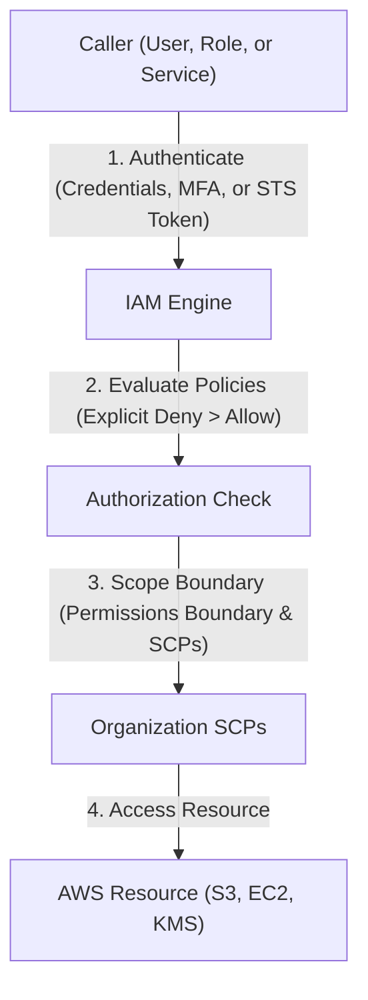
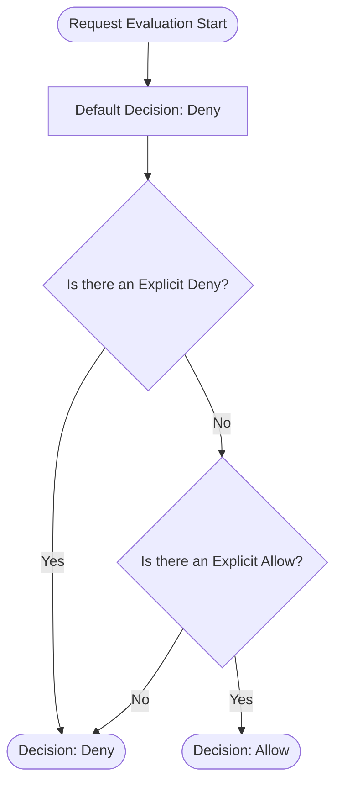

---
domains:
  - "aws"
class: reference-note
tier: reference-note
tags:
  - aws/iam
---

# Module 3-2: AWS IAM & Identity Management

**Breadcrumbs:** [[Reference Notes/3-Index - AWS|🏠 AWS Index]] > **AWS IAM & Identity Management**

---

## 🗺️ Cognitive Map: IAM Authentication and Authorization


---

## 1. Identity & Access Management (IAM) Deep Dive
IAM is a **global service** that manages access to AWS resources securely through authentication (verifying who you are) and authorization (verifying permissions). Since IAM is global, users, groups, policies, and roles are available across all AWS regions.

### A. Root User vs. IAM Users & Groups
*   **Root User:** Created by default when the AWS account is created. Has absolute, unrestricted access to all resources and billing information. 
    *   *Best Practice:* Only use the root user for initial account setup tasks (such as creating the first admin user, changing account settings, or enabling billing access), then protect it with MFA and lock it away.
*   **IAM User:** Represents a single physical person or application inside your organization (1-to-1 mapping). Each user has a password for AWS Console access and/or access keys for programmatic access.
*   **IAM Group:** A logical container for IAM users. 
    *   *Best Practice:* Assign policies directly to groups rather than individual users, allowing users to inherit permissions dynamically.
    *   *Constraints:* Groups can only contain users, not other groups (no nested groups). Users can belong to multiple groups or no groups (though no groups is against best practice).

### B. AWS Console Simultaneous Sign-in (Multi-Session Support)
AWS supports multi-session console access using the same browser. Users can click "Add Session" and sign into multiple identities or account IDs concurrently within the same browser session.
*   *Evolutionary Context:* Historically, users had to use private browser windows (Incognito) or separate browsers to manage multiple active sessions simultaneously. The native multi-session feature represents a major workflow optimization for cloud administrators operating at scale.

---

## 2. IAM Policies & Evaluation Logic
Policies are JSON documents that define permissions. They can be attached to identities (identity-based policies) or resources (resource-based policies).

### A. Policy JSON Structure
An IAM policy consists of one or more statements, each containing:
*   **Version:** The policy language version (typically `"2012-10-17"`).
*   **Id:** An optional policy-wide identifier.
*   **Statement:** An array containing:
    *   **Sid:** Optional statement identifier.
    *   **Effect:** Either `"Allow"` or `"Deny"`.
    *   **Principal:** The entity (account, user, or role) that is allowed or denied access (used only in resource-based policies).
    *   **Action:** The list of API calls being allowed/denied (e.g., `iam:ListUsers`, `s3:GetObject`). Wildcards (e.g., `iam:Get*`) can be used to match multiple actions.
    *   **Resource:** The list of resources the actions apply to (specified by ARN or `*` for all resources).
    *   **Condition:** Optional constraints specifying when the statement is active.

Example:
```json
{
  "Version": "2012-10-17",
  "Statement": [
    {
      "Sid": "AllowIAMRead",
      "Effect": "Allow",
      "Action": [
        "iam:ListUsers",
        "iam:GetUser"
      ],
      "Resource": "*"
    }
  ]
}
```

### B. Policy Types
1.  **AWS-Managed Policies:** Standardized, reusable policies created and maintained by AWS (e.g., `AdministratorAccess`, `IAMReadOnlyAccess`).
2.  **Customer-Managed Policies:** Custom, reusable policies created by the account owner.
3.  **Inline Policies:** Non-reusable policies attached directly to a single user, group, or role.

### C. Policy Evaluation Logic Diagram
AWS IAM operates on a default deny basis. Evaluation follows these absolute rules:
1.  **Explicit Deny:** If any policy statement evaluates to `Deny` for the requested action, the final decision is immediately `Deny` (overriding all allows).
2.  **Explicit Allow:** If no explicit deny exists, there must be an explicit `Allow` statement for the action to be authorized.
3.  **Implicit Deny:** If there is neither an explicit deny nor an explicit allow, the request is denied by default.



---

## 3. Account Protection: Password Policies & MFA
Securing authentication is critical to preventing account compromise.

### A. Password Policy
Administrators can customize password complexity requirements:
*   Enforcing minimum length.
*   Requiring uppercase, lowercase, numbers, and non-alphanumeric characters.
*   Enforcing password expiration (e.g., every 90 days).
*   Preventing password reuse.
*   *Note:* New password policies apply immediately to new users, but existing users are only forced to change their password when it expires.

### B. Multi-Factor Authentication (MFA)
MFA adds an extra layer of defense by combining a password (something you know) with a device (something you own). Enforcing MFA on the Root User and all IAM users is a high-priority security best practice.
*   **Virtual MFA App:** Authenticator applications (Google Authenticator, Authy, Twilio Authenticator) running on a phone. Authy supports multiple tokens on a single device, making it highly portable. One virtual device can manage multiple AWS users and accounts.
*   **Universal 2nd Factor (U2F) Security Key:** A physical USB/NFC token (e.g., YubiKey by Yubico) supporting multiple users and accounts.
*   **Hardware Key Fob TOTP:** A physical token (e.g., Gemalto) generating time-based one-time passwords.
*   **SurePassID Key Fob:** Specialized key fobs designed for the US GovCloud region.

---

## 4. Programmatic Access: CLI, SDK, and CloudShell
Programmatic access allows applications and operators to execute commands directly against public AWS APIs.

### A. Access Keys
To call APIs programmatically, users must generate **Access Keys**:
*   **Access Key ID:** Public identifier (analogous to a username).
*   **Secret Access Key:** Secret credential (analogous to a password).
*   *Security Constraints:* Access keys are only visible at the moment of creation. If lost, they cannot be retrieved and must be regenerated. They must never be shared or committed to code repositories.

### B. AWS CLI (Command Line Interface)
An open-source command-line tool built on the **AWS SDK for Python (Boto/Botocore)**.
*   **Configuration:** Configured by running `aws configure` in the terminal, which prompts for the Access Key ID, Secret Access Key, default Region (e.g., `eu-west-1`), and default output format.
*   **Testing Access:** Use the command `aws iam list-users` to confirm credential connectivity and permissions.

### C. AWS SDK (Software Development Kit)
Language-specific libraries embedded directly into application code to call AWS APIs programmatically.
*   Supports languages like JavaScript, Python, PHP, .NET, Ruby, Java, Go, Node.js, C++, and includes specialized SDKs for mobile and IoT devices.

### D. AWS CloudShell
A browser-based, pre-authenticated terminal environment built directly into the AWS Console.
*   **Availability:** Free to use, but only available in specific AWS regions (the default region is determined by the console's active region).
*   **Features:**
    *   Preloaded with AWS CLI Version 2, Python, and other utilities.
    *   Pre-authenticated using the credentials of the logged-in console session.
    *   Includes a home directory (`/home/cloudshell-user`) that persists files across sessions.
    *   Supports splitting the console pane into multiple active columns/tabs and uploading/downloading files.

---

## 5. IAM Roles & AWS STS
AWS services (like EC2 instances or Lambda functions) often need permissions to access other resources (e.g., S3 buckets). Hardcoding permanent Access Keys inside applications or instances is a severe security risk.

### A. IAM Roles
An IAM Role is an identity with permission policies that can be temporarily assumed by a trusted service, resource, or federated user.
*   **Trust Policy:** Defines *which* trusted entity can assume the role (e.g., `ec2.amazonaws.com`).
*   **Permission Policy:** Defines *what* actions the entity can take once the role is assumed.

### B. AWS STS (Security Token Service)
A global service that issues **temporary security credentials** (access key ID, secret access key, and a security token) when a role is assumed.
*   Credentials issued by STS are short-lived (valid from 15 minutes up to 12 hours) and rotate automatically when managed by AWS (e.g., via EC2 Instance Profiles).
*   Applications running on EC2 fetch these temporary credentials dynamically via the Instance Metadata Service (IMDSv2) endpoint:
    ```bash
    curl http://169.254.169.254/latest/meta-data/iam/security-credentials/EC2-Role-Name
    ```

---

## 6. Audit & Governance: Security Tools, Billing, & Budgets

### A. IAM Security Tools
1.  **Credential Report (Account-Level):** Generates a CSV audit containing all users in the account, password usage, MFA status, access key generation/usage/rotation dates.
2.  **Access Advisor (User/Role-Level):** Shows which services are authorized for a user/role and when they were last accessed. Critical for enforcing the **Principle of Least Privilege** by identifying and removing unused permissions.

### B. AWS Billing Access Activation
By default, even administrators cannot access the billing console.
*   *Action Required:* The **Root User** must explicitly enable "IAM User and Role Access to Billing Information" under account settings to delegate billing visibility to administrators.

### C. AWS Budgets
A proactive cost-governance tool to alert administrators when spending thresholds are breached.
*   **Zero Spend Budget:** Alerts immediately via email when actual spending exceeds $0.01. Highly recommended for developer sandboxes.
*   **Monthly Cost Budget:** Triggers alerts when spending approaches a set limit (e.g., $10), evaluating actual spending against thresholds (e.g., 85% and 100%) and forecasted spending (e.g., 100%).

---

## 7. Deep-Intuition (AARF) Breakdowns

### AARF Breakdown: IAM Roles (STS) vs. Permanent Credentials
1.  **The Answer (Core Pattern):** Deploy applications using IAM Roles and EC2 Instance Profiles to fetch temporary, short-lived credentials via AWS STS, completely avoiding the use of permanent Access Keys.
2.  **The Assumptions (Context):** The calling application or user must be inside a trust boundary recognized by the IAM trust policy, and local processes must fetch credentials dynamically from the IMDSv2 metadata endpoint.
3.  **The Rationale (Why):** Permanent access keys stored in config files or git repositories risk leakage. STS credentials automatically expire (configurable from 15 minutes to 12 hours) and are rotated by the AWS platform, neutralizing leak vulnerabilities.
4.  **The Failure Loop (What if not):** Hardcoding static access keys in a codebase hosted on an EC2 instance that gets compromised allows attackers to steal those credentials and call AWS APIs directly, bypassing the OS and host controls.
5.  **Alternative Case (When to use 'if not'):** For legacy on-premises applications that cannot assume IAM Roles, use strictly scoped IAM User access keys with aggressive rotation managed by AWS Secrets Manager.

### AARF Breakdown: Service Control Policies (SCPs)
1.  **The Answer (Core Pattern):** Enforce strict Deny policies at the Organizational Unit (OU) level to prevent root/admin users in member accounts from bypassing security configurations (e.g., disabling CloudTrail or leaving the organization).
    ```json
    {
      "Version": "2012-10-17",
      "Statement": [
        {
          "Effect": "Deny",
          "Action": [
            "organizations:LeaveOrganization",
            "cloudtrail:StopLogging",
            "cloudtrail:DeleteTrail"
          ],
          "Resource": "*"
        }
      ]
    }
    ```
2.  **The Assumptions (Context):** SCPs apply only to member accounts within the Organization, not to the master/management root account. An IAM policy is still required within the member account to grant access.
3.  **The Rationale (Why):** Enforces global corporate compliance rules. Even if a member account's administrator credentials are stolen, the attacker cannot delete audit logs or disable compliance tools because the SCP explicitly blocks those actions at the organization level.
4.  **The Failure Loop (What if not):** Without SCPs, a compromised admin account in a child sandbox can delete CloudTrail logs, delete backups, and spin up runaway GPU clusters for crypto-mining, rendering the incident untraceable.
5.  **Alternative Case (When to use 'if not'):** In standalone accounts or developer sandboxes not bound to corporate compliance frameworks, bypass SCPs to maximize API freedom and speed of experimentation.
