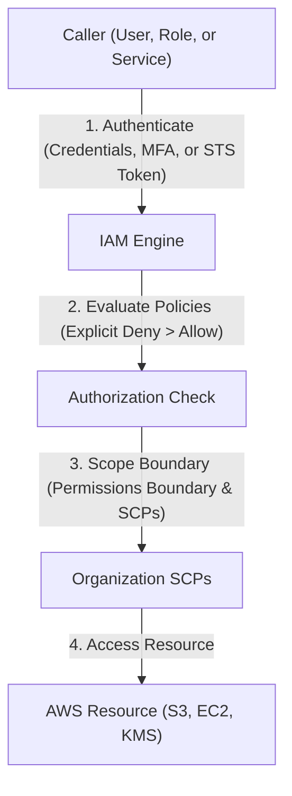

---
domains:
  - "aws"
  - "security"
class: reference-note
tier: reference-note
tags:
  - aws/iam
  - aws/organizations
  - aws/security
---

# Module 3-2: AWS Identity & Access Management (IAM) & Governance

This module covers identity federation, role assumption via **AWS Security Token Service (STS)**, programmatic access keys, root user security, and multi-account governance using **AWS Organizations** and **Service Control Policies (SCPs)**.

---

## 🗺️ Cognitive Map: IAM Authentication and Authorization



---

## 1. Identity & Access Management (IAM) Deep Dive
IAM manages access to AWS resources securely through authentication (verifying who you are) and authorization (verifying permissions).

## IAM - Identity & Access Management
IAM allows creating & managing multiple identities, authentication & authorization for AWS account.
So The same AWS account can have multiple users with different permissions, instead of only logging in as a ROOT User
### IAM Features:
- Shared access to AWS account
- Granular Permissions:
	Specific & strict permissions as desired.
- Secure access to AWS resources for applications that runs on AWS 
- Multi-factor authentication
- Identity Federation:
	The process of delegating a user authentication responsibility to a trusted external party. *ex:* Logging in by google authentication.
-  identity information logs
- PCI Compliance:
	Credit Card Compliance.
- Integrated with many AWS Services
- Eventually Consistent details & permissions 
	(IAM sticks with the user regardless his geolocation or the AWS  region he is operating in)
- Free to use
- AWS STS "AWS Secure Token Service":
	Temporary Sessions.


### IAM Identities
- Federated Users (outside AWS)
- IAM User
- IAM Group
- IAM Role:
	IAM Role is a set of permissions, acts as a badge for a determined temporary time "STS - Security Token Service".

![[../Attachments/Pasted image 20250508121336.png]]


### IAM Console
### *_USERS:*

### Creating IAM User :


### Setting Permissions or adding the user to a Group :

### User details

### Access Key
- A secret key that is download as .csv file, to login using it instead of username & password.
- If the access key or the file is lost, the access can be denied from the console, by selecting status to inactive.


### *_ACCOUNT SETTINGS:*

### Password Policy
Having restrictions over passwords in the system


*Note:* When applying a new password policy, only new users will be affected, & the old users will only be affected after password expiry "Enable passwords expiration".

![[../Attachments/Pasted image 20250508133827.png]]

### IAM Best Practice

![[../Attachments/Pasted image 20250508134144.png]]


 
## Creating Billing Alarms
Using the Root User, limiting bills to as low as 1$ & setting Billing alarms can be done through the Budgets tab in the Billing Dashboard.
This can be set to be a continuous **"Recurring budget"** or an **"Expiring Budget"**.
This is very important step to avoid unexpected bills over the budget plan.

## VPC - Virtual Private Cloud
- The Virtual Private Cloud, is a virtual data center in the cloud, confined to an AWS region & isolated from other VPCs by default.
management- The client has full control over his VPC & is secured from other clients with other VPCs on the same AWS host server.
- A VPC is confined to a single AWS Region

#AWS-VPC-SCOPE
VPC is a regional service 
You don't get charged over VPC creation (igw,vgw,subnets)
### VPC Components  
- ##### CIDR Block
	- Each created VPC has  a main CIDR Block created with it & this main cannot be removed or changed, only the VPC can be totally deleted.
	- **VPC Address Pool can be expanded by adding up to 4 secondary CIDR Blocks, with some limitations.**                  secondary CIDR  == Expansion CIDR
	- When Connecting to another VPC subnets or on premise if the same CIDR range is used it creates a problem but it can be worked around it 

- ##### Subnets
	- Multiple subnets can be configured per VPC.
	- subnets can't be overlapping and that is a basic TCP/IP restriction subnets are confined in a *Availability Zone*, *meaning they cannot stretch between multiple AZs.* 
	- Subnets can only attach to one route table at a time 

	--if i tried stretching a subnet over two AZ is not recommended because it causes troubles like broadcast problems ??-- 

- ##### Implied Router
	- AWS provides an implied virtual router for the VPC, connecting all subnets to one another. This router is accessible or manageable  only by AWS not the client.

     We can Control Implied Router behavior but thats not in the associate level 

- ##### Route Tables
    - The client only edits the routing tables provided by the Implied Router
    - Route table can be used by more than one subnet 

	Routing inside a VPC is guaranteed by default and it can't be changed or removed 

#AWS-ROUTE-TABLE-SCOPE
Subnet level 

 - ##### Internet Gateway "IGW"
	 Default VPCs are automatically assigned with Internet Gateway, created new VPCs doesn't & must be assigned to an Internet Gateway Manually .
	 Internet Gateway is fully managed by AWS not the client, horizontally scaled, redundant & highly available, & supports IPv4 & IPv6.
	 **Only one IGW can be assigned to a VPC at a time.**
	- ##### Virtual Private Gateway "VGW"
	  An encrypted (VPN-IPsec) Gateway over the internet **(can be affected by network latency)** to establish connection to On-Premise with the cloud "For Hybrid Clouds".
	  Only one VGW can be assigned to a VPC at a time.
- ##### Security Groups
- ##### Network Access Control Lists "Network ACL"

### VPC Console
By default there will a VPC on each region, this can be viewed from the VPC dashboard. 
From the VPC Console You can manage & view the info of current VPCs or create new VPCs, & manage all the VPC components listed before.


## Public Subnet vs Private Subnet
### Public Subnet 
Is a subnet created in a VPC with IGW attached and its associated routing table contains a default route pointing at the VPC's IGW, 
meaning it has internet access. 
Public Subnets is used for the applications & services that will need internet access
### private subnets 
doesn't have internet access. They can't access the internet directly and can't be accessed from outside the VPC,*Private Subnets is mainly for databases*, Private subnets is sometimes even used for application that need internet access for extra security so it will access the internet indirectly   


## Hybrid Cloud Connectivity Options in AWS
##### 1- VPN Connection
- Not reliable
- Over the internet connection
- Quick to deploy
- Secure
- Cost effective
##### 2- AWS Direct Connect Connection "DX"
- Long deployment times
- Reliable good performance
- Not secure by default as VPN Connection
*Note:* It's applicable to use "IPSec"/VPN on top of the DX to get the benefits of the DX with more reliable security.
Both Connections above are terminated on the "VGW" from the VPC end, & on the Customer Gateway from the On-Premises end.
![[../Attachments/Pasted image 20250508151826.png]]
## EC2 - Elastic Compute Cloud
EC2 is a service acting as Virtual Machines, with resizable computing capacity in the cloud, & fully manageable by the client with the root access.
EC2 can be provisioned on **shared hosts** (Between other AWS Client's EC2 instances) or **dedicated hosts**. There is a 20 EC2 instances soft limit per account. {{Soft limits is limits that can be changed, opposite of Hard Limits}}
EC2 is launched in a subnet in the availability zone.

### EC2 Instances Types:

#AWS-EBS-SCOPE
The availability zone 
Can only be used by one EC2 
##### 1- EBS Volumes - Elastic Block Store
- EBS volumes are volumes that keeps the data persistent & not lost after turning off the EC2.
- The EBS Volumes are always outside the EC2 instance but **in the same availability zone.**
- The EC2 EBS volume holding the data is reached through ENI (eth0) as its not on EC2 its a storage over the network in the AZ.
- EC2 instances with an EBS root volume are called **EBS-Backed EC2 Instances.**
##### 2- Instance-Store
- Also known as ephemeral Storage, these volumes are in the same physical server as the EC2, & are not persistent.
- Access to Instance-store volumes are much faster than EBS Volume.
- EC2 instances with an instance-store volume are called Instance-Store Backed EC2 Instances. sometime we want the high IO operations so we make distributed system for high availability will be covered later in the course  

### EC2 SSH Keys
- No Password needed for login, only 2 Keys Pairs
- Public key is stored in AWS, Private key is a key the client keeps.
- The Private key is downloaded only at instance creation, if not or lost the instance should be terminated & start a new one.
### Methods of Connection
##### 1- SSH - Secure Shell Login for EC2 instances
##### 2- EC2 Instance Connect "Browser Based SSH Connection"

###### EC2 connecting by SSH client steps are shown in the console after trying to connect:


*Note:* instead of typing the SSH key in the command, use the option -K for storing it in memory & option -A for the agent forwarding. 


### Private, Public & Elastic IP Addresses 


> [!NOTE] Title
> EIP has a soft limit of 5 per VPC "Can be changed by sending a ticket"


### NAT - Network Address Translation.
**No EC2 instance will launch without having a Private IP Address.** However it needs either Public IP Address or Elastic IP Address to simply be able to connect to it, as the EC2 is logged onto through the internet as every AWS service.
The EC2 Private IP Address is translated to its corresponding Public IP Address by NAT - Network Address Translation.


### Elastic Ip Address
EIP is mostly used to hold a specific IP for firewalls, so it is referred to as **whitelisting**, The whitelisting term is used when we want to configure a firewall to IPs so we want fixed IPs so we don't reconfigure the firewall if the instances is restarted 
![[../Attachments/Pasted image 20250509093622.png]]
.

### Monolithic vs Multi Tier, & Microservices
Monolithic is using one instance for the whole application & the entire application is built as a single code project, making it harder to scale & troubleshoot. It's more advisable to use multi tier instances for multiple parts of the project or the application.

Microservices approach is dividing the tiers even more to be able to launch it on containers instead of VMs, as it's has more efficiency & speed.


![[../Attachments/Pasted image 20250512091001.png]]
## Security Groups
- Security Groups are virtual firewalls applied on the ENI "Elastic Network Interface" of the EC2 instance.
- Traffic going into the ENI is called inbound traffic, & traffic from the ENI is called outbound traffic. 
- Security Groups have only permit rules. no deny rules. If no permits are found it is considered as an implied deny.
- Can add up to 16 (5 default maximum) Security Groups per EC2 instance.
- Security Groups are stateful, meaning that if the traffic is allowed either if its inbound or outbound, the opposite direction response is automatically allowed even if no permit rules were found.


![[../Attachments/Pasted image 20250509095045.png]]

#AWS-SECURITYGROUP-SCOPE
On EC2 level and it can 
be connected to multiple EC2 
in **same region** ?
### Source & Destination Ports
Security Groups are basically settings for sources & destinations.
**vip.note:** Ephemeral Range is the set of ports of the client.

*Example:* In a working environment you want the SSH Logins to only be able to occur from a set of specific IPs


## NACLs - Network Access Control Lists
- NACL functions at a subnet level, so it's applied to all EC2 instances inside the subnet.
- It's applied at the implied router
- NACLs are **Stateless** "one way only".
- It includes permit & deny rules.
- Each NACL rule has a sequence number, rules are elevated from lowest to highest sequence number.
- Once a rule is found either permit or deny the process is stopped "no reading for rest of the rules", if none are found it ends with explicit deny.
- Traffic going into Subnet is called inbound traffic, & traffic from the Subnet is called outbound traffic.

**Security Group Vs NACL, NACL is applied to all EC2 inside the subnet**


*Note:* As Network ACL acts on the Subnet not the VPC, **its Dashboard is on the VPC Dashboard,** unlike the security groups which is on the EC2 Dashboard.

#AWS-NACL-SCOPE
subnet level 

### Whitelisting vs Blacklisting 
![[../Attachments/Pasted image 20250509101613.png]]

custom NACL by default is black listed deny all traffic and by adding rules we are whitelisting, Default NACL allow inbound and outbound 

In outbound traffic the source will be a port of the ephemeral range that the client may be using so we need to set the range of the outbound rules same as the ephemeral range 
![[../Attachments/Pasted image 20250509102806.png]]

![[../Attachments/Pasted image 20250509102735.png]]


## Encryption
It's basically locking sensitive data or over network packets to prevent leakage of sensitive information, this locking is done with encryption keys of different kinds.

Its always better to know in the design phase if i want to apply encryption on my S3 buckets or RDS for example before creating my architecture and it can be added later but in terms of best practices its better before 

### 1- Encryption in-Transit using Asymmetric Keys
- Encryption between two ends, using a Public key & a Private key.
- Requires Key generator to create the key pair.
- The key owner holds the private key & shares the public key with clients.
**ie:** Owner encrypts with the private key & the client decrypts with the public key, & vice versa.

![[../Attachments/Pasted image 20250509104728.png]] 

![[../Attachments/Pasted image 20250509105033.png]]
### 2- Encryption in-Transit using Symmetric Keys
- Uses the same key & encryption algorithm for encryption/decryption.
- It's more efficient than using the asymmetric key.
- The asymmetric encryption can be used to exchange symmetric keys.
![[../Attachments/Pasted image 20250509105447.png]]
### KMS - AWS Key Management Services [[AWS-KMS]]
It's an *AWS managed* Key management service that allows customers to **create & manage cryptographic keys.**
- Controls keys usage & permissions for keys' access.
- integrated with many AWS services.
- Highly durable "Low loss" & highly available.
- Integrated with CloudTrail(Audit services).
- It's a Regional service, meaning that created keys in RegionA will only work for RegionA, although the VPC is over multiple regions.
- **$1/Month for each key customer created, or free for keys created by AWS services.**
- CMKs - Customer Master Keys are the primary resources in the KMS.

#AWS-KMS-SCOPE
Regional scope only on the region it was created 
#### CMKs - Customer Master Keys

![[../Attachments/Pasted image 20250509110017.png]]

- CMKs are used to provide either encrypted keys or plain keys.
- KMS provides encrypting data up to 4 Kbytes, bigger files require manual encrypting using CMKs generated keys.
- **CMKs never leave KMS.**
- KMS doesn't store customer **data keys** generated by CMKs, **either encrypted or not.**
- The encrypted Key held by customer can be sent to KMS to decrypt it to plain text again to be able to use it for decryption.
- There are both AWS-managed CMKs, or Customer-Managed CMKs


![[../Attachments/Pasted image 20250509110718.png]]


Here we used the plain text Datakey for decryption and then discarded it... and stored the encrypted Datakey 

![[../Attachments/Pasted image 20250509110745.png]]

Since i stored my encrypted Datakey I will use KMS to decrypt the Datakey to plain text so it could be used to decrypt the data

![[../Attachments/Pasted image 20250509110941.png]]


Note: So how can i differentiate between Keys managed by AWS and customer managed keys, **AWS keys are known by the name of** *aws/service_name* 

**Example:** creating an EC2 instance & encrypting EBS Volume:

**Note:**  AWS-managed CMKs have automatic key rotation of 3 years, while Customer-Managed CMKs have 1-year optional rotational period "If Chosen".

![[../Attachments/Pasted image 20250509111142.png]]
## AWS S3 -Simple Storage Service / Object Storage
![[../Attachments/Pasted image 20250509113404.png]]
- It's Object Storage based, Data & Meta-Data stored as whole object & not divided into objects "as in Block Storage".
- Cheaper than Block Storage "as EBS Volumes"
- Better scalability & durability.
- **Cannot be mounted as a drive or a directory to an EC2 instance. it can only be accessed through API's** 
- Ideal for data growth storage as there is no limit on amount of data or metadata in an object, only the maximum size of a file is 5 Terabyte
- S3 Storages are called S3 Buckets, & the Buckets are confined to the Region & outside the VPC, **backing up it to another regions must be done manually**. since its outside the VPC NACL and security groups are not applied to it 
- The S3 Buckets' names are Globally Unique.
- There are no actual folders within a bucket, however this can be mimicked and attach a folder name to objects for work organization.


![[../Attachments/Pasted image 20250509114119.png]]


#AWS-S3-SCOPE
Regional scope 
## Programmatic Access to AWS
![[../Attachments/Pasted image 20250510230133.png]]

![[../Attachments/Pasted image 20250510230152.png]]


Programmatic access for any IAM user isn't done by username & password, it requires an access key (Access Key ID & Secret Access Key) to access AWS Programmatically "**ex:** the windows cmd".
- The Secret Access Key is only shown at creation & must be saved. 
**Note:** Make sure you have AWS CLI installed on your OS terminal.

**Logging in by programmatic access using the log in keys:**


## IAM Policies

![[../Attachments/Pasted image 20250510231341.png]]

![[../Attachments/Pasted image 20250510231545.png]]


![[../Attachments/Pasted image 20250510232036.png]]

- it's attached to an identity "IAM user, IAM role, etc." or a resource "item in a S3 Bucket".
- Policies are AWS-Managed, Customer-Managed, or inline Policy "for one user".
- More than one policy may be attached to an identity.
- By default all requests are denied for an identity, an explicit allow overrides this.
- an explicit deny overrides all allows.
- Policies are stored as JSON documents in AWS.


### EC2 Instance IAM Role 

![[../Attachments/Pasted image 20250510233120.png]]


IAM Role **is not permanent** (long term credentials) the provided token doesn't last forever its only available for a predefined time  
**Don't** use permanent credentials inside an EC2 instance or in a code instead use an IAM Roles

**AN IAM ROLE IS AN STS (security token service)**


## SQS - Amazon Simple Queue Service (Message Queue Concept)
- Message Queues provide asynchronous communication & coordination for the application components.
- Messages are stored in queue reliably until they re processed, then get deleted.
- this allows scaling different parts of the project (Producer queue and consumer queue) because they are independent of each other  & increase its reliability.
- Message sending Tiers is called **Message** **Producers**, while message receiving Tiers is called **Message Consumers**.
- Using SQS is referred to as Decoupling process, as it decouples different tiers. 
![[../Attachments/Pasted image 20250510235011.png]]


## SNS - Amazon Simple Notification Service
- SNS is a fast & fully managed notification service.
- **Publisher is the sender "Producer" & Subscriber is the receiver "Consumer".**
- Publishers publish messages to a SNS Topic, Subscribers receive messages from the SNS Topics they are subscribed to.
- **Publisher must have the permissions to be in the SNS Topic "IAM Policies".**
- Subscribers can be users, emails, SMS, services & many other formats.
- SNS is reliable & stores multiple data copies across multiple AZs.
- SNS supports HTTPS in-transit. Its also encrypted at rest 

**Note:** Message size in SQS & SNS shouldn't exceed 256 Kbytes, indicating that the messages either in queue "SQS" or instant "SNS" won't include the data or the object itself, only a message about the data.

## CDN - Content Delivery Network (Amazon CloudFront)
- Amazon CloudFront Provides highly available cache to compensate using multiple resources for less latency "**ex:** Accessing data from S3 buckets through different countries"
- using CloudFront is more economically efficient than using different Buckets.
- These Cache Locations are called Edge Locations.


Red squares refers to edge locations, if edge locations doesn't have the requested data cached it uses its high speed links to the main s3 bucket source and fetch the data so the fetch process was faster than the user connecting directly to the s3 and if the data was requested again its already cached in the edge location 

Using Cloud-Front is guaranteed to be cheaper than fetching content directly from an s3 bucket, can be a question on how to reduce s3 bucket cost usage 


## Amazon Route 53 

![[../Attachments/Pasted image 20250511004319.png]]


![[../Attachments/Pasted image 20250511003916.png]]

- Amazon Route 53 is AWS's DNS.
- Acts similar to the Public DNS for example.
- It supports public hosted zones for internet facing workload/applications, or private hosed zones for private workloads/on VPC applications.
- The Firms or corporate that has a Domain name server (Route 53) They have a pool of Ip addresses mapped to names all they do wait for a request on that domain name and reply with the IP 
	- AWS is the authoritative of any domain name it holds, Internet registry any domain name registered in it is unique globally 
	- Record Means Which domain resolves to what ip address 

![[../Attachments/Pasted image 20250513221529.png]]
![[../Attachments/Pasted image 20250513221555.png]]
![[../Attachments/Pasted image 20250513221701.png]]

## OLTP & OLAP
![[../Attachments/Pasted image 20250511005627.png]]
#### OLTP - On-Line Transactional Processing
- Uses detailed & Current data to store the transactional data
- Characterized by high volume of simple transactions & short queries.
#### OLAP - On-Line Analytical  Processing
- Stores analytical data & reports
- Characterized by relatively low transactions volume & very complex queries involving aggregations.

## RDS - Amazon Relational Database Service 
- it supports a set of databases services as MS SQL, MySQL, Maria DB, Oracle, PostgreSQL & Amazon Aurora.
- **RDS Launches the database inside the (VPC).**
- It's advised to be put inside a private subnet.
- RDS is fully managed Database, so no customer or root access to it by default.
- If I want root access to RDS instance control, it's  available to use EC2 instances for a self-managed database.
- A **security group** can be attached to the RDS database. **its a best practice to only allow backend tier traffic to pass to the database** 
- RDS instance can be launched in a standalone mode "single AZ" or Multi-AZ mode (Primary instances for read/write & **Standby RDS instances for instant data replication only**).
	- standby is fully synced with the primary RDS, so in real time any data in Primary will be in the standby but it can't read/write unless something happened to the primary and **this process is fully managed by AWS**, AWS provide a URL for developer the URL redirect the request to the up and running database 
- If Iam using RDS in multi-AZ mode when we use the provided URL it uses private hosted route 53 so the URL resolves to the healthy RDS **whether its the Primary or the stand by all the is AWS managed** 
- **It supports auto scaling.**

## High Availability & Fault Tolerance
- **High availability** describes the **availability of the application**, **while Fault tolerance** describes how much the application **performance is affected by faults**.
- High availability is done by **Load Balancers.** through periodic health check the load balancer forward the traffic to healthy EC2 instances, The health check as threshold if it was exceeded the EC2 is marked out of service and unhealthy 

![[../Attachments/Pasted image 20250512091313.png]]

- Highly available but not fault tolarent 
![[../Attachments/Pasted image 20250512091336.png]]

- **Higher Fault tolerance** means higher cost, due to increase of resources. If the application didn't react in real time in fault scenarios the application will not be considered fault tolerance 


## Scalability & Elasticity
### Scalability 
- Scalability refers to system's ability to handle the growth of load by adding resources.
- This scaling can be vertical scaling (up/down) or horizontal scaling(out/in).
 
### Elasticity 
  
- Elasticity describes the system ability to provision &  deprovision resources **automatically** to ensure that resources matches the need. 
- **Auto scaling groups can be configured for EC2 instances**, There  are another auto scaling type called Application Autoscaling will be covered later 
- **Autoscaling is always accompanied with load balancer** in design to ensure high availability  

> [!NOTE]
> - Remember we need to take in consideration the time need for horizontal scaling to start executing it needs triggers from cloud watch and autoscaling groups health checks then start in creating the EC2 instances and EC2 instance may need Minutes to initialize so if it was a 1 min spike in traffic, The application has failed to be fault tolerant we tackle more of this in later videos  

![[../Attachments/Pasted image 20250512092901.png]]

## CloudWatch
- CloudWatch is the center of real time monitoring & visibility in AWS.
- It's a metric data repository "per resource".
- Has the ability to add a custom metric.
- Provides statistics & logs.
- Monitors alarms can be set & can trigger actions
![[../Attachments/Pasted image 20250512103020.png]]
## CloudTrail
- Any actions "APIs" taken by IAM users, roles or AWS services are recorded in CloudTrail.
- Events can be viewed & downloaded.
- It helps in governance & auditing the account.
- Events history are maintained for 90 days.
- Logs can be stored in a S3 Bucket for more than 90 days if desired, **this is encrypted by default.**
- CloudTrail is integrated with SNS.
- A trail created in the console is a multi-region trail, use the command interface to make a region trail.
  so Console cloud trail is multi-region scope
  And CLI if I want to make a single region trail 
![[../Attachments/Pasted image 20250512103915.png]]
### Logs Events types
#### 1- Management event
- Provide visibility into management & operations on resources.
- Free of charge.
- Enabled  by default.
#### 2- Data event 
- Provide visibility into resource level operations "objects in a bucket".
- Chargeable.
- Disabled by default.
#### 3- Insights Events
- Logs events for unusual API write activates in the account.
- Chargeable.
- Disabled by default.

### Log File Integrity Validation
- The ability of CloudTrail to determine whether a log file was modified, changed or deleted after delivering the logs to an S3 Bucket.
- This is beneficial in forensics investigations.
- Using a validation log file, you can accurately determine whether a log file was changed or not, & **if so shows the user credentials involved in this activity.**
- **This is done by creating a hash for every log file delivered.**


---

## 2. Multi-Account Governance: AWS Organizations & SCPs
AWS Organizations allows central administration of multiple AWS accounts.

### A. AWS Organizations Structure
*   **Management (Root) Account:** Central account for consolidated billing and organizational management.
*   **Member Accounts:** Accounts holding actual workloads.
*   **Organizational Units (OUs):** Hierarchical groups of accounts to which policies can be attached.

### B. Service Control Policies (SCPs)
SCPs act as guardrails, defining the maximum possible permissions for member accounts. They do not grant permissions; they limit them.

---

## 3. Hands-on Lab: EC2 to S3 IAM Role Authentication
This lab demonstrates creating an IAM role and assigning it to an EC2 instance to list and copy files from an S3 bucket without using hardcoded access keys.

### A. IAM Policy Definition
Create a JSON policy (e.g., `s3-read-policy.json`) restricting access to the target bucket:
```json
{
  "Version": "2012-10-17",
  "Statement": [
    {
      "Effect": "Allow",
      "Action": [
        "s3:ListBucket",
        "s3:GetObject"
      ],
      "Resource": [
        "arn:aws:s3:::my-secure-config-bucket",
        "arn:aws:s3:::my-secure-config-bucket/*"
      ]
    }
  ]
}
```

### B. Role Configuration
1. Create a trust policy allowing EC2 to assume the role (`ec2-trust-policy.json`):
```json
{
  "Version": "2012-10-17",
  "Statement": [
    {
      "Effect": "Allow",
      "Principal": {
        "Service": "ec2.amazonaws.com"
      },
      "Action": "sts:AssumeRole"
    }
  ]
}
```
2. Create the IAM role using the CLI:
```bash
aws iam create-role --role-name EC2-S3-Read-Role --assume-role-policy-document file://ec2-trust-policy.json
```
3. Attach the S3 read policy to the role:
```bash
aws iam put-role-policy --role-name EC2-S3-Read-Role --policy-name S3ReadPolicy --policy-document file://s3-read-policy.json
```
4. Create an Instance Profile and associate it with the EC2 instance:
```bash
aws iam create-instance-profile --instance-profile-name EC2-S3-Profile
aws iam add-role-to-instance-profile --instance-profile-name EC2-S3-Profile --role-name EC2-S3-Read-Role
aws ec2 associate-iam-instance-profile --instance-id i-0123456789abcdef0 --iam-instance-profile Name=EC2-S3-Profile
```

### C. Validation from the EC2 Instance
Log into the EC2 instance and run verification commands:
```bash
# Verify credentials are temporary from STS metadata
curl http://169.254.169.254/latest/meta-data/iam/security-credentials/EC2-S3-Read-Role

# Test S3 listing (using internal gateway endpoint)
aws s3 ls s3://my-secure-config-bucket/
```

---

## 4. Deep-Intuition (AARF) Breakdowns

### AARF Breakdown: IAM Roles (STS) vs. Permanent Credentials
1.  **The Answer (Core Pattern):** Deploy applications using IAM Roles and EC2 Instance Profiles to fetch temporary, short-lived credentials via AWS STS, completely avoiding the use of permanent Access Keys.
2.  **The Assumptions (Context):** The calling application or user must be inside a trust boundary recognized by the IAM trust policy, and local processes must fetch credentials dynamically from the IMDSv2 metadata endpoint.
3.  **The Rationale (Why):** Permanent access keys stored in config files or git repositories risk leakage. STS credentials automatically expire (configurable from 15 minutes to 12 hours) and are rotated by the AWS platform, neutralizing leak vulnerabilities.
4.  **The Failure Loop (What if not):** Hardcoding static access keys in a codebase hosted on an EC2 instance that gets compromised allows attackers to steal those credentials and call AWS APIs directly, bypassing the OS and host controls.
5.  **Alternative Case (When to use 'if not'):** For legacy on-premises applications that cannot assume IAM Roles, use strictly scoped IAM User access keys with aggressive rotation managed by AWS Secrets Manager.

### AARF Breakdown: Service Control Policies (SCPs)
1.  **The Answer (Core Pattern):** Enforce strict Deny policies at the Organizational Unit (OU) level to prevent root/admin users in member accounts from bypassing security configurations (e.g., disabling CloudTrail or leaving the organization).
    ```json
    {
      "Version": "2012-10-17",
      "Statement": [
        {
          "Effect": "Deny",
          "Action": [
            "organizations:LeaveOrganization",
            "cloudtrail:StopLogging",
            "cloudtrail:DeleteTrail"
          ],
          "Resource": "*"
        }
      ]
    }
    ```
2.  **The Assumptions (Context):** SCPs apply only to member accounts within the Organization, not to the master/management root account. An IAM policy is still required within the member account to grant access.
3.  **The Rationale (Why):** Enforces global corporate compliance rules. Even if a member account's administrator credentials are stolen, the attacker cannot delete audit logs or disable compliance tools because the SCP explicitly blocks those actions at the organization level.
4.  **The Failure Loop (What if not):** Without SCPs, a compromised admin account in a child sandbox can delete CloudTrail logs, delete backups, and spin up runaway GPU clusters for crypto-mining, rendering the incident untraceable.
5.  **Alternative Case (When to use 'if not'):** In standalone accounts or developer sandboxes not bound to corporate compliance frameworks, bypass SCPs to maximize API freedom and speed of experimentation.

