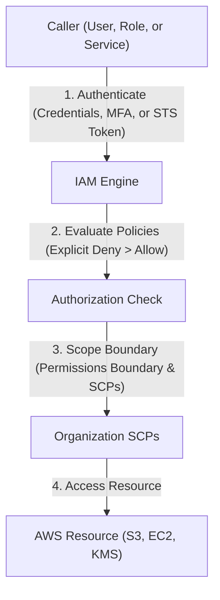

---
domains:
  - "aws"
  - "security"
class: reference-note
tier: reference-note
tags:
  - aws/iam
  - aws/organizations
  - aws/security
---

# Module 3-2: AWS IAM & Identity Management

This module covers identity federation, role assumption via **AWS Security Token Service (STS)**, programmatic access keys, root user security, and multi-account governance using **AWS Organizations** and **Service Control Policies (SCPs)**.

---

## 🗺️ Cognitive Map: IAM Authentication and Authorization



---

## 1. Identity & Access Management (IAM) Deep Dive
IAM manages access to AWS resources securely through authentication (verifying who you are) and authorization (verifying permissions).

![[Pasted image 20250509095045.png]]

#AWS-SECURITYGROUP-SCOPE
On EC2 level and it can 
be connected to multiple EC2 
in **same region** ?
### Source & Destination Ports
Security Groups are basically settings for sources & destinations.
**vip.note:** Ephemeral Range is the set of ports of the client.

*Example:* In a working environment you want the SSH Logins to only be able to occur from a set of specific IPs


## NACLs - Network Access Control Lists
- NACL functions at a subnet level, so it's applied to all EC2 instances inside the subnet.
- It's applied at the implied router
- NACLs are **Stateless** "one way only".
- It includes permit & deny rules.
- Each NACL rule has a sequence number, rules are elevated from lowest to highest sequence number.
- Once a rule is found either permit or deny the process is stopped "no reading for rest of the rules", if none are found it ends with explicit deny.
- Traffic going into Subnet is called inbound traffic, & traffic from the Subnet is called outbound traffic.

**Security Group Vs NACL, NACL is applied to all EC2 inside the subnet**


*Note:* As Network ACL acts on the Subnet not the VPC, **its Dashboard is on the VPC Dashboard,** unlike the security groups which is on the EC2 Dashboard.

#AWS-NACL-SCOPE
subnet level 

### Whitelisting vs Blacklisting 
![[Pasted image 20250509101613.png]]

custom NACL by default is black listed deny all traffic and by adding rules we are whitelisting, Default NACL allow inbound and outbound 

In outbound traffic the source will be a port of the ephemeral range that the client may be using so we need to set the range of the outbound rules same as the ephemeral range 
![[Pasted image 20250509102806.png]]

![[Pasted image 20250509102735.png]]


## Encryption
It's basically locking sensitive data or over network packets to prevent leakage of sensitive information, this locking is done with encryption keys of different kinds.

Its always better to know in the design phase if i want to apply encryption on my S3 buckets or RDS for example before creating my architecture and it can be added later but in terms of best practices its better before 

### 1- Encryption in-Transit using Asymmetric Keys
- Encryption between two ends, using a Public key & a Private key.
- Requires Key generator to create the key pair.
- The key owner holds the private key & shares the public key with clients.
**ie:** Owner encrypts with the private key & the client decrypts with the public key, & vice versa.

![[Pasted image 20250509104728.png]] 

![[Pasted image 20250509105033.png]]
### 2- Encryption in-Transit using Symmetric Keys
- Uses the same key & encryption algorithm for encryption/decryption.
- It's more efficient than using the asymmetric key.
- The asymmetric encryption can be used to exchange symmetric keys.
![[Pasted image 20250509105447.png]]
### KMS - AWS Key Management Services [[AWS-KMS]]
It's an *AWS managed* Key management service that allows customers to **create & manage cryptographic keys.**
- Controls keys usage & permissions for keys' access.
- integrated with many AWS services.
- Highly durable "Low loss" & highly available.
- Integrated with CloudTrail(Audit services).
- It's a Regional service, meaning that created keys in RegionA will only work for RegionA, although the VPC is over multiple regions.
- **$1/Month for each key customer created, or free for keys created by AWS services.**
- CMKs - Customer Master Keys are the primary resources in the KMS.

#AWS-KMS-SCOPE
Regional scope only on the region it was created 
#### CMKs - Customer Master Keys

![[Pasted image 20250509110017.png]]

- CMKs are used to provide either encrypted keys or plain keys.
- KMS provides encrypting data up to 4 Kbytes, bigger files require manual encrypting using CMKs generated keys.
- **CMKs never leave KMS.**
- KMS doesn't store customer **data keys** generated by CMKs, **either encrypted or not.**
- The encrypted Key held by customer can be sent to KMS to decrypt it to plain text again to be able to use it for decryption.
- There are both AWS-managed CMKs, or Customer-Managed CMKs


![[Pasted image 20250509110718.png]]


Here we used the plain text Datakey for decryption and then discarded it... and stored the encrypted Datakey 

![[Pasted image 20250509110745.png]]

Since i stored my encrypted Datakey I will use KMS to decrypt the Datakey to plain text so it could be used to decrypt the data

![[Pasted image 20250509110941.png]]


Note: So how can i differentiate between Keys managed by AWS and customer managed keys, **AWS keys are known by the name of** *aws/service_name* 

**Example:** creating an EC2 instance & encrypting EBS Volume:

**Note:**  AWS-managed CMKs have automatic key rotation of 3 years, while Customer-Managed CMKs have 1-year optional rotational period "If Chosen".

## Programmatic Access to AWS
![[Pasted image 20250510230133.png]]

![[Pasted image 20250510230152.png]]


Programmatic access for any IAM user isn't done by username & password, it requires an access key (Access Key ID & Secret Access Key) to access AWS Programmatically "**ex:** the windows cmd".
- The Secret Access Key is only shown at creation & must be saved. 
**Note:** Make sure you have AWS CLI installed on your OS terminal.

**Logging in by programmatic access using the log in keys:**


## IAM Policies

![[Pasted image 20250510231341.png]]

![[Pasted image 20250510231545.png]]


![[Pasted image 20250510232036.png]]

- it's attached to an identity "IAM user, IAM role, etc." or a resource "item in a S3 Bucket".
- Policies are AWS-Managed, Customer-Managed, or inline Policy "for one user".
- More than one policy may be attached to an identity.
- By default all requests are denied for an identity, an explicit allow overrides this.
- an explicit deny overrides all allows.
- Policies are stored as JSON documents in AWS.


### EC2 Instance IAM Role 

![[Pasted image 20250510233120.png]]


IAM Role **is not permanent** (long term credentials) the provided token doesn't last forever its only available for a predefined time  
**Don't** use permanent credentials inside an EC2 instance or in a code instead use an IAM Roles

**AN IAM ROLE IS AN STS (security token service)**


![[Pasted image 20250511004319.png]]


![[Pasted image 20250511003916.png]]

- Amazon Route 53 is AWS's DNS.
- Acts similar to the Public DNS for example.
- It supports public hosted zones for internet facing workload/applications, or private hosed zones for private workloads/on VPC applications.
- The Firms or corporate that has a Domain name server (Route 53) They have a pool of Ip addresses mapped to names all they do wait for a request on that domain name and reply with the IP 
	- AWS is the authoritative of any domain name it holds, Internet registry any domain name registered in it is unique globally 
	- Record Means Which domain resolves to what ip address 

![[Pasted image 20250513221529.png]]
![[Pasted image 20250513221555.png]]
![[Pasted image 20250513221701.png]]

## OLTP & OLAP
![[Pasted image 20250511005627.png]]
#### OLTP - On-Line Transactional Processing
- Uses detailed & Current data to store the transactional data
- Characterized by high volume of simple transactions & short queries.
#### OLAP - On-Line Analytical  Processing
- Stores analytical data & reports
- Characterized by relatively low transactions volume & very complex queries involving aggregations.

## RDS - Amazon Relational Database Service 
- it supports a set of databases services as MS SQL, MySQL, Maria DB, Oracle, PostgreSQL & Amazon Aurora.
- **RDS Launches the database inside the (VPC).**
- It's advised to be put inside a private subnet.
- RDS is fully managed Database, so no customer or root access to it by default.
- If I want root access to RDS instance control, it's  available to use EC2 instances for a self-managed database.
- A **security group** can be attached to the RDS database. **its a best practice to only allow backend tier traffic to pass to the database** 
- RDS instance can be launched in a standalone mode "single AZ" or Multi-AZ mode (Primary instances for read/write & **Standby RDS instances for instant data replication only**).
	- standby is fully synced with the primary RDS, so in real time any data in Primary will be in the standby but it can't read/write unless something happened to the primary and **this process is fully managed by AWS**, AWS provide a URL for developer the URL redirect the request to the up and running database 
- If Iam using RDS in multi-AZ mode when we use the provided URL it uses private hosted route 53 so the URL resolves to the healthy RDS **whether its the Primary or the stand by all the is AWS managed** 
- **It supports auto scaling.**

## High Availability & Fault Tolerance
- **High availability** describes the **availability of the application**, **while Fault tolerance** describes how much the application **performance is affected by faults**.
- High availability is done by **Load Balancers.** through periodic health check the load balancer forward the traffic to healthy EC2 instances, The health check as threshold if it was exceeded the EC2 is marked out of service and unhealthy 

![[Pasted image 20250512091313.png]]

- Highly available but not fault tolarent 
![[Pasted image 20250512091336.png]]


---

## 2. Hands-on Lab: EC2 to S3 IAM Role Authentication
This lab demonstrates creating an IAM role and assigning it to an EC2 instance to list and copy files from an S3 bucket without using hardcoded access keys.

### A. IAM Policy Definition
Create a JSON policy (e.g., `s3-read-policy.json`) restricting access to the target bucket:
```json
{
  "Version": "2012-10-17",
  "Statement": [
    {
      "Effect": "Allow",
      "Action": [
        "s3:ListBucket",
        "s3:GetObject"
      ],
      "Resource": [
        "arn:aws:s3:::my-secure-config-bucket",
        "arn:aws:s3:::my-secure-config-bucket/*"
      ]
    }
  ]
}
```

### B. Role Configuration
1. Create a trust policy allowing EC2 to assume the role (`ec2-trust-policy.json`):
```json
{
  "Version": "2012-10-17",
  "Statement": [
    {
      "Effect": "Allow",
      "Principal": {
        "Service": "ec2.amazonaws.com"
      },
      "Action": "sts:AssumeRole"
    }
  ]
}
```
2. Create the IAM role using the CLI:
```bash
aws iam create-role --role-name EC2-S3-Read-Role --assume-role-policy-document file://ec2-trust-policy.json
```
3. Attach the S3 read policy to the role:
```bash
aws iam put-role-policy --role-name EC2-S3-Read-Role --policy-name S3ReadPolicy --policy-document file://s3-read-policy.json
```
4. Create an Instance Profile and associate it with the EC2 instance:
```bash
aws iam create-instance-profile --instance-profile-name EC2-S3-Profile
aws iam add-role-to-instance-profile --instance-profile-name EC2-S3-Profile --role-name EC2-S3-Read-Role
aws ec2 associate-iam-instance-profile --instance-id i-0123456789abcdef0 --iam-instance-profile Name=EC2-S3-Profile
```

### C. Validation from the EC2 Instance
Log into the EC2 instance and run verification commands:
```bash
# Verify credentials are temporary from STS metadata
curl http://169.254.169.254/latest/meta-data/iam/security-credentials/EC2-S3-Read-Role

# Test S3 listing (using internal gateway endpoint)
aws s3 ls s3://my-secure-config-bucket/
```

### D. Supplemental Lab Notes & Images
## project 3
### Lab 
create a EC2 instance and list s3 buckets from the instance (policy)

``` AWS-CLI
aws s3 ls  
``` 

![[Pasted image 20250511001805.png]]

![[Pasted image 20250511002017.png]]

![[Pasted image 20250511004948.png]]
![[Pasted image 20250511005254.png]]


---

## 3. Deep-Intuition (AARF) Breakdowns

### AARF Breakdown: IAM Roles (STS) vs. Permanent Credentials
1.  **The Answer (Core Pattern):** Deploy applications using IAM Roles and EC2 Instance Profiles to fetch temporary, short-lived credentials via AWS STS, completely avoiding the use of permanent Access Keys.
2.  **The Assumptions (Context):** The calling application or user must be inside a trust boundary recognized by the IAM trust policy, and local processes must fetch credentials dynamically from the IMDSv2 metadata endpoint.
3.  **The Rationale (Why):** Permanent access keys stored in config files or git repositories risk leakage. STS credentials automatically expire (configurable from 15 minutes to 12 hours) and are rotated by the AWS platform, neutralizing leak vulnerabilities.
4.  **The Failure Loop (What if not):** Hardcoding static access keys in a codebase hosted on an EC2 instance that gets compromised allows attackers to steal those credentials and call AWS APIs directly, bypassing the OS and host controls.
5.  **Alternative Case (When to use 'if not'):** For legacy on-premises applications that cannot assume IAM Roles, use strictly scoped IAM User access keys with aggressive rotation managed by AWS Secrets Manager.

### AARF Breakdown: Service Control Policies (SCPs)
1.  **The Answer (Core Pattern):** Enforce strict Deny policies at the Organizational Unit (OU) level to prevent root/admin users in member accounts from bypassing security configurations (e.g., disabling CloudTrail or leaving the organization).
    ```json
    {
      "Version": "2012-10-17",
      "Statement": [
        {
          "Effect": "Deny",
          "Action": [
            "organizations:LeaveOrganization",
            "cloudtrail:StopLogging",
            "cloudtrail:DeleteTrail"
          ],
          "Resource": "*"
        }
      ]
    }
    ```
2.  **The Assumptions (Context):** SCPs apply only to member accounts within the Organization, not to the master/management root account. An IAM policy is still required within the member account to grant access.
3.  **The Rationale (Why):** Enforces global corporate compliance rules. Even if a member account's administrator credentials are stolen, the attacker cannot delete audit logs or disable compliance tools because the SCP explicitly blocks those actions at the organization level.
4.  **The Failure Loop (What if not):** Without SCPs, a compromised admin account in a child sandbox can delete CloudTrail logs, delete backups, and spin up runaway GPU clusters for crypto-mining, rendering the incident untraceable.
5.  **Alternative Case (When to use 'if not'):** In standalone accounts or developer sandboxes not bound to corporate compliance frameworks, bypass SCPs to maximize API freedom and speed of experimentation.

