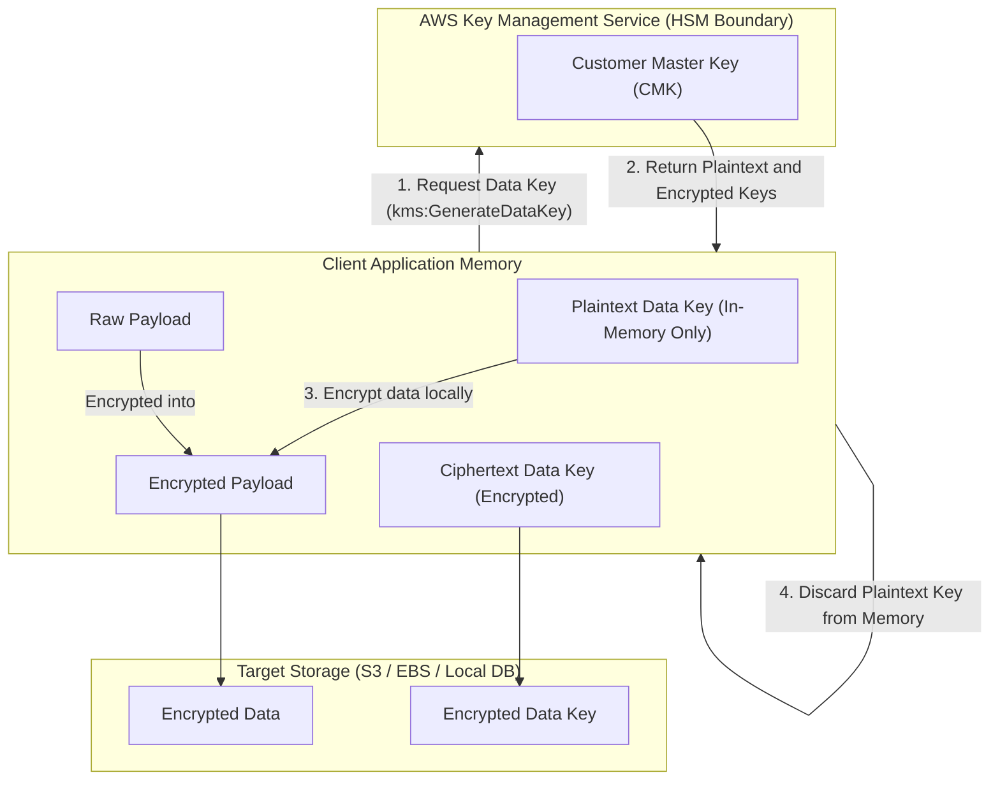

---
domains:
  - "aws"
class: reference-note
tier: reference-note
tags:
  - aws/security
---

# Module 3-3: AWS KMS & Security

This module details cryptographic key management using **AWS Key Management Service (KMS)**, envelope encryption, secrets protection, certificate management via **AWS Certificate Manager (ACM)**, dedicated hardware security using **AWS CloudHSM**, edge-security layers utilizing **AWS WAF**, **AWS Shield**, and **AWS Firewall Manager**, and continuous threat detection via **Amazon GuardDuty**, **Amazon Inspector**, and **Amazon Macie**.

---

## 🗺️ Cognitive Map: How to Think About AWS Security and Cryptography

To master AWS security, think of the services as concentric rings of protection starting from low-level data encryption to edge traffic filtering and threat detection:

1.  **Cryptographic Primitives & Envelope Encryption (Sections 1 & 2):** Secure individual data blocks at rest and in transit using regional or multi-region keys.
2.  **Secrets & Parameter Management (Section 3):** Centralize environment configurations and rotate database credentials dynamically.
3.  **App Edge & DDoS Filtering (Section 4):** Filter HTTP exploits at Layer 7 and absorb Layer 3/4 flood attacks before they reach backend hosts.
4.  **Continuous Assessment & Threat Scanning (Section 5):** Run agentless ML scans over access logs and continuously audit system configurations for vulnerabilities.

By following this flow, you build a layered defense starting from **[Data Primitives] → [Credentials Control] → [Traffic Scrubbing] → [Intelligent Threat Auditing]**.

---

## 1. Encryption Primitives: In-Flight vs. At-Rest

AWS enforces security boundaries using different cryptographic mechanics depending on the state of the data.

### A. Encryption in Transit (In-Flight)
- **Mechanics:** Data is encrypted on the client side before sending, and decrypted on the server side after receipt, utilizing **Transport Layer Security (TLS)** or **Secure Sockets Layer (SSL)** certificates.
- **Purpose:** Prevents Man-in-the-Middle (MITM) packet sniffing attacks on the public network.
- **AWS Enforcements:** Application Load Balancers (ALB) can configure HTTP-to-HTTPS redirect rules to force all clients to establish TLS connections before requests are routed to backend EC2 instances.

### B. Server-Side Encryption (SSE) at Rest
- **Mechanics:** The AWS target service (e.g., S3, EBS, RDS) receives unencrypted data, generates/queries a data key from KMS to encrypt the data, and stores the encrypted ciphertext on disk.
- **Access Flow:** When the client requests the data, the AWS service automatically queries KMS to decrypt the data key, decrypts the ciphertext in memory, and returns the plaintext payload over TLS. The client does not participate in the cryptographic handshake.

### C. Client-Side Encryption at Rest
- **Mechanics:** The client application encrypts the data locally before sending it to AWS. The AWS service receives and stores a pre-encrypted payload (opaque ciphertext).
- **Access Flow:** The server cannot decrypt the data because it lacks access to the client-side data key. Decryption is performed entirely on the client after retrieving the ciphertext.
- **Implementations:** Supported via the **AWS Encryption SDK** (often used for database column/field encryption) or the **Amazon DynamoDB Encryption Client**.

---

## 2. AWS Key Management Service (KMS) & Envelope Encryption

AWS KMS is a managed, highly available, and secure service that handles the lifecycle and access permissions of cryptographic keys.

### A. Key Categories and Lifecycles
- **AWS Owned Keys:** Free, default keys created and used internally by AWS services (e.g., default SSE-S3 or SSE-DynamoDB). These keys are invisible to the customer and are managed entirely by AWS.
- **AWS Managed Keys:** Free, created automatically on behalf of the customer when a service-level encryption is enabled (e.g., `aws/s3`, `aws/ebs`). These keys start with the prefix `aws/` and are automatically rotated every year (historically every 3 years). They cannot be shared across AWS accounts.
- **Customer Managed Keys (CMK):** Custom keys created by the customer inside KMS. They cost $1/month plus API transaction fees ($0.03 per 10,000 API calls). They allow custom Key Policies, custom aliases, manual or automatic key rotation (configurable or on-demand), and can be shared cross-account.
- **Imported Keys:** CMKs created with an "External" key origin, where the customer imports their own key material. These keys do not support automatic rotation; they must be manually rotated by creating a new key and updating the key alias.

### B. Key Access Policies
- **KMS Key Policies:** Control access to the KMS keys. If a key policy is empty, no one (not even the account administrator) can access it.
  - *Default Key Policy:* Created automatically if no custom policy is supplied. It grants the root account user full permission to write IAM policies for the key, essentially delegating access control to standard IAM policies.
  - *Custom Key Policy:* Configured to restrict administrative and usage permissions to specific IAM roles/users, bypassing account-level wildcards. Required for cross-account access.

### C. Envelope Encryption Workflow
To encrypt payloads larger than 4KB without sending massive files over the network (which triggers network latency and high KMS CPU load), KMS enforces **Envelope Encryption**:

1.  **Request:** The client application requests a Data Key from KMS, specifying a Customer Master Key (CMK).
2.  **Key Generation:** KMS generates a data key under the CMK boundary and returns two copies to the client:
    - A **Plaintext Data Key** (in-memory key used immediately for local encryption).
    - An **Encrypted Data Key** (the data key encrypted by the CMK).
3.  **Local Encryption:** The application encrypts the local payload using the Plaintext Data Key, then immediately discards the Plaintext Data Key from memory.
4.  **Storage:** The application stores the encrypted payload alongside the Encrypted Data Key.
5.  **Decryption:** To read the data, the application sends the Encrypted Data Key to KMS, which decrypts it using the CMK and returns the Plaintext Data Key to the application memory for local decryption.



### D. Cross-Region Operations
KMS keys are strictly scoped to a single Region.
- **Copying Encrypted Snapshots:** To copy an encrypted EBS snapshot to another region, the snapshot must be decrypted in the source region and re-encrypted with a destination-region KMS key during the copy process.
- **KMS Multi-Region Keys:** A set of keys in different regions that share the exact same key ID and key material (prefixed with `mrk-`). 
  - *Interchangeable Decryption:* Allows encrypting data in one region and decrypting it locally in another region without cross-region API calls or re-encryption.
  - *Decentralized Management:* While they share key material, each regional multi-region key is managed independently with its own key policy, aliases, and tags.
  - *Use Cases:* Global client-side encryption, DynamoDB Global Tables (via DynamoDB Encryption Client), and Aurora Global Databases (via AWS Encryption SDK) to protect specific columns/attributes from even database administrators (DBAs).
  - *S3 Replication Caveat:* S3 currently treats multi-region keys as independent keys. S3 replication will still decrypt at the source and re-encrypt at the target, even if the destination is configured to use the corresponding replica MRK.

### E. Cross-Account Resource Sharing (Encrypted EBS & AMIs)
To launch an EC2 instance in Account B from an encrypted AMI or EBS snapshot in Account A:
1.  **Launch Permissions:** In Account A, share the AMI/snapshot with Account B by adding Account B's AWS Account ID to the launch permissions.
2.  **Key Policy Delegation:** In Account A, modify the Customer Managed Key policy to authorize Account B's root account or specific IAM role to access the key. The target permissions required are:
    - `kms:DescribeKey`
    - `kms:ReEncrypt*`
    - `kms:CreateGrant` (delegates permission to EC2/EBS services in the target account to mount the volume)
    - `kms:Decrypt`
3.  **Launch & Re-encrypt:** In Account B, launch the instance or copy the snapshot. During launch, Account B must re-encrypt the volume using its own target CMK to maintain local security boundaries.
4.  *Note:* You cannot share resources encrypted with AWS Managed Keys (e.g., `aws/ebs`) because their key policies cannot be modified to authorize external accounts.

### F. S3 Replication with Encryption
- **SSE-S3 & Unencrypted Objects:** Replicated to the target bucket automatically by default.
- **SSE-C Objects:** Replicated automatically when configured.
- **SSE-KMS Objects:** **Disabled by default.** To replicate:
  - Manually enable the option in the S3 replication configuration.
  - Specify the target KMS Key ID in the destination region.
  - Grant the S3 Replication IAM Role permissions to `kms:Decrypt` with the source KMS key and `kms:Encrypt` with the target KMS key.
  - Update the target KMS key policy to trust the S3 replication IAM role.
  - High-throughput buckets may experience KMS rate throttling, requiring a service quota increase request.

---

## 🌉 Evolutionary Conceptual Bridging: Traditional HSMs vs. AWS KMS & CloudHSM

### 1. Traditional On-Premises HSMs (The Classic Paradigm)
- **Design:** Physical hardware appliances housed in secure data center racks. They enforced strict cryptographic boundaries, physical tamper-resistance (often zeroing out key material if physical chassis intrusion was detected), and manual user registration via physical console cards.
- **Constraints:** High capital expenditure (CapEx), single points of physical failure, rigid scale boundaries, and extremely complex API protocols (PKCS#11). Developers had to compile custom cryptographic libraries on client servers, and key backup replication required manual, offline key-custodian procedures.

### 2. The Cloud HSM Interface (AWS CloudHSM)
- **Bridge:** AWS CloudHSM brings the physical HSM appliance model to the cloud. AWS provisions and manages the hardware appliance inside a customer's VPC, ensuring FIPS 140-2 Level 3 compliance and physical tamper resistance.
- **Control Model:** Under the shared responsibility model, AWS manages the physical hardware but has zero visibility into the keys. The customer holds exclusive control over users, cryptographic keys, and permissions, which are managed entirely via the CloudHSM Client Software, not IAM.
- **Evolutionary Improvements:** High Availability (HA) is achieved natively by running multiple HSM appliances across different Availability Zones (AZs) in a synchronized cluster. It supports SSL/TLS offloading on load balancers and Oracle Transparent Data Encryption (TDE) acceleration.
- **Custom Key Store Integration:** Bridges the gap between raw HSM keys and AWS native services. By configuring a KMS Custom Key Store backed by a CloudHSM cluster, native AWS services (EBS, S3, RDS) can encrypt data using keys stored in the CloudHSM cluster while leveraging the standard KMS IAM integrations and CloudTrail logging.

### 3. Serverless Cryptography (AWS KMS)
- **Evolution:** KMS abstracts the physical HSM entirely into a multi-tenant, serverless global-scale API. Customers do not manage hardware, clusters, or PKCS#11 connections. All authorization is integrated with IAM, and compliance is audited via CloudTrail.
- **Envelope Encryption Evolution:** Legacy systems manually distributed symmetric session keys or loaded static keys into client server configurations. Envelope encryption solves this by using a central, highly secure CMK (which never leaves the KMS HSM boundary) to generate ephemeral, single-use plaintext data keys for local client encryption. The client stores the encrypted data key alongside the payload, removing the need for a persistent key database on the client.

---

## 3. Secrets Manager vs. SSM Parameter Store

AWS provides two services for storing configurations and credentials.

| Feature | AWS Systems Manager Parameter Store | AWS Secrets Manager |
| :--- | :--- | :--- |
| **Primary Use Case** | Centralized, hierarchical configuration data. | Sensitive database credentials and API keys. |
| **Cost** | Standard tier is free. Advanced is $0.05/param/month. | $0.40 per secret per month + $0.05 per 10k API calls. |
| **Max Payload Size** | Standard: 4KB. Advanced: 8KB. | 64KB. |
| **Credential Rotation** | No native automatic rotation. | Automated rotation via Lambda integration (native RDS support). |
| **Replication** | Regional only. Must recreate manually. | Native cross-region replication with automatic sync. |
| **Cross-Account Access** | Complex (not natively supported via resource policy). | Natively supported via resource-based policies. |

### Parameter Policies (SSM Parameter Store - Advanced Tier Only)
Advanced parameters allow attaching lifecycle rules to configuration values:
- **Expiration Policy (TTL):** Automatically deletes the parameter at a specific timestamp.
- **Expiration Notification:** Triggers an Amazon EventBridge event a configurable number of days/hours before deletion to allow manual key updates.
- **No-Change Notification:** Triggers an EventBridge event if the parameter value has not been updated within a specified time limit, helping audit static configurations.

---

## 4. Edge Security: WAF, Shield, & Firewall Manager

AWS provides layered security at the application edge to filter traffic, mitigate DDoS attacks, and enforce compliance.

### A. AWS WAF (Web Application Firewall)
- **Scope:** Operates at Layer 7 (HTTP/HTTPS) to block application-layer attacks (OWASP Top 10).
- **Deployment Targets:** Application Load Balancer (ALB), API Gateway, CloudFront, AppSync GraphQL API, Cognito User Pools. (Cannot be deployed on NLB, which operates at Layer 4).
- **Rule Configurations:** Uses Web Access Control Lists (Web ACLs) to filter traffic based on:
  - *IP Sets:* Lists of allowed or blocked IP addresses (up to 10,000 IPs per rule).
  - *Headers/Body/URI:* Regex matches to intercept SQL Injection (SQLi) or Cross-Site Scripting (XSS).
  - *Geo-Match:* Blocks requests originating from specific countries.
  - *Rate-Based Rules:* Dynamically blocks IPs sending requests exceeding a threshold (e.g. 100 requests per 5 minutes) to mitigate application DDoS or brute-force.

### B. AWS Shield (DDoS Protection)
- **Shield Standard:** Activated by default and free for all AWS accounts. Automatically mitigates Layer 3/4 infrastructure attacks (such as SYN floods, UDP floods, and reflection attacks).
- **Shield Advanced:** A paid subscription ($3,000/month per organization) covering EC2, ELB, CloudFront, Global Accelerator, and Route 53.
  - Provides 24/7 access to the **DDoS Response Team (DRT) / Shield Response Team (SRT)**.
  - Protects against economic billing spikes caused by auto-scaling during a DDoS attack.
  - **Automatic Layer 7 Mitigation:** Shield Advanced automatically creates, tests, and deploys WAF rules in the customer's Web ACL to block Layer 7 HTTP floods.

### C. AWS Firewall Manager
- **Purpose:** A centralized security management service to configure and enforce firewall rules across all accounts in an AWS Organization.
- **Supported Policies:** WAF Web ACLs, Shield Advanced protections, VPC Security Groups, AWS Network Firewall rules, and Route 53 Resolver DNS Firewall rules.
- **Operational Impact:** Policies are defined at the region level and applied org-wide. If a new account or a new resource (e.g., ALB) is created, Firewall Manager automatically applies the corporate firewall policy, ensuring continuous compliance.

---

## 5. Vulnerability & Threat Detection: GuardDuty, Inspector, & Macie

AWS provides continuous, out-of-band security scanning to audit workloads and detect compromises.

### A. Amazon GuardDuty
- **Purpose:** Continuous threat detection and anomaly scanning. It operates out-of-band and does not require agent installation.
- **Core Input Log Sources:**
  - *CloudTrail Management Logs:* Audits anomalous API actions.
  - *CloudTrail Data Logs (S3):* Audits object access patterns.
  - *VPC Flow Logs:* Detects network anomalies (e.g. port scans, unauthorized targets).
  - *DNS Query Logs:* Scans for compromised EC2 instances performing DNS tunneling to C2 servers.
- **Optional Sources:** EKS audit logs/runtime monitoring, RDS/Aurora login events, Lambda network activity, and EBS volume malware scanning.
- **Crypto Mining Findings:** Features dedicated threat intelligence rules to flag instances participating in cryptocurrency mining.
- **Alerting:** Findings are published to AWS Security Hub and EventBridge, which can trigger automated Lambda remediations.

### B. Amazon Inspector
- **Purpose:** Automated security vulnerability assessments.
- **Scanning Targets:**
  - *EC2 Instances:* Uses the SSM Agent to continuously scan running operating systems for Common Vulnerabilities and Exposures (CVEs) and analyze network reachability.
  - *ECR Container Images:* Scans Docker images automatically upon push.
  - *Lambda Functions:* Scans package dependencies and custom code upon deployment.
- **Operational Flow:** Automatically re-triggers scans when the global CVE vulnerability database is updated. It assigns a risk-prioritized score to findings and exports them to Security Hub and EventBridge.

### C. Amazon Macie
- **Purpose:** Managed data privacy and sensitive data discovery.
- **Operation:** Uses machine learning and pattern matching to continuously scan Amazon S3 buckets for Personally Identifiable Information (PII), protected health information (PHI), and financial details.
- **Alerting:** Generates security findings in EventBridge for automated notification and data isolation.

---

## 6. AWS Certificate Manager (ACM) & CloudHSM

### A. AWS Certificate Manager (ACM)
- **Function:** Provisions, manages, and deploys public and private SSL/TLS certificates.
- **Public Certificates:** Free of charge.
  - *Validation Methods:* DNS validation (creates a CNAME record; Route 53 does this automatically) or Email validation (sends verification links to registrant contacts).
  - *Automatic Renewal:* ACM automatically renews DNS-validated public certificates 60 days before expiration. Email-validated certificates require manual renewal responses.
- **Imported Certificates:** Certificates generated outside AWS can be imported into ACM, but they **do not support automatic renewal**.
  - *Expiration Alerts:* ACM publishes daily expiration events starting 45 days prior (configurable) to EventBridge. Alternatively, the AWS Config managed rule `acm-certificate-expiration-check` identifies non-compliant certificates and triggers EventBridge alerts.
- **API Gateway Custom Domains:**
  - *Edge-Optimized Endpoints:* Requests route via CloudFront. The ACM certificate **must reside in `us-east-1`** (global region for CloudFront).
  - *Regional Endpoints:* Requests route directly to API Gateway. The ACM certificate must reside in the same region as the API stage.

---

## Deep-Intuition (AARF) Breakdowns

### AARF Breakdown: KMS Customer Managed Keys (CMK)
1.  **The Answer (Core Pattern):** Utilize KMS Customer Managed Keys (CMKs) with explicit IAM Key Policies restricting access to authorized execution roles:
    ```json
    {
      "Sid": "AllowUseOfTheKey",
      "Effect": "Allow",
      "Principal": {"AWS": "arn:aws:iam::123456789012:role/AppExecutionRole"},
      "Action": [
        "kms:Decrypt",
        "kms:GenerateDataKey*"
      ],
      "Resource": "*"
    }
    ```
2.  **The Assumptions (Context):** The calling application role must have permission to access both the target storage resource (e.g., S3 bucket, EBS volume) *and* the KMS key used for envelope encryption.
3.  **The Rationale (Why):** Implements separation of duties. Restricting key permissions ensures that even if a user bypasses S3 bucket policies, they cannot read data without decrypting it, providing a double-barrier security topology and complete CloudTrail auditing.
4.  **The Failure Loop (What if not):** If IAM roles have S3 access but lack KMS Decrypt permissions on the custom CMK, application read API requests fail with `Access Denied` or `KMS.AccessDeniedException`, causing application crashes during startup or retrieval.
5.  **Alternative Case (When to use 'if not'):** For non-sensitive, high-volume workloads where API call costs are a major concern, use S3 Managed Keys (SSE-S3) to completely bypass KMS transaction charges.
