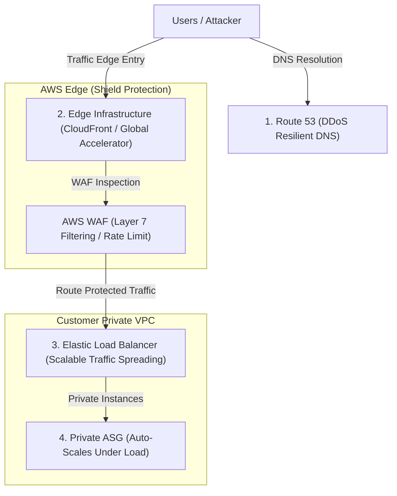

---
domains:
  - "aws"
class: reference-note
tier: reference-note
tags:
  - aws/security
  - aws/kms
  - aws/secretsmanager
  - aws/waf
  - aws/shield
  - aws/guardduty
---

# Module 3-3: AWS KMS & Security

This module covers cryptographic key management using **AWS Key Management Service (KMS)**, envelope encryption, configuration and secrets protection via **SSM Parameter Store** and **AWS Secrets Manager**, certificate management using **AWS Certificate Manager (ACM)**, dedicated hardware security with **AWS CloudHSM**, edge protection using **AWS WAF**, **AWS Shield**, and **AWS Firewall Manager**, and continuous threat audits using **Amazon GuardDuty**, **Amazon Inspector**, and **Amazon Macie**.

---

## 🗺️ Cognitive Map: How to Think About AWS Security and Cryptography

AWS security follows a defense-in-depth model structured in concentric rings:
1.  **Cryptographic Primitives & Envelope Encryption (Sections 1 & 2):** Secure individual data payloads at rest and in transit using regional, cross-account, or multi-region key materials.
2.  **Secrets & Parameter Management (Section 3):** Centralize application configurations, credentials, and api keys, separating config logic from code.
3.  **App Edge & DDoS Filtering (Section 4):** Filter Layer 7 HTTP exploits and absorb Layer 3/4 volumetric floods at the AWS network boundary.
4.  **Continuous Threat Auditing (Section 5):** Deploy machine-learning anomaly detection and runtime package vulnerability scans over workloads.

---

## 1. Encryption Primitives: In-Flight vs. At-Rest

### A. Encryption in Transit (In-Flight)
- **Mechanics:** Data is encrypted on the client side before transmission and decrypted on the server side upon receipt, utilizing **Transport Layer Security (TLS)** or **Secure Sockets Layer (SSL)** certificates.
- **Purpose:** Prevents Man-in-the-Middle (MITM) sniffing and packet interception attacks on the public network.
- **AWS Implementations:** Enforce HTTPS redirection rules on Application Load Balancers (ALB) or CloudFront distributions.

### B. Server-Side Encryption (SSE) at Rest
- **Mechanics:** The AWS target service (e.g., S3, EBS, RDS) receives raw plaintext data, requests an encryption key from KMS to encrypt the payload, and writes the ciphertext to storage.
- **Access Flow:** When authorized clients read the resource, the service transparently queries KMS to decrypt the data, returning plaintext over TLS. The client is not involved in cryptography.

### C. Client-Side Encryption at Rest
- **Mechanics:** The client application encrypts the data locally before sending it to AWS. AWS only receives and stores pre-encrypted ciphertext.
- **Access Flow:** The AWS server cannot decrypt the data because the keys never leave the client's execution environment. Decryption occurs entirely on the client side.
- **Tools:** Supported via the **AWS Encryption SDK** (used for application code) or the **Amazon DynamoDB Encryption Client** (for database attribute-level encryption).

---

## 2. AWS Key Management Service (KMS) & Envelope Encryption

AWS KMS handles key creation, deletion, description, and rotation, integrating natively with AWS services and logging all access to AWS CloudTrail.

### A. KMS Key Categories & Lifecycles
- **AWS Owned Keys:** Free, default keys created and managed internally by AWS to encrypt resource categories (e.g., default S3 bucket encryption). They are invisible to and unmanageable by customers.
- **AWS Managed Keys:** Free, automatically generated on behalf of the customer when a service encryption option is enabled (e.g., `aws/s3`, `aws/ebs`, `aws/ssm`). They start with the prefix `aws/` and are automatically rotated by AWS every 1 year. They cannot be modified, deleted, or shared cross-account.
- **Customer Managed Keys (CMK):** Created by the customer in KMS. Cost $1/month plus API transaction fees ($0.03 per 10,000 API calls). They support custom Key Policies, custom aliases, manual or automatic key rotation (configurable period from 90 to 2,560 days, or on-demand rotation), and can be shared cross-account.
- **Imported Keys:** CMKs created with "External" key origin, where the customer imports their own key material. These keys do not support automatic rotation; they must be rotated manually by updating the key alias to point to a new key.

### B. Key Access Policies
- **KMS Key Policies:** JSON-based resource policies that control access to KMS keys. Without a key policy, nobody can access or manage the key.
  - *Default Key Policy:* Grants the root account user full permission to write IAM policies for the key, essentially delegating access control to standard IAM policies.
  - *Custom Key Policy:* Explicitly lists specific IAM users/roles that can administer or use the key. It is required for enabling cross-account key sharing.

### C. Envelope Encryption Workflow
To encrypt payloads larger than 4KB without sending massive payloads to KMS (which introduces network latency and high KMS CPU load), AWS enforces **Envelope Encryption**:

1.  **Data Key Request:** The client application calls the KMS `GenerateDataKey` API, specifying the target KMS Key.
2.  **Key Delivery:** KMS generates a data key under the CMK boundary and returns two copies to the client:
    - A **Plaintext Data Key** (kept in-memory to perform local encryption).
    - An **Encrypted Data Key** (the data key encrypted by the CMK).
3.  **Local Payload Encryption:** The client encrypts the local payload using the Plaintext Data Key, then immediately deletes the Plaintext Data Key from memory.
4.  **Storage:** The client stores the encrypted payload alongside the Encrypted Data Key.
5.  **Decryption Flow:** The client sends the Encrypted Data Key to KMS via the `Decrypt` API. KMS decrypts it using the CMK and returns the Plaintext Data Key, enabling local client-side decryption.

```mermaid
graph TD
    subgraph KMS ["AWS Key Management Service (HSM Boundary)"]
        CMK["Customer Master Key (CMK)"]
    end

    subgraph Client ["Client Application Memory"]
        PlaintextDataKey["Plaintext Data Key (In-Memory Only)"]
        CiphertextDataKey["Ciphertext Data Key (Encrypted)"]
        Payload["Raw Payload"]
        EncryptedPayload["Encrypted Payload"]
    end

    subgraph Storage ["Target Storage (S3 / EBS / Local DB)"]
        StoredData["Encrypted Data"]
        StoredKey["Encrypted Data Key"]
    end

    %% Workflow Steps
    Client -->|"1. Request Data Key (kms:GenerateDataKey)"| KMS
    CMK -->|"2. Return Plaintext and Encrypted Keys"| Client
    PlaintextDataKey -->|"3. Encrypt data locally"| EncryptedPayload
    Payload -->|"Encrypted into"| EncryptedPayload
    EncryptedPayload StoredData
    CiphertextDataKey --> StoredKey
    Client -->|"4. Discard Plaintext Key from Memory"| Client
```

### D. Cross-Region Operations
KMS keys are strictly scoped to a single Region.
- **Copying Encrypted Snapshots:** To copy an encrypted EBS snapshot to another region, the snapshot must be decrypted in the source region and re-encrypted with a destination-region KMS key during the copy process.
- **KMS Multi-Region Keys:** A set of keys in different regions that share the exact same key ID and key material (prefixed with `mrk-`).
  - *Interchangeable Decryption:* Allows encrypting data in one region (e.g., `us-east-1`) and decrypting it locally in another region (e.g., `ap-southeast-2`) without making cross-region API calls.
  - *Decentralized Management:* While sharing key material, each regional multi-region key is managed independently with its own key policy, aliases, and tags.
  - *Use Cases:* Global client-side encryption, DynamoDB Global Tables (using DynamoDB Encryption Client), and Aurora Global Databases (using AWS Encryption SDK) to protect specific columns (like SSN) from database administrators (DBAs).
  - *S3 Replication Caveat:* S3 currently treats multi-region keys as independent keys. S3 replication will still decrypt at the source and re-encrypt at the target, even if the destination is configured to use the corresponding replica MRK.

### E. Cross-Account Resource Sharing (EBS & AMIs)
To launch an EC2 instance in Account B from an encrypted AMI or EBS snapshot in Account A:
1.  **Launch Permissions:** In Account A, share the AMI/snapshot by adding Account B's AWS Account ID to the launch permissions.
2.  **Key Policy Delegation:** In Account A, modify the Custom Key Policy of the Customer Managed Key to authorize Account B's root account or IAM role. The target permissions required are:
    - `kms:DescribeKey`
    - `kms:Decrypt`
    - `kms:ReEncrypt*` (to decrypt from Account A's key and re-encrypt with Account B's key)
    - `kms:CreateGrant` (delegates permission to target account EC2/EBS services to mount the volume)
3.  **Launch & Re-encrypt:** In Account B, launch the instance or copy the snapshot. Account B must re-encrypt the volume using its own target Customer Managed Key to maintain local security boundaries.
4.  *Constraint:* Resources encrypted with AWS Managed Keys (e.g., `aws/ebs`) cannot be shared across accounts because their key policies cannot be customized.

### F. S3 Replication with Encryption
- **SSE-S3 & Unencrypted Objects:** Replicated to the target bucket automatically by default.
- **SSE-C Objects:** Replicated automatically when configured.
- **SSE-KMS Objects:** **Disabled by default.** To enable:
  - Explicitly activate replication of SSE-KMS encrypted objects in the replication rule.
  - Specify the target KMS Key ID in the destination region.
  - Grant the S3 Replication IAM Role permissions to `kms:Decrypt` with the source KMS key and `kms:Encrypt` with the target KMS key.
  - Update the target KMS key policy to trust the S3 replication IAM role.
  - High-throughput buckets may experience KMS rate throttling, requiring a service quota increase.

---

## 3. KMS CLI Operations Demo

This section details how to perform cryptographic operations manually using the AWS CLI.

### A. Setup: Create File
```bash
echo "SuperSecretPassword" > ExampleSecretFile.txt
```

### B. Encryption Command
Using the customer managed key alias `alias/tutorial` (substitute with your Key ID or ARN):
```bash
aws kms encrypt \
    --key-id alias/tutorial \
    --plaintext fileb://ExampleSecretFile.txt \
    --query CiphertextBlob \
    --output text \
    --region eu-west-2 > ExampleSecretFileEncrypted.base64
```
*Note:* The `--plaintext` parameter requires the `fileb://` prefix to read the raw binary payload correctly. The output is a base64 encoded ciphertext.

### C. Decode base64 to Binary
KMS decrypts binary data blobs. Convert the base64 output to a raw binary file:
```bash
# On Linux / macOS
base64 -d ExampleSecretFileEncrypted.base64 > ExampleSecretFileEncrypted

# On Windows
certutil -decode ExampleSecretFileEncrypted.base64 ExampleSecretFileEncrypted
```

### D. Decryption Command
KMS automatically detects the correct CMK used to encrypt the payload from the metadata embedded in the ciphertext blob:
```bash
aws kms decrypt \
    --ciphertext-blob fileb://ExampleSecretFileEncrypted \
    --query Plaintext \
    --output text \
    --region eu-west-2 > ExampleSecretFileDecrypted.base64
```

### E. Decode Decrypted Plaintext
```bash
# On Linux / macOS
base64 -d ExampleSecretFileDecrypted.base64 > ExampleSecretFileDecrypted.txt

# On Windows
certutil -decode ExampleSecretFileDecrypted.base64 ExampleSecretFileDecrypted.txt

# Verify contents
cat ExampleSecretFileDecrypted.txt
# Output: SuperSecretPassword
```

---

## 4. Systems Manager Parameter Store vs. AWS Secrets Manager

AWS provides two distinct services for storing configuration settings and credentials.

### A. Comparison Table
| Feature | AWS Systems Manager Parameter Store | AWS Secrets Manager |
| :--- | :--- | :--- |
| **Primary Use Case** | Centralized configuration data and environment strings. | Sensitive credentials, API keys, and database passwords. |
| **Tiers / Cost** | Standard: Free.<br>Advanced: $0.05 per parameter/month. | $0.40 per secret/month + $0.05 per 10,000 API calls. |
| **Max Payload Size** | Standard: 4KB.<br>Advanced: 8KB. | 64KB. |
| **Max Parameters** | Standard: 10,000.<br>Advanced: 100,000. | Unlimited. |
| **Credential Rotation** | No native rotation (requires custom EventBridge/Lambda pipelines). | **Native automated rotation** via Lambda (built-in integration for RDS, Aurora, DocumentDB). |
| **Replication** | Regional only. | **Native cross-region replication** (automatic synchronization). |
| **Cross-Account Access** | Complex (no direct resource-based policies). | **Natively supported** via resource-based policies. |
| **Integration** | Directly integrates with CloudFormation, ECS tasks, and SSM Run Command. | Integrates with RDS, Redshift, and code runtimes. |

### B. SSM Parameter Store Hands-On Demo (CLI)
Parameters can be configured hierarchically to simplify IAM policy management (e.g., `/my-app/dev/db-url`).

1.  **Retrieve Parameters by Name:**
    ```bash
    # String returns plaintext, SecureString returns ciphertext by default
    aws ssm get-parameters --names "/my-app/dev/db-url" "/my-app/dev/db-password"
    ```
2.  **Retrieve Parameters with Decryption:**
    ```bash
    # Decrypt SecureString on-the-fly using underlying KMS key
    aws ssm get-parameters --names "/my-app/dev/db-url" "/my-app/dev/db-password" --with-decryption
    ```
3.  **Retrieve Parameters by Path:**
    ```bash
    aws ssm get-parameters-by-path --path "/my-app/dev" --with-decryption
    ```
4.  **Recursive Path Retrieve:**
    ```bash
    aws ssm get-parameters-by-path --path "/my-app" --recursive --with-decryption
    ```

### C. Parameter Policies (Systems Manager Advanced Tier Only)
- **Expiration Policy (TTL):** Deletes the parameter at a specific timestamp.
- **Expiration Notification:** Triggers an EventBridge event a specified number of days/hours before deletion to allow rotation.
- **No-Change Notification:** Triggers an EventBridge event if the parameter value is not updated within a set number of days.

### D. AWS Secrets Manager Details
- **Secret Generation & Storage:** Secrets are stored as key-value pairs or raw JSON documents.
- **Disaster Recovery:** Replicated secrets in secondary regions can be promoted to standalone secrets if the primary region fails.
- **Database Synchronization:** Automatic rotation automatically changes the password on both the target database (e.g. MySQL on RDS) and the Secrets Manager vault using a synchronized Lambda rotation script.

---

## 5. AWS Certificate Manager (ACM) & AWS CloudHSM

### A. AWS Certificate Manager (ACM)
ACM provisions, manages, and deploys public and private SSL/TLS certificates.
- **Public Certificates:** Free of charge when created via ACM.
  - *DNS Validation:* Requires creating a specific CNAME record in Route 53 or your DNS registrar. DNS validation supports **automatic certificate renewal** (ACM renews the certificate 60 days before expiration).
  - *Email Validation:* ACM sends validation emails to registrant contacts. Automatic renewal is not supported (requires clicking validation links in emails).
- **Imported Certificates:** Certificates generated outside AWS can be imported into ACM.
  - *No Automatic Renewal:* Customers must manually renew and re-import certificates before expiration.
  - *Alerting:* ACM publishes daily expiration events to EventBridge starting 45 days prior (configurable). Alternatively, deploy the AWS Config managed rule `acm-certificate-expiration-check` to identify non-compliant certificates.
- **API Gateway Custom Domain Integration:**
  - *Edge-Optimized Endpoints:* Requests are routed via CloudFront. The custom domain TLS certificate **must be provisioned in `us-east-1`** (global region for CloudFront).
  - *Regional Endpoints:* Requests route directly to the regional API Gateway endpoint. The ACM certificate must be provisioned in the same region as the API stage.

### B. AWS CloudHSM
Dedicated physical Hardware Security Module (HSM) appliances managed inside a customer's VPC.
- **Control Model:** Single-tenant. AWS manages the physical hardware but has zero visibility into keys. The customer holds exclusive control over users, cryptographic keys, and permissions using CloudHSM Client Software, not IAM.
- **Compliance:** FIPS 140-2 Level 3 compliance and physical tamper resistance (zeroes key material if chassis intrusion is detected).
- **High Availability (HA):** Provisioned as a cluster containing multiple HSM devices spread across different Availability Zones (AZs) in a VPC.
- **Cryptographic Acceleration:** Offloads SSL/TLS processing on load balancers, and accelerates Oracle Transparent Data Encryption (TDE).
- **Custom Key Store Integration:** Bridges the gap between raw HSM keys and AWS native services. By configuring a KMS Custom Key Store backed by a CloudHSM cluster, native AWS services (EBS, S3, RDS) can encrypt data using keys stored in the CloudHSM cluster while leveraging the standard KMS IAM integrations and CloudTrail logging.

| Feature | AWS KMS | AWS CloudHSM |
| :--- | :--- | :--- |
| **Tenancy** | Multi-tenant. | Single-tenant (dedicated hardware). |
| **Authentication** | IAM policies and KMS Key Policies. | CloudHSM Client Software user database. |
| **Master Keys** | AWS Owned, AWS Managed, Customer Managed. | Customer Managed only. |
| **Compliance** | FIPS 140-2 Level 2. | FIPS 140-2 Level 3. |
| **Network Scope** | Global service API endpoints. | Deployed inside the customer's VPC. |
| **Cryptographic Features** | Symmetric, Asymmetric, digital signing. | Symmetric, Asymmetric, digital signing, hashing, SSL/TLS offloading. |
| **Pricing** | Free tier available. Pay per key/API call. | Hourly charge per HSM instance. No free tier. |

---

## 6. Edge Security & DDoS Protection: WAF, Shield, & Firewall Manager

AWS offers layered security at the application edge to filter malicious traffic, absorb DDoS attacks, and enforce security policies globally.

### A. AWS WAF (Web Application Firewall)
- **Scope:** Operates at Layer 7 (HTTP/HTTPS) to intercept and block application exploits (OWASP Top 10).
- **Targets:** Application Load Balancer (ALB), API Gateway, CloudFront, AppSync, Cognito User Pools. (Cannot deploy WAF on NLB, which operates at Layer 4).
- **Rule Configurations (Web ACLs):**
  - *IP Sets:* Lists of up to 10,000 allowed or blocked IP addresses.
  - *HTTP Payload Checks:* Inspects HTTP headers, body, URI strings, and query parameters to intercept SQL injection (SQLi) or Cross-Site Scripting (XSS).
  - *Size Constraints:* Rejects payloads over a configured size (e.g. blocking file uploads over 2MB).
  - *Geo-Match:* Restricts or blocks access from specific countries.
  - *Rate-Based Rules:* Temporarily blocks IP addresses that make requests exceeding a specified threshold (e.g., more than 100 requests per 5 minutes) to mitigate application floods or brute force attempts.

### B. AWS Shield (DDoS Protection)
- **Shield Standard:** Active by default and free. Automatically mitigates Layer 3/4 infrastructure attacks (such as SYN floods, UDP floods, and reflection attacks).
- **Shield Advanced:** Subscription-based ($3,000/month per organization) covering CloudFront, Route 53, ALB, Global Accelerator, and Elastic IPs.
  - Provides 24/7 access to the **Shield Response Team (SRT)**.
  - Covers economic scaling charges incurred due to resource auto-scaling under DDoS load.
  - **Automatic Layer 7 Mitigation:** Shield Advanced automatically evaluates Layer 7 HTTP flood signatures and deploys WAF rules in the customer's Web ACL to drop attack traffic.

### C. AWS Firewall Manager
- **Purpose:** A centralized security management service to configure and enforce firewall rules across all accounts in an AWS Organization.
- **Scope:** Manages WAF Web ACLs, Shield Advanced protections, VPC Security Groups, AWS Network Firewall, and Route 53 Resolver DNS Firewalls.
- **Operational Impact:** Security policies are configured at the region level and applied org-wide. If a developer creates a new Application Load Balancer, Firewall Manager automatically applies the corporate WAF Web ACL rule, ensuring compliance.

### D. DDoS Protection Solution Architecture Best Practices
To design resilient systems, leverage three core strategies:



1.  **Infrastructure Layer Defense (Mitigate at the Edge):**
    - Deploy CloudFront, AWS Global Accelerator, and Route 53 at the edge of the AWS network to absorb Layer 3/4 SYN or UDP floods before they reach backend servers.
    - Enable Auto-Scaling Groups to scale out and absorb load spikes that bypass edge scrubbing.
    - Use Elastic Load Balancing to distribute traffic across target pools.
2.  **Application Layer Defense (Inspect and Filter):**
    - Serve static assets directly from CloudFront Edge locations to reduce server CPU load.
    - Deploy WAF rate-based rules on ALBs or CloudFront to automatically block malicious IP addresses.
    - Enable Shield Advanced to automatically deploy WAF rules during active Layer 7 attacks.
3.  **Attack Surface Reduction (Hide Backends):**
    - Hide backend EC2 instances or Lambda functions behind CloudFront or ALBs. Keep backend servers in private subnets with no public IPs.
    - Configure Security Groups and NACLs to restrict inbound traffic exclusively to the load balancer's security group.
    - Enforce API Gateway limits, header inspections, and API keys.

---

## 7. Threat Detection & Security Auditing: GuardDuty, Inspector, & Macie

AWS provides continuous, out-of-band security scanning to audit configurations and detect compromise.

### A. Amazon GuardDuty
- **Purpose:** Managed continuous threat detection and anomaly scanning. It runs out-of-band, requires no agent installation, and does not impact resource performance.
- **Log Source Inputs:**
  - *CloudTrail Management Logs:* Audits anomalous API actions.
  - *CloudTrail Data Logs (S3):* Audits object access patterns.
  - *VPC Flow Logs:* Detects network anomalies (e.g., port scans, unauthorized outbound targets).
  - *DNS Query Logs:* Identifies instances exfiltrating data via DNS queries (DNS Tunneling) or contacting C2 servers.
- **Optional Sources:** EKS audit logs/runtime monitoring, RDS/Aurora login events, Lambda network activity, and EBS volume malware scanning.
- **Crypto Mining Findings:** Flags instances running mining software using dedicated threat intelligence signatures.
- **Alerting:** Findings are published to AWS Security Hub and EventBridge, enabling automated remediation (via Lambda) or SNS alerts.

### B. Amazon Inspector
- **Purpose:** Automated security vulnerability assessments.
- **Targets:**
  - *EC2 Instances:* Uses the SSM Agent to continuously scan running operating systems for Common Vulnerabilities and Exposures (CVEs) and analyze network reachability.
  - *ECR Container Images:* Scans Docker images automatically on push.
  - *Lambda Functions:* Scans package dependencies and custom code upon deployment.
- **Operational Flow:** Automatically re-runs scans when the global CVE vulnerability database is updated. It assigns a risk-prioritized score to findings and exports them to Security Hub and EventBridge.

### C. Amazon Macie
- **Purpose:** Data privacy and sensitive data discovery.
- **Operation:** Uses machine learning and pattern matching to continuously scan Amazon S3 buckets for Personally Identifiable Information (PII), protected health information (PHI), and financial details.
- **Alerting:** Generates security findings in EventBridge for automated notification and data isolation.

---

## Bridge to Legacy Systems (Evolutionary Conceptual Bridging)

### A. Traditional Hardware Security Modules (HSM) vs. AWS CloudHSM
- **The Legacy Constraints:** Traditional on-premises cryptographic deployments required purchasing physical HSM appliances, housing them in secure cages, and writing complex PKCS#11 C-based code interfaces. Key backup and synchronization across data centers required physical key-custodian presence and manual procedures.
- **The CloudHSM Bridge:** CloudHSM brings the physical HSM appliance to the VPC. AWS manages the hardware provisioning, cluster synchronization, and high availability across AZs. However, the customer retains exclusive access to the cryptographic keys and handles HSM user administration via dedicated client software, maintaining isolation from AWS.

### B. Envelope Encryption vs. Static Key Files
- **The Legacy Constraints:** Legacy client-side encryption required distributing symmetric key files directly to client hosts or hardcoding keys in local application configuration files. If a single host was compromised, the key was lost, requiring manual rotatory code changes across all machines.
- **The KMS Envelope Encryption Evolution:** Envelope encryption abstracts this pattern. Instead of using a static, persistent key on the client, applications dynamically request single-use, ephemeral Plaintext Data Keys from KMS using a centralized Customer Managed Key (CMK) that never leaves the HSM boundary. The client encrypts the payload, discards the plaintext key, and stores the ciphertext alongside the encrypted data key, eliminating key distribution overhead and enabling granular IAM and CloudTrail logging for every access attempt.

---

## Deep-Intuition (AARF) Breakdowns

### AARF Breakdown: KMS Customer Managed Keys (CMK)
1.  **The Answer (Core Pattern):** Utilize KMS Customer Managed Keys (CMKs) with explicit JSON Key Policies restricting access to authorized execution roles:
    ```json
    {
      "Sid": "AllowUseOfTheKey",
      "Effect": "Allow",
      "Principal": {"AWS": "arn:aws:iam::123456789012:role/AppExecutionRole"},
      "Action": [
        "kms:Decrypt",
        "kms:GenerateDataKey*"
      ],
      "Resource": "*"
    }
    ```
2.  **The Assumptions (Context):** The calling application role must have permission to access both the target storage resource (e.g., S3 bucket, EBS volume) *and* the KMS key used for envelope encryption.
3.  **The Rationale (Why):** Implements separation of duties. Restricting key permissions ensures that even if a user bypasses S3 bucket policies, they cannot read data without decrypting it, providing a double-barrier security topology and complete CloudTrail auditing.
4.  **The Failure Loop (What if not):** If IAM roles have S3 access but lack KMS Decrypt permissions on the custom CMK, application read API requests fail with `Access Denied` or `KMS.AccessDeniedException`, causing application crashes during startup or retrieval.
5.  **Alternative Case (When to use 'if not'):** For non-sensitive, high-volume workloads where API call costs are a major concern, use S3 Managed Keys (SSE-S3) to completely bypass KMS transaction charges.
