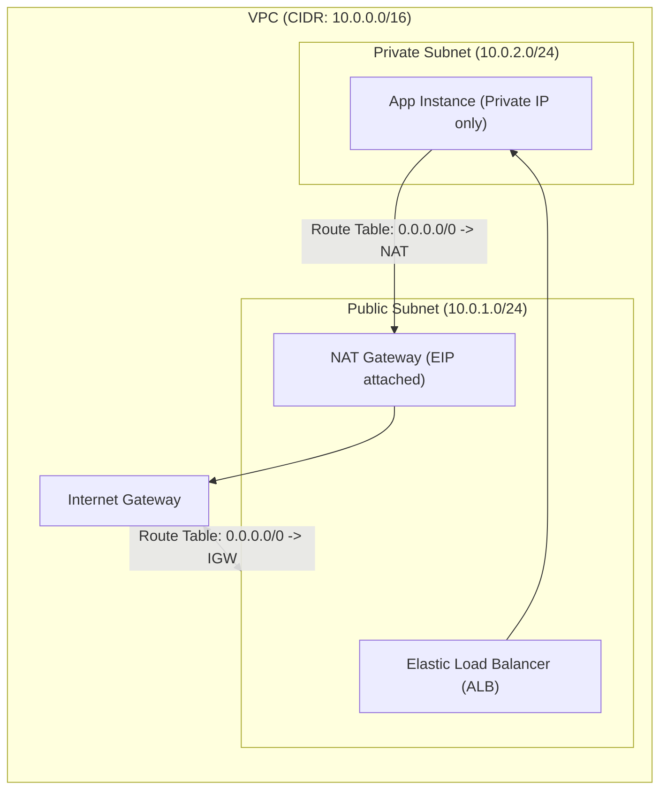

---
domains:
  - "aws"
  - "infra"
---

# Module 3-3: AWS Networking & Elastic Load Balancing

This module covers Virtual Private Cloud (VPC) networking, routing policies, firewalls, load balancers, auto-scaling architectures, and hybrid cloud connectivity topologies.

---

## 🗺️ Cognitive Map: VPC Network Routing Topology

---

## 1. Virtual Private Cloud (VPC) Architecture

A VPC is an isolated logical network confined to a single AWS Region.

### A. IP Allocation & Subnetting
*   **CIDR Blocks:** The primary IP range of the VPC. Address pools can be expanded by adding up to 4 secondary CIDR blocks.
*   **Subnets:** Subdivisions of the VPC CIDR block. Subnets are confined to a single Availability Zone (AZ) and cannot stretch across multiple AZs.
*   **Implied Router:** A fully managed, invisible routing engine that enables inter-subnet communication automatically (this routing is guaranteed and cannot be disabled).
*   **Route Tables:** Lists of routing rules (associations). Every subnet must associate with exactly one route table.
*   **Public Subnets:** Subnets containing a route table rule directing outbound traffic (`0.0.0.0/0`) to an **Internet Gateway (IGW)**. Resources require a public IP or Elastic IP (EIP) to communicate.
*   **Private Subnets:** Subnets without direct internet access. Outbound traffic is routed to a **NAT Gateway** located in a public subnet.

### B. Gateway Endpoints & Network Address Translation (NAT)
*   **NAT Gateway:** A fully managed NAT service that translates private subnet IP addresses to its attached Elastic IP. Scaling automatically up to 45 Gbps. Zonal scope.
*   **NAT Instance:** A self-managed EC2 instance running a NAT AMI in a public subnet. Requires disabling the **Source/Destination Check** on the ENI to allow routing traffic. Acts as a single point of failure and does not scale automatically.
*   **Egress-Only Internet Gateway:** Provides stateful outbound-only connectivity for IPv6 traffic, preventing inbound connections from initiating to private resources.

#### Deep-Intuition (AARF) Breakdown: NAT Gateway vs. NAT Instance
1.  **The Answer (Core Pattern):** Standardize on deploying highly available **NAT Gateways** within each Availability Zone where private subnets reside, configuring separate route tables per AZ private subnet mapping to their local zonal NAT Gateway.
2.  **The Assumptions (Context):** A NAT Gateway requires an allocated Elastic IP and must be launched in a public subnet containing a route table entry pointing to the Internet Gateway.
3.  **The Rationale (Why):** NAT Gateways are fully managed, redundantly scaled, and highly available. NAT Instances require manual scaling, security patching, and custom scripting to coordinate failovers, creating significant operational overhead.
4.  **The Failure Loop (What if not):** Deploying a single NAT Instance for multiple AZ private subnets creates a single point of failure. If that instance experiences a CPU lock or hypervisor crash, all outbound traffic from the private subnets (e.g., database updates, API fetches) immediately fails, disrupting the application.
5.  **Alternative Case (When to use 'if not'):** For developer sandboxes where cost minimization is the primary constraint and traffic volume is minimal, deploy a single low-spec NAT Instance.

### C. Bastion Hosts & Proxies
*   **Bastion Host:** A hardened, public-facing EC2 instance used as a secure gateway for administrative access (SSH/RDP) to private subnet resources. Access should be restricted via security group rules to whitelisted developer IP ranges.
*   **Proxy Server:** Used for outbound URL filtering and traffic inspection.
*   **Reverse Proxy:** Used for caching and load filtering prior to reaching application backends.

---

## 2. VPC Security: Security Groups vs. Network ACLs

VPC security requires layering stateful and stateless firewalls:

| Feature | Security Group (SG) | Network ACL (NACL) |
| :--- | :--- | :--- |
| **Layer of Operation** | Instance Level (ENI) | Subnet Level |
| **Statefulness** | **Stateful** (Return traffic allowed automatically) | **Stateless** (Outbound return traffic must be explicitly allowed) |
| **Rules Support** | Allow rules only (Implied deny at the end) | Allow and Deny rules |
| **Evaluation** | Evaluates all rules before matching | Evaluates sequentially in numerical order (lowest first) |

#### Deep-Intuition (AARF) Breakdown: SG and NACL Ephemeral Ports
1.  **The Answer (Core Pattern):** Layer security by applying restrictive instance-level Security Groups combined with subnet-level NACLs. When configuring custom NACLs, always ensure outbound rules permit return traffic to the client's ephemeral port range (typically TCP 1024-65535).
2.  **The Assumptions (Context):** TCP handshakes require two-way communication. Client browsers establish connections by selecting a random high-numbered port to receive responses.
3.  **The Rationale (Why):** SGs are stateful; they track connection state tables and allow return packets automatically. NACLs are stateless and evaluate every packet. Failing to configure outbound ephemeral port rules on a custom NACL blocks the return packet from leaving the subnet.
4.  **The Failure Loop (What if not):** If a custom NACL has inbound rules allowing port 80/443, but lacks an outbound rule allowing ports 1024-65535, a client attempting to load a website will experience connection timeouts. The packet enters the subnet, the server processes it, but the return packet is blocked at the subnet boundary by the stateless NACL.
5.  **Alternative Case (When to use 'if not'):** In development environments where network segmentation auditing is not required, use default Open NACLs (Allow All) and rely exclusively on Security Groups.

---

## 3. Elastic Load Balancing (ELB) Topologies

Load balancers distribute traffic across multiple target groups within a region:

*   **Application Load Balancer (ALB):** Layer 7 (HTTP/HTTPS). Routes traffic based on headers, hostnames (`offers.example.com`), and paths (`/images`). Supports web sockets, WAF integration, and target groups containing EC2 instances, IP addresses, or Lambda functions.
*   **Network Load Balancer (NLB):** Layer 4 (TCP/UDP/TLS). Ultra-low latency, handles millions of requests per second. Preserves client IP addresses natively when using instance ID targets.
*   **Cross-Zone Load Balancing:** Distributes incoming traffic evenly across all registered instances in all enabled AZs, rather than dividing traffic equally among the load balancer nodes in each AZ.
*   **Connection Draining (Deregistration Delay):** Keeps active connections open for a configurable timeout (default 300s) when an instance is deregistered, allowing in-flight transactions to complete before terminating the target.

#### Deep-Intuition (AARF) Breakdown: SSL Offloading vs. TCP Passthrough
1.  **The Answer (Core Pattern):** Terminate TLS sessions at the load balancer (SSL Offloading) using certificates managed by AWS Certificate Manager (ACM). Transition to TCP Passthrough only when end-to-end encryption to the host is required for compliance (e.g., PCI-DSS, HIPAA).
2.  **The Assumptions (Context):** The client to ELB path is encrypted. In SSL Offloading, the ELB to backend instance path is unencrypted HTTP over the private network.
3.  **The Rationale (Why):** SSL Offloading offloads the compute-intensive TLS handshake and decryption CPU cycles from backend application servers, simplifying certificate rotation. TCP Passthrough (utilizing NLB) forwards encrypted packets directly to the EC2 instances, requiring each instance to manage its own certificate and perform decryption.
4.  **The Failure Loop (What if not):** Implementing TCP Passthrough on web applications with large numbers of short-lived connections causes high CPU utilization on EC2 instances due to constant TLS negotiations, necessitating larger instance sizes and increasing overall compute costs.
5.  **Alternative Case (When to use 'if not'):** For regulated workloads requiring zero plaintext data transmission over any network segment, implement TCP Passthrough with backend TLS termination.

---

## 4. Auto Scaling Groups (ASG)

ASGs dynamically adjust EC2 fleets based on capacity demands.

*   **Configuration:** Scaled via **Launch Templates** (defining AMI, instance type, security groups, and user data).
*   **Parameters:**
    *   *Min Size:* The minimum floor of running instances.
    *   *Max Size:* The absolute ceiling for horizontal scaling.
    *   *Desired Capacity:* The target number of instances ASG attempts to maintain.
*   **ASG Cooldown:** The duration the ASG waits after a scaling activity completes before initiating another scale event, preventing rapid fluctuation (flapping).
*   **ASG Warm-up:** The time required for a newly launched instance to boot and begin contributing metrics to CloudWatch before it is evaluated for scaling.

#### Deep-Intuition (AARF) Breakdown: ASG Scaling Policies and Lifecycle Hooks
1.  **The Answer (Core Pattern):** Deploy Target Tracking scaling policies (e.g., maintaining average CPU at 60%) combined with ASG Lifecycle Hooks to pause instance termination, allowing state dumping or log extraction before instances are recycled.
2.  **The Assumptions (Context):** Instances are stateless, but logs or session data may need to be uploaded to S3 or processed by external cleanup scripts before termination completes.
3.  **The Rationale (Why):** Target Tracking scales dynamically to match traffic changes. ASG Lifecycle Hooks halt transitions (into states like `EC2_INSTANCE_TERMINATING`), providing a default 1-hour window to run scripts (via SSM or Lambda) to complete tasks before sending a `CONTINUE` signal.
4.  **The Failure Loop (What if not):** Operating high-velocity scale-in events without lifecycle hooks or offloaded logging results in the immediate destruction of EC2 disks. If an application error occurs right before scaling in, the logs are permanently lost, rendering debugging impossible.
5.  **Alternative Case (When to use 'if not'):** For batch environments where jobs run to completion on self-terminating tasks and logging is pushed in real-time to CloudWatch Logs, omit lifecycle hooks.

---

## 5. VPC Endpoints & PrivateLink

VPC Endpoints allow private connections between your VPC and supported AWS services without using an Internet Gateway, NAT Gateway, or VPN.

*   **Gateway Endpoints:**
    *   *Supported Services:* **S3** and **DynamoDB** only.
    *   *Integration:* Configured as a routing target in subnet route tables. Free to use.
*   **Interface Endpoints (PrivateLink):**
    *   *Supported Services:* Most AWS services, marketplace offerings, and custom client services.
    *   *Integration:* Deploys an Elastic Network Interface (ENI) with a private IP address inside the subnet. Uses private DNS resolution. Chargeable.

---

## 6. Hybrid Cloud Connectivity

Topologies for connecting on-premises infrastructure to AWS:

*   **Site-to-Site VPN:**
    *   *Components:* Virtual Private Gateway (VGW) or Transit Gateway (TGW) on the AWS side; Customer Gateway (CGW) on-premises.
    *   *Protocols:* IPsec. Configures dual tunnels for redundancy.
    *   *Properties:* Deployed over the public internet, meaning throughput is subject to latency and internet congestion.
*   **AWS Direct Connect (DX):**
    *   *Components:* Dedicated physical fiber connection from customer data center to an AWS DX location.
    *   *VIFs:* Private VIF (accessing VPCs via VGW), Public VIF (accessing public services like S3), Transit VIF (connecting to Transit Gateways).
    *   *Properties:* Secure physical link, low latency, consistent performance. Data is **unencrypted by default**; IPsec VPN can be layered over DX for encryption.
    *   *LAG (Link Aggregation Group):* Combines up to 4 physical DX links into a single logical connection.
*   **Transit Gateway (TGW):**
    *   *Layout:* A centralized cloud router connecting thousands of VPCs and on-premises networks (via VPN or DX) in a hub-and-spoke configuration, eliminating complex VPC peering meshes.

---

## 7. Network Diagnostics & Auditing

*   **VPC Flow Logs:** Captures IP traffic metadata going to and from network interfaces (ENIs) within the VPC. Published to CloudWatch Logs or S3. Logs source/destination IP, port, protocol, packets, and status (ACCEPT/REJECT). Does not capture packet payloads.
*   **Traffic Mirroring:** Copies actual network traffic (packet level) from EC2 ENIs and forwards it to out-of-band security and monitoring appliances for deep packet inspection (DPI).
