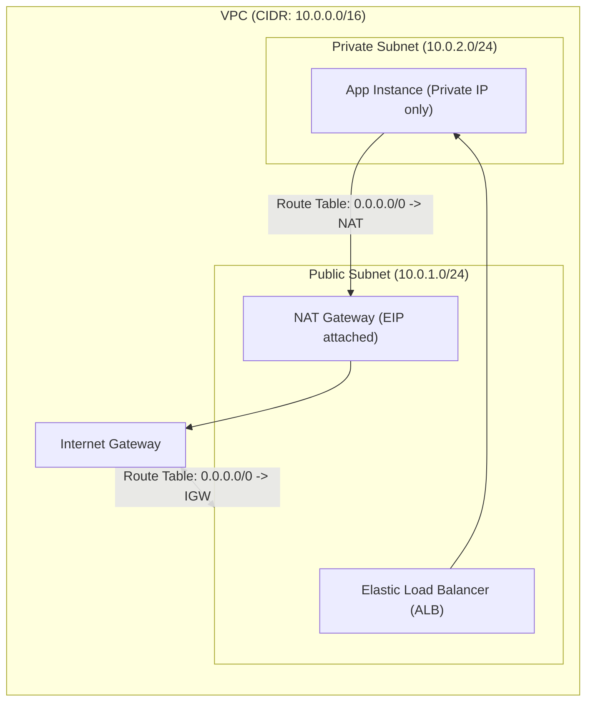

---
domains:
  - "aws"
  - "infra"
---

# Module 3-3: AWS Networking & Elastic Load Balancing

This module covers AWS Virtual Private Cloud (VPC) networking and load balancing. It details public vs. private subnets, security groups vs. NACLs, NAT gateways, Elastic Load Balancing, and Auto Scaling.

---

## 🗺️ Cognitive Map: VPC Network Routing Topology

---

## 1. Virtual Private Cloud (VPC) Infrastructure

A VPC is an isolated logical network mapping a user-defined IP range (CIDR).
*   **Public Subnets:** Subnets whose route table directs outbound internet traffic to an **Internet Gateway (IGW)**. Resources require Public IPs.
*   **Private Subnets:** Subnets isolated from direct inbound internet traffic. Outbound-only communication is routed through a **NAT Gateway** located in the public subnet.

---

## 2. Security Groups vs. Network ACLs

VPC security requires layering stateful and stateless firewalls.

| Firewall | Layer | Stateful / Stateless | Rules |
| :--- | :--- | :--- | :--- |
| **Security Group** | Instance Level (ENI) | Stateful (Inbound return traffic allowed automatically) | Only Allow rules |
| **Network ACL** | Subnet Level | Stateless (Must configure inbound & outbound explicitly) | Allow & Deny rules |

#### Deep-Intuition (AARF) Breakdown:
1. **The Answer (Core Pattern):** Layer security by applying restrictive instance-level Security Groups (e.g., allowing port 80 only from the load balancer security group) combined with subnet-level NACLs blocking known malicious CIDRs.
2. **The Assumptions (Context):** For NACL rule evaluation, rules are evaluated sequentially in numerical order (lowest first).
3. **The Rationale (Why):** Stateful Security Groups simplify configuration; they monitor connection states, meaning TCP handshake return packets are handled automatically. Stateless NACLs evaluate every packet blindly.
4. **The Failure Loop (What if not):** Configuring NACL inbound rules to allow port 80/443 without configuring outbound ephemeral port rules (ports 1024-65535) breaks return traffic. The client TCP handshake packets enter the subnet, but response packets are dropped by the stateless NACL, causing connection timeouts on the client.
5. **Alternative Case (When to use 'if not'):** In high-velocity developer test environments, default open NACLs (Allow All) can be left active, relying solely on Security Groups for access control.

---

## 3. Elastic Load Balancing & Auto Scaling

High-availability architectures require load-distributing traffic and dynamic scaling.

*   **Application Load Balancer (ALB):** Layer 7 load balancer. Directs traffic based on HTTP headers, cookies, and path-routing rules.
*   **Network Load Balancer (NLB):** Layer 4 load balancer. Handles millions of concurrent TCP/UDP requests with ultra-low latency.
*   **Auto Scaling Groups (ASG):** Automatically launches or terminates EC2 instances in response to changing CPU utilization or target tracking metrics.
