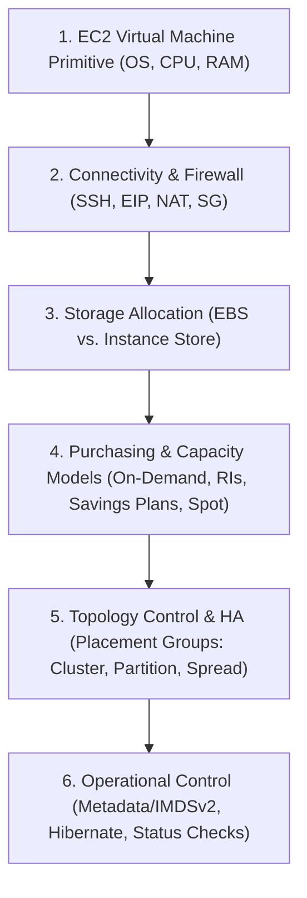

---
domains:
  - "aws"
class: reference-note
tier: reference-note
tags:
  - aws/compute
---

# Module 3-4: AWS EC2 Compute

This module covers core EC2 compute architectures, placement groups, bootstrap configurations, instance lifecycle states, metadata services (IMDSv1/v2), pricing models (On-Demand, Reserved, Savings Plans, Spot, Dedicated Hosts/Instances), network interface attachment, and basic concepts of Elastic Load Balancing (ELB) and Auto Scaling Groups (ASG).

---

## 🗺️ Cognitive Map: How to Think About the Flow of Knowledge

To build a strong intuition for AWS EC2 compute, think of the topics as moving from foundational virtualization primitives to advanced lifecycle and placement operations:



1. **Step 1: Foundational Compute Virtualization (Section 1):** Renting virtual servers (EC2 instances) with specific OS (Linux/Windows/macOS) and sizing characteristics.
2. **Step 2: Core Connectivity & Networking (Section 2):** Controlling access via Security Groups, key pairs, and routing via public/private/Elastic IPs and NAT.
3. **Step 3: Storage & Lifecycle Management (Section 3 & 4):** Attaching storage (persistent EBS vs. ephemeral Instance Store) and managing lifecycle states (rebooting, stopping, stopping-hibernate).
4. **Step 4: Cost Optimization & High Availability (Section 5 & 6):** Customizing purchasing models (Spot, Savings Plans) and utilizing placement topologies to prevent rack/AZ failures.

---

## 1. Amazon EC2 Compute Architecture & Foundations

Amazon Elastic Compute Cloud (EC2) is a fundamental Infrastructure as a Service (IaaS) offering that allows customers to rent virtual servers ("instances") on demand. 

### Core Hardware & Configuration Primitives
*   **Operating System (OS):** Selection of base Amazon Machine Images (AMIs) spanning Linux (e.g., Amazon Linux 2), Windows Server, or macOS.
*   **vCPUs and Memory (RAM):** Sized based on the workload requirements, ranging from low-power instances (1 vCPU, 1 GB RAM) to massive data-processing rigs.
*   **Storage Bindings:**
    *   **EBS (Elastic Block Store) Volumes:** Network-attached virtual drives that persist independently of the instance's state (survive shutdown and stop cycles).
    *   **Instance Store:** Ephemeral, physically attached SSD storage on the host hypervisor server. Provides ultra-low latency and high IOPS but is non-persistent; data is lost when the instance is stopped or terminated.
*   **Networking interface:** Fast network cards attached dynamically to virtual adapters (ENI - Elastic Network Interface) specifying internal and public IPs.
*   **Firewall Controls (Security Groups):** Statefully regulate incoming and outgoing ports, protocols, and IP ranges.
*   **Bootstrapping (EC2 User Data):** A shell script passed to the instance at launch to automate software installation, updates, and configurations.
    *   Runs **only once** during the initial boot cycle of the instance.
    *   Executes with administrative (`root` / `sudo`) privileges.
    *   Limited to a maximum size of 16 KB (non-encrypted).

### Instance Sizing & Naming Convention
AWS categorizes instances using a precise nomenclature. For example, in **`m5.2xlarge`**:
*   **`m` (Instance Family/Class):** Specifies the optimization profile (e.g., `m` is General Purpose).
*   **`5` (Generation):** Represents the hardware generation. Higher numbers utilize newer host processors and underlying infrastructure.
*   **`2xlarge` (Instance Size):** Corresponds to the scale of compute resources (CPU, memory, storage throughput, network bandwidth) allocated to the instance.

| Instance Class | Optimized For | Standard Families | Primary Use Cases |
| :--- | :--- | :--- | :--- |
| **General Purpose** | Balanced compute, memory, and network resources. | `T` (burstable), `M` | Web servers, code repositories, development/test environments. |
| **Compute Optimized** | High-performance processors and computation. | `C` | Batch processing, media transcoding, scientific modeling, gaming servers. |
| **Memory Optimized** | Processing large datasets directly within RAM. | `R` (RAM), `X` | In-memory databases (Redis, SAP HANA), large-scale caches (ElastiCache). |
| **Storage Optimized** | High sequential read/write and low-latency storage. | `I`, `D`, `H` | High-frequency OLTP systems, relational/NoSQL databases, Kafka, HDFS. |

---

## 2. Methods of Connection & IP Routing

To interact with and deploy applications on an EC2 instance, you must configure network ingress and connection mechanisms.

### Key Pairs & Secure Shell (SSH) Access
*   **Asymmetric Cryptography:** A key pair consisting of a **Public Key** (injected into the instance's `~/.ssh/authorized_keys` file by AWS at launch) and a **Private Key** (downloaded by the client).
*   **Key Formats:**
    *   `.pem` (Privacy-Enhanced Mail): Default format for OpenSSH on Linux, macOS, and Windows 10+.
    *   `.ppk` (PuTTY Private Key): Required for legacy Windows platforms using the PuTTY client.
*   **SSH Command & Options:**
    *   `ssh -i <keyfile.pem> <user>@<public-ip>`
    *   **SSH Agent Forwarding:** Storing the private key in local memory (`-K` flag) and forwarding it to the target instance (`-A` flag) to allow hopping to other instances without exposing the key on remote disks.

### Connectivity Alternatives
1.  **EC2 Instance Connect:** A browser-based secure shell utility. It pushes a temporary, single-use public SSH key directly into the instance's metadata cache via AWS API calls, avoiding the need for clients to store static private keys.
2.  **Systems Manager (SSM) Session Manager:** Secures access via HTTPS tunnels using an SSM agent on the OS. Avoids opening port 22 in security groups entirely.

### IP Address Types & NAT Architecture
*   **Private IP:** Injected into every EC2 instance. Used for internal communication within the VPC subnet. Traffic inside the same AZ using private IPs is **free**.
*   **Public IP:** Dynamically assigned from AWS's public pool. It is lost when the instance is stopped or terminated.
*   **Elastic IP (EIP):** A static, public IPv4 address that can be remapped dynamically between instances. Used to whitelist IPs in external firewalls.
    *   *Limit:* Soft limit of 5 Elastic IPs per VPC.
    *   *Billing:* Charged only when the EIP is allocated but **not** associated with a running instance (to prevent IP resource hoarding).
*   **NAT (Network Address Translation):** Translates an instance's private IP to its public IP at the VPC internet gateway boundary, enabling bi-directional communication.

---

## 3. Instance Lifecycle & Billing Options

Understanding when compute resources are billed is critical for cost-efficient systems design.

### Lifecycle States
*   **Pending:** The instance is being prepared by the hypervisor. No compute billing.
*   **Running:** Compute resources are active. Billing applies.
*   **Stopping / Stopped:** The compute environment is shut down.
    *   Compute billing **ceases**.
    *   Charges continue for any attached EBS storage volumes and any allocated/unassociated Elastic IPs.
*   **Shutting-down / Terminated:** The instance is permanently deleted. Attached EBS volumes marked with "Delete on Termination" (true by default for root volumes) are purged.

### Stop-Hibernate State
*   **Mechanism:** When hibernated, the in-memory state (RAM) of the instance is written directly to a dump file in the root EBS volume, and the instance is stopped.
*   **Benefits:** Faster boot times upon restart because the OS is frozen (not rebooted), preserving applications state, running processes, and warmed-up caches.
*   **Prerequisites & Limits:**
    *   The root volume must be an encrypted EBS volume with sufficient capacity to hold the RAM dump.
    *   Supported for On-Demand, Reserved, and Spot instances.
    *   Cannot be used on bare-metal instances.
    *   RAM size limit is typically < 150 GB.
    *   Maximum hibernation duration is 60 days.

---

## 4. EC2 Purchasing & Launch Models

AWS provides several purchasing models to balance cost optimization with performance reliability.

### On-Demand Instances
*   **Model:** Pay-as-you-go with no long-term commitment. Billed per second (for Linux, Windows, macOS after the first minute) or per hour.
*   **Best For:** Short-term, unpredictable workloads that cannot handle interruptions (e.g., initial application testing, sudden traffic spikes).

### Reserved Instances (RIs)
*   **Model:** 1-year or 3-year commitment specifying standard compute attributes. Offers up to 72% discounts compared to On-Demand. Can be purchased in three payment tiers: All Upfront, Partial Upfront, and No Upfront.
*   **Standard RIs:** Highest discount (up to 72%). Allows modification of AZ, instance size (within the same family), and scope, but **cannot** change the instance family, OS, or tenancy. RIs can be sold on the RI Marketplace.
*   **Convertible RIs:** Slightly lower discount (up to 54%). Allows exchanging for a different instance class, family, OS, tenancy, or scope.
*   **Scope:** 
    *   *Zonal:* Binds capacity reservation to a specific Availability Zone.
    *   *Regional:* Provides billing discounts across all AZs in the region without capacity guarantees.

### Savings Plans
*   **Model:** A modern, flexible pricing commitment where you commit to a specific hourly spend (e.g., $10/hour) for 1 or 3 years. Any usage within the limit is charged at the discounted rate; excess usage is billed at standard On-Demand rates. Up to 72% savings.
*   **Flexibility:** Automatically applies across instance sizes, operating systems, tenancy, and regions for a given instance family. Compute Savings Plans extend flexibility to Fargate and Lambda.

### Dedicated Infrastructure
*   **Dedicated Hosts:** A physical server fully dedicated to a single customer. Billed per physical server.
    *   *Use Cases:* Regulatory compliance demanding physical separation, or licensing models bound to physical sockets, cores, or hypervisor configurations (BYOL).
    *   *Control:* Permits full visibility and control over instance placement on the hardware.
*   **Dedicated Instances:** Running on hardware dedicated to you, but shared with other instances under the same AWS account. You lack control over physical placement on the hardware.

### Capacity Reservations
*   Reserve On-Demand capacity in a specific AZ for any duration with no commitment. Billed at On-Demand rates regardless of whether the instance is running or idle.

### Spot Instances & Spot Fleets
*   **Spot Instances:** Utilizes unused AWS capacity at discounts up to 90%.
    *   **Bid Mechanism:** You specify a maximum price you are willing to pay. If the spot price (based on supply and demand) rises above your maximum, you receive a **2-minute warning** before the instance is stopped or terminated.
    *   **Requests:**
        *   *One-Time:* Active until fulfilled, then deleted.
        *   *Persistent:* Remains active to launch new spot instances if the current ones are reclaimed or stopped, as long as the request duration is valid.
    *   **Termination Protocol:** To permanently delete a persistent spot setup, you **must cancel the Spot Request first**, and then terminate the running instances. Terminating the instances first will prompt the persistent request to launch a replacement instance.
*   **Spot Fleet:** A collection of Spot Instances (and optionally On-Demand instances) that automatically requests capacity across multiple instance types, OS profiles, and AZs to meet a target budget or capacity.
    *   *LowestPrice Strategy:* Provisions instances from the cheapest pool (best for short-duration batch processing).
    *   *Diversified Strategy:* Distributes instances across all defined pools (optimal for long-running, fault-tolerant workloads).
    *   *CapacityOptimized:* Launches instances from the pool with the highest available capacity (reduces termination rates).
    *   *PriceCapacityOptimized:* Selects the highest capacity pool first, then chooses the cheapest within it (recommended default).

---

## 5. EC2 Placement Groups

To optimize network latency or isolate physical hardware failures, customers can instruct AWS on how to locate instances relative to one another.

### 1. Cluster Placement Groups
*   **Layout:** Instances are packed tightly in a single Availability Zone.
*   **Purpose:** Low latency and high networking throughput (up to 10 Gbps+ when combined with enhanced networking).
*   **Risk:** If the physical AZ hardware fails, all instances are affected.
*   **Use Cases:** Scientific modeling, High-Performance Computing (HPC), low-latency inter-node communication.

### 2. Spread Placement Groups
*   **Layout:** Every instance is placed on a completely separate physical rack (separate power and network feeds).
*   **Constraint:** Max of 7 instances per AZ per placement group.
*   **Purpose:** Isolates instances from hardware failures.
*   **Use Cases:** Highly critical applications (e.g., control nodes, secondary database replicas) where instances must not fail concurrently.

### 3. Partition Placement Groups
*   **Layout:** Instances are distributed across logical partitions (up to 7 partitions per AZ). Each partition maps to an independent set of racks.
*   **Capacity:** Scales to hundreds of instances per group.
*   **Purpose:** Isolates failures at the partition level. A rack failure in Partition 1 will not impact Partition 2.
*   **Use Cases:** Partition-aware distributed databases (Cassandra, HBase), big data clusters (HDFS), and message streams (Apache Kafka).

### 🗺️ Placement Group Topology Configurations

```mermaid
flowchart TD
    subgraph Cluster ["Cluster Placement Group (Single AZ)"]
        direction LR
        c1["EC2 Instance 1"] <-->|"10Gbps+ Network <br> Ultra-Low Latency"| c2["EC2 Instance 2"]
        c2 <-->|"Enhanced Networking"| c3["EC2 Instance 3"]
        c1 <--> c3
    end
    
    subgraph Spread ["Spread Placement Group (Max 7 per AZ)"]
        direction TB
        subgraph Rack_A1 ["Physical Rack A"]
            s1["EC2 Instance 1"]
        end
        subgraph Rack_A2 ["Physical Rack B"]
            s2["EC2 Instance 2"]
        end
        subgraph Rack_A3 ["Physical Rack C"]
            s3["EC2 Instance 3"]
        end
    end
    
    subgraph Partition ["Partition Placement Group (Up to 7 Partitions per AZ)"]
        direction TB
        subgraph Part1 ["Partition 1 (Rack X)"]
            p1_1["EC2 Instance 1"]
            p1_2["EC2 Instance 2"]
        end
        subgraph Part2 ["Partition 2 (Rack Y)"]
            p2_1["EC2 Instance 3"]
            p2_2["EC2 Instance 4"]
        end
        subgraph Part3 ["Partition 3 (Rack Z)"]
            p3_1["EC2 Instance 5"]
            p3_2["EC2 Instance 6"]
        end
    end
```



---

## 6. EC2 Monitoring & Checking

AWS provides built-in instrumentation to track compute platform health and application behavior.

### Status Checks
*   **System Status Check:** Monitors issues requiring AWS intervention to resolve (e.g., hypervisor loss of power, physical hardware fault, network connectivity loss). Performance reports as "OK" or "Impaired". Checked every minute.
    *   *Remediation:* Configure a CloudWatch Alarm to automatically trigger a **Recover** action, transferring the instance to new host hardware.
*   **Instance Status Check:** Monitors issues requiring the customer's intervention to resolve (e.g., corrupted file system, misconfigured system settings, exhausted memory, OS boot failure). Checked every minute.
    *   *Remediation:* Trigger a **Reboot** or restart cycle.

### CloudWatch Metrics
*   **Basic Monitoring:** Sends standard metrics to CloudWatch every 5 minutes (default, free).
*   **Detailed Monitoring:** Sends metrics to CloudWatch every 1 minute (chargeable).
*   *Key Warning:* Storage disk space and RAM utilization metrics are **not** sent to CloudWatch by default. Collecting these OS-level metrics requires installing the unified CloudWatch Agent on the instance to push them as custom metrics.

---

## 7. Decoupled Orchestration Basics: ELB & ASG

*   **ELB (Elastic Load Balancing):** Distributes traffic statefully or statelessly across target groups. For deeper traffic configurations (ALB vs. NLB), refer to [[Reference Notes/3-10_aws_elb_load_balancing|Module 3-10: AWS Elastic Load Balancing]].
*   **ASG (Auto Scaling Groups):** Automatically scales capacity based on CPU limits or target parameters. For scaling rules and cooldowns, refer to [[Reference Notes/3-11_aws_asg_auto_scaling|Module 3-11: AWS Auto Scaling Groups]].
*   **AWS Batch:** A regional-scale service that plans, schedules, and executes containerized batch computing jobs across multiple AZs, dynamically sizing optimal EC2 compute pools without manual cluster maintenance.

---

## Deep-Intuition (AARF) Breakdowns

### AARF Breakdown: IMDSv1 vs. IMDSv2
1.  **The Answer (Core Pattern):** Standardize on requiring **IMDSv2** with a Hop Limit of 1 on all EC2 instances, disabling IMDSv1 to protect local metadata attributes.
    ```bash
    # Enforce IMDSv2 via AWS CLI
    aws ec2 modify-instance-metadata-options \
        --instance-id i-0123456789abcdef0 \
        --http-tokens required \
        --http-put-response-hop-limit 1
    ```
2.  **The Assumptions (Context):** Applications running on the EC2 instance must be updated to use HTTP token requests when querying the metadata IP (`169.254.169.254`).
3.  **The Rationale (Why):** IMDSv1 is vulnerable to Server-Side Request Forgery (SSRF) because an attacker can query simple HTTP GET requests. IMDSv2 requires a session token requested via HTTP PUT, preventing unauthorized access through open web proxies.
4.  **The Failure Loop (What if not):** If IMDSv1 is left active and a hosted web app has a directory traversal or SSRF vulnerability, an external attacker can exploit it to pull instance metadata and extract AWS credentials from the instance profile.
5.  **Alternative Case (When to use 'if not'):** For legacy software or pre-compiled AMIs that do not support token headers, temporarily allow IMDSv1 while monitoring security logs closely.

### AARF Breakdown: Spot Fleet vs. On-Demand for Batch Processing
1.  **The Answer (Core Pattern):** Deploy high-throughput, containerized batch processing tasks on a Spot Fleet utilizing the `capacityOptimized` allocation strategy across multiple instance pools and AZs, with a fallback configuration to On-Demand instances.
2.  **The Assumptions (Context):** The batch application must be stateless, support checkpointing (saving state to S3/DynamoDB), and handle unexpected instance terminations gracefully.
3.  **The Rationale (Why):** Spot capacity can be reclaimed by AWS at any moment. By choosing `capacityOptimized`, the fleet provisions from the least-congested pools, minimizing termination frequency. Combining this with multi-AZ configurations ensures batch pipeline execution progress continues even if a pool experiences reclaiming.
4.  **The Failure Loop (What if not):** Running a non-checkpointed, long-running single monolithic application on a standard Spot instance risks losing hours of computation if AWS terminates the instance mid-job, leading to missed SLA targets and repeated computing costs.
5.  **Alternative Case (When to use 'if not'):** For stateful, latency-sensitive production databases with strict transaction SLAs, deploy exclusively on On-Demand instances or reserved Capacity Reservations.

---

## 🌐 External Reference Resources
*   [AWS EC2 Hibernation Prerequisites & Troubleshooting](https://docs.aws.amazon.com/AWSEC2/latest/UserGuide/Hibernate.html#hibernating-prerequisites)
*   [AWS Knowledge Center: Run User Data Scripts at Every Launch](https://aws.amazon.com/premiumsupport/knowledge-center/execute-user-data-ec2/)
