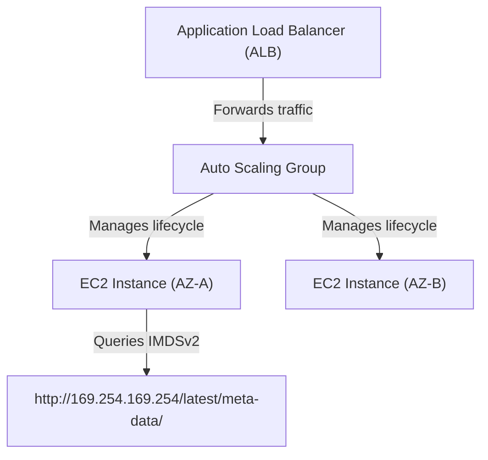

---
domains:
  - "aws"
  - "compute"
class: reference-note
tier: reference-note
tags:
  - aws/ec2
  - aws/load-balancing
  - aws/autoscaling
---

# Module 3-4: AWS EC2 Compute

This module covers core EC2 compute architectures, placement groups, bootstrap configurations, metadata services (IMDSv1/v2), pricing metrics, **Elastic Load Balancing (ELB)** traffic distribution, and **Auto Scaling Groups (ASG)** capacity scaling.

---

## 🗺️ Cognitive Map: High Availability & Scaling Stack



---

## 1. Amazon EC2 Compute Architecture
Amazon Elastic Compute Cloud (EC2) provides secure, resizable compute capacity.

![[Pasted image 20250722182440.png]]

![[Pasted image 20250722182605.png]]


![[Pasted image 20250722182521.png]]

![[Pasted image 20250722183055.png]]

![[Pasted image 20250722183121.png]]

![[Pasted image 20250722183158.png]]


Linux only

![[Pasted image 20250722183546.png]]

![[Pasted image 20250722183614.png]]
![[Pasted image 20250722183401.png]]

![[Pasted image 20250722183506.png]]

----------------

Database 

![[Pasted image 20250723225836.png]]

![[Pasted image 20250723225916.png]] 

![[Pasted image 20250723231947.png]]

![[Pasted image 20250723232041.png]]

![[Pasted image 20250723232106.png]]

![[Pasted image 20250723232144.png]]

![[Pasted image 20250723232213.png]]

![[Pasted image 20250723232247.png]]

![[Pasted image 20250723232508.png]]

![[Pasted image 20250723232541.png]]

![[Pasted image 20250723232645.png]]

![[Pasted image 20250723232852.png]]

![[Pasted image 20250723232943.png]]

![[Pasted image 20250723233005.png]]

![[Pasted image 20250723233102.png]]

![[Pasted image 20250723233150.png]]

![[Pasted image 20250723233359.png]]

![[Pasted image 20250723233820.png]]
# Part 3: EC2 Deep Dive

## EC2 Instance Families & Types


*Note:* Burstable bandwidth instances are instances that give credits if the I/O operations were below limit for a month, these credits stretches the limit of the I/O operations per month until you run out of credits.

## Instances Lifecycle & Billing
Instances are billable in three states, either running, rebooting, or stopping for Stop-Hibernate, the other states are not billed for.

*Note:* ***Stop-Hibernate*** state is a freeze state not a complete shutdown, RAM content, Instance ID, Processes running, private IP addresses and EBS root & data volumes are preserved until the restart.
Hibernated instances are not billable, except for EBS volumes & applied Elastic IP addresses.  
It's used to pre-warm applications that take a long time to boot, to make DR backup site ready to be used in case of disaster.
Not all instances support Stop-Hibernate.
https://docs.aws.amazon.com/AWSEC2/latest/UserGuide/Hibernate.html#hibernating-prerequisites 

![[Pasted image 20250522144204.png]]
## Instance Metadata
![[Pasted image 20250522144442.png]]

It's data about the instance, & can be used to conigure or manage the instance.
- To view an EC2 instance metadata, connect to the EC2 & use one of these commands:
	- GET http://169.254.169.254/latest/meta-data/
	- Curl http://169.254.169.254/latest/meta-data/
- To view a specific metadata parameter, for example to view local hostname:
	- GET http://169.254.169.254/latest/meta-data/hostname/
	- Curl http://169.254.169.254/latest/meta-data/hostname/


## Instance User Data
It's a data supplied by the user at the instance launch in the form of script to be executed during instance boot.
- It's limited to 16Kb in size.
- User data can be changed after stopping the instance.
- User data is not encrypted, so don't include passwords or sensitive data in user data scripts.
- Can be retrieved using http://169.254.169.254/latest/user-data
- User data scripts Runs when an EC2 instance is created once only will not run when rebooting the instance, to execute the user data at every launch visit https://aws.amazon.com/premiumsupport/knowledge-center/execute-user-data-ec2/
*Note:* AWS does not charge for read requests for user data.


![[Pasted image 20250522144658.png]]
## Instance Purchasing / Launch Types
##### 1- On-Demand
- Most expensive, billable for each second for instances that you launch.
- Used for short duration jobs.
##### 2- Reserved Instances 
- Prepaid.
- High savings up to 75% discount compared to on-demand.
- 1 or 3 years commitments. 
- Can be zonal (per AZ) or Regional scoped.
- It has two types:
	***- Standard RIs***: Higher discounts (up to 75%), & can only modify the size of the instance not the family.
	***- Convertible RIs:*** Lower discounts (up to 54%), & can modify or exchanged with other convertible RIs. 
##### 3- Scheduled Reserved Instances
- Prepaid.
- Up to 54% discount.
- 1 year commitment.
- Upfront purchase instance capacity for **recurring** daily, weekly, or monthly schedule.
##### 4- On-demand Capacity Reservation 
- No commitment, & can be cancelled
- Reserving a specific on-demand instance type capacity in a specific AZ.
##### 5- Spot Instances ($)
![[Pasted image 20250524095619.png]]
- Cheapest up to 90% savings.
- Utilizes AWS's unused EC2 instances. 
- Can be interrupted.
- Request is on one AZ/subnet.
- Availability is not guaranteed when you need it.
- Launches the instance when the market price meets the required, & terminated if the market price exceeded the price customer required.
- Used for applications that doesn't have strict requirements & can be interrupted.
- Default interruption behavior is terminating the instance, this can be changed for EBS-backed spot instances to stop or hibernate. This doesn't apply to spot blocks.
- There are two types of requests for spot instances:
	***- One Time:*** The request remains active until fulfilled, request expires, or gets cancelled.
	***- Persistent:*** The request remains active until it expires, or you cancel it even if the instance is fulfilled. 
- Aside from spot instances there are:
	***- Spot Blocks:*** Spot blocks will likely not to be terminated upon launching, *used with finite duration's* "few hours work". Request is on one AZ/subnet.
	***- Spot Fleet:*** used to launch a fleet of spot & optional on-demand instances, it uses instance pools & can maintain target capacity & allocation strategies, *used with optional on-demand instances* for work that requires on-demand instances but increasing the instances might be a desired option "As for doing the work faster". Request is on one  or more AZ/subnet.

**Spot Blocks and Spot Fleets are created from spot request Page**, and the normal spot instance is created from the EC2 page 


##### 6- Saving Plan
- Prepaid.
- 1 or 3 years commitment for a specific amount of usage
- Commitment for on-demand launches.
- up to 72% savings.
##### 7- Dedicated Hosts (Bare-Metal Host)
- Pay for a fully dedicated physical host.

##### 8- Dedicated Instances
- Pay by the hour for instances that run on a **dedicated single hardware.** They are launched on a single tenant hardware(host) not on dedicated hosts 
- They(Instances) can share the host hardware with other non-dedicated instance of the same account, but not its not used as a shared host the hardware in this case its called Dedicated Single-Tenant Hardware 


Setting dedicated hosts/instances in Console:


## EC2 Placement Groups
By default, AWS EC2 service tries to launch instances spread apart to avoid a major impact in case of a failure. 

Placement groups can be used to allow customers to influence how their instances are placed to meet the application needs.

Depending on the type of workload, there are three different ways to launch a placement group.
##### 1- Cluster Placement Groups
- Instances are placed in a Single AZ
- Low node-to-node latency for inter-node communications. 
- Use enhanced networking instances.
- Good for High performance computing (HPC) which requires inter-instance low latency and high speed. 
- **Single AZ has a huge cost advantage at the risk of no high availability "Communications between different AZ instances are billed".**
##### 2- Partition Placement Groups
- Instances are launched in different logical partitions (up to 7 per AZ). 
- Each partition is launched in a separate rack/server.
- One or more AZs in one region.
- Ideal for HDFS, HBase, and Cassandra Database "BigData applications".
![[Pasted image 20250524102054.png]]
##### 3- Spread Placement Groups
- Each instance is placed in a different rack (up to 7 per AZ).
- One or more AZS.
- Used for applications with a small number of critical instances that need to be separated from each other.

![[Pasted image 20250524102103.png]]


#Billing
## EC2 Billing
1- Across AZS in the same VPC: Chargeable both ways .
2- Across peered VPCS: Chargeable both ways.
3- Between Instances, Same AZ using Elastic or Public IPs: Chargeable both ways.
4- Between Instances, Same AZ using Private IPv4 IPs: Free.
5- Outbound to the Internet: **Chargeable at Regional rate.**
6- Inbound to an AWS region from the Internet or another region: Free.
7- Outbound from a Region to another region: Chargeable at **Regional rate.**
![[Pasted image 20250524102247.png]]
Creating an EC2 with a Placement Group on the Console:


#CloudWatch
## EC2 Monitoring & Check ups
### EC2 Status Check
Status Checks for EC2 done by AWS to assure performance promised to the customer.
##### 1- EC2 System Status Check:
- Is about monitoring and detecting issues needing AWS's involvement to fix. 
- As host hardware or software problems, network connectivity problems or system power.
- Is performed every minute "The result of the check is either Ok, or Impaired".
##### 2- EC2 Instance Status Check:
- Monitors and detects issues that require the customer's involvement to fix.
- As misconfigured startup configurations, or exhausted memory. 
- It is checked every minute by default.
- Only checks for issues, doesn't get resolved by AWS "As the instance is created by the customer".

### EC2 Monitoring using CloudWatch
##### 1- Basic Monitoring
- By default, Amazon EC2 sends metrics to CloudWatch every 5 minutes. 
- free of charge. 
##### 2- Detailed Monitoring
- Customer can enable detailed monitoring whereby EC2 service sends the metrics to CloudWatch every minute.
- Detailed monitoring is chargeable.

*Note:* Customer can configure CloudWatch to react automatically to failed checks:
- setting CloudWatch Alarm Actions to automatically stop, terminate, reboot or recover EC2 instances.
***Recover action can only be done for System Status check*** related failures. ***Reboot action is more suitable for Instance Status Check*** related failures.
- Customer can also use CloudWatch Events to respond automatically to events such as application availability issues or resource changes.

*Note:* Pay attention to what is NOT sent by default to CloudWatch. For example, Memory utilization and disk space utilization are key metrics required for monitoring, but not sent by default (require custom metrics).
![[Pasted image 20250524105543.png]]


![[Pasted image 20250524105734.png]]


---

## 2. Elastic Load Balancing (ELB) Topologies
Elastic Load Balancing automatically distributes incoming application traffic across multiple targets.

### A. Core Topologies & Features
# Part 4: Elastic Load Balancing & Auto Scaling Deep Dive

## Target Groups, Listeners, & Health Checks
Load Balancer is a REGIONAL construct, cannot create load balancers for applications across multiple regions.

##### How it works ?
ELB Load Balancer is an EC2 instance with the load balancing software, launched in an AWS-Created VPC called VPC ELB.
It reaches the instances in customer VPC with an AWS-Created ENI called ENI-ELB in customer VPC. This means that the customer subnet must have available IP addresses in range for the ENI-ELB. 
It deals with the private IP address given too the ENI-ELB.


### Load Balancer Types
##### 1- Classic Load Balancer (CLB)
- Backend EC2 Instances
- Applicable on all layers, but old & not recommended by AWS anymore
##### 2- Application Load Balancer (ALB)
- Applicable upon Layer 7 "Applications layer" 
- Targets can be EC2 Instances, IP addresses, Lambda Function
##### 3- Network Load Balancer (NLB)
- Applicable upon Layer 4 "Network layer" 
- Targets can be EC2 Instances, IP addresses, Lambda Function
- Highest Performance for load balancers "only for layer 4".
*Note:*  Load balancers applicable on IP Addresses allow the ability to apply load balancing for on-premises sites as well, by using their IP address.

### Target Groups
![[Pasted image 20250529151249.png]]
It's a logical grouping of targets, targets can be EC2 Instances, IP addresses, or ECS microservice.
- A target is an endpoint registered with the ***ALB/NLB*** as part of a target group.
- IP addresses can be used to add targets that are instances in a peered VPC, on- premises servers, and AWS resources that can be addressed by IP and port. 
- ALB/NLB can route traffic to multiple target groups.
- A target can be registered with a target group multiple times using different ports.

### ELB Listeners
A listener is the process that checks for connection requests to the ELB nodes, Multiple listeners can be configured on the ELB.
- On the CLB, listeners are configured frontend towards the clients, and backend towards backend instances.
- On ALB/NLB, frontend is the same as CLB, but backend is configured at the target group.
![[Pasted image 20250529151422.png]]

### ELB Health Checks
![[Pasted image 20250529151634.png]]
A load balancer decouples the application layer by concealing the failure in one tier from other tiers.
- Health checks are used by the elastic load balancer to track the health and responsiveness of the backend compute.
- Health check ports and thresholds are configurable.
- This way, ELB increases the availability of the application.
- If no healthy backend computes were found, the traffic won't be dropped, but will be sent to all computes instead "in hope of a response".

### Target Groups & Listeners Rules
A rule can be given to each listener to specify a specific job "*ex:* specific Port".
- Any listener has a default rule.
- The default rule is sending any traffic to the target group port.
- Customer can define different rules.
- Rules are applied from top to bottom in the console.
- If no rule were to be satisfied the traffic is sent to the default rule.
![[Pasted image 20250529152226.png]]


## ELB is on the EC2 Dashboard in Console:


## Cross-Zone Load Balancing
Applying the traffic equally upon instance level, instead of node level.
*ie:* Applies distribution of traffic among different AZs instead of among EC2 instances in the same EZ only.
- Ensures higher availability & fault tolerance.
- Enabled by default in CLB.
- Enabled by default in ALB.
- Disabled by default & Chargeable in NLB.


## Connection Draining
Suppose some EC2 instances is required to be deregistered from the ELB for troubleshooting, what happens to the sessions on these instances.
When a backend instance or a target from a target group attached to an ELB is deregistered from the ELB:
- ELB stops sending any further traffic to this instance/target.
- ELB waits for a deregistration (or connection draining) delay, during which in-flight sessions through that instance/ELB are given time to finish.
- Deregistration delay is 300 seconds by default.
- If the deregistration delay is met & the instance still didn't end current sessions, Traffic/Sessions will be dropped.

## ELB High Availability Design For Subnets

- AWS Recommends using ELB across minimum of 2 AZ.
- If the ELB is an internet-facing ELB, the enabled subnets have to be public subnets "subnets with routes accessing the internet" for the ENI.
- Backend or targets can be in public or private subnets.
- *Note:* NAT Gateways can be used in HA Design for private subnets accessing the internet.
![[Pasted image 20250529154850.png]]


## ELB - Security Groups

![[Pasted image 20250529155342.png]]


- Applying security Groups to the ELB can be done.
- Security Groups are not applicable on NLB.
- The concept is setting the security groups as source instead of using IP addresses.
- Security groups are stateful.
- Make sure that the NACLs allow subnets communications
- AS the NLB cannot have security groups, it only have the NACL of the subnet. Instead of setting the security group as source, the NLB Nodes IP/Subnet range is set.
- Notice the security groups of each of the ELBs & the instances:


## ELB & Digital Certificates
X.509/TLS/SSL or Digital Certificates is a digital file that is used to certify the ownership/binding between a public cryptographic key to an entity that must be named in the subject field. 
- The entity can be a person, organization, web entity, or a software distribution.
- The certificate includes the public key and information about who issued it (the Certificate Authority).
- Certificate Authority (CA) ensure that people cannot claim others' IDs by issuing fake digital certificates.
![[Pasted image 20250529161234.png]]


![[Pasted image 20250529161310.png]]
### Digital Certificates on ELB
ELB deals with the traffic, so it must have the certificate the clients will require for connection.
![[Pasted image 20250529161459.png]]
##### CLB
- Can do both SSL & HTTPS "Layer 4 & Layer 7".
- Can have one certificate.
##### ALB
-  Can do HTTPS only "Layer 7".
-  Can have multiple certificates.
##### NLB.
- Can do only SSL "Layer 4"
-  Can have multiple certificates.

#### SSL Offloading
SSL offloading is when the ELB will terminate TLS/HTTPS sessions from clients then establish clear or unencrypted sessions to the backend.
- Encryption is done on the Client to ELB side.
- Backend instances/targets do not have to process TLS/HTTPS handshake and the associated secure sessions overhead.
- Meaning that the backend won't need encrypted traffic.
- Termination is done on the ELB.


#### TCP Passthrough
TCP Passthrough is when the backend is responsible for termination of TLS/HTTPS sessions from clients.
- End-to-end in-transit (in-flight) encryption is required between the client and EC2 backend instances or targets.
- ELB should not be involved in any SSL negotiation (decrypting and re-encrypting traffic).
- Meaning no encryption is done on the client to ELB or the ELB to backend sides. 
- Termination is done on the backend.


#### Server Name Indication "SNI"
SNI or Server Name Indication is an extension to TLS.
- Clients that support SNI can indicate which domain they are trying to connect to during the handshake.
- Servers supporting SNI can read this HTTP header and respond with the correct domain certificate.
- It's not a DNS service, it only provides the correct certificate from multiple certificate.
- Supported by ALB, NLB "as they can hold multiple certificates".


## ELB & Client IP Address
Normally, ELB nodes will send their own IPv4 address as source IP address in the packets forwarded. Suppose it's required for the applications to be able to know the actual client IP addresses, not that of the ELB Node.

The following ways used to provide the client IP address to the backend:
##### X-Forwarded
- For at layer 7 listeners.
- CLB & ALB.
- Client IP is in put in Header.
##### Proxy Protocol
- At layer 4 listeners.
- CLB & NLB.
- Client IP is put in the proxy data not the Header.
- If the Instance IDs were used in the target groups, NLB automatically preserves client IP addresses when the instances are registered to their target groups using instance IDs.
*ie.* Proxy Protocol is not needed in NBL if the instances were defined using instance ID, but is used in case of IP addresses or Lambda functions defining of instances in the target group.


## ELB Monitoring & Logging
Monitoring ELB in AWS can be achieved by:
- ###### CloudWatch:
	- By default ELB service will send ***metrics*** to CloudWatch every minute if there is traffic flowing through the ELB nodes
- ##### CloudTrail:
	- CloudTrail logs all ***API Calls*** made to ELB APIs.
 - ##### Access Logs:
	 - Provides logs about ***actual traffic, Client IP, Protocol, Port,*** basically about the actual session information. Disabled by default.

## Session Affinity (Sticky Sessions)
![[Pasted image 20250626145343.png]]
Session stickiness refers to a configuration whereby the ELB will bind a client to a specific backend instance/target.
- This is supported by all ELBs. 
- Session stickiness is not fault tolerant. 
- Used with stateful applications, or applications that can not maintain session state.
- Applied on the target group not the ELB.
*Note:* Stateful applications are applications that stores cache & cookies on the instant, so faulting of the instance means losing of data access.

## Perfect Forward Secrecy
Perfect Forward Secrecy (PFS) helps prevent the decoding of captured encrypted data by unauthorized third parties, even if the private key gets compromised.
- Concept is allowing using changing encryption keys.
- It does that by using session keys that are ephemeral and not stored anywhere.
- Uses Elliptic Curve Diffie-Hellman Ephemeral (ECDHE) Protocol.


## Application Load Balancer (ALB)
-  supports: HTTP, HTTPS, HTTP/2 
- Supports Web Application Firewall (WAF): You can use AWS WAF with Application Load Balancer (ALB) to allow or block requests based on the rules in a web access control list (web ACL). 
- Internet-facing ALB supports IPv4 and DualStack. 
- ALB supports WebSockets by default "Server Initiating messages to client".
- ALB supports round robin (default), and least outstanding requests load balancing algorithms
	- Round Robin: Distributes work among targets equally.
	- Least Outstanding Requests: Sends traffic to less stressed instances.

### Path-Based & Host-Based Routing
Supported ONLY for ALB.
An Application Load Balancer supports specific content routing traffic to a specific target group based on:
- The HTTP path header of the URL.
	``www.example.com/images``
	``www.example.com/videos``
- The HTTP hostname header of the URL.
	``offers.example.com``
	``sales.example.com``
- This is also possible for HTTPS traffic.


### Slow Start Mode
Supported ONLY for ALB.
By default, a registered target starts receiving its full share of requests as soon as it becomes healthy.
- This is a target group level configuration.
- Slow-start mode gives a target time to warm up before receiving the full share of requests.
- During this period, the ALB increases the requests sent to this target gradually towards full share, which happens when the slow-start time ends.


## Network Load Balancer (NLB)
- NLB provides the highest connections speed and lowest latency among all ELBs.
- Supports TCP & UDP load balancing.
- NLB can be assigned an Elastic IP per enabled AZ if desired.
- Access logs, cross-zone load balancing, and delete protection are disabled by default, & chargeable.
- Supports client connections over VPC peering, AWS VPNs and 3rd party VPNs.

### AWS PrivateLink & VPC Endpoints
![[Pasted image 20250626153447.png]]
- Used with Interface VPC Endpoints.
- AWS PrivateLink-powered services are created in a VPC, also called ***VPC Endpoint Services***.
- Requirement is to have a NLB in the provider VPC and an Interface VPC Endpoint in the consumer VPC. Together, they constitute the Private Link to this service.
- Provider VPC can control via permissions which principals can connect via interface endpoints.

#### AWS PrivateLink & VPC Endpoints High Availability
- High Availability is applied by configuring the NLB and interface endpoints in each AZ in that AWS region.
- Consumers use DNS names for the endpoints to connect to the services. 
- It's advised to enable cross-zone load balancing on the NLB to ensure each NLB node can route to all EC2 instances, but it's chargeable.


### Gateway Load Balancer
It is a service that makes it easy and cost-effective to deploy, scale and manage the availability of third-party virtual applications such as Firewalls, Intrusion detection and prevention systems, and deep packet inspection systems in the cloud.
- Internet traffic goes from the IGW to the Gateway Load Balancer, & the Gateway Load Balancer redirects it to a NLB attached to a target group with the third-party virtual appliances, then after the application ends its work, the Gateway Load Balancer gets the traffic back & sends it to the original destination EC2 Instances.
- Traffic from the instance to internet "response" works the same way.
This is done via routing tables of the subnets.
- Subnet level service & has its own subnet.


## Load Balancers are under the EC2 Dashboard in Console


![[Pasted image 20250501135856.png]]


![[Pasted image 20250501135951.png]]


Encryption and Decryption of data stored in EBS happens on the EC2 instance !! so as we can see there no direct way or a work around to change the state of an encrypted volume to Unencrypted 

In such situations we Can do the following 
- Attach a new EBS unencrypted volume to the same EC2  
- Copy the Encrypted data to the new unencrypted volume 
- The data will be unencrypted on the host and will be saved in the new unencrypted volume without encryption 

----------------------
====================================================================

So Can I share the snapshot if i have multiple accounts in the organization 

by default a snapshot is available for the account created it only 

![[Pasted image 20250501140208.png]]

So we if we use amazon CMK the snapshot won't be shared, so we can do the copy and change CMK with something other than the default with the new snap shot to be shareable 

-------------------------
====================================================================

Any EBS or snapshot or copy will be encrypted within the scope of a region 


![[Pasted image 20250501143408.png]]
![[Pasted image 20250501143437.png]]![[Pasted image 20250501143449.png]]


-----------
===================================================================


Creating your Golden AMI -- hell yeah 
![[Pasted image 20250501161951.png]]

![[Pasted image 20250501170504.png]] 


---------------------------
====================================================================

![[Pasted image 20250501171718.png]]

![[Pasted image 20250501171731.png]] 


------------------
====================================================================

![[Pasted image 20250501172220.png]]


================================================================================================================================================================================================================================================================================

Elastic Load balancing 

Internet Facing Load Balancer 
Internal Load Balancer 


LB -- > Amazon recommend to deploy LB at 2 AZ in the same region...

LB between regions won't work LB is regional  **Many make this mistake thinking they can load balance an app between regions**


![[Pasted image 20250501174421.png]]


![[Pasted image 20250501174556.png]]


![[Pasted image 20250501174857.png]] 

Network load balancer offers the best performance performance we can use it as long as we don't need it to work on layer 7  

classic load balancer and application load balancer can a security groups configures, as of 2023 Network load balancer can have security groups configured 

![[Pasted image 20250501175443.png]]


![[Pasted image 20250501180443.png]]


![[Pasted image 20250501180459.png]]

If all Az's where unhealthy the LB just forward the traffic to all hopping it that traffic may reach a healthy target but it won't drop the traffic if 404 error of any kind came it will be a response from the failed EC2  


![[Pasted image 20250501180910.png]]

Its better for LB health checks to be on the same port thats running the application 

![[Pasted image 20250501181431.png]]

load balancer rules executed according to the order they are listed in so you need to put that in mind 

--------------------------------------------------------
====================================================================

Cross-Zone LB disabled The traffic is not divided according to EC2
every time a request is forwarded to an AZ... They have different number of EC2 

![[Pasted image 20250502101828.png]]

Cross zone lb The traffic is forwarded to all registered healthy EC2 instance by default enabled in Application load balancer and it charges in Network load balancer 

![[Pasted image 20250502102957.png]]


----------------
====================================================================

![[Pasted image 20250502103308.png]]

----------------------------------------
====================================================================

A load balancer node is defined in a public subnet if its a Internet facing load balancer 

We have one ENI-ELB per AZ with a public IP to connect with the public network and a private IP

Now to increase security measures we can place the interface of the application in a private subnet 


![[Pasted image 20250502103329.png]]

------------------------
====================================================================

![[Pasted image 20250502103846.png]]


**we can use gateway end-point for private subnets to connect to aws services** 
 
--------------------------------------------------------------------====================================================================

![[Pasted image 20250502120105.png]]


![[Pasted image 20250502120344.png]]


 ![[Pasted image 20250502120600.png]]


--------------------------------------------------------------------====================================================================

![[Pasted image 20250502122540.png]]
 
![[Pasted image 20250502122648.png]] 

![[Pasted image 20250502123036.png]]

 ![[Pasted image 20250502123257.png]]
![[Pasted image 20250502123408.png]]

![[Pasted image 20250502124046.png]]


![[Pasted image 20250502124150.png]]


![[Pasted image 20250502124835.png]]


--------------------------------------------------------------------====================================================================


![[Pasted image 20250502125222.png]]

Application load balancer 
Remember x-forwarded is the client public id found in the layer 7 header of the request 

Network load balancer 
Proxy protocol stores the ip of the client in the layer 4 message payload itself if we are not using target groups 

![[Pasted image 20250502125852.png]]

---

## 3. Auto Scaling Groups (ASG) Deep Dive
ASGs dynamically scale EC2 fleets based on CPU, network, or custom CloudWatch metrics.

### A. Lifecycle & Metrics
# Part 5: AWS Auto Scaling Deep Dive
AWS Auto Scaling allows for the configuration of automatic scaling for the AWS resources that are part of an application very quickly. 
- Automatic scaling can be configured for individual resources or for applications.
- Auto Scaling can be used with EC2, Spot Instances, DynamoDB, Aurora, Amazon ECS among other services.

Auto Scaling is useful for applications that experience daily or weekly variations in traffic flow such as:
- Cyclical traffic patterns.
- On and Off traffic patterns.
- Variable traffic patterns.

## Application Auto Scaling
Application Auto Scaling is a web service for automatically scaling resources for services beyond Amazon EC2. 
- It can be used with Auto Scaling and EC2 Auto Scaling to scale resources across multiple services including:
	- ECS services 
	- Spot Fleet requests
	- EMR Clusters 
	- AppStream 2.0 fleets
	- Aurora Replicas DynamoDB Read and Write Capacity units
	- SageMaker endpoints
	- Amazon Comprehend

## EC2 Auto Scaling
- It's a Regional service
- It can span multiple Availability Zones in the same AWS Region.
- It integrates with ELB, CloudWatch, and Cloud Trail.
- It is free to use, but customers pay only for EC2 and EBS resources used. 
- ASG will try to balance resources across Availability Zones.
- The EC2 Auto Scaling configuration components are:
	 - ##### An Auto Scaling Group 
		- Is the logical grouping of managed instances.
		- Desired no. is the starting no. of instances to launch.
	- ##### A Launch Configuration (or A Template)
		- The template for instance configurations. 
	- ##### A Scaling Policy (Plan) 
		- Defines the when and how to scale out or in.

*Note:* Launch Templates are preferred over Launch Configurations by AWS, as future updates are concerning Launch Templates.

### EC2 Auto Scaling: Launch Templates
Launch Templates serves the same purpose as launch configuration, where it defines the EC2 instance configuration. AWS recommends using it over launch configuration.
However it has the following advantages over launch configurations:
- It can have different versions.
- It allows the use of multiple instance types and can use On-Demand and Spot instances in the same Auto Scaling group.
- We can define a placement group in the template such that instances will be launched in that placement group "Check placement groups in Part3".
This would help achieve the desired scale, cost, and performance.

### EC2 Auto Scaling: Health Checks
![[Pasted image 20250626164334.png]]
By default the EC2 Auto Scaling service determines if the instance is running or not via EC2 status check, even with ELB applied.
- This can be changed when creating Auto Scaling Group in the console to wait for EC2 status check ***AND*** the ELB health checks.
- If either of the two checks states a negative response, the instance is terminated.


### EC2 Auto Scaling: Types
![[Pasted image 20250626164350.png]]
Auto Scaling policy types: 
- ##### 1- Manual
	- This is to maintain a current number of Instances at all times.
	- Manually change the Min/Desired/Max & Attach/Detach instances.
- ##### 2- Cyclic or Schedule Scaling
	- Used with predictable load change to add Instances and remove them after the desired duration (daily, weekly, monthly).
- ##### 3- On-Demand or Dynamic Scaling
	 ![[Pasted image 20250626164613.png]]
	- Scaling in response to an alarm/event.
	- CloudWatch monitors metrics and generates alarms for auto scaling to scale out/in.
	- Has 3 types:
		![[Pasted image 20250626164832.png]]
		- **Simple Scaling:** A single adjustment up or down in response to the alarm.
		- **Step Scaling:** Multiple Steps/Adjustments depending on different Alarms.
		- **Target Tracking Scaling:** Scale out or in based on a target value for a specific metric.
- ##### 4- Predictive Scaling
	- Combines proactive and reactive scaling.

### EC2 Auto Scaling: Lifecycle Hooks
- Lifecycle hooks enables performing custom actions "such as checking logs" by pausing instances as an auto scaling group launches or terminates these instances.
- When an instance is paused, it remains in a wait state either until the lifecycle action is completed or until the timeout period ends (one hour by default).


### EC2 Auto Scaling: Cooldown & Warm-up Periods
##### Cooldown Period
- After a scale-out or scale-in activity.
- Is the amount of time Auto Scaling waits after a scale-out or scale-in activity before another scale activity can start. 
- This help ensure that the impact of the scaling activity becomes visible.
##### Instance Warm-up Period
- After a scale out activity.
- Is the amount of time that elapses before a newly launched instance (due to a scale-out activity) begins contributing to CloudWatch metrics.
- Basically to allow new launched instances to start giving impact after fully launching.

### EC2 Auto Scaling: Scale-in Termination Protection
Instances can be protected from being automatically terminated during a scale-in event using Scale-in instance protection.
This setting can be changed at the Auto Scaling Group level.

However, this does not protect the instance from:
- Manual termination. 
- Replacement if it becomes unhealthy.
- Spot instance interruption.

### EC2 Auto Scaling: Termination Policy
Which Instance is to be terminated??

- The AZ with the larger number of EC2 instances is selected first for termination.
- If there is a mix of launch configuration and Launch Template instances, ones with launch configuration are selected first for termination.
- AS terminates the instance with the oldest launch configuration first.
- If they are all the same, AS terminates the one that is closest to billing hour.


---

## 4. Application Integration & Decoupling (SQS & SNS)
## SQS - Amazon Simple Queue Service (Message Queue Concept)
- Message Queues provide asynchronous communication & coordination for the application components.
- Messages are stored in queue reliably until they re processed, then get deleted.
- this allows scaling different parts of the project (Producer queue and consumer queue) because they are independent of each other  & increase its reliability.
- Message sending Tiers is called **Message** **Producers**, while message receiving Tiers is called **Message Consumers**.
- Using SQS is referred to as Decoupling process, as it decouples different tiers. 
![[Pasted image 20250510235011.png]]


## SNS - Amazon Simple Notification Service
- SNS is a fast & fully managed notification service.
- **Publisher is the sender "Producer" & Subscriber is the receiver "Consumer".**
- Publishers publish messages to a SNS Topic, Subscribers receive messages from the SNS Topics they are subscribed to.
- **Publisher must have the permissions to be in the SNS Topic "IAM Policies".**
- Subscribers can be users, emails, SMS, services & many other formats.
- SNS is reliable & stores multiple data copies across multiple AZs.
- SNS supports HTTPS in-transit. Its also encrypted at rest 

**Note:** Message size in SQS & SNS shouldn't exceed 256 Kbytes, indicating that the messages either in queue "SQS" or instant "SNS" won't include the data or the object itself, only a message about the data.


---

## 5. Hands-on Configurations & Project Labs
This section documents how to setup load balancing and target group rules.

### A. Load Balancer Listener Rule Configurations
Create a listener rule for an ALB using path-based routing via the AWS CLI:
```bash
aws elbv2 create-rule \
    --listener-arn arn:aws:elasticloadbalancing:us-east-1:123456789012:listener/app/my-alb/50dc6c495c0c9188/f2f7dc8e1b3e839e \
    --conditions '[{"Field":"path-pattern","Values":["/images/*"]}]' \
    --priority 10 \
    --actions '[{"Type":"forward","TargetGroupArn":"arn:aws:elasticloadbalancing:us-east-1:123456789012:targetgroup/images-tg/73e2d6bc24d8a067"}]'
```

### B. Auto Scaling Lifecycle Hook Setup
Configure a lifecycle hook that pauses instance termination to back up logs to S3:
```bash
aws autoscaling put-lifecycle-hook \
    --lifecycle-hook-name BackupLogsHook \
    --auto-scaling-group-name my-web-asg \
    --lifecycle-transition autoscaling:EC2_INSTANCE_TERMINATING \
    --default-result CONTINUE \
    --heartbeat-timeout 3600
```

---

## 6. Supplemental Hands-on SAA Labs & HA Design

### A. SQS, RDS, and High Availability / Fault Tolerance Lab
![[Pasted image 20250512085552.png]]

the Web/app programming will be modified to communicate with the SQS instead of the database 
**Lambda function is used in architectures like this to take the data in the SQS and write it in the RDS** 

![[Pasted image 20250512090125.png]]

Any Project that has Design requirements it is divided into functional requirements and non functional requirements 

we need to understand and study the platform in order to be able to design and implement according to the available services and its limitations 


![[Pasted image 20250512101213.png]]

![[Pasted image 20250512102552.png]]

----------


With the load balancer and the two EC2 instance we achieved high availability, Now suppose we added an Autoscaling group to guarantee the existence of two EC2 instance so if of one of the two EC2 terminated the AG will create another one in any of the two AZ either the same or another available its AG responsibility, so by adding two EC2 with LB we are highly available but the AG should be added and its always comes with a package when LB is mentioned  

But are we 100% fault tolerant ?? 
Absolutely not because when AG executes the Boot time may be minutes so the application behavior will be affected until its ready to receive traffic  

In case of using container instead of VM the boot process will be faster and in scenarios like these we may be fault tolerant 

To be fault tolerant 
Suppose a third AZ and its in the AG and the three instance is up and they are the minimum to run my app , with threshold 60% cpu usage now we guaranteed 100% fault tolerance and elasticity  


![[Pasted image 20250512104739.png]]


### B. Elastic Load Balancer (ELB) Projects
# AWS Elastic load balancer (ELB)
## project 1
working with health checks of load balancer groups 
![[Pasted image 20250529160044.png]]

## project 2
![[Pasted image 20250626140433.png]]

![[Pasted image 20250626140557.png]]

![[Pasted image 20250626141215.png]]


## project 3

![[Pasted image 20250626151341.png]]

![[Pasted image 20250626151400.png]]

## project 4

![[Pasted image 20250626150847.png]]

![[Pasted image 20250626150926.png]]


## Project 5


### C. Auto Scaling Group (ASG) Projects
# AutoScaling Group
![[Pasted image 20250626165425.png]]

![[Pasted image 20250626165815.png]]

---

## 7. Deep-Intuition (AARF) Breakdowns

### AARF Breakdown: IMDSv1 vs. IMDSv2
1.  **The Answer (Core Pattern):** Standardize on requiring **IMDSv2** with a Hop Limit of 1 on all EC2 instances, disabling IMDSv1 to protect local metadata attributes.
    ```bash
    # Enforce IMDSv2 via CLI
    aws ec2 modify-instance-metadata-options \
        --instance-id i-0123456789abcdef0 \
        --http-tokens required \
        --http-put-response-hop-limit 1
    ```
2.  **The Assumptions (Context):** Applications running on the EC2 instance must be updated to use HTTP token requests when querying the metadata IP (`169.254.169.254`).
3.  **The Rationale (Why):** IMDSv1 is vulnerable to Server-Side Request Forgery (SSRF) because an attacker can query simple HTTP GET requests. IMDSv2 requires a session token requested via HTTP PUT, preventing unauthorized access through open web proxies.
4.  **The Failure Loop (What if not):** If IMDSv1 is left active and a hosted web app has a directory traversal or SSRF vulnerability, an external attacker can exploit it to pull instance metadata and extract AWS credentials from the instance profile.
5.  **Alternative Case (When to use 'if not'):** For legacy software or pre-compiled AMIs that do not support token headers, temporarily allow IMDSv1 while monitoring security logs closely.

### AARF Breakdown: SSL Offloading vs. TCP Passthrough
1.  **The Answer (Core Pattern):** Terminate TLS sessions at the load balancer (SSL Offloading) using certificates managed by AWS Certificate Manager (ACM). Transition to TCP Passthrough only when end-to-end encryption to the host is required for compliance (e.g., PCI-DSS, HIPAA).
2.  **The Assumptions (Context):** The client to ELB path is encrypted. In SSL Offloading, the ELB to backend instance path is unencrypted HTTP over the private network.
3.  **The Rationale (Why):** SSL Offloading offloads the compute-intensive TLS handshake and decryption CPU cycles from backend application servers, simplifying certificate rotation. TCP Passthrough (utilizing NLB) forwards encrypted packets directly to the EC2 instances, requiring each instance to manage its own certificate and perform decryption.
4.  **The Failure Loop (What if not):** Implementing TCP Passthrough on web applications with large numbers of short-lived connections causes high CPU utilization on EC2 instances due to constant TLS negotiations, necessitating larger instance sizes and increasing overall compute costs.
5.  **Alternative Case (When to use 'if not'):** For regulated workloads requiring zero plaintext data transmission over any network segment, implement TCP Passthrough with backend TLS termination.

### AARF Breakdown: Spot Fleet vs. On-Demand for Batch Processing
1.  **The Answer (Core Pattern):** Deploy high-throughput, containerized batch processing tasks on a Spot Fleet utilizing the `capacityOptimized` allocation strategy across multiple instance pools and AZs, with a fallback configuration to On-Demand instances.
2.  **The Assumptions (Context):** The batch application must be stateless, support checkpointing (saving state to S3/DynamoDB), and handle unexpected instance terminations gracefully.
3.  **The Rationale (Why):** Spot capacity can be reclaimed by AWS at any moment. By choosing `capacityOptimized`, the fleet provisions from the least-congested pools, minimizing termination frequency. Combining this with multi-AZ configurations ensures batch pipeline execution progress continues even if a pool experiences reclaiming.
4.  **The Failure Loop (What if not):** Running a non-checkpointed, long-running single monolithic application on a standard Spot instance risks losing hours of computation if AWS terminates the instance mid-job, leading to missed SLA targets and repeated computing costs.
5.  **Alternative Case (When to use 'if not'):** For stateful, latency-sensitive production databases with strict transaction SLAs, deploy exclusively on On-Demand instances or reserved Capacity Reservations.

