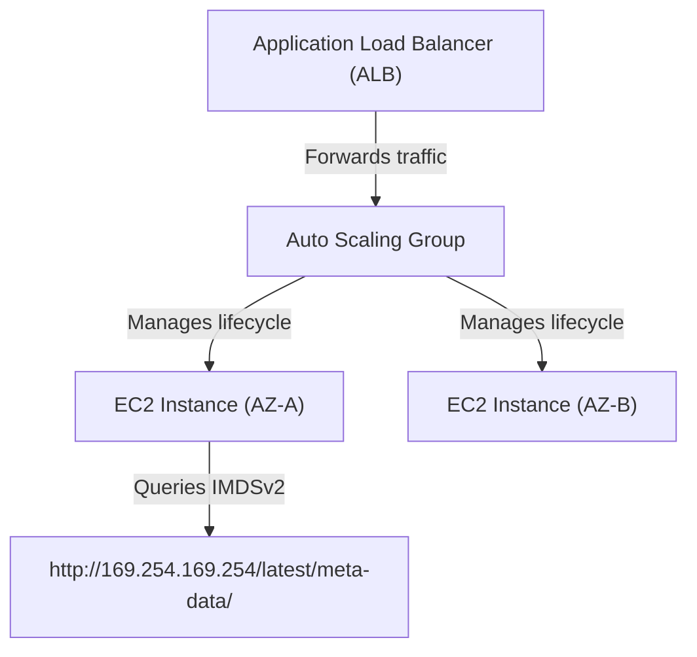

---
domains:
  - "aws"
  - "compute"
class: reference-note
tier: reference-note
tags:
  - aws/ec2
  - aws/load-balancing
  - aws/autoscaling
---

# Module 3-4: AWS EC2 Compute

This module covers core EC2 compute architectures, placement groups, bootstrap configurations, metadata services (IMDSv1/v2), pricing metrics, **Elastic Load Balancing (ELB)** traffic distribution, and **Auto Scaling Groups (ASG)** capacity scaling.

---

## 🗺️ Cognitive Map: High Availability & Scaling Stack



---

## 1. Amazon EC2 Compute Architecture
Amazon Elastic Compute Cloud (EC2) provides secure, resizable compute capacity.


---

## 2. Elastic Load Balancing (ELB) Topologies
Elastic Load Balancing automatically distributes incoming application traffic across multiple targets.

### A. Core Topologies & Features


---

## 3. Auto Scaling Groups (ASG) Deep Dive
ASGs dynamically scale EC2 fleets based on CPU, network, or custom CloudWatch metrics.

### A. Lifecycle & Metrics


---

## 4. Application Integration & Decoupling (SQS & SNS)


---

## 5. Hands-on Configurations & Project Labs
This section documents how to setup load balancing and target group rules.

### A. Load Balancer Listener Rule Configurations
Create a listener rule for an ALB using path-based routing via the AWS CLI:
```bash
aws elbv2 create-rule \
    --listener-arn arn:aws:elasticloadbalancing:us-east-1:123456789012:listener/app/my-alb/50dc6c495c0c9188/f2f7dc8e1b3e839e \
    --conditions '[{"Field":"path-pattern","Values":["/images/*"]}]' \
    --priority 10 \
    --actions '[{"Type":"forward","TargetGroupArn":"arn:aws:elasticloadbalancing:us-east-1:123456789012:targetgroup/images-tg/73e2d6bc24d8a067"}]'
```

### B. Auto Scaling Lifecycle Hook Setup
Configure a lifecycle hook that pauses instance termination to back up logs to S3:
```bash
aws autoscaling put-lifecycle-hook \
    --lifecycle-hook-name BackupLogsHook \
    --auto-scaling-group-name my-web-asg \
    --lifecycle-transition autoscaling:EC2_INSTANCE_TERMINATING \
    --default-result CONTINUE \
    --heartbeat-timeout 3600
```

---

## 6. Deep-Intuition (AARF) Breakdowns

### AARF Breakdown: IMDSv1 vs. IMDSv2
1.  **The Answer (Core Pattern):** Standardize on requiring **IMDSv2** with a Hop Limit of 1 on all EC2 instances, disabling IMDSv1 to protect local metadata attributes.
    ```bash
    # Enforce IMDSv2 via CLI
    aws ec2 modify-instance-metadata-options \
        --instance-id i-0123456789abcdef0 \
        --http-tokens required \
        --http-put-response-hop-limit 1
    ```
2.  **The Assumptions (Context):** Applications running on the EC2 instance must be updated to use HTTP token requests when querying the metadata IP (`169.254.169.254`).
3.  **The Rationale (Why):** IMDSv1 is vulnerable to Server-Side Request Forgery (SSRF) because an attacker can query simple HTTP GET requests. IMDSv2 requires a session token requested via HTTP PUT, preventing unauthorized access through open web proxies.
4.  **The Failure Loop (What if not):** If IMDSv1 is left active and a hosted web app has a directory traversal or SSRF vulnerability, an external attacker can exploit it to pull instance metadata and extract AWS credentials from the instance profile.
5.  **Alternative Case (When to use 'if not'):** For legacy software or pre-compiled AMIs that do not support token headers, temporarily allow IMDSv1 while monitoring security logs closely.

### AARF Breakdown: SSL Offloading vs. TCP Passthrough
1.  **The Answer (Core Pattern):** Terminate TLS sessions at the load balancer (SSL Offloading) using certificates managed by AWS Certificate Manager (ACM). Transition to TCP Passthrough only when end-to-end encryption to the host is required for compliance (e.g., PCI-DSS, HIPAA).
2.  **The Assumptions (Context):** The client to ELB path is encrypted. In SSL Offloading, the ELB to backend instance path is unencrypted HTTP over the private network.
3.  **The Rationale (Why):** SSL Offloading offloads the compute-intensive TLS handshake and decryption CPU cycles from backend application servers, simplifying certificate rotation. TCP Passthrough (utilizing NLB) forwards encrypted packets directly to the EC2 instances, requiring each instance to manage its own certificate and perform decryption.
4.  **The Failure Loop (What if not):** Implementing TCP Passthrough on web applications with large numbers of short-lived connections causes high CPU utilization on EC2 instances due to constant TLS negotiations, necessitating larger instance sizes and increasing overall compute costs.
5.  **Alternative Case (When to use 'if not'):** For regulated workloads requiring zero plaintext data transmission over any network segment, implement TCP Passthrough with backend TLS termination.

### AARF Breakdown: Spot Fleet vs. On-Demand for Batch Processing
1.  **The Answer (Core Pattern):** Deploy high-throughput, containerized batch processing tasks on a Spot Fleet utilizing the `capacityOptimized` allocation strategy across multiple instance pools and AZs, with a fallback configuration to On-Demand instances.
2.  **The Assumptions (Context):** The batch application must be stateless, support checkpointing (saving state to S3/DynamoDB), and handle unexpected instance terminations gracefully.
3.  **The Rationale (Why):** Spot capacity can be reclaimed by AWS at any moment. By choosing `capacityOptimized`, the fleet provisions from the least-congested pools, minimizing termination frequency. Combining this with multi-AZ configurations ensures batch pipeline execution progress continues even if a pool experiences reclaiming.
4.  **The Failure Loop (What if not):** Running a non-checkpointed, long-running single monolithic application on a standard Spot instance risks losing hours of computation if AWS terminates the instance mid-job, leading to missed SLA targets and repeated computing costs.
5.  **Alternative Case (When to use 'if not'):** For stateful, latency-sensitive production databases with strict transaction SLAs, deploy exclusively on On-Demand instances or reserved Capacity Reservations.

