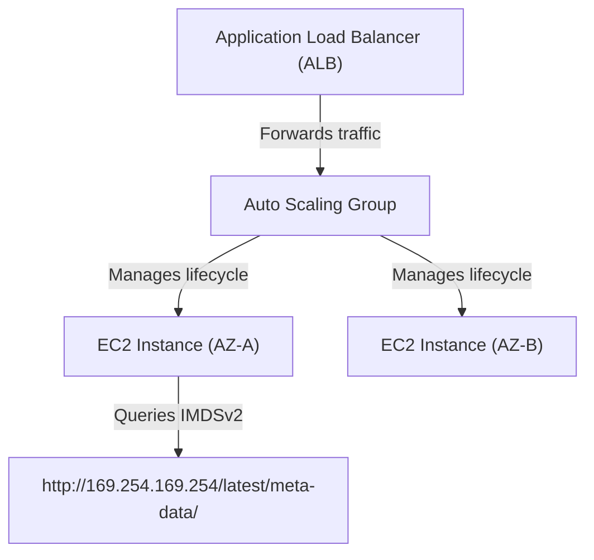

---
domains:
  - "aws"
class: reference-note
tier: reference-note
tags:
  - aws/compute
---

# Module 3-4: AWS EC2 Compute

## EC2 - Elastic Compute Cloud
EC2 is a service acting as Virtual Machines, with resizable computing capacity in the cloud, & fully manageable by the client with the root access.
EC2 can be provisioned on **shared hosts** (Between other AWS Client's EC2 instances) or **dedicated hosts**. There is a 20 EC2 instances soft limit per account. {{Soft limits is limits that can be changed, opposite of Hard Limits}}
EC2 is launched in a subnet in the availability zone.

### EC2 Instances Types:

#AWS-EBS-SCOPE
The availability zone 
Can only be used by one EC2 
##### 1- EBS Volumes - Elastic Block Store
- EBS volumes are volumes that keeps the data persistent & not lost after turning off the EC2.
- The EBS Volumes are always outside the EC2 instance but **in the same availability zone.**
- The EC2 EBS volume holding the data is reached through ENI (eth0) as its not on EC2 its a storage over the network in the AZ.
- EC2 instances with an EBS root volume are called **EBS-Backed EC2 Instances.**
##### 2- Instance-Store
- Also known as ephemeral Storage, these volumes are in the same physical server as the EC2, & are not persistent.
- Access to Instance-store volumes are much faster than EBS Volume.
- EC2 instances with an instance-store volume are called Instance-Store Backed EC2 Instances. sometime we want the high IO operations so we make distributed system for high availability will be covered later in the course  

### EC2 SSH Keys
- No Password needed for login, only 2 Keys Pairs
- Public key is stored in AWS, Private key is a key the client keeps.
- The Private key is downloaded only at instance creation, if not or lost the instance should be terminated & start a new one.
### Methods of Connection
##### 1- SSH - Secure Shell Login for EC2 instances
##### 2- EC2 Instance Connect "Browser Based SSH Connection"

###### EC2 connecting by SSH client steps are shown in the console after trying to connect:


*Note:* instead of typing the SSH key in the command, use the option -K for storing it in memory & option -A for the agent forwarding. 


### Private, Public & Elastic IP Addresses 


> [!NOTE] Title
> EIP has a soft limit of 5 per VPC "Can be changed by sending a ticket"


### NAT - Network Address Translation.
**No EC2 instance will launch without having a Private IP Address.** However it needs either Public IP Address or Elastic IP Address to simply be able to connect to it, as the EC2 is logged onto through the internet as every AWS service.
The EC2 Private IP Address is translated to its corresponding Public IP Address by NAT - Network Address Translation.


### Elastic Ip Address
EIP is mostly used to hold a specific IP for firewalls, so it is referred to as **whitelisting**, The whitelisting term is used when we want to configure a firewall to IPs so we want fixed IPs so we don't reconfigure the firewall if the instances is restarted 
![[Pasted image 20250509093622.png]]
.

### Monolithic vs Multi Tier, & Microservices
Monolithic is using one instance for the whole application & the entire application is built as a single code project, making it harder to scale & troubleshoot. It's more advisable to use multi tier instances for multiple parts of the project or the application.

Microservices approach is dividing the tiers even more to be able to launch it on containers instead of VMs, as it's has more efficiency & speed.


![[Pasted image 20250512091001.png]]

---

# Module 3-4: AWS EC2 Compute

This module covers core EC2 compute architectures, placement groups, bootstrap configurations, metadata services (IMDSv1/v2), pricing metrics, **Elastic Load Balancing (ELB)** traffic distribution, and **Auto Scaling Groups (ASG)** capacity scaling.

---

---

## 🗺️ Cognitive Map: High Availability & Scaling Stack


---

---

## 1. Amazon EC2 Compute Architecture
Amazon Elastic Compute Cloud (EC2) provides secure, resizable compute capacity.

![[Pasted image 20250722182440.png]]

![[Pasted image 20250722182605.png]]


![[Pasted image 20250722182521.png]]

![[Pasted image 20250722183055.png]]

![[Pasted image 20250722183121.png]]

![[Pasted image 20250722183158.png]]


Linux only

![[Pasted image 20250722183546.png]]

![[Pasted image 20250722183614.png]]
![[Pasted image 20250722183401.png]]

![[Pasted image 20250722183506.png]]

----------------

Database 

![[Pasted image 20250723225836.png]]

![[Pasted image 20250723225916.png]] 

![[Pasted image 20250723231947.png]]

![[Pasted image 20250723232041.png]]

![[Pasted image 20250723232106.png]]

![[Pasted image 20250723232144.png]]

![[Pasted image 20250723232213.png]]

![[Pasted image 20250723232247.png]]

![[Pasted image 20250723232508.png]]

![[Pasted image 20250723232541.png]]

![[Pasted image 20250723232645.png]]

![[Pasted image 20250723232852.png]]

![[Pasted image 20250723232943.png]]

![[Pasted image 20250723233005.png]]

![[Pasted image 20250723233102.png]]

![[Pasted image 20250723233150.png]]

![[Pasted image 20250723233359.png]]

![[Pasted image 20250723233820.png]]

---

# Part 3: EC2 Deep Dive


---

## EC2 Instance Families & Types


*Note:* Burstable bandwidth instances are instances that give credits if the I/O operations were below limit for a month, these credits stretches the limit of the I/O operations per month until you run out of credits.

---

## Instances Lifecycle & Billing
Instances are billable in three states, either running, rebooting, or stopping for Stop-Hibernate, the other states are not billed for.

*Note:* ***Stop-Hibernate*** state is a freeze state not a complete shutdown, RAM content, Instance ID, Processes running, private IP addresses and EBS root & data volumes are preserved until the restart.
Hibernated instances are not billable, except for EBS volumes & applied Elastic IP addresses.  
It's used to pre-warm applications that take a long time to boot, to make DR backup site ready to be used in case of disaster.
Not all instances support Stop-Hibernate.
https://docs.aws.amazon.com/AWSEC2/latest/UserGuide/Hibernate.html#hibernating-prerequisites 

![[Pasted image 20250522144204.png]]

---

## Instance Metadata
![[Pasted image 20250522144442.png]]

It's data about the instance, & can be used to conigure or manage the instance.
- To view an EC2 instance metadata, connect to the EC2 & use one of these commands:
	- GET http://169.254.169.254/latest/meta-data/
	- Curl http://169.254.169.254/latest/meta-data/
- To view a specific metadata parameter, for example to view local hostname:
	- GET http://169.254.169.254/latest/meta-data/hostname/
	- Curl http://169.254.169.254/latest/meta-data/hostname/


---

## Instance User Data
It's a data supplied by the user at the instance launch in the form of script to be executed during instance boot.
- It's limited to 16Kb in size.
- User data can be changed after stopping the instance.
- User data is not encrypted, so don't include passwords or sensitive data in user data scripts.
- Can be retrieved using http://169.254.169.254/latest/user-data
- User data scripts Runs when an EC2 instance is created once only will not run when rebooting the instance, to execute the user data at every launch visit https://aws.amazon.com/premiumsupport/knowledge-center/execute-user-data-ec2/
*Note:* AWS does not charge for read requests for user data.


![[Pasted image 20250522144658.png]]

---

## Instance Purchasing / Launch Types
##### 1- On-Demand
- Most expensive, billable for each second for instances that you launch.
- Used for short duration jobs.
##### 2- Reserved Instances 
- Prepaid.
- High savings up to 75% discount compared to on-demand.
- 1 or 3 years commitments. 
- Can be zonal (per AZ) or Regional scoped.
- It has two types:
	***- Standard RIs***: Higher discounts (up to 75%), & can only modify the size of the instance not the family.
	***- Convertible RIs:*** Lower discounts (up to 54%), & can modify or exchanged with other convertible RIs. 
##### 3- Scheduled Reserved Instances
- Prepaid.
- Up to 54% discount.
- 1 year commitment.
- Upfront purchase instance capacity for **recurring** daily, weekly, or monthly schedule.
##### 4- On-demand Capacity Reservation 
- No commitment, & can be cancelled
- Reserving a specific on-demand instance type capacity in a specific AZ.
##### 5- Spot Instances ($)
![[Pasted image 20250524095619.png]]
- Cheapest up to 90% savings.
- Utilizes AWS's unused EC2 instances. 
- Can be interrupted.
- Request is on one AZ/subnet.
- Availability is not guaranteed when you need it.
- Launches the instance when the market price meets the required, & terminated if the market price exceeded the price customer required.
- Used for applications that doesn't have strict requirements & can be interrupted.
- Default interruption behavior is terminating the instance, this can be changed for EBS-backed spot instances to stop or hibernate. This doesn't apply to spot blocks.
- There are two types of requests for spot instances:
	***- One Time:*** The request remains active until fulfilled, request expires, or gets cancelled.
	***- Persistent:*** The request remains active until it expires, or you cancel it even if the instance is fulfilled. 
- Aside from spot instances there are:
	***- Spot Blocks:*** Spot blocks will likely not to be terminated upon launching, *used with finite duration's* "few hours work". Request is on one AZ/subnet.
	***- Spot Fleet:*** used to launch a fleet of spot & optional on-demand instances, it uses instance pools & can maintain target capacity & allocation strategies, *used with optional on-demand instances* for work that requires on-demand instances but increasing the instances might be a desired option "As for doing the work faster". Request is on one  or more AZ/subnet.

**Spot Blocks and Spot Fleets are created from spot request Page**, and the normal spot instance is created from the EC2 page 


##### 6- Saving Plan
- Prepaid.
- 1 or 3 years commitment for a specific amount of usage
- Commitment for on-demand launches.
- up to 72% savings.
##### 7- Dedicated Hosts (Bare-Metal Host)
- Pay for a fully dedicated physical host.

##### 8- Dedicated Instances
- Pay by the hour for instances that run on a **dedicated single hardware.** They are launched on a single tenant hardware(host) not on dedicated hosts 
- They(Instances) can share the host hardware with other non-dedicated instance of the same account, but not its not used as a shared host the hardware in this case its called Dedicated Single-Tenant Hardware 


Setting dedicated hosts/instances in Console:


---

## EC2 Placement Groups
By default, AWS EC2 service tries to launch instances spread apart to avoid a major impact in case of a failure. 

Placement groups can be used to allow customers to influence how their instances are placed to meet the application needs.

Depending on the type of workload, there are three different ways to launch a placement group.
##### 1- Cluster Placement Groups
- Instances are placed in a Single AZ
- Low node-to-node latency for inter-node communications. 
- Use enhanced networking instances.
- Good for High performance computing (HPC) which requires inter-instance low latency and high speed. 
- **Single AZ has a huge cost advantage at the risk of no high availability "Communications between different AZ instances are billed".**
##### 2- Partition Placement Groups
- Instances are launched in different logical partitions (up to 7 per AZ). 
- Each partition is launched in a separate rack/server.
- One or more AZs in one region.
- Ideal for HDFS, HBase, and Cassandra Database "BigData applications".
![[Pasted image 20250524102054.png]]
##### 3- Spread Placement Groups
- Each instance is placed in a different rack (up to 7 per AZ).
- One or more AZS.
- Used for applications with a small number of critical instances that need to be separated from each other.

![[Pasted image 20250524102103.png]]


#Billing

---

## EC2 Billing
1- Across AZS in the same VPC: Chargeable both ways .
2- Across peered VPCS: Chargeable both ways.
3- Between Instances, Same AZ using Elastic or Public IPs: Chargeable both ways.
4- Between Instances, Same AZ using Private IPv4 IPs: Free.
5- Outbound to the Internet: **Chargeable at Regional rate.**
6- Inbound to an AWS region from the Internet or another region: Free.
7- Outbound from a Region to another region: Chargeable at **Regional rate.**
![[Pasted image 20250524102247.png]]
Creating an EC2 with a Placement Group on the Console:


#CloudWatch

---

## EC2 Monitoring & Check ups
### EC2 Status Check
Status Checks for EC2 done by AWS to assure performance promised to the customer.
##### 1- EC2 System Status Check:
- Is about monitoring and detecting issues needing AWS's involvement to fix. 
- As host hardware or software problems, network connectivity problems or system power.
- Is performed every minute "The result of the check is either Ok, or Impaired".
##### 2- EC2 Instance Status Check:
- Monitors and detects issues that require the customer's involvement to fix.
- As misconfigured startup configurations, or exhausted memory. 
- It is checked every minute by default.
- Only checks for issues, doesn't get resolved by AWS "As the instance is created by the customer".

### EC2 Monitoring using CloudWatch
##### 1- Basic Monitoring
- By default, Amazon EC2 sends metrics to CloudWatch every 5 minutes. 
- free of charge. 
##### 2- Detailed Monitoring
- Customer can enable detailed monitoring whereby EC2 service sends the metrics to CloudWatch every minute.
- Detailed monitoring is chargeable.

*Note:* Customer can configure CloudWatch to react automatically to failed checks:
- setting CloudWatch Alarm Actions to automatically stop, terminate, reboot or recover EC2 instances.
***Recover action can only be done for System Status check*** related failures. ***Reboot action is more suitable for Instance Status Check*** related failures.
- Customer can also use CloudWatch Events to respond automatically to events such as application availability issues or resource changes.

*Note:* Pay attention to what is NOT sent by default to CloudWatch. For example, Memory utilization and disk space utilization are key metrics required for monitoring, but not sent by default (require custom metrics).
![[Pasted image 20250524105543.png]]


![[Pasted image 20250524105734.png]]


---

---

# Part 4: Elastic Load Balancing & Auto Scaling Deep Dive


---

# Part 5: AWS Auto Scaling Deep Dive
AWS Auto Scaling allows for the configuration of automatic scaling for the AWS resources that are part of an application very quickly. 
- Automatic scaling can be configured for individual resources or for applications.
- Auto Scaling can be used with EC2, Spot Instances, DynamoDB, Aurora, Amazon ECS among other services.

Auto Scaling is useful for applications that experience daily or weekly variations in traffic flow such as:
- Cyclical traffic patterns.
- On and Off traffic patterns.
- Variable traffic patterns.

---

# AWS Elastic load balancer (ELB)


---

## AWS Batch
AWS Batch is a fully managed service that simplifies running batch jobs "recurring Jobs" of any scale across multiple availability zones within a region.
- Regional Scale
- It plans, schedules, and executes the batch computing workloads and provisions the optimal quantity of compute required. 
- Customers do not have to run or maintain servers or schedulers. 
- It can scale to hundreds of thousands of batch computing jobs. 
- Use cases include digital media rendering, drug screening, and post trade analysis.

![[Pasted image 20250529143446.png]] 

---

---

## Deep-Intuition (AARF) Breakdowns

### AARF Breakdown: IMDSv1 vs. IMDSv2
1.  **The Answer (Core Pattern):** Standardize on requiring **IMDSv2** with a Hop Limit of 1 on all EC2 instances, disabling IMDSv1 to protect local metadata attributes.
    ```bash
    # Enforce IMDSv2 via CLI
    aws ec2 modify-instance-metadata-options \
        --instance-id i-0123456789abcdef0 \
        --http-tokens required \
        --http-put-response-hop-limit 1
    ```
2.  **The Assumptions (Context):** Applications running on the EC2 instance must be updated to use HTTP token requests when querying the metadata IP (`169.254.169.254`).
3.  **The Rationale (Why):** IMDSv1 is vulnerable to Server-Side Request Forgery (SSRF) because an attacker can query simple HTTP GET requests. IMDSv2 requires a session token requested via HTTP PUT, preventing unauthorized access through open web proxies.
4.  **The Failure Loop (What if not):** If IMDSv1 is left active and a hosted web app has a directory traversal or SSRF vulnerability, an external attacker can exploit it to pull instance metadata and extract AWS credentials from the instance profile.
5.  **Alternative Case (When to use 'if not'):** For legacy software or pre-compiled AMIs that do not support token headers, temporarily allow IMDSv1 while monitoring security logs closely.

### AARF Breakdown: Spot Fleet vs. On-Demand for Batch Processing
1.  **The Answer (Core Pattern):** Deploy high-throughput, containerized batch processing tasks on a Spot Fleet utilizing the `capacityOptimized` allocation strategy across multiple instance pools and AZs, with a fallback configuration to On-Demand instances.
2.  **The Assumptions (Context):** The batch application must be stateless, support checkpointing (saving state to S3/DynamoDB), and handle unexpected instance terminations gracefully.
3.  **The Rationale (Why):** Spot capacity can be reclaimed by AWS at any moment. By choosing `capacityOptimized`, the fleet provisions from the least-congested pools, minimizing termination frequency. Combining this with multi-AZ configurations ensures batch pipeline execution progress continues even if a pool experiences reclaiming.
4.  **The Failure Loop (What if not):** Running a non-checkpointed, long-running single monolithic application on a standard Spot instance risks losing hours of computation if AWS terminates the instance mid-job, leading to missed SLA targets and repeated computing costs.
5.  **Alternative Case (When to use 'if not'):** For stateful, latency-sensitive production databases with strict transaction SLAs, deploy exclusively on On-Demand instances or reserved Capacity Reservations.
