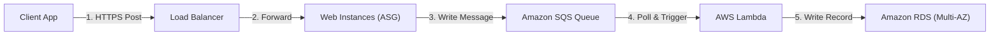
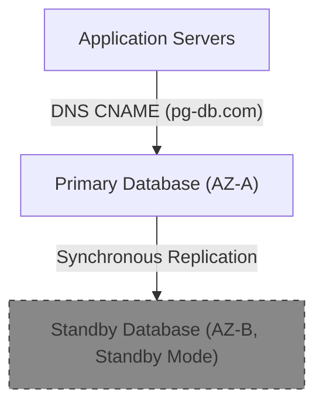

---
domains:
  - "aws"
  - "infra"
---

# Module 3-4: AWS Solution Architect Associate (SAA) Playbook

This module outlines Solution Architect-level high-availability patterns, disaster recovery strategies, event-driven decoupling topologies, and SAA exam scenarios accompanied by hands-on lab configurations.

---

## 🗺️ Cognitive Map: Event-Driven Decoupled Architecture



---

## 1. High Availability Database Replicas

Designing database topologies for high availability (HA) and disaster recovery (DR):

### A. RDS Multi-AZ Deployment
*   **Mechanics:** Deploy a primary database instance in AZ-A and synchronously replicate data to a standby instance in AZ-B.
*   **Failover Execution:** In the event of primary instance failure, AWS automatically updates the DNS CNAME record to point to the standby instance, completing failover with zero manual script intervention.
*   **Trigger Events:** Primary AZ outage, primary host hardware failure, storage corruption, manual reboot with failover, or OS patching.



### B. Read Replicas (Read Scaling & Local DR)
*   **Mechanics:** Deploy up to 15 read replicas within the same or different regions (Cross-Region). Data replication is **asynchronous**.
*   **Use Cases:** Offload read-heavy reporting queries, serve local reads to international users, or act as a regional failover database.

### C. Aurora Global Database (Cross-Region DR)
*   **Mechanics:** Deploy a primary read-write cluster in one region and up to 5 secondary read-only clusters in other regions. Uses dedicated storage-level physical replication infrastructure (replication lag < 1s). Secondary regions can be promoted to write-clusters in less than 1 minute in case of disaster.

---

## 2. Disaster Recovery (DR) Strategies

Disaster recovery choices balance cost against Recovery Point Objective (RPO) and Recovery Time Objective (RTO):

*   **RPO (Recovery Point Objective):** The acceptable amount of data loss measured in time (e.g., "lost 4 hours of data").
*   **RTO (Recovery Time Objective):** The target duration of downtime to restore operations (e.g., "system was down for 30 minutes").

### DR Tiers (From Lowest Cost/Speed to Highest Cost/Speed):
1.  **Backup & Restore:** Daily backups (AMIs, RDS snapshots) stored in S3 and copied to a secondary region. RTO: Hours/Days (requires provisioning resources from scratch). RPO: Hours (data lost since last snapshot).
2.  **Pilot Light:** Minimal footprint (database only) running in the target region with continuous data replication. Web/application servers are kept dark (as AMIs) and only spun up (via ASG) in the event of a disaster. RTO: Tens of minutes. RPO: Minutes.
3.  **Warm Standby:** A fully functional, scaled-down version of the production environment running constantly in the secondary region. Traffic is redirected via Route 53 DNS routing policies, and the ASG is scaled up to meet production load. RTO: Minutes. RPO: Seconds/Minutes.
4.  **Multi-Site Active/Active:** Full-scale production environments running simultaneously in multiple regions. Traffic is dynamically balanced (e.g., Route 53 Latency or Geolocation routing). If one region fails, the other absorbs the load instantly. RTO: Near Zero. RPO: Near Zero.

#### Deep-Intuition (AARF) Breakdown: Warm Standby vs. Pilot Light DR Selection
1.  **The Answer (Core Pattern):** Deploy a **Pilot Light** disaster recovery topology for applications with moderate RTOs (under 30 minutes). Upgrade to **Warm Standby** only when compliance or business agreements demand RTOs under 10 minutes.
2.  **The Assumptions (Context):** Databases must support continuous replication (e.g., RDS Read Replicas or Aurora Global DB) to the DR region, and application deployment configurations (AMIs, Launch Templates) must be synced regularly.
3.  **The Rationale (Why):** Warm Standby requires running active, scaled-down EC2 instances constantly, incurring baseline compute charges. Pilot Light keeps all compute instances off (stored only as AMIs), meaning zero compute charges until a failover occurs, saving substantial costs while still keeping databases synced.
4.  **The Failure Loop (What if not):** Selecting a Backup & Restore strategy for a database that grows to multi-terabyte scale will result in failover attempts taking hours to copy, allocate, and restore snapshots during a disaster, violating business SLAs.
5.  **Alternative Case (When to use 'if not'):** For mission-critical banking, checkout, or core SaaS applications where any downtime results in heavy financial penalties, bypass both and implement Multi-Site Active/Active routing.

---

## 3. Decoupling & Event-Driven Architectures

Decoupling application tiers isolates failures, absorbs traffic spikes, and enables asynchronous processing.

### A. Amazon SQS (Simple Queue Service)
*   **Standard Queue:** Unlimited throughput. Guarantees at-least-once delivery. Occasional out-of-order delivery.
*   **FIFO Queue:** Max throughput of 300 messages/sec (or 3,000 with batching). Guarantees exactly-once processing and first-in-first-out ordering.
*   **Message Size:** Maximum message size is **256KB**. Store payloads in S3 and push metadata/pointers to SQS for larger messages.

### B. Amazon SNS (Simple Notification Service)
*   **Fan-Out Pattern:** Publish a single message to an SNS topic, which immediately replicates and broadcasts it to multiple SQS queues, Lambda functions, or HTTP endpoints for parallel processing.

#### Deep-Intuition (AARF) Breakdown: SQS + Lambda Fan-Out
1.  **The Answer (Core Pattern):** Implement the **Fan-Out** pattern by publishing application events to an SNS Topic, and configuring multiple SQS Queues as subscribers to feed downstream consumer pools (e.g., an Order queue and an Analytics queue).
2.  **The Assumptions (Context):** The message publisher does not require immediate responses from downstream consumers (asynchronous processing).
3.  **The Rationale (Why):** Decouples application execution paths. If the Analytics database goes down, the Order processing pipeline continues to function because messages accumulate safely in the Analytics SQS queue without impacting the billing or web tier.
4.  **The Failure Loop (What if not):** Designing a synchronous chain where the web app writes to the database, then directly calls an analytics API, creates a cascading failure path. If the analytics API experiences latency or outages, the web app threads saturate waiting for responses, causing client request timeouts and overall platform failure.
5.  **Alternative Case (When to use 'if not'):** For synchronous user flows where the client requires immediate confirmation of an operation's result (e.g., verifying a password match), use direct API Gateway to Lambda integrations.

---

## 4. Hybrid Networking Comparison Guides

### A. VPC Peering vs. Transit Gateway (TGW)

#### Deep-Intuition (AARF) Breakdown: TGW vs. Peering Mesh
1.  **The Answer (Core Pattern):** Utilize **AWS Transit Gateway** as a centralized hub-and-spoke router for environments containing more than 4 VPCs or requiring connection to on-premises networks.
2.  **The Assumptions (Context):** VPC Peering does not support transitive routing (if VPC-A is peered with VPC-B, and VPC-B with VPC-C, VPC-A cannot communicate with VPC-C).
3.  **The Rationale (Why):** Connecting $N$ VPCs via peering requires a full-mesh configuration ($N(N-1)/2$ peering links), which quickly becomes unmanageable as the routing tables must be updated manually for every new link. Transit Gateway acts as a central router, requiring only 1 attachment per VPC and simplifying centralized routing.
4.  **The Failure Loop (What if not):** Building a full-mesh peering topology for 20 VPCs results in 190 peering connections. Adding a new VPC requires creating 20 new peering requests, updating 40 routing tables, and creates high operational complexity and human configuration errors.
5.  **Alternative Case (When to use 'if not'):** For small environments with 2 or 3 VPCs requiring maximum bandwidth (peering does not have throughput limits, whereas TGW attachments scale at 50 Gbps baseline), deploy simple direct VPC Peering.

---

## 5. SAA Lab Scenario Workflows

### Lab Scenario 1: EC2 to S3 IAM Role Access (No Hardcoded Credentials)
*   **Objective:** Configure an EC2 instance in a private subnet to securely retrieve configuration files from an S3 bucket without using permanent Access Keys.
*   **Visual Topology:** `EC2 Instance -> IAM Role (STS) -> Gateway Endpoint -> S3 Bucket`
*   **Configuration Steps:**
    1.  Create an IAM Policy allowing read access to the target S3 bucket:
        ```json
        {
          "Version": "2012-10-17",
          "Statement": [
            {
              "Effect": "Allow",
              "Action": ["s3:GetObject", "s3:ListBucket"],
              "Resource": [
                "arn:aws:s3:::my-secure-config-bucket",
                "arn:aws:s3:::my-secure-config-bucket/*"
              ]
            }
          ]
        }
        ```
    2.  Create an IAM Role with a trust policy allowing EC2 to assume it, and attach the policy.
    3.  Create an EC2 Instance Profile and associate it with the target EC2 instance.
    4.  Create a VPC Gateway Endpoint for S3 and associate it with the private subnet's route table.
    5.  SSH into the EC2 instance (via Bastion Host or Systems Manager Session Manager) and execute the test:
        ```bash
        # Verify identity is assumed via STS
        aws sts get-caller-identity
        
        # List files using internal routing
        aws s3 ls s3://my-secure-config-bucket/
        
        # Download files
        aws s3 cp s3://my-secure-config-bucket/app-config.json .
        ```

### Lab Scenario 2: Decoupled Order Processing Pipeline
*   **Objective:** Build a resilient checkout backend that handles flash-sale traffic spikes and writes to an RDS instance.
*   **Visual Topology:** `ALB -> Web ASG -> SQS Standard -> Lambda -> RDS PostgreSQL`
*   **Configuration Steps:**
    1.  Create an SQS Standard Queue (e.g., `OrderQueue`) with a default visibility timeout of 30 seconds (matching processing time).
    2.  Create a Lambda function (`ProcessOrder`) with execution role permissions to poll from SQS and write to RDS.
    3.  Configure SQS as the event source trigger for the Lambda function.
    4.  Deploy the web application on EC2 instances inside Auto Scaling Groups behind an Application Load Balancer. The application code receives order payloads and writes them to SQS using the AWS SDK:
        ```python
        import boto3
        sqs = boto3.client('sqs')
        response = sqs.send_message(
            QueueUrl='https://sqs.us-east-1.amazonaws.com/123456789012/OrderQueue',
            MessageBody='{"order_id": "99b-12a", "user_id": "usr-55", "total": 120.00}'
        )
        ```
    5.  If RDS experiences a write lock or high CPU, Lambda retries automatically, and failed messages transition to a configured Dead Letter Queue (DLQ) after 5 failed attempts, preserving order integrity.

### Lab Scenario 3: Highly Available and Fault-Tolerant Web Tier
*   **Objective:** Design a multi-AZ web layer that tolerates the loss of an entire Availability Zone while maintaining the application's processing SLAs.
*   **Visual Topology:** `ALB -> ASG (Min: 2, Desired: 2, Max: 6) -> Multi-AZ subnets`
*   **Configuration Steps:**
    1.  Create a VPC with public and private subnets across 3 Availability Zones (AZ-A, AZ-B, AZ-C).
    2.  Create an Application Load Balancer configured to listen on port 80/443 and associate it with the public subnets in all 3 AZs.
    3.  Configure a Target Group pointing to EC2 instances in private subnets, with HTTP health checks pointing to `/health`.
    4.  Create an ASG with Desired capacity = 2, Min = 2, Max = 6, and associate it with the private subnets in all 3 AZs.
    5.  Set the scaling policy to Target Tracking based on average CPU utilization at 60%.
    6.  *Fault Tolerance Calculation:* If the application requires a baseline of 2 instances to run normally without degradation:
        *   If deployed across only 2 AZs, losing 1 AZ drops capacity to 50% instantly. The ASG requires minutes to boot replacement instances in the surviving AZ.
        *   If deployed across 3 AZs with a minimum of 3 running instances (1 per AZ), losing 1 AZ drops capacity to 66% (2 instances surviving). This maintains baseline operations while the ASG scales out, achieving true 100% fault tolerance.
